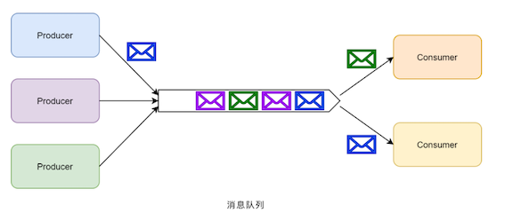
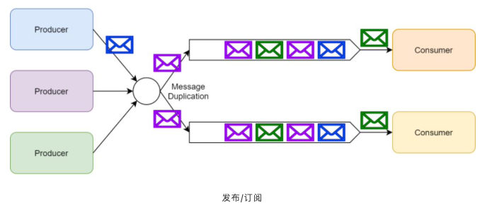
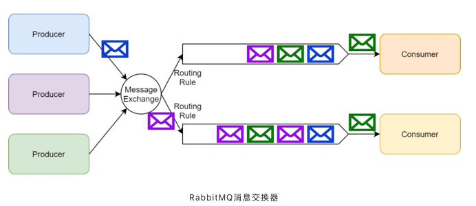
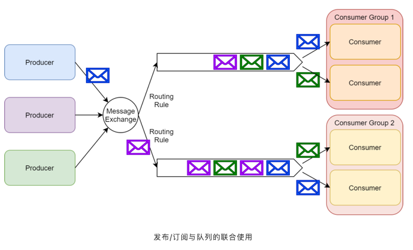
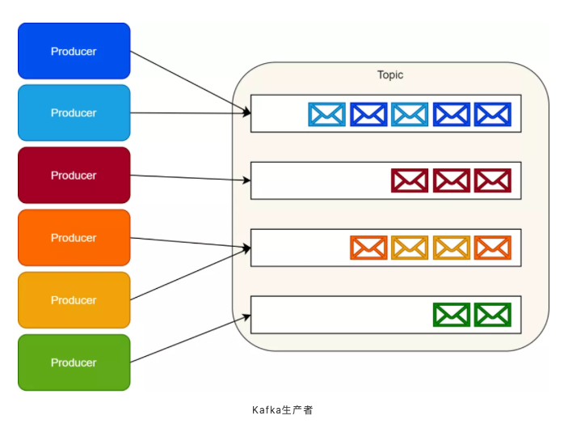
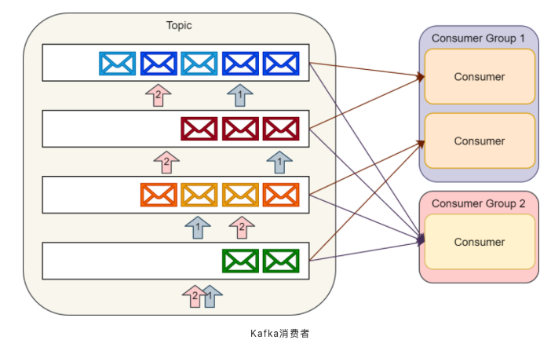
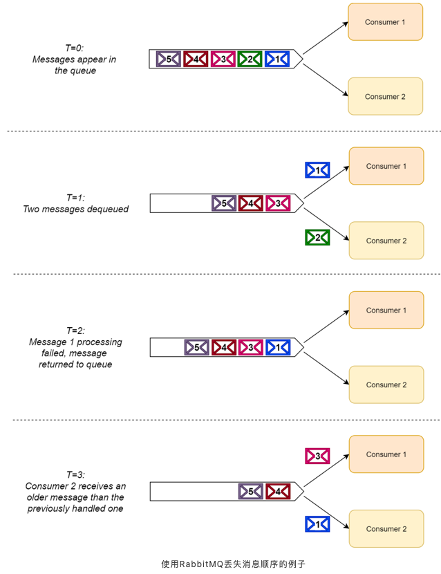
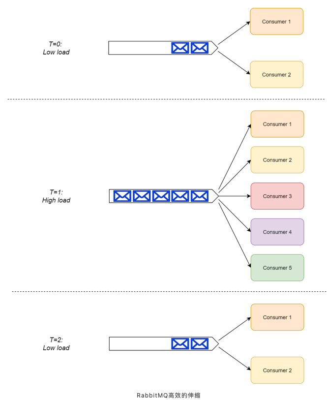
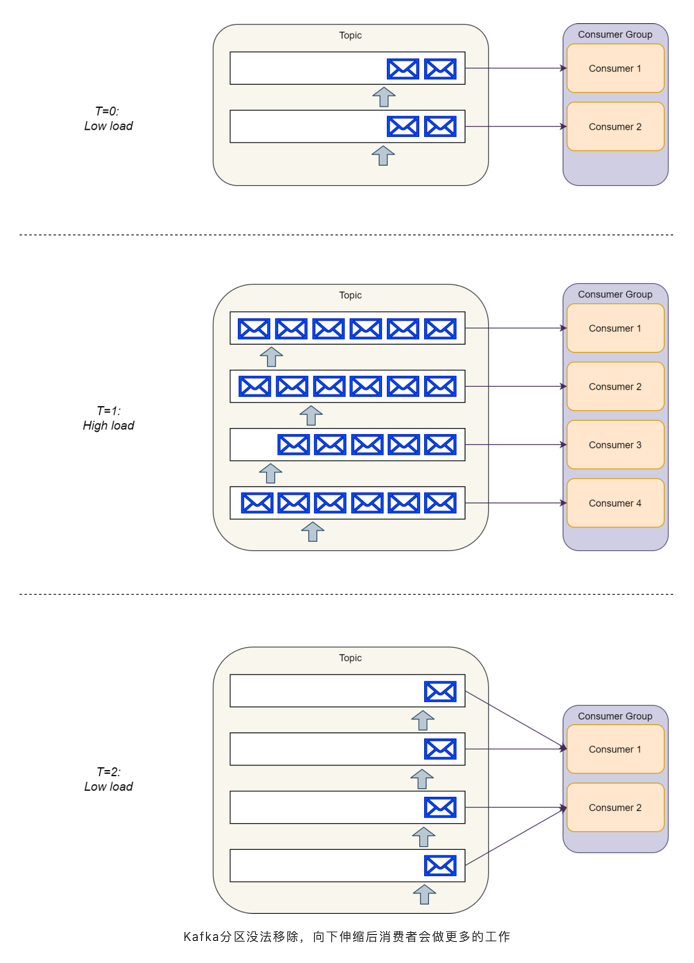

# **第十节 RabbitMQ和Kafka的比较**

## **1、异步消息模式**

异步消息可以作为解耦消息的生产和处理的一种解决方案。提到消息系统，我们通常会想到两种主要的消息模式—— **消息队列和发布/订阅模式**。

### **1-1 消息队列**

利用消息队列可以解耦生产者和消费者。

多个生产者可以向同一个消息队列发送消息；

但是，一个消息在被一个消息者处理的时候，这个消息在队列上会被锁住或者被移除并且其他消费者无法处理该消息。也就是说一个具体的消息只能由一个消费者消费。

需要额外注意的是，如果消费者处理一个消息失败了，消息系统一般会把这个消息放回队列，这样其他消费者可以继续处理。

**消息队列除了提供解耦功能之外，它还能够对生产者和消费者进行独立的伸缩（scale），以及提供对错误处理的容错能力。**

### **1-2 发布/订阅**

发布/订阅（pub/sub）模式中，单个消息可以被多个订阅者并发的获取和处理。

例如，一个系统中产生的事件可以通过这种模式让发布者通知所有订阅者。在许多队列系统中常常用主题（topics）这个术语指代发布/订阅模式。在RabbitMQ中，主题就是发布/订阅模式的一种具体实现（更准确点说是交换器（exchange）的一种），但是在这篇文章中，我会把主题和发布/订阅当做等价来看待。

一般来说，订阅有两种类型：

1. 临时（ephemeral）订阅，这种订阅只有在消费者启动并且运行的时候才存在。一旦消费者退出，相应的订阅以及尚未处理的消息就会丢失。
2. 持久（durable）订阅，这种订阅会一直存在，除非主动去删除。消费者退出后，消息系统会继续维护该订阅，并且后续消息可以被继续处理。

## **2 RabbitMQ**

RabbitMQ作为消息中间件的一种实现，常常被当作一种服务总线来使用。RabbitMQ原生就支持上面提到的两种消息模式。

其他一些流行的消息中间件的实现有ActiveMQ，ZeroMQ，Azure Service Bus以及Amazon Simple Queue Service（SQS）。这些消息中间件的实现有许多共通的地方；这边文章中提到的许多概念大部分都适用于这些中间件。

### **2-1 队列**

RabbitMQ支持典型的开箱即用的消息队列。开发者可以定义一个命名队列，然后发布者可以向这个命名队列中发送消息。最后消费者可以通过这个命名队列获取待处理的消息。

### **2-2 消息交换器exchange**

RabbitMQ使用消息交换器来实现发布/订阅模式。**发布者可以把消息发布到消息交换器上而不用知道这些消息都有哪些订阅者**。

* **每一个订阅了交换器的消费者都会创建一个队列**；
* 然后消息交换器会把生产的消息放入队列以供消费者消费。
* 消息交换器也可以基于各种路由规则为一些订阅者过滤消息。

需要重点注意的是RabbitMQ支持临时和持久两种订阅类型。**消费者可以调用RabbitMQ的API来选择他们想要的订阅类型**。

根据RabbitMQ的架构设计，我们也可以创建一种混合方法——订阅者以组队的方式然后在组内以竞争关系作为消费者去处理某个具体队列上的消息，这种由订阅者构成的组我们称为消费者组。按照这种方式，我们实现了发布/订阅模式，同时也能够很好的伸缩（scale-up）订阅者去处理收到的消息。

## **3、Apache Kafka**

Apache Kafka不是消息中间件的一种实现。**<mark>相反，它只是一种分布式流式系统</mark>**。

不同于基于队列和交换器的RabbitMQ，**<mark>Kafka的存储层是使用分区事务日志来实现的</mark>**。

**Kafka也提供流式API用于实时的流处理以及连接器API用来更容易的和各种数据源集成**；当然，这些已经超出了本篇文章的讨论范围。

云厂商为Kafka存储层提供了可选的方案，比如Azure Event Hubsy以及AWS Kinesis Data Streams等。对于Kafka流式处理能力，还有一些特定的云方案和开源方案，不过，话说回来，它们也超出了本篇的范围。

### **3-1 主题**

Kafka没有实现队列这种东西。相应的，Kafka按照类别存储记录集，并且把这种类别称为主题。

**Kafka为每个主题维护一个消息分区日志。每个分区都是由有序的不可变的记录序列组成，并且消息都是连续的被追加在尾部。**

当消息到达时，Kafka就会把他们追加到分区尾部。默认情况下，Kafka使用轮询分区器（partitioner）把消息一致的分配到多个分区上。

**Kafka可以改变创建消息逻辑流的行为**。

例如，在一个多租户的应用中，我们可以根据每个消息中的租户ID创建消息流。

IoT场景中，我们可以在常数级别下根据生产者的身份信息（identity）将其映射到一个具体的分区上。**确保来自相同逻辑流上的消息映射到相同分区上，这就保证了消息能够按照顺序提供给消费者。**

**消费者通过维护分区的偏移（或者说索引）来顺序的读出消息，然后消费消息**。

单个消费者可以消费多个不同的主题，**<mark>并且消费者的数量可以伸缩到可获取的最大分区数量</mark>**。

所以在创建主题的时候，我们要认真的考虑一下在创建的主题上预期的消息吞吐量。

消费同一个主题的多个消费者构成的组称为消费者组。通过Kafka提供的API可以处理同一消费者组中多个消费者之间的分区平衡以及消费者当前分区偏移的存储。

**Kafka实现的消息模式**

Kafka的实现很好地契合发布/订阅模式。

生产者可以向一个具体的主题发送消息，然后多个消费者组可以消费相同的消息。每一个消费者组都可以独立的伸缩去处理相应的负载。由于消费者维护自己的分区偏移，所以他们可以选择持久订阅或者临时订阅，持久订阅在重启之后不会丢失偏移而临时订阅在重启之后会丢失偏移并且每次重启之后都会从分区中最新的记录开始读取。

但是这种实现方案不能完全等价的当做典型的消息队列模式看待。当然，我们可以创建一个主题，这个主题和拥有一个消费者的消费组进行关联，这样我们就模拟出了一个典型的消息队列。不过这会有许多缺点，我们会在第二部分详细讨论。

值得特别注意的是，Kafka是按照预先配置好的时间保留分区中的消息，而不是根据消费者是否消费了这些消息。这种保留机制可以让消费者自由的重读之前的消息。另外，开发者也可以利用Kafka的存储层来实现诸如事件溯源和日志审计功能。

**尽管有时候RabbitMQ和Kafka可以当做等价来看，但是他们的实现是非常不同的。所以我们不能把他们当做同种类的工具来看待；一个是消息中间件，另一个是分布式流式系统。**

## **4、RabbitMQ和Kafka的显著差异**

**<mark>RabbitMQ是一个消息代理，但是Apache Kafka是一个分布式流式系统</mark>**。

好像从语义上就可以看出差异，但是它们内部的一些特性会影响到我们是否能够很好的设计各种用例。

例如，Kafka最适用于数据的流式处理，但是RabbitMQ对流式中的消息就很难保持它们的顺序。

**另一方面，RabbitMQ内置重试逻辑和死信（dead-letter）交换器，但是Kafka只是把这些实现逻辑交给用户来处理**。

这部分主要强调在不同系统之间它们的主要差异。

### **4-1 消息顺序**

**对于发送到队列或者交换器上的消息，RabbitMQ不保证它们的顺序**。尽管消费者按照顺序处理生产者发来的消息看上去很符合逻辑，但是这有很大误导性。

RabbitMQ文档中有关于消息顺序保证的说明：

> “发布到一个通道（channel）上的消息，用一个交换器和一个队列以及一个出口通道来传递，那么最终会按照它们发送的顺序接收到。” 
> 
> ——RabbitMQ代理语义（Broker Semantics）

换话句话说，只要我们是单个消费者，那么接收到的消息就是有序的。然而，一旦有多个消费者从同一个队列中读取消息，那么消息的处理顺序就没法保证了。

由于消费者读取消息之后可能会把消息放回（或者重传）到队列中（例如，处理失败的情况），这样就会导致消息的顺序无法保证。

**一旦一个消息被重新放回队列，另一个消费者可以继续处理它，即使这个消费者已经处理到了放回消息之后的消息。因此，消费者组处理消息是无序的，如下表所示**。

当然，我们可以通过限制消费者的并发数等于1来保证RabbitMQ中的消息有序性。更准确点说，限制单个消费者中的线程数为1，因为任何的并行消息处理都会导致无序问题。

不过，随着系统规模增长，单线程消费者模式会严重影响消息处理能力。所以，我们不要轻易的选择这种方案。

**另一方面，对于Kafka来说，它在消息处理方面提供了可靠的顺序保证。Kafka能够保证发送到相同主题分区的所有消息都能够按照顺序处理。**

默认情况下，Kafka会使用循环分区器（round-robin partitioner）把消息放到相应的分区上。不过，生产者可以给每个消息设置分区键（key）来创建数据逻辑流（比如来自同一个设备的消息，或者属于同一租户的消息）。

所有来自相同流的消息都会被放到相同的分区中，这样消费者组就可以按照顺序处理它们。

但是，我们也应该注意到，在同一个消费者组中，每个分区都是由一个消费者的一个线程来处理。结果就是我们没法伸缩（scale）单个分区的处理能力。

**不过，在Kafka中，我们可以伸缩一个主题中的分区数量，这样可以让每个分区分担更少的消息，然后增加更多的消费者来处理额外的分区。**

获胜者（Winner）：

**显而易见，Kafka是获胜者，因为它可以保证按顺序处理消息。RabbitMQ在这块就相对比较弱**。

### **4-2 消息路由**

RabbitMQ可以基于定义的订阅者路由规则路由消息给一个消息交换器上的订阅者。

**一个主题交换器可以通过一个叫做`routing_key`的特定头来路由消息。**

**或者，一个头部（headers）交换器可以基于任意的消息头来路由消息。**这两种交换器都能够有效地让消费者设置他们感兴趣的消息类型，因此可以给解决方案架构师提供很好的灵活性。

**另一方面，Kafka在处理消息之前是不允许消费者过滤一个主题中的消息。一个订阅的消费者在没有异常情况下会接受一个分区中的所有消息**。

作为一个开发者，你可能使用Kafka流式作业（job），它会从主题中读取消息，然后过滤，最后再把过滤的消息推送到另一个消费者可以订阅的主题。但是，这需要更多的工作量和维护，并且还涉及到更多的移动操作。

**获胜者**：

**在消息路由和过滤方面，RabbitMQ提供了更好的支持。**

### **4-3 消息时序（timing）**

在测定发送到一个队列的消息时间方面，RabbitMQ提供了多种能力：

**消息存活时间（TTL）**

发送到RabbitMQ的每条消息都可以关联一个TTL属性。发布者可以直接设置TTL或者根据队列的策略来设置。

系统可以根据设置的TTL来限制消息的有效期。如果消费者在预期时间内没有处理该消息，那么这条消息会自动的从队列上被移除（并且会被移到死信交换器上，同时在这之后的消息都会这样处理）。

TTL对于那些有时效性的命令特别有用，因为一段时间内没有处理的话，这些命令就没有什么意义了。

**延迟/预定的消息**

RabbitMQ可以通过插件的方式**来支持延迟或者预定的消息**。当这个插件在消息交换器上启用的时候，生产者可以发送消息到RabbitMQ上，然后这个生产者可以延迟RabbitMQ路由这个消息到消费者队列的时间。

这个功能允许开发者调度将来（future）的命令，也就是在那之前不应该被处理的命令。例如，当生产者遇到限流规则时，我们可能会把这些特定的命令延迟到之后的一个时间执行。

Kafka没有提供这些功能。它在消息到达的时候就把它们写入分区中，这样消费者就可以立即获取到消息去处理。

Kafka也没用为消息提供TTL的机制，不过我们可以在应用层实现。

**不过，我们必须要记住的一点是Kafka分区是一种追加模式的事务日志。所以，它是不能处理消息时间（或者分区中的位置）**。

**获胜者：**

毫无疑问，RabbitMQ是获胜者，因为这种实现天然的就限制Kafka。

### **4-4 消息留存（retention）**

**当消费者成功消费消息之后，RabbitMQ就会把对应的消息从存储中删除。这种行为没法修改。它几乎是所有消息代理设计的必备部分。**

**相反，Kafka会给每个主题配置超时时间，只要没有达到超时时间的消息都会保留下来。在消息留存方面，Kafka仅仅把它当做消息日志来看待，并不关心消费者的消费状态**。

消费者可以不限次数的消费每条消息，并且他们可以操作分区偏移来“及时”往返的处理这些消息。Kafka会周期的检查分区中消息的留存时间，一旦消息超过设定保留的时长，就会被删除。

Kafka的性能不依赖于存储大小。所以，理论上，它存储消息几乎不会影响性能（只要你的节点有足够多的空间保存这些分区）。

**获胜者：**

**Kafka设计之初就是保存消息的，但是RabbitMQ并不是。所以这块没有可比性，Kafka是获胜者**。

### **4-5 容错处理**

当处理消息，队列和事件时，开发者常常认为消息处理总是成功的。毕竟，生产者把每条消息放入队列或者主题后，即使消费者处理消息失败了，它仅仅需要做的就是重新尝试，直到成功为止。

尽管表面上看这种方法是没错的，但是我们应该对这种处理方式多思考一下。首先我们应该承认，在某些场景下，消息处理会失败。所以，即使在解决方案部分需要人为干预的情况下，我们也要妥善地处理这些情况。

消息处理存在两种可能的故障：

* 瞬时故障——故障产生是由于临时问题导致，比如网络连接，CPU负载，或者服务崩溃。我们可以通过一遍又一遍的尝试来减轻这种故障。
* 持久故障——故障产生是由于永久的问题导致的，并且这种问题不能通过额外的重试来解决。比如常见的原因有软件bug或者无效的消息格式（例如，损坏（poison）的消息）

作为架构师和开发者，我们应该问问自己：“对于消息处理故障，我们应该重试多少次？每一次重试之间我们应该等多久？我们怎样区分瞬时和持久故障？”

最重要的是：“所有重试都失败后或者遇到一个持久的故障，我们要做什么？”

当然，不同业务领域有不同的回答，消息系统一般会给我们提供工具让我们自己实现解决方案。

RabbitMQ会给我们提供诸如交付重试和死信交换器（DLX）来处理消息处理故障。

DLX的主要思路是根据合适的配置信息自动地把路由失败的消息发送到DLX，并且在交换器上根据规则来进一步的处理，比如异常重试，重试计数以及发送到“人为干预”的队列。

查看这篇文章[1]，它在RabbitMQ处理重试上提供了额外的可能模式视角。

在RabbitMQ中我们需要记住最重要的事情是当一个消费者正在处理或者重试某个消息时（即使是在把它返回队列之前），其他消费者都可以并发的处理这个消息之后的其他消息。

当某个消费者在重试处理某条消息时，作为一个整体的消息处理逻辑不会被阻塞。所以，一个消费者可以同步地去重试处理一条消息，不管花费多长时间都不会影响整个系统的运行。

**和RabbitMQ相反，Kafka没有提供这种开箱即用的机制。在Kafka中，需要我们自己在应用层提供和实现消息重试机制。**

另外，我们需要注意的是当一个消费者正在同步地处理一个特定的消息时，那么同在这个分区上的其他消息是没法被处理的。

由于消费者不能改变消息的顺序，所以我们不能够拒绝和重试一个特定的消息以及提交一个在这个消息之后的消息。你只要记住，分区仅仅是一个追加模式的日志。

一个应用层解决方案可以把失败的消息提交到一个“重试主题”，并且从那个主题中处理重试；但是这样的话我们就会丢失消息的顺序。

我们可以在Uber.com上找到Uber工程师实现的一个例子。如果消息处理的时延不是关注点，那么对错误有足够监控的Kafka方案可能就足够了。

如果消费者阻塞在重试一个消息上，那么底部分区的消息就不会被处理

**获胜者：**

RabbitMQ是获胜者，因为它提供了一个解决这个问题的开箱即用的机制。

### **4-6 伸缩**

**有多个基准测试，用于检查RabbitMQ和Kafka的性能。**

尽管通用的基准测试对一些特定的情况会有限制，但是Kafka通常被认为比RabbitMQ有更优越的性能。

Kafka使用顺序磁盘I / O来提高性能。

**从Kafka使用分区的架构上看，它在横向扩展上会优于RabbitMQ，当然RabbitMQ在纵向扩展上会有更多的优势。**

Kafka的大规模部署通常每秒可以处理数十万条消息，甚至每秒百万级别的消息。

过去，Pivotal记录了一个Kafka集群每秒处理一百万条消息[2]的例子；但是，它是在一个有着30个节点集群上做的，并且这些消息负载被优化分散到多个队列和交换器上。

典型的RabbitMQ部署包含3到7个节点的集群，并且这些集群也不需要把负载分散到不同的队列上。这些典型的集群通常可以预期每秒处理几万条消息。

**获胜者：**

尽管这两个消息平台都可以处理大规模负载，但是Kafka在伸缩方面更优并且能够获得比RabbitMQ更高的吞吐量，因此这局Kafka获胜。

但是，值得注意的是大部分系统都还没有达到这些极限！所以，除非你正在构建下一个非常受欢迎的百万级用户软件系统，否则你不需要太关心伸缩性问题，毕竟这两个消息平台都可以工作的很好。

### **4-7 消费者复杂度**

RabbitMQ使用的是智能代理和傻瓜式消费者模式。消费者注册到消费者队列，然后RabbitMQ把传进来的消息推送给消费者。RabbitMQ也有拉取（pull）API；不过，一般很少被使用。

**RabbitMQ管理消息的分发以及队列上消息的移除（也可能转移到DLX）。消费者不需要考虑这块。**

根据RabbitMQ结构的设计，当负载增加的时候，一个队列上的消费者组可以有效的从仅仅一个消费者扩展到多个消费者，并且不需要对系统做任何的改变。

相反，Kafka使用的是傻瓜式代理和智能消费者模式。消费者组中的消费者需要协调他们之间的主题分区租约（以便一个具体的分区只由消费者组中一个消费者监听）。

**消费者也需要去管理和存储他们分区偏移索引。幸运的是Kafka SDK已经为我们封装了，所以我们不需要自己管理。**

另外，当我们有一个低负载时，单个消费者需要处理并且并行的管理多个分区，这在消费者端会消耗更多的资源。

**<mark>当然，随着负载增加，我们只需要伸缩消费者组使其消费者的数量等于主题中分区的数量。这就需要我们配置Kafka增加额外的分区。</mark>**

获胜者：

**根据设计，RabbitMQ就是为了傻瓜式消费者而构建的。所以这轮RabbitMQ获胜。**

## **5、如何选择？**

现在我们就如面对百万美元问题一样：“什么时候使用RabbitMQ以及什么时候使用Kafka？”

概括上面的差异，我们不难得出以下结论：

优先选择RabbitMQ的条件：

1. 高级灵活的路由规则
2. 消息时序控制（控制消息过期或者消息延迟）
3. 高级的容错处理能力，在消费者更有可能处理消息不成功的情景中（瞬时或者持久）
4. 更简单的消费者实现

优先选择Kafka的条件：

1. 严格的消息顺序
2. **延长消息留存时间，包括过去消息重放的可能**
3. 传统解决方案无法满足的高伸缩能力

大部分情况下这两个消息平台都可以满足我们的要求。但是，它取决于我们的架构师，他们会选择最合适的工具。当做决策的时候，我们需要考虑上面着重强调的功能性差异和非功能性限制。

这些限制如下：

1. 当前开发者对这两个消息平台的了解
2. 托管云解决方案的可用性（如果适用）
3. 每种解决方案的运营成本
4. 适用于我们目标栈的SDK的可用性

当开发复杂的软件系统时，我们可能被诱导使用同一个消息平台去实现所有必须的消息用例。但是，从我的经验看，通常同时使用这两个消息平台能够带来更多的好处。

例如，在一个事件驱动的架构系统中，我们可以使用RabbitMQ在服务之间发送命令，并且使用Kafka实现业务事件通知。

原因是事件通知常常用于事件溯源，批量操作（ETL风格），或者审计目的，因此Kafka的消息留存能力就显得很有价值。

相反，命令一般需要在消费者端做额外处理，并且处理可以失败，所以需要高级的容错处理能力。

这里，RabbitMQ在功能上有很多闪光点。以后我可能会写一篇详细的文章来介绍，但是你必须记住--你的里程（mileage）可能会变化，因为适合性取决于你的特定需求。

