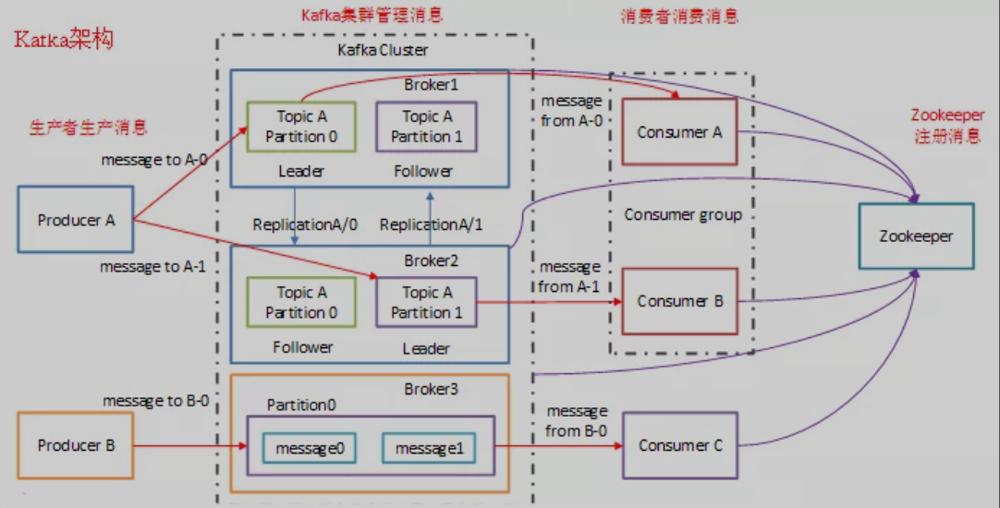
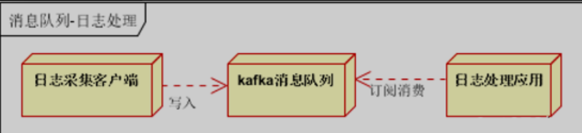
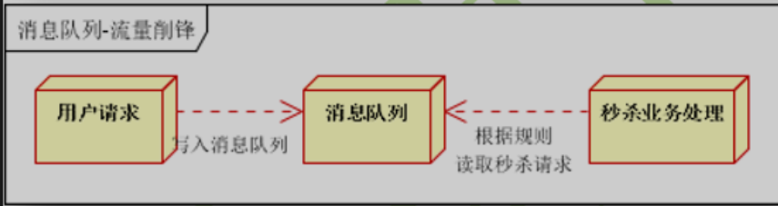

# **第一节 Kafka设计介绍**

Apache Kafka 是一个快速、可扩展的、高吞吐的、可容错的分布式“发布-订阅”消息系统， 使用 Scala 与 Java 语言编写，能够将消息从一个端点传递到另一个端点。

较之传统的消息中间件（例如 ActiveMQ、RabbitMQ），Kafka 具有高吞吐量、内置分区、支持消息副本和高容错的特性，非常适合大规模消息处理应用程序。

Kafka 官网：[http://kafka.apache.org/](http://kafka.apache.org/)

## **1、Kafka 设计介绍**

### **1-1 Kafka 主要设计目标如下**

* 以时间复杂度为 O(1) 的方式提供消息持久化能力，即使对 TB 级以上数据也能保证常数时间的访问性能。
* 高吞吐率。即使在非常廉价的商用机器上也能做到单机支持每秒 100K 条消息的传输。
* **支持 Kafka Server 间的消息分区，及分布式消费，同时保证每个 Partition 内的消息顺序传输**。
* 同时支持离线数据处理和实时数据处理。
* 支持在线水平扩展。

### **1-2 Kafka 通常用于两大类应用程序：**

* **建立实时流数据管道，以可靠地在系统或应用程序之间获取数据**。
* **构建实时流应用程序，以转换或响应数据流**。

要了解 Kafka 如何执行这些操作，让我们从头开始深入研究 Kafka 的功能。

### **1-3 首先几个概念**

* Kafka 在一个或多个可以跨越多个数据中心的服务器上作为集群运行。
* **Kafka 集群将记录流存储在称为主题的类别中**。
* **每个记录由一个键，一个值和一个时间戳组成**。

### **1-4 Kafka 架构体系**

### **1-5 Kafka 的应用场景非常多**

下面我们就来举几个我们最常见的场景：

* **用户的活动跟踪**：用户在网站的不同活动消息发布到不同的主题中心，然后可以对这些消息进行实时监测、实时处理。当然，也可以加载到 Hadoop 或离线处理数据仓库，对用户进行画像。像淘宝、天猫、京东这些大型电商平台，用户的所有活动都要进行追踪的。
* **日志收集如下图**：

* **限流削峰如下图**：

### **1-5 高吞吐率实现**

高吞吐率实现：**Kafka 与其他 MQ 相比，最大的特点就是高吞吐率**。

**为了增加存储能力，Kafka 将所有的消息都写入到了低速大容量的硬盘**。

按理说，这将导致性能损失，但实际上，Kafka 仍然可以保持超高的吞吐率，并且其性能并未受到影响。

其主要采用如下方式实现了高吞吐率：

* 顺序读写：**Kafka 将消息写入到了分区 Partition 中，而分区中的消息又是顺序读写的。顺序读写要快于随机读写**。
* 零拷贝：**生产者、消费者对于 Kafka 中的消息是采用零拷贝实现的**。
* 批量发送：**Kafka 允许批量发送模式**。
* 消息压缩：**Kafka 允许对消息集合进行压缩**。

### **1-6 Kafka 的优点如下**

* **解耦**：在项目启动之初来预测将来项目会碰到什么需求，是极其困难的。消息系统在处理过程中间插入了一个隐含的、基于数据的接口层，两边的处理过程都要实现这一接口。这允许你独立的扩展或修改两边的处理过程，只要确保它们遵守同样的接口约束。
* **冗余（副本）**：有些情况下，处理数据的过程会失败。除非数据被持久化，否则将造成丢失。消息队列把数据进行持久化直到它们已经被完全处理，通过这一方式规避了数据丢失风险。许多消息队列所采用的"插入-获取-删除"范式中，在把一个消息从队列中删除之前，需要你的处理系统明确的指出该消息已经被处理完毕，从而确保你的数据被安全的保存直到你使用完毕。
* **扩展性**：因为消息队列解耦了你的处理过程，所以增大消息入队和处理的频率是很容易的，只要另外增加处理过程即可。不需要改变代码、不需要调节参数。扩展就像调大电力按钮一样简单。
* **灵活性&峰值处理能力**：在访问量剧增的情况下，应用仍然需要继续发挥作用，但是这样的突发流量并不常见；如果为以能处理这类峰值访问为标准来投入资源随时待命无疑是巨大的浪费。使用消息队列能够使关键组件顶住突发的访问压力，而不会因为突发的超负荷的请求而完全崩溃。
* **可恢复性**：系统的一部分组件失效时，不会影响到整个系统。消息队列降低了进程间的耦合度，所以即使一个处理消息的进程挂掉，加入队列中的消息仍然可以在系统恢复后被处理。
* **顺序保证**：在大多使用场景下，**数据处理的顺序都很重要。大部分消息队列本来就是排序的，并且能保证数据会按照特定的顺序来处理。Kafka 保证一个 Partition 内的消息的有序性**。
* **缓冲：在任何重要的系统中，都会有需要不同的处理时间的元素**。例如，加载一张图片比应用过滤器花费更少的时间。消息队列通过一个缓冲层来帮助任务最高效率的执行，写入队列的处理会尽可能的快速。该缓冲有助于控制和优化数据流经过系统的速度。
* **异步通信：很多时候，用户不想也不需要立即处理消息**。消息队列提供了异步处理机制，允许用户把一个消息放入队列，但并不立即处理它。想向队列中放入多少消息就放多少，然后在需要的时候再去处理它们。

### **1-7 Kafka 与其他 MQ 对比**

* RabbitMQ：RabbitMQ 是使用 Erlang 编写的一个开源的消息队列，本身支持很多的协议：AMQP，XMPP，SMTP，STOMP，也正因如此，它非常重量级，更适合于企业级的开发。同时实现了 Broker 构架，这意味着消息在发送给客户端时先在中心队列排队。对路由，负载均衡或者数据持久化都有很好的支持。
* Redis：Redis 是一个基于 Key-Value 对的 NoSQL 数据库，开发维护很活跃。虽然它是一个 Key-Value 数据库存储系统，但它本身支持 MQ 功能，所以完全可以当做一个轻量级的队列服务来使用。对于 RabbitMQ 和 Redis 的入队和出队操作，各执行 100 万次，每 10 万次记录一次执行时间。测试数据分为 128Bytes、512Bytes、1K 和 10K 四个不同大小的数据。实验表明：**入队时，当数据比较小时 Redis 的性能要高于 RabbitMQ，而如果数据大小超过了 10K，Redis 则慢的无法忍受；出队时，无论数据大小，Redis 都表现出非常好的性能，而 RabbitMQ 的出队性能则远低于 Redis。**
* **ZeroMQ：ZeroMQ 号称最快的消息队列系统，尤其针对大吞吐量的需求场景**。ZeroMQ 能够实现 RabbitMQ 不擅长的高级/复杂的队列，但是开发人员需要自己组合多种技术框架，技术上的复杂度是对这 MQ 能够应用成功的挑战。ZeroMQ 具有一个独特的非中间件的模式，你不需要安装和运行一个消息服务器或中间件，因为你的应用程序将扮演这个服务器角色。你只需要简单的引用 ZeroMQ 程序库，可以使用 NuGet 安装，然后你就可以愉快的在应用程序之间发送消息了。但是 ZeroMQ 仅提供非持久性的队列，也就是说如果宕机，数据将会丢失。其中，Twitter 的 Storm 0.9.0 以前的版本中默认使用 ZeroMQ 作为数据流的传输（Storm 从 0.9 版本开始同时支持 ZeroMQ 和 Netty 作为传输模块）。
* **ActiveMQ：ActiveMQ 是 Apache 下的一个子项目**。类似于 ZeroMQ，它能够以代理人和点对点的技术实现队列。同时类似于 RabbitMQ，它少量代码就可以高效地实现高级应用场景。
* Kafka/Jafka：Kafka 是 Apache 下的一个子项目，是一个高性能跨语言分布式发布/订阅消息队列系统，而 Jafka 是在 Kafka 之上孵化而来的，即 Kafka 的一个升级版。

## **2、Kafka具有以下特性**

* 快速持久化，可以在 O(1) 的系统开销下进行消息持久化。
* 高吞吐，在一台普通的服务器上既可以达到 10W/s 的吞吐速率。
* **完全的分布式系统，Broker、Producer、Consumer 都原生自动支持分布式，自动实现负载均衡**。
* **支持 Hadoop 数据并行加载，对于像 Hadoop 的一样的日志数据和离线分析系统，但又要求实时处理的限制，这是一个可行的解决方案**。

Kafka 通过 Hadoop 的并行加载机制统一了在线和离线的消息处理。Apache Kafka 相对于 ActiveMQ 是一个非常轻量级的消息系统，除了性能非常好之外，还是一个工作良好的分布式系统。

## **3、Kafka 的几种重要角色**

### **3-1 Kafka 作为存储系统**

任何允许发布与使用无关的消息发布的消息队列都有效地充当了运行中消息的存储系统。Kafka 的不同之处在于它是一个非常好的存储系统。写入 Kafka 的数据将写入磁盘并进行复制以实现容错功能。Kafka 允许生产者等待确认，以便直到完全复制并确保即使写入服务器失败的情况下写入也不会完成。

Kafka 的磁盘结构可以很好地扩展使用-无论服务器上有 50KB 还是 50TB 的持久数据，Kafka 都将执行相同的操作。由于认真对待存储并允许客户端控制其读取位置，因此您可以将 Kafka 视为一种专用于高性能，低延迟提交日志存储，复制和传播的专用分布式文件系统。

### **3-2 Kafka 作为消息传递系统**

Kafka 的流概念与传统的企业消息传递系统相比如何？传统上，消息传递具有两种模型：

排队和发布订阅。在队列中，一组使用者可以从服务器中读取内容，并且每条记录都将转到其中一个。在发布-订阅记录中广播给所有消费者。这两个模型中的每一个都有优点和缺点。排队的优势在于，它允许您将数据处理划分到多个使用者实例上，从而扩展处理量。

不幸的是，队列不是多用户的—一次进程读取了丢失的数据。发布-订阅允许您将数据广播到多个进程，但是由于每条消息都传递给每个订阅者，因此无法扩展处理。Kafka 的消费者群体概念概括了这两个概念。与队列一样，使用者组允许您将处理划分为一组进程（使用者组的成员）。与发布订阅一样，Kafka 允许您将消息广播到多个消费者组。

**Kafka 模型的优点在于，每个主题都具有这些属性-可以扩展处理范围，并且是多订阅者，无需选择其中一个。**与传统的消息传递系统相比，Kafka 还具有更强的订购保证。传统队列将记录按顺序保留在服务器上，如果多个使用者从队列中消费，则服务器将按记录的存储顺序分发记录。但是，尽管服务器按顺序分发记录，但是这些记录是异步传递给使用者的，因此它们可能在不同的使用者上乱序到达。

这实际上意味着在并行使用的情况下会丢失记录的顺序。消息传递系统通常通过“专有使用者”的概念来解决此问题，该概念仅允许一个进程从队列中使用，但是，这当然意味着在处理中没有并行性。Kafka 做得更好，通过在主题内具有并行性（即分区）的概念，Kafka 能够在用户进程池中提供排序保证和负载均衡。

这是通过将主题中的分区分配给消费者组中的消费者来实现的，以便每个分区都由组中的一个消费者完全消费。通过这样做，我们确保使用者是该分区的唯一读取器，并按顺序使用数据。由于存在许多分区，因此仍然可以平衡许多使用者实例上的负载。但是请注意，使用者组中的使用者实例不能超过分区。

### **3-3 Kafka 用作流处理**

仅读取，写入和存储数据流是不够的，目的是实现对流的实时处理。

在 Kafka 中，流处理器是指从输入主题中获取连续数据流，对该输入进行一些处理并生成连续数据流以输出主题的任何东西。例如，零售应用程序可以接受销售和装运的输入流，并输出根据此数据计算出的重新订购和价格调整流。

可以直接使用生产者和消费者 API 进行简单处理。但是，对于更复杂的转换，Kafka 提供了完全集成的 Streams API。

这允许构建执行非重要处理的应用程序，这些应用程序计算流的聚合或将流连接在一起。该功能有助于解决此类应用程序所面临的难题：处理无序数据，在代码更改时重新处理输入，执行状态计算等。

流 API 建立在 Kafka 提供的核心原语之上：**它使用生产者和使用者 API 进行输入，使用 Kafka 进行状态存储，并使用相同的组机制来实现流处理器实例之间的容错。**

