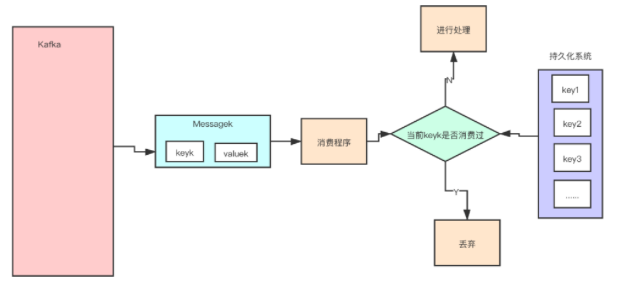
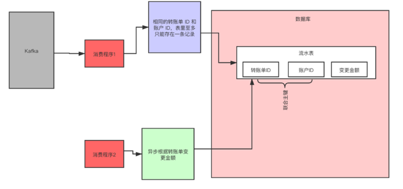
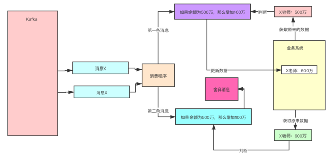

# **第三节 Kafka的工作原理和过程**

## **1、消息写入算法**

消息发送者将消息发送给 Broker, 并形成最终的可供消费者消费的 log，是已给比较复杂的过程：

* Producer 先从 ZooKeeper 中找到该 Partition 的 Leader。
* **Producer 将消息发送给该 Leader**。
* Leader 将消息接入本地的 log，并通知 ISR 的 Followers。
* **ISR 中的 Followers 从 Leader 中 Pull 消息, 写入本地 log 后向 Leader 发送 Ack**。
* Leader 收到所有 ISR 中的 Followers 的 Ack 后，增加 HW 并向 Producer 发送 Ack，表示消息写入成功。

## **2、消息路由策略**

在通过 API 方式发布消息时，生产者是以 Record 为消息进行发布的。

Record 中包含 Key 与 Value，

* **Value 才是我们真正的消息本身**
* **Key 用于路由消息所要存放的 Partition**

消息要写入到哪个 Partition 并不是随机的，而是有路由策略的：

* 若指定了 Partition，则直接写入到指定的 Partition。
* 若未指定 Partition 但指定了 Key，则通过对 Key 的 Hash 值与 Partition 数量取模，该取模。
* **结果就是要选出的 Partition 索引。 若 Partition 和 Key 都未指定，则使用轮询算法选出一个 Partition。**

## **3、 HW 截断机制**

**如果 Partition Leader 接收到了新的消息， ISR 中其它 Follower 正在同步过程中，还未同步完毕时 leader 宕机。**

> ISR，In-Sync Replicas，是指副本同步列表。ISR 列表是由 Leader 负责维护。

此时就需要选举出新的 Leader。若没有 HW 截断机制，将会导致 Partition 中 Leader 与 Follower 数据的不一致。

**当原 Leader 宕机后又恢复时，将其 LEO 回退到其宕机时的 HW，然后再与新的 Leader 进行数据同步，这样就可以保证老 Leader 与新 Leader 中数据一致了，这种机制称为 HW 截断机制**。

## **4、消息发送的可靠性**

### **4-1 同一个 Consumer 重复消费：**

当 Consumer 由于消费能力低而引发了消费超时，则可能会形成重复消费。

在某数据刚好消费完毕，但是正准备提交 Offset 时候，消费时间超时，则 Broker 认为这条消息未消费成功。这时就会产生重复消费问题。

**其解决方案：延长 Offset 提交时间**。

### **4-2 不同的 Consumer 重复消费**：

当 Consumer 消费了消息，但还没有提交 Offset 时宕机，则这些已经被消费过的消息会被重复消费。

其解决方案：将自动提交改为手动提交。

## **5、从架构设计上解决 Kafka 重复消费的问题**

我们在设计程序的时候，比如考虑到网络故障等一些异常的情况，我们都会设置消息的重试次数，可能还有其他可能出现消息重复，那我们应该如何解决呢？下面提供三个方案：

### **5-1 方案一：保存并查询**

给每个消息都设置一个独一无二的 uuid，所有的消息，我们都要存一个 uuid。

我们在消费消息的时候，**首先去持久化系统中查询一下看这个看是否以前消费过，如没有消费过，在进行消费，如果已经消费过，丢弃就好了**。

下图表明了这种方案：

### **5-2 方案二：利用幂等**

幂等（Idempotence）在数学上是这样定义的，如果一个函数 f(x) 满足：`f(f(x)) = f(x)`，则函数 f(x) 满足幂等性。

一个幂等的方法，使用同样的参数，对它进行多次调用和一次调用，对系统产生的影响是一样的。所以，对于幂等的方法，不用担心重复执行会对系统造成任何改变。

我们举个例子来说明一下。在不考虑并发的情况下，“将 X 老师的账户余额设置为 100 万元”，执行一次后对系统的影响是，X 老师的账户余额变成了 100 万元。只要提供的参数 100 万元不变，那即使再执行多少次，X 老师的账户余额始终都是 100 万元，不会变化，这个操作就是一个幂等的操作。

再举一个例子，“将 X 老师的余额加 100 万元”，这个操作它就不是幂等的，每执行一次，账户余额就会增加 100 万元，执行多次和执行一次对系统的影响（也就是账户的余额）是不一样的。

所以，通过这两个例子，我们可以想到如果系统消费消息的业务逻辑具备幂等性，那就不用担心消息重复的问题了，因为同一条消息，消费一次和消费多次对系统的影响是完全一样的。也就可以认为，消费多次等于消费一次。

那么，如何实现幂等操作呢？最好的方式就是，从业务逻辑设计上入手，将消费的业务逻辑设计成具备幂等性的操作。

但是，不是所有的业务都能设计成天然幂等的，这里就需要一些方法和技巧来实现幂等。

下面我们介绍一种常用的方法：**利用数据库的唯一约束实现幂等**。

例如，我们刚刚提到的那个不具备幂等特性的转账的例子：将 X 老师的账户余额加 100 万元。在这个例子中，我们可以通过改造业务逻辑，让它具备幂等性。

首先，我们可以限定，对于每个转账单每个账户只可以执行一次变更操作，在分布式系统中，这个限制实现的方法非常多，最简单的是我们在数据库中建一张转账流水表。

这个表有三个字段：转账单 ID、账户 ID 和变更金额，然后给转账单 ID 和账户 ID 这两个字段联合起来创建一个唯一约束，这样对于相同的转账单 ID 和账户 ID，表里至多只能存在一条记录。

这样，我们消费消息的逻辑可以变为：“在转账流水表中增加一条转账记录，然后再根据转账记录，异步操作更新用户余额即可。”

在转账流水表增加一条转账记录这个操作中，由于我们在这个表中预先定义了“账户 ID 转账单 ID”的唯一约束，对于同一个转账单同一个账户只能插入一条记录，后续重复的插入操作都会失败，这样就实现了一个幂等的操作。

### **5-1 方案三：设置前提条件**

为更新的数据设置前置条件另外一种实现幂等的思路是，给数据变更设置一个前置条件，如果满足条件就更新数据，否则拒绝更新数据，在更新数据的时候，同时变更前置条件中需要判断的数据。

这样，重复执行这个操作时，由于第一次更新数据的时候已经变更了前置条件中需要判断的数据，不满足前置条件，则不会重复执行更新数据操作。

比如，刚刚我们说过，“将 X 老师的账户的余额增加 100 万元”这个操作并不满足幂等性，我们可以把这个操作加上一个前置条件，变为：“如果 X 老师的账户当前的余额为 500 万元，将余额加 100 万元”，这个操作就具备了幂等性。

对应到消息队列中的使用时，可以在发消息时在消息体中带上当前的余额，在消费的时候进行判断数据库中，当前余额是否与消息中的余额相等，只有相等才执行变更操作。

但是，如果我们要更新的数据不是数值，或者我们要做一个比较复杂的更新操作怎么办？用什么作为前置判断条件呢？

**更加通用的方法是，给你的数据增加一个版本号属性，每次更数据前，比较当前数据的版本号是否和消息中的版本号一致，如果不一致就拒绝更新数据，更新数据的同时将版本号 +1，一样可以实现幂等。**

