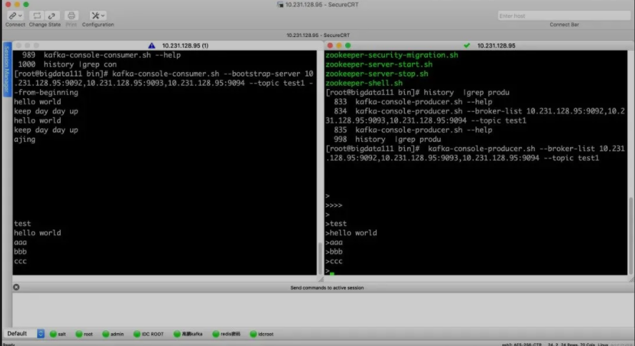

# **第四节 Kafka 集群搭建**

我们在官网下载 Kafka，下载地址为：[http://kafka.apache.org/downloads](http://kafka.apache.org/downloads)，下载我们需要的版本，推荐使用稳定的版本。

## **1、搭建集群**

下载并解压：

```
cd /usr/local/src
wget http://mirrors.tuna.tsinghua.edu.cn/apache/kafka/2.4.0/kafka_2.11-2.4.0.tgz
mkdir /data/servers
tar xzvf kafka_2.11-2.4.0.tgz -C /data/servers/
cd /data/servers/kafka_2.11-2.4.0
```

修改配置文件：


Kafka 的配置文件 `$KAFKA_HOME/config/server.properties`，主要修改一下下面几项：

```
确保每个机器上的 id 不一样
 broker.id=0
  配置服务端的监控地址
 listeners=PLAINTEXT://192.168.51.128:9092
  Kafka 日志目录
 log.dirs=/data/servers/kafka_2.11-2.4.0/logs
 #Kafka 设置的 partitons 的个数
 num.partitions=1

  ZooKeeper 的连接地址，如果有自己的 ZooKeeper 集群，请直接使用自己搭建的 ZooKeeper 集群
 zookeeper.connect=192.168.51.128:2181
```

因为我自己是本机做实验，所有使用的是一个主机的不同端口，在线上，就是不同的机器，大家参考即可。

我们这里使用 Kafka 的 ZooKeeper，只启动一个节点，但是正真的生产过程中，是需要 ZooKeeper 集群，自己搭建就好，后期我们也会出 ZooKeeper 的教程，大家请关注就好了。

拷贝 3 份配置文件：

```
#创建对应的日志目录
mkdir -p /data/servers/kafka_2.11-2.4.0/logs/9092
mkdir -p /data/servers/kafka_2.11-2.4.0/logs/9093
mkdir -p /data/servers/kafka_2.11-2.4.0/logs/9094

#拷贝三份配置文件
cp server.properties server_9092.properties 
cp server.properties server_9093.properties 
cp server.properties server_9094.properties
```

修改不同端口对应的文件：

```
#9092 的 id 为 0，9093 的 id 为 1，9094 的 id 为 2
 broker.id=0
# 配置服务端的监控地址，在不通的配置文件中写入不同的端口
 listeners=PLAINTEXT://192.168.51.128:9092
# Kafka 日志目录，目录也是对应不同的端口
 log.dirs=/data/servers/kafka_2.11-2.4.0/logs/9092
# Kafka 设置的 partitons 的个数
 num.partitions=1
# ZooKeeper 的连接地址，如果有自己的 ZooKeeper 集群，请直接使用自己搭建的 ZooKeeper 集群
 zookeeper.connect=192.168.51.128:2181
 ```
 
 修改 ZooKeeper 的配置文件：


```
dataDir=/data/servers/zookeeper
server.1=192.168.51.128:2888:3888
```

然后创建 ZooKeeper 的 myid 文件：

```
echo "1"> /data/servers/zookeeper/myid
```

启动 ZooKeeper：

使用 Kafka 内置的 ZooKeeper：

```
cd /data/servers/kafka_2.11-2.4.0/bin
zookeeper-server-start.sh -daemon ../config/zookeeper.properties 
netstat -anp |grep 2181
```

启动 Kafka：

```
./kafka-server-start.sh -daemon ../config/server_9092.properties   
./kafka-server-start.sh -daemon ../config/server_9093.properties   
./kafka-server-start.sh -daemon ../config/server_9094.properties
```

## **2、Kafka 的操作**

### **2-1 Topic**

我们先来看一下创建 Topic 常用的参数吧：

* `--create`：创建 topic
* `--delete`：删除 topic
* `--alter`：修改 topic 的名字或者 partition 个数
* `--list`：查看 topic
* `--describe`：查看 topic 的详细信息
* `--topic <String: topic>`：指定 topic 的名字
* `--zookeeper <String: hosts>`：指定 Zookeeper 的连接地址参数提示并不赞成这样使用（DEPRECATED, The connection string for the zookeeper connection in the form host:port. Multiple hosts can be given to allow fail-over.）
* `--bootstrap-server <String: server to connect to>`：指定 Kafka 的连接地址，推荐使用这个，参数的提示信息显示（REQUIRED: The Kafka server to connect to. In case of providing this, a direct Zookeeper connection won't be required.）。
* `--replication-factor <Integer: replication factor>`：对于每个 Partiton 的备份个数。（The replication factor for each partition in the topic being created. If not supplied, defaults to the cluster default.）
* `--partitions <Integer: # of partitions>`：指定该 topic 的分区的个数

### **2-2 自动创建 Topic**

我们在工作中，如果我们不想去管理 Topic，可以通过 Kafka 的配置文件来管理。


我们可以让 Kafka 自动创建 Topic，需要在我们的 Kafka 配置文件中加入如下配置文件：

```
auto.create.topics.enable=true
```

如果删除 Topic 想达到物理删除的目的，也是需要配置的：

```
delete.topic.enable=true
```

### **2-3 发送消息**

他们可以通过客户端的命令生产消息，先来看看 `kafka-console-producer.sh` 常用的几个参数吧：

* `--topic <String: topic>`：指定 topic
* `--timeout <Integer: timeout_ms>`：超时时间
* `--sync`：异步发送消息
* `--broker-list <String: broker-list>`：官网提示：REQUIRED: The broker list string in the form HOST1:PORT1,HOST2:PORT2.

这个参数是必须的：

```
kafka-console-producer.sh --broker-list 192.168.51.128:9092,192.168.51.128:9093,192.168.51.128:9094 --topic test1
```

### **2-4 消费消息**

我们也还是先来看看 kafka-console-consumer.sh 的参数吧：

* `--topic <String: topic>`：指定 topic
* `--group <String: consumer group id>`：指定消费者组
* `--from-beginning`：指定从开始进行消费, 如果不指定, 就从当前进行消费
* `--bootstrap-server`：Kafka 的连接地址‍‍

```
kafka-console-consumer.sh --bootstrap-server 192.168.51.128:9092,192.168.51.128:9093,192.168.51.128:9094 --topic test1 ---beginning
```




## **3、Kafka 的日志**

Kafka 的日志分两种：


* **第一种日志是我们的 Kafka 的启动日志，就是我们排查问题，查看报错信息的日志**。
* **第二种日志就是我们的数据日志，Kafka 是我们的数据是以日志的形式存在存盘中的，我们第二种所说的日志就是我们的 Partiton 与 Segment**。

那我们就来说说备份和分区吧：我们创建一个分区，一个备份，那么 test 就应该在三台机器上或者三个数据目录只有一个 `test-0`。（分区的下标是从 0 开始的）

如果我们创建 N 个分区，我们就会在三个服务器上发现，`test_0-n`，如果我们创建 M 个备份，我们就会在发现，`test_0` 到 `test_n` 每一个都是 M 个。

