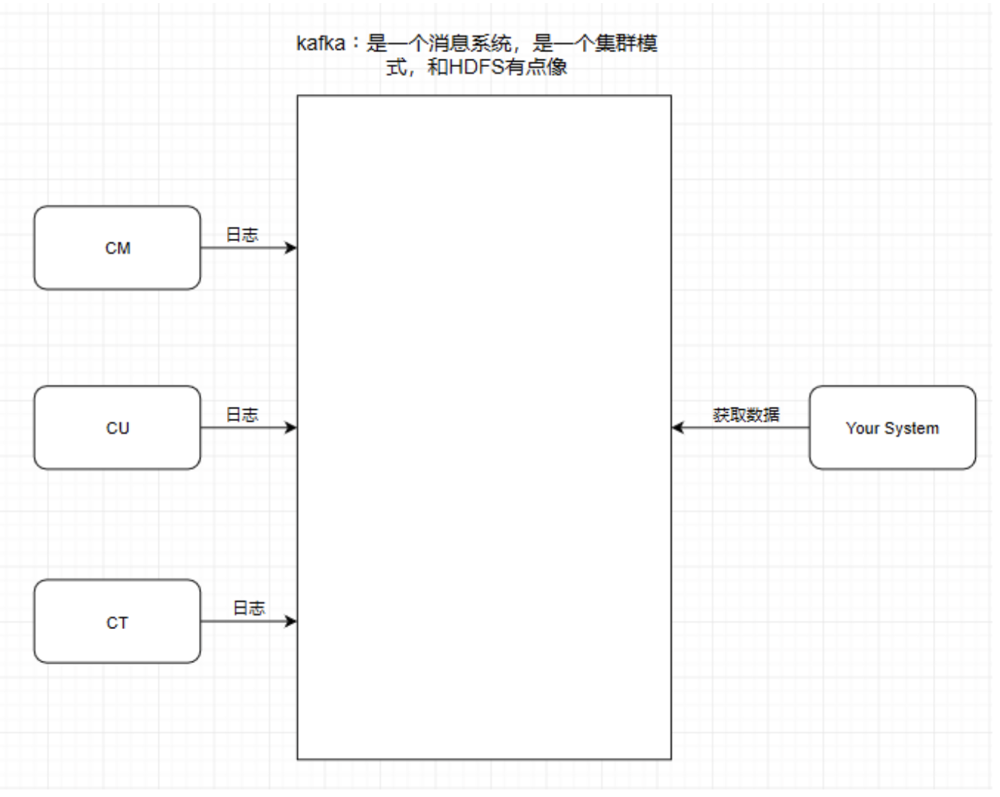
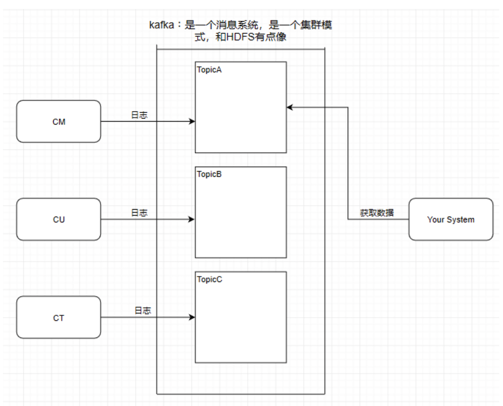
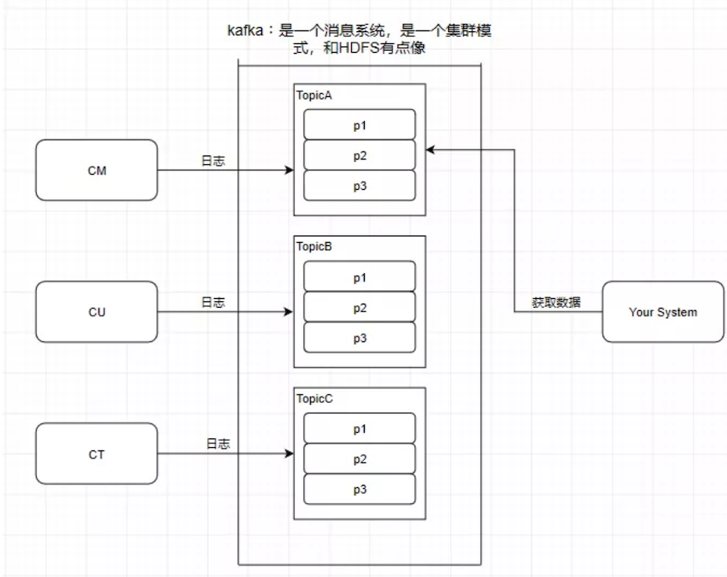
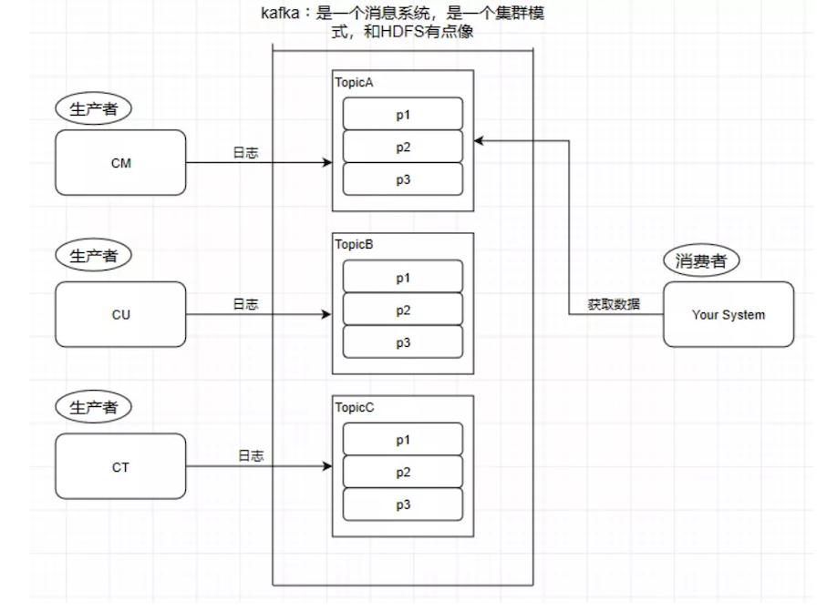
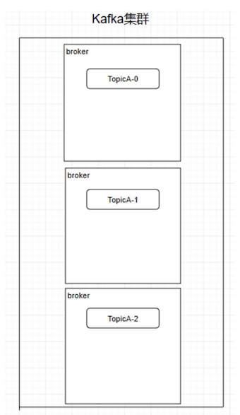
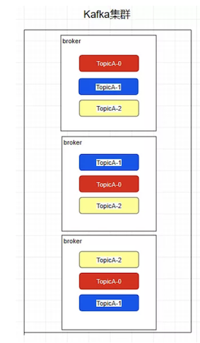
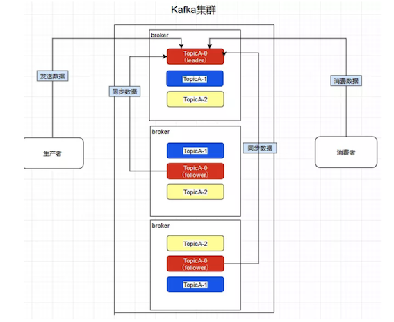
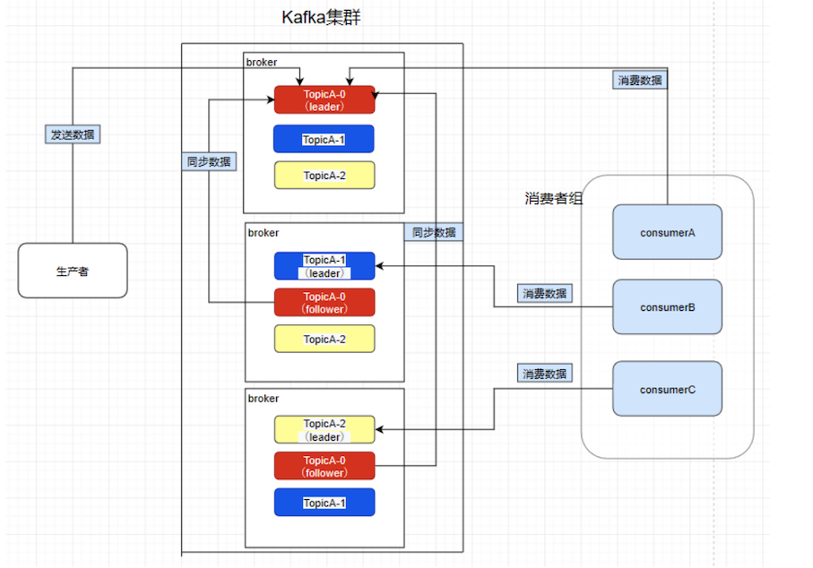

# **第六节 图解 Kafka**

消息系统其实就是一个模拟缓存，且仅仅是起到了缓存的作用而并不是真正的缓存，数据仍然是存储在磁盘上面而不是内存。

 

## **1、Kafka基础**


### **1-1 Topic主题**

Kafka学习了数据库里面的设计，在里面设计了topic（主题），这个东西类似于关系型数据库的表。

 

### **1-2 Partition分区**

kafka还有一个概念叫Partition（分区），分区具体在服务器上面表现起初就是一个目录，一个主题下面有多个分区，**这些分区会存储到不同的服务器上面**，或者说，其实就是在不同的主机上建了不同的目录。

这些分区主要的信息就存在了`.log`文件里面。跟数据库里面的分区差不多，是为了提高性能。

 

至于为什么提高了性能，很简单，多个分区多个线程，多个线程并行处理肯定会比单线程好得多。

Topic和partition像是HBASE里的table和region的概念，table只是一个逻辑上的概念，真正存储数据的是region，这些region会分布式地存储在各个服务器上面，对应于Kafka，也是一样，Topic也是逻辑概念，**而partition就是分布式存储单元**。

这个设计是保证了海量数据处理的基础。我们可以对比一下，如果HDFS没有block的设计，一个100T的文件也只能单独放在一个服务器上面，那就直接占满整个服务器了，引入block后，大文件可以分散存储在不同的服务器上。

注意：

* 分区会有单点故障问题，所以我们会为每个分区设置副本数；
* 分区的编号是从0开始的。

### **1-3 Producer - 生产者**

往消息系统里面发送数据的就是生产者。


### **1-4 Consumer - 消费者**

从Kafka里读取数据的就是消费者。

 

### **1-5 Message - 消息**

Kafka里面的我们处理的数据叫做消息。


## **2、Kafka的集群架构**

创建一个TopicA的主题，3个分区分别存储在不同的服务器，也就是broker下面。

Topic是一个逻辑上的概念，并不能直接在图中把Topic的相关单元画出。

 

需要注意：Kafka在0.8版本以前是没有副本机制的，所以在面对服务器宕机的突发情况时会丢失数据，所以尽量避免使用这个版本之前的Kafka。


### **2-1 Replica - 副本**

Kafka中的partition为了保证数据安全，所以每个partition可以设置多个副本。

此时我们对分区0，1，2分别设置3个副本（其实设置两个副本是比较合适的）。

 

而且其实每个副本都是有角色之分的，**它们会选取一个副本作为leader，而其余的作为follower，我们的生产者在发送数据的时候，是直接发送到leader partition里面，然后follower partition会去leader那里自行同步数据，消费者消费数据的时候，也是从leader那去消费数据的**。

 

### **2-2 Consumer Group - 消费者组**

我们在消费数据时会在代码里面指定一个`group.id`，这个id代表的是消费组的名字，而且这个group.id就算不设置，系统也会默认设置。

```
conf.setProperty("group.id","tellYourDream")
```

我们所熟知的一些消息系统一般来说会这样设计，就是只要有一个消费者去消费了消息系统里面的数据，那么其余所有的消费者都不能再去消费这个数据。可是Kafka并不是这样，比如现在consumerA去消费了一个topicA里面的数据。

```
consumerA:
    group.id = a
consumerB:
    group.id = a
    
consumerC:
    group.id = b
consumerD:
    group.id = b
```

再让consumerB也去消费TopicA的数据，它是消费不到了，但是我们在consumerC中重新指定一个另外的group.id，consumerC是可以消费到topicA的数据的。而consumerD也是消费不到的，所以**在Kafka中，不同组可有唯一的一个消费者去消费同一主题的数据**。

**所以消费者组就是让多个消费者并行消费信息而存在的，而且它们不会消费到同一个消息**，如下，consumerA，B，C是不会互相干扰的。


如图，因为前面提到过了消费者会直接和leader建立联系，所以它们分别消费了三个leader，所以一个分区不会让消费者组里面的多个消费者去消费，但是在消费者不饱和的情况下，一个消费者是可以去消费多个分区的数据的。

 

### **2-3 Controller**


熟知一个规律：在大数据分布式文件系统里面，95%的都是主从式的架构，个别是对等式的架构，比如ElasticSearch。

Kafka也是主从式的架构，主节点就叫controller，其余的为从节点，controller是需要和ZooKeeper进行配合管理整个Kafka集群。

### **2-4 Kafka和ZooKeeper如何配合工作**

Kafka严重依赖于ZooKeeper集群。所有的broker在启动的时候都会往ZooKeeper进行注册，目的就是选举出一个controller，这个选举过程非常简单粗暴，就是一个谁先谁当的过程，不涉及什么算法问题。

那成为controller之后要做啥呢，它会监听ZooKeeper里面的多个目录，例如有一个目录/brokers/，其他从节点往这个目录上注册（就是往这个目录上创建属于自己的子目录而已）自己，这时命名规则一般是它们的id编号，比如/brokers/0，1，2。

注册时各个节点必定会暴露自己的主机名，端口号等等的信息，此时controller就要去读取注册上来的从节点的数据（通过监听机制），生成集群的元数据信息，之后把这些信息都分发给其他的服务器，让其他服务器能感知到集群中其它成员的存在。

此时模拟一个场景，我们创建一个主题（其实就是在ZooKeeper上/topics/topicA这样创建一个目录而已），Kafka会把分区方案生成在这个目录中，此时controller就监听到了这一改变，它会去同步这个目录的元信息，然后同样下放给它的从节点，通过这个方法让整个集群都得知这个分区方案，此时从节点就各自创建好目录等待创建分区副本即可。这也是整个集群的管理机制。


