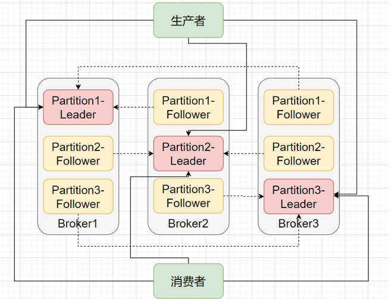

# **第七节 Kafka 宕机引发的高可用问题**

## **1、Kafka的多副本冗余设计**

不管是传统的基于关系型数据库设计的系统，还是分布式的如zookeeper、redis、Kafka、HDFS等等，实现高可用的办法通常是采用冗余设计，通过冗余来解决节点宕机不可用问题。

首先简单了解Kafka的几个概念：

### **1-1、物理模型**

 

### **1-2、逻辑模型**

 

* **Broker（节点）**：Kafka服务节点，**简单来说一个Broker就是一台Kafka服务器**，一个物理节点。
* **Topic（主题）**：在Kafka中消息以主题为单位进行归类，**每个主题都有一个Topic Name**，生产者根据Topic Name将消息发送到特定的Topic，消费者则同样根据Topic Name从对应的Topic进行消费。
* **Partition（分区）：Topic（主题）是消息归类的一个单位，但每一个主题还能再细分为一个或多个Partition（分区），一个分区只能属于一个主题**。主题和分区都是逻辑上的概念，举个例子，消息1和消息2都发送到主题1，它们可能进入同一个分区也可能进入不同的分区（所以同一个主题下的不同分区包含的消息是不同的），之后便会发送到分区对应的Broker节点上。
* **Offset（偏移量）**：分区可以看作是一个只进不出的队列（Kafka只保证一个分区内的消息是有序的），消息会往这个队列的尾部追加，每个消息进入分区后都会有一个偏移量，标识该消息在该分区中的位置，消费者要消费该消息就是通过偏移量来识别。

其实，根据上述的几个概念，是不是也多少猜到了Kafka的多副本冗余设计实现了？别急，咱继续往下看。

在Kafka 0.8版本以前，是没有多副本冗余机制的，**一旦一个节点挂掉，那么这个节点上的所有Partition的数据就无法再被消费。这就等于发送到Topic的有一部分数据丢失了**。

在0.8版本后引入副本记者则很好地解决宕机后数据丢失的问题。**副本是以Topic中每个Partition的数据为单位，每个Partition的数据会同步到其他物理节点上，形成多个副本**。

**每个Partition的副本都包括一个Leader副本和多个Follower副本，Leader由所有的副本共同选举得出，其他副本则都为Follower副本。**

在生产者写或者消费者读的时候，都只会与Leader打交道，在写入数据后Follower就会来拉取数据进行数据同步。

就这么简单？是的，基于上面这张多副本架构图就实现了Kafka的高可用。

 

当某个Broker挂掉了，甭担心，**这个Broker上的Partition在其他Broker节点上还有副本。你说如果挂掉的是Leader怎么办？那就在Follower中在选举出一个Leader即可，生产者和消费者又可以和新的Leader愉快地玩耍了，这就是高可用**。

你可能还有疑问，那要多少个副本才算够用？Follower和Leader之间没有完全同步怎么办？一个节点宕机后Leader的选举规则是什么？

直接抛结论:

### **1-3 多少个副本才算够用**

副本肯定越多越能保证Kafka的高可用，但越多的副本意味着网络、磁盘资源的消耗更多，性能会有所下降，**通常来说副本数为3即可保证高可用，极端情况下将replication-factor参数调大即可**。

### **1-4 Follower和Lead之间没有完全同步怎么办**

Follower和Leader之间并不是完全同步，但也不是完全异步，而是采用一种ISR机制（In-Sync Replica）。

**每个Leader会动态维护一个ISR列表，该列表里存储的是和Leader基本同步的Follower。**

如果有Follower由于网络、GC等原因而没有向Leader发起拉取数据请求，此时Follower相对于Leader是不同步的，则会被踢出ISR列表。

**所以说，ISR列表中的Follower都是跟得上Leader的副本。**

### **1-5 一个节点宕机后Leader的选举规则是什么？**

分布式相关的选举规则有很多，像Zookeeper的Zab、Raft、Viewstamped Replication、微软的PacificA等。

**而Kafka的Leader选举思路很简单，基于我们上述提到的ISR列表，当宕机后会从所有副本中顺序查找，如果查找到的副本在ISR列表中，则当选为Leader。**

另外还要保证前任Leader已经是退位状态了，否则会出现脑裂情况（有两个Leader）。怎么保证？

**Kafka通过设置了一个controller来保证只有一个Leader。 **

## **2、Ack参数决定了可靠程度**

另外，这里补充一个面试考Kafka高可用必备知识点：`request.required.acks`参数。

Acks这个参数是生产者客户端的重要配置，发送消息的时候就可设置这个参数。该参数有三个值可配置：0、1、All。

### **2-1 第一种是设为0**

意思是生产者把消息发送出去之后，之后这消息是死是活咱就不管了，有那么点发后即忘的意思，说出去的话就不负责了。不负责自然这消息就有可能丢失，那就把可用性也丢失了。

### **2-2 第二种是设为1**

意思是生产者把消息发送出去之后，这消息只要顺利传达给了Leader，其他Follower有没有同步就无所谓了。存在一种情况，Leader刚收到了消息，Follower还没来得及同步Broker就宕机了，但生产者已经认为消息发送成功了，那么此时消息就丢失了。**注意，设为1是Kafka的默认配置！！！可见Kafka的默认配置也不是那么高可用，而是对高可用和高吞吐量做了权衡折中**。

### **2-3 第三种是设为All（或者-1）**，

意思是生产者把消息发送出去之后，**不仅Leader要接收到，ISR列表中的Follower也要同步到，生产者才会任务消息发送成功。**

进一步思考，Acks=All就不会出现丢失消息的情况吗？答案是否。

**当ISR列表只剩Leader的情况下，Acks=All相当于Acks=1，这种情况下如果节点宕机了，还能保证数据不丢失吗？因此只有在Acks=All并且有ISR中有两个副本的情况下才能保证数据不丢失。**

## **3、解决问题**

绕了一大圈，了解了Kafka的高可用机制，终于回到我们一开始的问题本身，Kafka的一个节点宕机后为什么不可用？

我在开发测试环境配置的Broker节点数是3，Topic是副本数为3，Partition数为6，Asks参数为1。

当三个节点中某个节点宕机后，集群首先会怎么做？没错，正如我们上面所说的，集群发现有Partition的Leader失效了，**这个时候就要从ISR列表中重新选举Leader。如果ISR列表为空是不是就不可用了？并不会，而是从Partition存活的副本中选择一个作为Leader，不过这就有潜在的数据丢失的隐患了。**

**所以，只要将Topic副本个数设置为和Broker个数一样，Kafka的多副本冗余设计是可以保证高可用的，不会出现一宕机就不可用的情况**（不过需要注意的是Kafka有一个保护策略，当一半以上的节点不可用时Kafka就会停止）。那仔细一想，Kafka上是不是有副本个数为1的Topic？

问题出在了`__consumer_offset`上，`__consumer_offset`是一个Kafka自动创建的Topic，用来存储消费者消费的offset（偏移量）信息，默认`Partition`数为50。

而就是这个Topic，它的默认副本数为1。如果所有的Partition都存在于同一台机器上，那就是很明显的单点故障了！当将存储`__consumer_offset`的`Partition`的`Broker`给`Kill`后，会发现所有的消费者都停止消费了。

这个问题怎么解决？

**第一点，** 需要将`__consumer_offset`删除，注意这个Topic是Kafka内置的Topic，无法用命令删除，我是通过将logs删了来实现删除。

**第二点，需要通过设置`offsets.topic.replication.factor`为3来将`__consumer_offset`的副本数改为`3`。**

通过将`__consumer_offset`也做副本冗余后来解决某个节点宕机后消费者的消费问题。

最后，关于为什么`__consumer_offset`的Partition会出现只存储在一个Broker上而不是分布在各个Broker上感到困惑，如果有朋友了解的烦请指教~

