# **第八节 面试必问的 kafka 知识点**

## **一、kafka概述**

### **1.1、定义**


Kakfa是一个分布式的基于发布/订阅模式的消息队列（message queue），主要应用于大数据的实时处理领域

### **1.2、消息队列**

**1.2.1、传统的消息队列&新式的消息队列的模式**

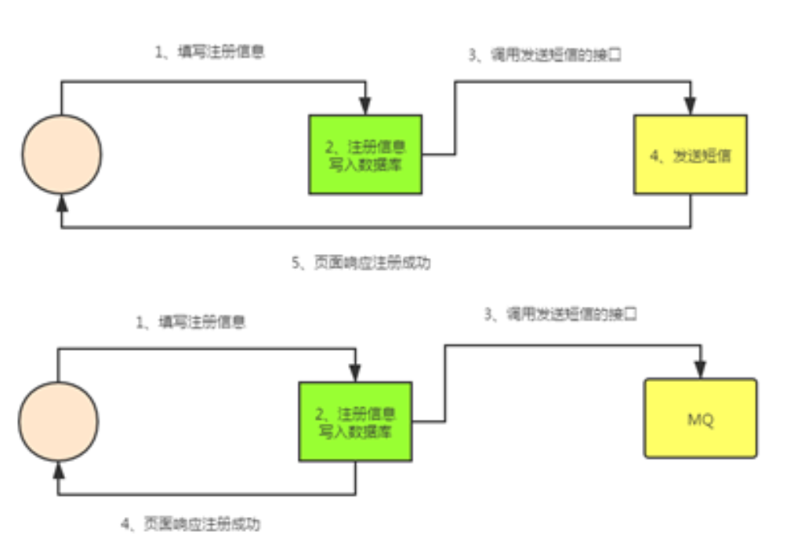 

上面是传统的消息队列，比如一个用户要注册信息，当用户信息写入数据库后，后面还有一些其他流程，比如发送短信，则需要等这些流程处理完成后，在返回给用户

而新式的队列是，比如一个用户注册信息，数据直接丢进数据库，就直接返回给用户成功

**1.2.2、使用消息队列的好处**

* A 解耦
* B 可恢复性
* C 缓冲
* D 灵活性&峰值处理能力
* E 异步通信


**1.2.3、消息队列的模式**

A、点对点模式

消息生产者发送消息到消息队列中，然后消息消费者从队列中取出并且消费消息，消息被消费后，队列中不在存储。所以消息消费者不可能消费到已经被消费的消息；队列支持存在多个消费者，但是对于一个消息而言，只会 有一个消费者可以消费；如果想发给多个消费者，则需要多次发送该条消息

B、发布/订阅模式（一对多，消费者消费数据之后不会清除消息）

消息生产者将消息发布到topic中，同时有多个消息消费者（订阅）消费该消息，和点对点的方式不同，发布到topic的消息会被所有的订阅者消费；

但是数据保留是期限的，默认是7天，因为他不是存储系统；

kafka就是这种模式的；

**有两种方式，一种是是消费者去主动去消费（拉取）消息，而不是生产者推送消息给消费者；另外一种就是生产者主动推送消息给消费者，类似公众号**

### **1.3、kafka的基础架构**

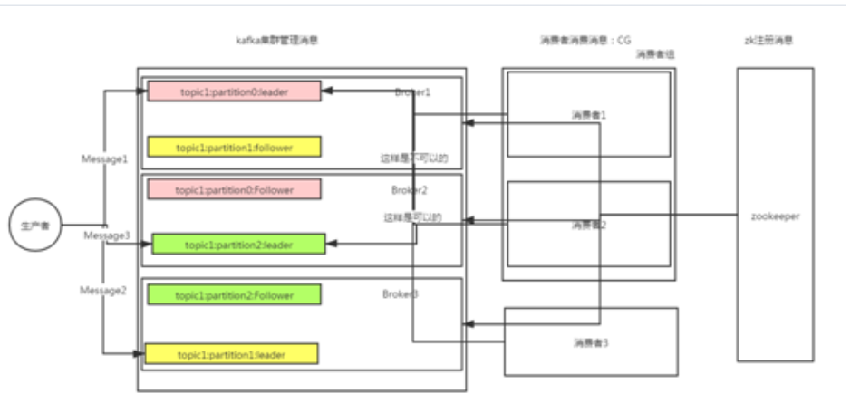 


**kafka的基础架构主要有broker、生产者、消费者组构成，当前还包括zookeeper**

生产者负责发送消息

**broker负责缓冲消息，broker中可以创建topic，每个topic又有partition和replication的概念**


消费者组负责处理消息，同一个消费者组的中消费者不能消费同一个partition中的数据，消费者组主要是提高消费能力，比如之前是一个消费者消费100条数据，现在是2个消费者消费100条数据，可以提高消费能力；

**所以消费者组的消费者的个数要小于partition的个数，不然就会有消费者没有partition可以消费，造成资源的浪费**


注：但是不同的消费者组的消费者是可以消费相同的partition数据

Kakfa如果要组件集群，则只需要注册到一个zk中就可以了，zk中还保留消息消费的进度或者说偏移量或者消费位置


* 0.9版本之前偏移量存储在zk
* 0.9版本之后偏移量存储在kafka中，kafka定义了一个系统的topic，专用用来存储偏移量的数据；

为什么要改？主要是考虑到频繁更改偏移量，对zk的压力较大，而且kafka本身自己的处理也较复杂

### **1.4、kafka安装**

A、Kafka的安装只需要解压安装包就可以完成安装

```
tar -zxvf kafka_2.11-2.1.1.tgz -C /usr/local/
```

B、查看配置文件

```
[root@es1 config]# pwd
/usr/local/kafka/config
[root@es1 config]# ll
total 84
-rw-r--r--. 1 root root  906 Feb  8  2019 connect-console-sink.properties
-rw-r--r--. 1 root root  909 Feb  8  2019 connect-console-source.properties
-rw-r--r--. 1 root root 5321 Feb  8  2019 connect-distributed.properties
-rw-r--r--. 1 root root  883 Feb  8  2019 connect-file-sink.properties
-rw-r--r--. 1 root root  881 Feb  8  2019 connect-file-source.properties
-rw-r--r--. 1 root root 1111 Feb  8  2019 connect-log4j.properties
-rw-r--r--. 1 root root 2262 Feb  8  2019 connect-standalone.properties
-rw-r--r--. 1 root root 1221 Feb  8  2019 consumer.properties
-rw-r--r--. 1 root root 4727 Feb  8  2019 log4j.properties
-rw-r--r--. 1 root root 1925 Feb  8  2019 producer.properties
-rw-r--r--. 1 root root 6865 Jan 16 22:00 server-1.properties
-rw-r--r--. 1 root root 6865 Jan 16 22:00 server-2.properties
-rw-r--r--. 1 root root 6873 Jan 16 03:57 server.properties
-rw-r--r--. 1 root root 1032 Feb  8  2019 tools-log4j.properties
-rw-r--r--. 1 root root 1169 Feb  8  2019 trogdor.conf
-rw-r--r--. 1 root root 1023 Feb  8  2019 zookeeper.properties
```

C、修改配置文件`server.properties`

设置`broker.id` 这个是`kafka`集群区分每个节点的唯一标志符

 

```
broker.id=0
```

D、**设置kafka的数据存储路径**

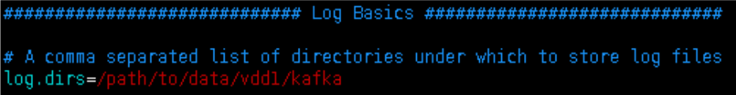 

> 注：这个目录下不能有其他非kafka的目录，不然会导致kafka集群无法启动

E、设置是否可以删除topic，默认情况先kafka的topic是不允许删除的

 

F、Kafka的数据保留的时间，默认是7天

 

G、Log文件最大的大小，如果log文件超过1g会创建一个新的文件

 

**H、Kafka连接的zk的地址和连接kafka的超时时间**

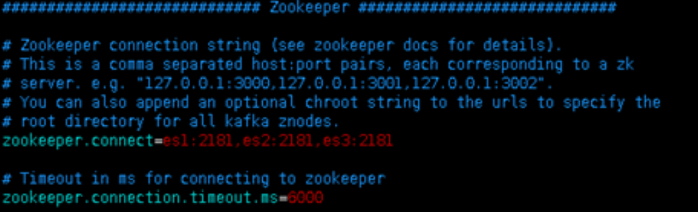 

J、默认的partition的个数

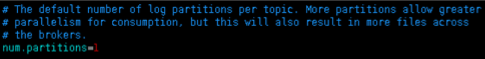 

### **1.5、启动kafka**

A、启动方式1，kafka只能单节点启动，所以每个kakfa节点都需要手动启动，下面的方式阻塞的方式启动

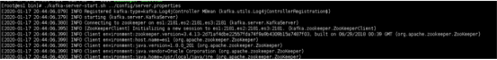 

B、启动方式2，守护的方式启动，推荐

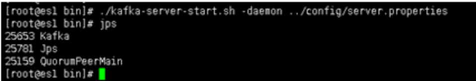 

### **1.6、kafka操作**

A、查看当前kafka集群已有的topic

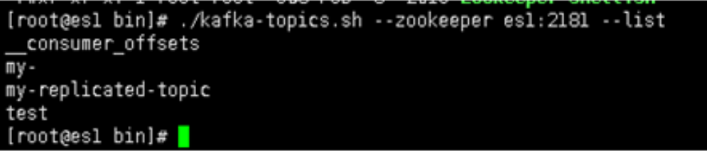 

> 注意：这里连接的zookeeper，而不是连接的kafka

B、创建topic，指定分片和副本个数

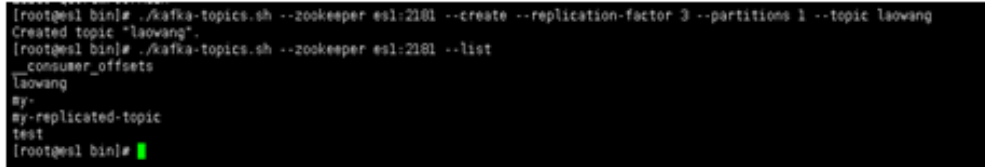 

注：

* replication-factor：副本数
* replication-factor：分区数


Topic：主题名

如果当前kafka集群只有3个broker节点，则`replication-factor`最大就是3了，下面的例子创建副本为4，则会报错


C、删除topic

 

D、查看topic信息

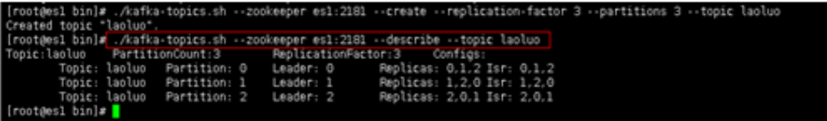 

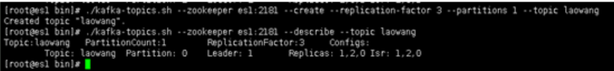 

### **1.7、启动生产者生产消息，kafka自带一个生产者和消费者的客户端**

A、启动一个生产者，注意此时连的9092端口，连接的kafka集群

 

B、启动一个消费者，注意此时连接的还是9092端口，在0.9版本之前连接的还是2181端口

 

这里我们启动2个消费者来测试一下

 

注：如果不指定的消费者组的配置文件的话，默认每个消费者都属于不同的消费者组

C、发送消息，可以看到每个消费者都能收到消息

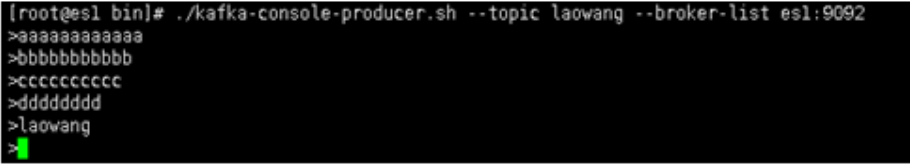 

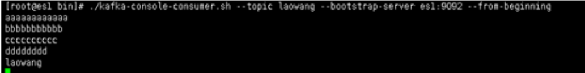 

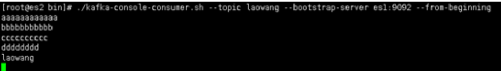 

D、Kakfa中的实际的数据

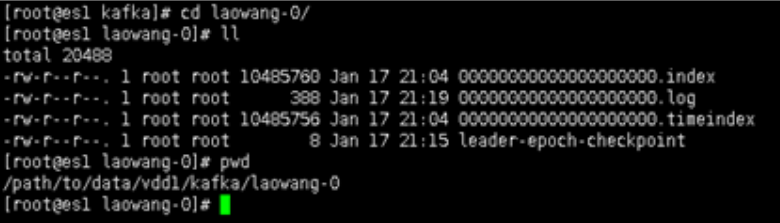 

## **二、kafka架构深入**

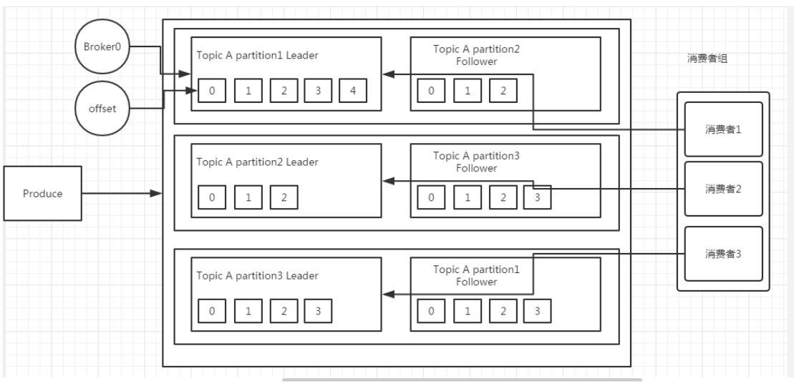 

Kafka不能保证消息的全局有序，只能保证消息在partition内有序，因为消费者消费消息是在不同的partition中随机的

### **2.1、kafka的工作流程**

**Kafka中的消息是以topic进行分类的，生产者生成消息，消费者消费消息，都是面向topic的**

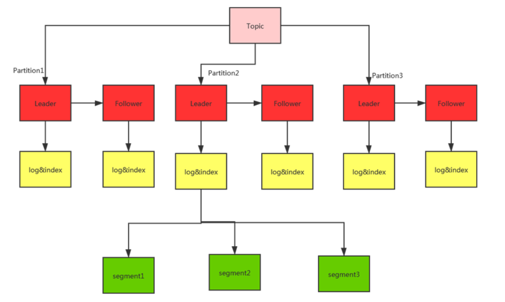 

Topic是一个逻辑上的概念，而partition是物理上的概念

每个partition又有副本的概念

每个partition对应于一个log文件，该log文件中存储的就是生产者生成的数据，生产者生成的数据会不断的追加到该log的文件末端，且每条数据都有自己的offset，消费者都会实时记录自己消费到了那个offset，以便出错的时候从上次的位置继续消费，这个offset就保存在index文件中

kafka的offset是分区内有序的，但是在不同分区中是无顺序的，kafka不保证数据的全局有序

### **2.2、kafka原理**

由于生产者生产的消息会不断追加到log文件的末尾，为防止log文件过大导致数据定位效率低下，

**Kafka采用分片和索引的机制，将每个partition分为多个segment，每个segment对应2个文件----index文件和log文件，这2个文件位于一个相同的文件夹下，文件夹的命名规则为topic名称+分区序号**

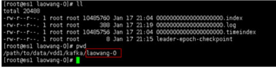 

Indx和log的文件的文件名是当前这个索引是最小的数据的offset

Kafka如何快速的消费数据呢？

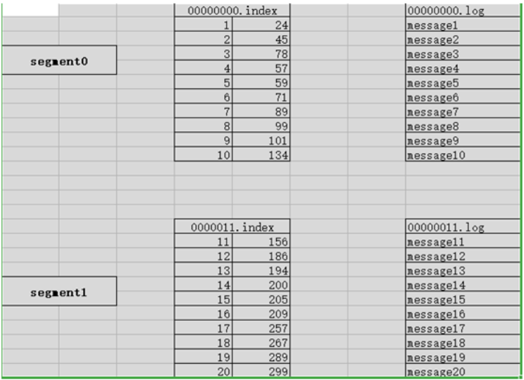 

Index文件中存储的数据的索引信息，第一列是offset，第二列这这个数据所对应的log文件中的偏移量，就像我们去读文件，使用`seek（）`设置当前鼠标的位置一样，可以更快的找到数据

如果要去消费offset为3的数据，首先通过二分法找到数据在哪个index文件中，然后在通过index中offset找到数据在log文件中的offset；这样就可以快速的定位到数据，并消费

所以kakfa虽然把数据存储在磁盘中，但是他的读取速度还是非常快的

## **三、kafka的生产者和消费者**

### **3.1、kafka的生产者**


Kafka的partition的分区的作用

**Kafka的分区的原因主要就是提供并发提高性能，因为读写是partition为单位读写的；**

那生产者发送消息是发送到哪个partition中呢？

A、在客户端中指定partition

B、轮询（推荐）消息1去p1，消息2去p2，消息3去p3，消息4去p1，消息5去p2，消息6去p3 。。。。。。。


### **3.2 kafka如何保证数据可靠性呢？通过ack来保证**

为保证生产者发送的数据，能可靠的发送到指定的topic，topic的每个partition收到生产者发送的数据后，都需要向生产者发送ack（确认收到），如果生产者收到ack，就会进行下一轮的发送，否则重新发送数据

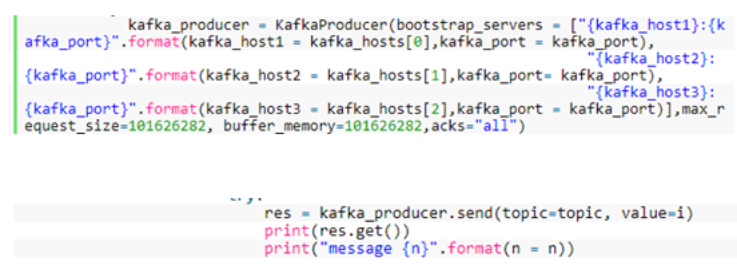 

那么kafka什么时候向生产者发送ack

**确保follower和leader同步完成，leader在发送ack给生产者，这样才能确保leader挂掉之后，能再follower中选举出新的leader后，数据不会丢失**

那多少个follower同步完成后发送ack

* 方案1：半数已经完成同步，就发送ack
* 方案2：全部完成同步，才发送ack（kafka采用这种方式）


采用第二种方案后，设想以下场景，leader收到数据，所有的follower都开始同步数据，但是有一个follower因为某种故障，一直无法完成同步，那leader就要一直等下，直到他同步完成，才能发送ack，这样就非常影响效率，这个问题怎么解决？

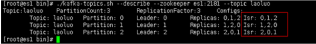 


Leader维护了一个动态的ISR列表（同步副本的作用），只需要这个列表的中的follower和leader同步；

* **当ISR中的follower完成数据的同步之后，leader就会给生产者发送ack，如果follower长时间未向leader同步数据，则该follower将被剔除ISR，这个时间阈值也是自定义的**；
* **同样leader故障后，就会从ISR中选举新的leader**

怎么选择ISR的节点呢？

首先通信的时间要快，要和leader要可以很快的完成通信，这个时间默认是10s

然后就看leader数据差距，消息条数默认是10000条（后面版本被移除）

为什么移除：因为kafka发送消息是批量发送的，所以会一瞬间leader接受完成，但是follower还没有拉取，所以会频繁的踢出加入ISR，这个数据会保存到zk和内存中，所以会频繁的更新zk和内存。

* A、acks为0

**生产者不等ack，只管往topic丢数据就可以了，这个丢数据的概率非常高**

* B、ack为1

Leader落盘后就会返回ack，会有数据丢失的现象，如果leader在同步完成后出现故障，则会出现数据丢失

* C、ack为-1（all）


**Leader和follower（ISR）落盘才会返回ack，会有数据重复现象，如果在leader已经写完成，且follower同步完成，但是在返回ack的出现故障，则会出现数据重复现象**；

极限情况下，这个也会有数据丢失的情况，比如follower和leader通信都很慢，所以ISR中只有一个leader节点，这个时候，leader完成落盘，就会返回ack，如果此时leader故障后，就会导致丢失数据

### **3.3 Kafka如何保证消费数据的一致性？通过HW来保证**

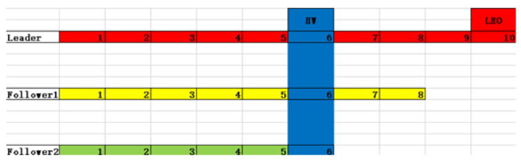 


* LEO：指每个follower的最大的offset

**HW（高水位）：指消费者能见到的最大的offset，LSR队列中最小的LEO，也就是说消费者只能看到1~6的数据，后面的数据看不到，也消费不了**

避免leader挂掉后，比如当前消费者消费8这条数据后，leader挂   了，此时比如f2成为leader，f2根本就没有9这条数据，那么消费者就会报错，所以设计了HW这个参数，只暴露最少的数据给消费者，避免上面的问题

**3.3.1、HW保证数据存储的一致性**

A、Follower故障

**Follower发生故障后会被临时提出LSR，待该follower恢复后，follower会读取本地的磁盘记录的上次的HW，并将该log文件高于HW的部分截取掉，从HW开始想leader进行同步，等该follower的LEO大于等于该Partition的hw，即follower追上leader后，就可以重新加入LSR**

B、Leader故障

**Leader发生故障后，会从ISR中选出一个新的leader，**之后，为了保证多个副本之间的数据一致性，其余的follower会先将各自的log文件高于hw的部分截掉（新leader自己不会截掉），然后从新的leader同步数据

注意：这个是为了保证多个副本间的数据存储的一致性，并不能保证数据不丢失或者不重复

**3.3.2精准一次（幂等性），保证数据不重复**

 
* Ack设置为-1，则可以保证数据不丢失，但是会出现数据重复（at least once）
* Ack设置为0，则可以保证数据不重复，但是不能保证数据不丢失（at most once）
* 但是如果鱼和熊掌兼得，该怎么办？这个时候就就引入了Exactl once（精准一次）

在0.11版本后，引入幂等性解决kakfa集群内部的数据重复，在0.11版本之前，在消费者处自己做处理

如果启用了幂等性，则ack默认就是`-1`，kafka就会为每个生产者分配一个pid，并未每条消息分配seqnumber，如果pid、partition、seqnumber三者一样，则kafka认为是重复数据，就不会落盘保存；但是如果生产者挂掉后，也会出现有数据重复的现象；所以幂等性解决在单次会话的单个分区的数据重复，但是在分区间或者跨会话的是数据重复的是无法解决的

### **3.4 kafka的消费者**

**3.4.1 消费方式**

消息队列有两种消费消息的方式，push（微信公众号）、pull（kafka），push模式很难适应消费速率不同的消费者，因为消费发送速率是由broker决定的，他的目标是尽可能以最快的的速度传递消息，但是这样很容易造成消费者来不及处理消息，典型的表现就是拒绝服务以及网络拥塞。而pull的方式可以消费者的消费能力以适当的速率消费消息

Pull的模式不足之处是如果kafka没有数据，消费者可能会陷入死循环，一直返回空数据，针对这一点，kafka的消费者在消费数据时候回传递一个timeout参数，如果当时没有数据可供消费，消费者会等待一段时间在返回

**3.4.2 分区分配策略**

一个消费者组有多个消费者，一个topic有多个partition。所以必然会涉及到partition的分配问题，即确定哪个partition由哪个消费者来消费

**Kafka提供两种方式，一种是轮询（RountRobin）对于topic组生效，一种是（Range）对于单个topic生效**

轮训：前置条件是需要一个消费者里的消费者订阅的是相同的topic。不然就会出现问题；非默认的的方式

同一个消费者组里的消费者不能同时消费同一个分区

比如三个消费者消费一个topic的9个分区


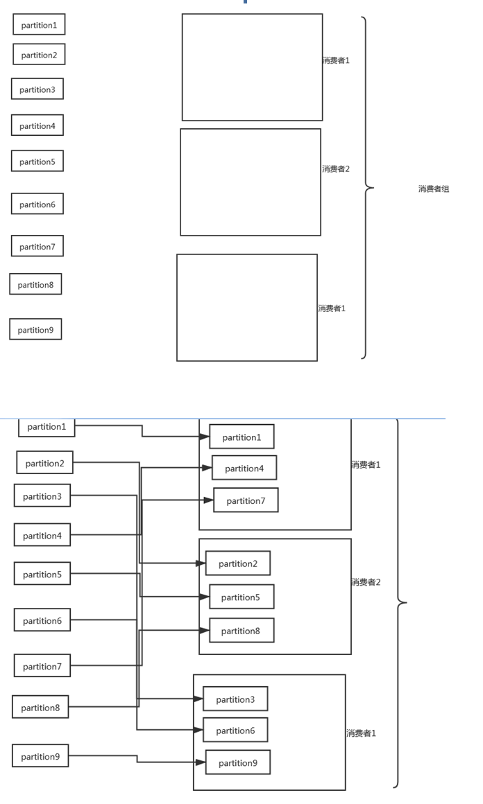 

如果一个消费者组里有2个消费者，这个消费者组里同时消费2个topic，每个topic又有三个partition

**首先会把2个topic当做一个主题，然后根据topic和partition做hash，然后在按照hash排序。然后轮训分配给一个消费者组中的2个消费者**

如果是下面这样的方式订阅的呢？

比如有3个topic，每个topic有3个partition，一个消费者组中有2个消费者。消费者1订阅topic1和topic2，消费者2订阅topic2和topic3，那么这样的场景，使用轮训的方式订阅topic就会有问题

如果是下面这种方式订阅呢

比如有2个topic，每个topic有3个partition，一个消费者组 有2个消费者，消费者1订阅topic1，消费者2订阅topic2，这样使用轮训的方式订阅topic也会有问题

所以我们一直强调，使用轮训的方式订阅topic的前提是一个消费者组中的所有消费者订阅的主题是一样的；

所以轮训的方式不是kafka默认的方式

Range：是按照单个topic来划分的，默认的分配方式

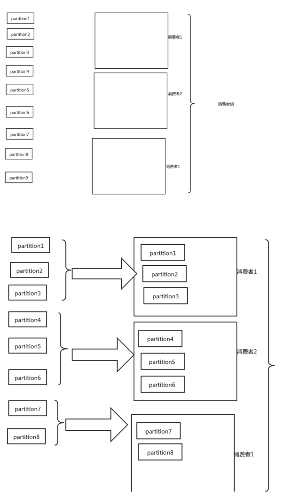 

Range的问题会出现消费者数据不均衡的问题

比如下面的例子，一个消费者组订阅了2个topic，就会出现消费者1消费4个partition，而另外一个消费者只消费2个partition

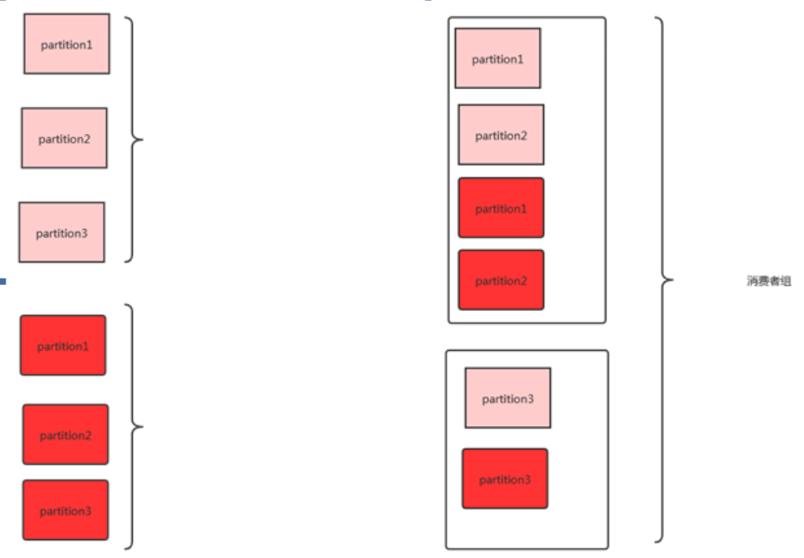 

分区策略什么时候会触发呢？当消费者组里的消费者个数变化的时候，会触发分区策略调整，比如消费者里增加消费者，或者减少消费者

**3.4.3 offset的维护**

由于消费者在消费过程中可能会出现断电宕机等故障，消费者恢复后，需要从故障前的位置继续消费，所以消费者需要实施记录自己消费哪个offset，以便故障恢复后继续消费

Offset保存的位置有2个，一个zk，一个是kafka

首先看下offset保存到zk

由消费者组、topic、partition三个元素确定唯一的offset

所以消费者组中的某个消费者挂掉之后，或者的消费者还是可以拿到这个offset的


Controller这个节点和zk通信，同步数据，这个节点就是谁先起来，谁就先注册controller，谁就是controller。其他节点和controller信息保持同步

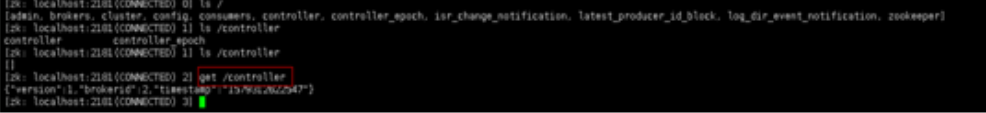 

**3.4.5、消费者组的案例**

修改消费者组id

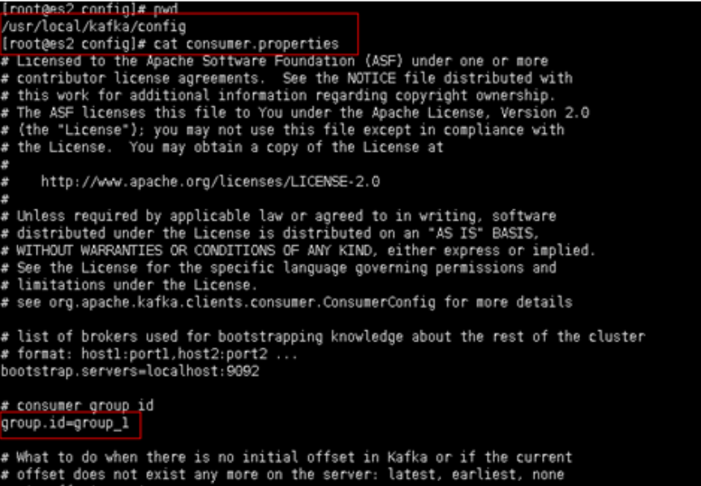 

启动一个消费者发送3条数据

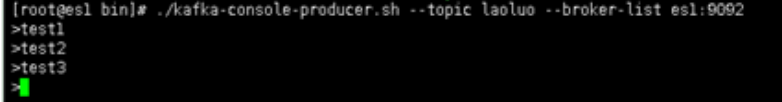 

指定消费者组启动消费者，启动三个消费者，可以看到每个消费者消费了一条数据

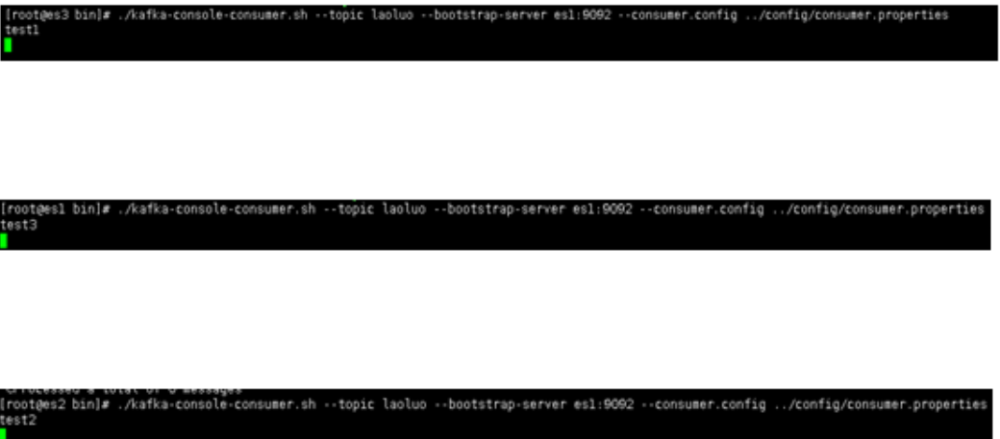 

在演示下不同组可以消费同一个topic的，我们看到2个消费者的消费者都消费到同一条数据

再次启动一个消费者，这个消费者属于另外一个消费者组

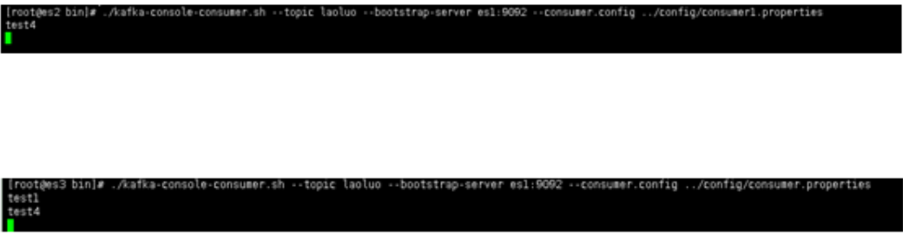 

## **四、Kafka的高效读写机制**

### **4.1、分布式部署**

多节点并行操作

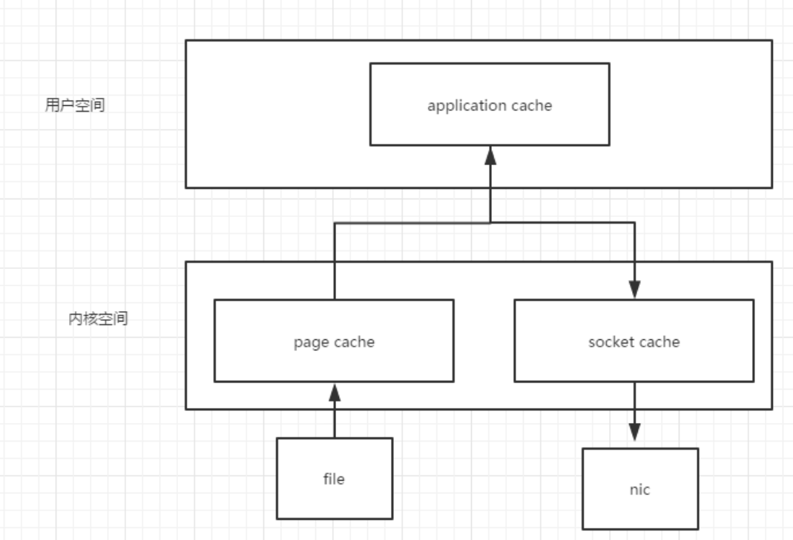 

### **4.2、顺序写磁盘**

Kafka的producer生产数据，要写入到log文件中，写的过程中一直追加到文件末尾，为顺序写，官网有数据表明。同样的磁盘，顺序写能到600M/S，而随机写只有100K/S。这与磁盘的机械结构有关，顺序写之所以快，是因为其省去了大量磁头寻址的时间

### **4.3、零复制技术**

正常情况下，先把数据读到内核空间，在从内核空间把数据读到用户空间，然后在调操作系统的io接口写到内核空间，最终在写到硬盘中

Kafka是这样做的，直接在内核空间流转io流，所以kafka的性能非常高

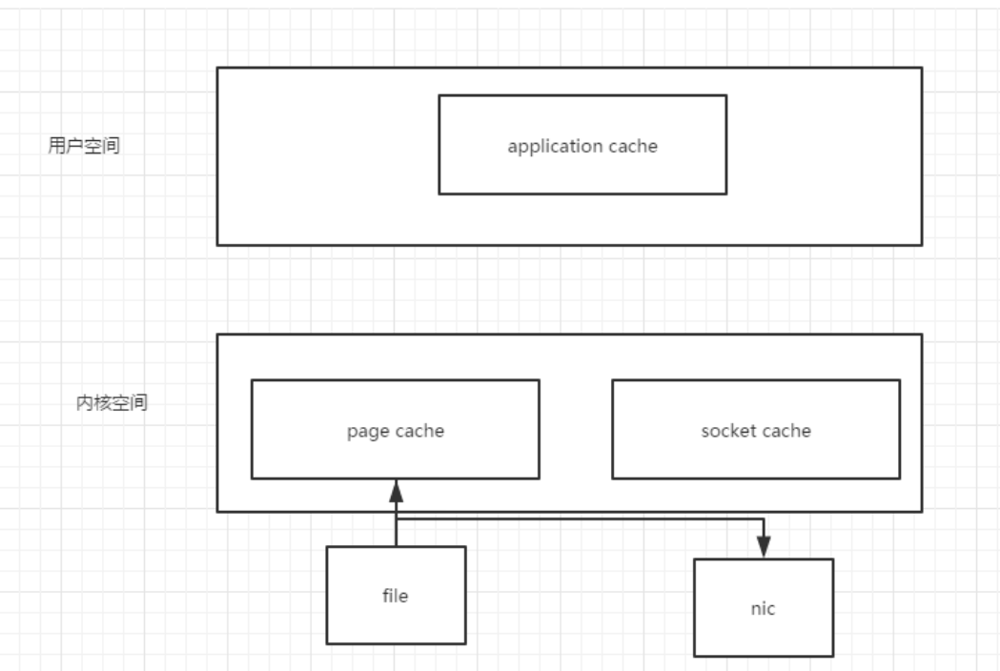 

## **五、 zookeeper在kafka中的作用**

**Kafka集群中有一个broker会被选举为controller，负责管理集群broker的上下线，所有的topic的分区副本分配和leader选举等工作**

