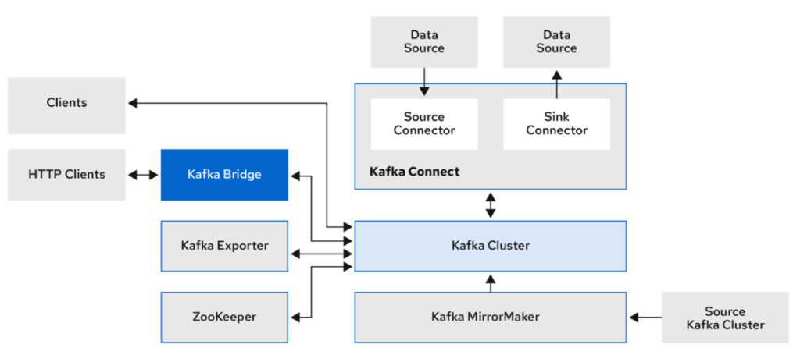
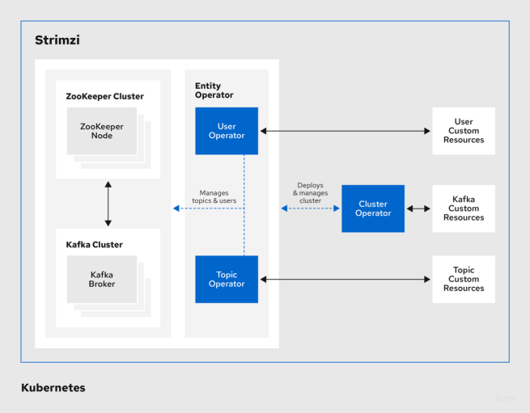
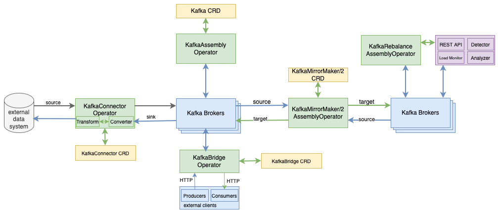
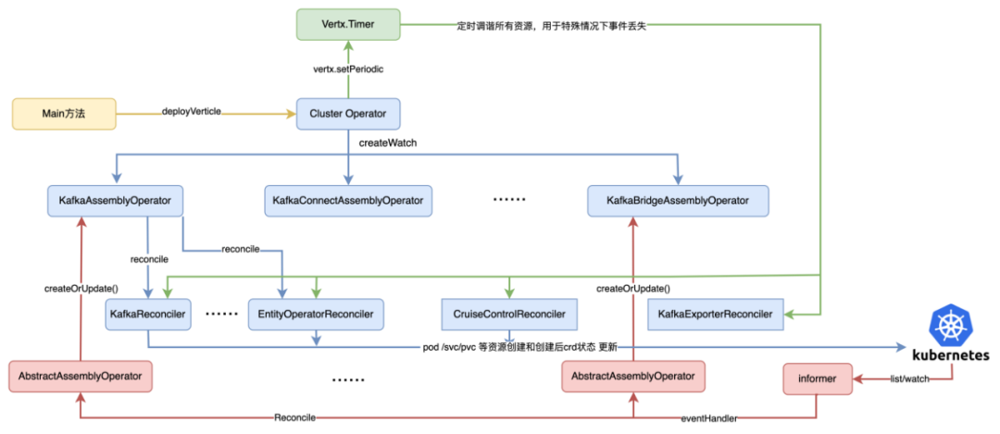
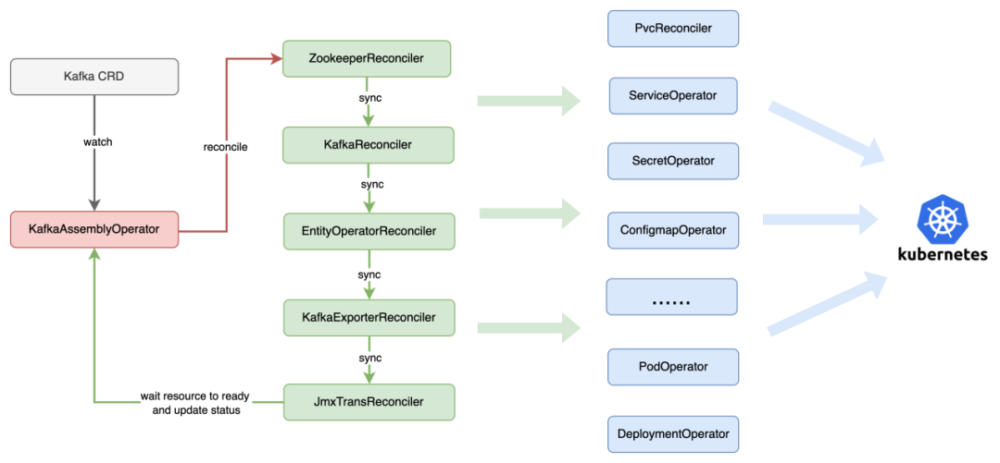

# Kafka Operator 实践和解析

## 一、背景

基于 K8s Operator 模式开发的应用程序因其具有全生命周期的自动化管理、可扩展性强和故障自愈等特点，成为云化方案落地的重要方向。业界中主流的 Kafka Operator on K8s 方案分别有 Strimzi 社区推出的 [strimzi-kafka-operator](https://github.com/strimzi/strimzi-kafka-operator)和 banzaicloud 公司推出的 [koperator](https://github.com/banzaicloud/koperator)。相较于 koperator，**strimzi-kafka-operator** 具有更完善 Kafka 的上下游生态、自定义 Operator 扩展性强和可定制等特点。

## **二、Strimzi Kafka Operator 介绍**

Strimzi Kafka Operator 基于 fabric8 k8s client 实现的 Kafka Operator，为 K8s 上自动化部署、管理和监控多套 Kafka 集群，提供了一种高度可扩展和可靠的解决方案。

Strimzi Kafka Operator 具有集群快速一键化部署、通用的 Kafka 集群管理、跨集群的数据复制、丰富的大数据数据源对接、统一的监控和告警、集群故障管理和数据 Rebalance 等功能。



strimzi kafka operator支持Kafka集群及周边生态

* Cluster Operator：**负责 Kafka 集群及其周边生态工具的所有 Operators 封装;**
* Entity Operator：**负责创建当前 Kafka 集群中 User Operator 和 Topic Operator 实例**;
* User Operator：**负责当前 Kafka 集群中不同类型 User 认证、鉴权和访问控制**；
* Topic Operator：**负责当前 Kafka 集群中的 Topic 管理**。



https://strimzi.io/docs/operators/latest/overview

## 三、安装部署和使用

**1、Cluster Operator 部署**

(1) k8s 中创建名为 kafka-operator 的 namespace: `kubectl create ns kafka-operator`   

(2) 安装 strimzi kafka operator：

* 打开官方在线部署的 yaml 文件并下载： 

`curl -L https://strimzi.io/install/latest?namespace=kafka-operator > strimzi-kafka-operator.yaml `

* 修改 `STRIMZI_NAMESPACE` 环境变量值为`*`，以便 `Cluster operator` 管理所有 namespace 下的 kafka 集群

* 创建 `ClusterRoleBindings`，为 `Cluster operator` 授予所有 `namespace` 的访问权限

**`strimzi-kafka-operator.yaml`**

```
...
env:
    - name: STRIMZI_NAMESPACE
      value: "*"
      # valueFrom:
      #   fieldRef:
      #     fieldPath: metadata.namespace
...
```

```
kubectl create clusterrolebinding strimzi-cluster-operator-namespaced --clusterrole=strimzi-cluster-operator-namespaced --serviceaccount kafka-operator:strimzi-cluster-operator


kubectl create clusterrolebinding strimzi-cluster-operator-watched --clusterrole=strimzi-cluster-operator-watched --serviceaccount kafka-operator:strimzi-cluster-operator


kubectl create clusterrolebinding strimzi-cluster-operator-entity-operator-delegation --clusterrole=strimzi-entity-operator --serviceaccount kafka-operator:strimzi-cluster-operator
```

查看安装后的 Cluster Operator pod 是否为 Running: 

```
kubectl create -f strimzi-kafka-operator.yaml kubectl -n kafka-operator get pods -w
```

```
$ kubectl get pods -n kafka-operator 
NAME                                        READY   STATUS    RESTARTS       AGE
strimzi-cluster-operator-78dd4f6d84-h4g2j   1/1     Running   2 (100m ago)   35h
```

**2、kafka 实例创建**

本小节将演示如何使用 Cluster Operator 将临时存储的 kafka 实例部署到 k8s 集群中。

集群的创建中，首先创建多副本的 zookeeper pod，创建完成后开始 kafka broker pod 创建。对于 ZK 和 Kafka 集群数据文件的存储，官方示例中提供了临时存储（EmptyDir）、块存储（JBOD）和持久化存储（PVC）三种形式样例。

```
kubectl apply -f https://strimzi.io/examples/latest/kafka/kafka-ephemeral-single.yaml -n kafka
```

```
$ kubectl get pods -n kafka
NAME                                          READY   STATUS    RESTARTS      AGE
my-cluster-zookeeper-0                        1/1     Running   1 (12h ago)   35h
my-cluster-zookeeper-2                        1/1     Running   1 (35h ago)   35h
my-cluster-zookeeper-1                        1/1     Running   1 (35h ago)   35h
my-cluster-kafka-0                            1/1     Running   2 (12h ago)   35h
my-cluster-entity-operator-64dc7c8844-mtmtf   3/3     Running   5 (12h ago)   35h
```

**3、kafka 实例生产消费**

本小节将演示如何，连接 kafka 实例对外暴露的服务，并进行消息的生产和消费。

**Session 1**

```
 $ kubectl -n kafka run kafka-producer -ti --image=quay.io/strimzi/kafka:0.38.0-kafka-3.6.0 --rm=true --restart=Never -- bin/kafka-console-producer.sh --bootstrap-server my-cluster-kafka-bootstrap:9092 --topic test
If you don't see a command prompt, try pressing enter.
>test
[2023-12-15 15:34:59,001] WARN [Producer clientId=console-producer] Error while fetching metadata with correlation id 4 : {test=LEADER_NOT_AVAILABLE} (org.apache.kafka.clients.NetworkClient)

>test
>llll 
```

**Session 2**

```
 kubectl -n kafka run kafka-consumer -ti --image=quay.io/strimzi/kafka:0.38.0-kafka-3.6.0 --rm=true --restart=Never -- bin/kafka-console-consumer.sh --bootstrap-server my-cluster-kafka-bootstrap:9092 --topic test --from-beginning
If you don't see a command prompt, try pressing enter.

test
llll
```

## 四、Cluster Operator 技术实现

本节详细分析 Cluster Operator 技术实现的核心细节，主要介绍 Cluster Operator 中多种 CRD 资源的定义和对应资源 Operator 的整体调用流程，并重点分析 Kafka 集群创建过程中各个环节的调谐步骤。

**1、Cluster Operator 整体架构**

Cluster Operator 是 Strimzi Kafka Operator 中的核心模块，封装了 Kafka 集群管理及其周边生态工具的 CRD 资源，并基于观察者模式的事件注册和 K8s Informer 机制，执行不同类型 Operator 的 Reconcile（调谐）逻辑。Cluster Operator 中对 Kafka 集群及其周边生态工具的操作，主要由 6 种 KafkaAssemblyOperator 类型来实现。

其中，**KafkaAssemblyOperator** 负责整个 Kafka 集群创建、持久化存储挂载和对外安全链路访问等。

`KafkaConnectAssemblyOperator` 创建 Kafka Connect 服务实现从外部系统导入或导出数据。KafkaBridgeAssemblyOperator 启动 Kafka Bridge 服务，基于 HTTP REST API 方式操作 Kafka 集群实例。

`KafkaMirrorMaker/2AssemblyOperator ` 完成不同 Kafka 集群之间的数据复制工作，实现跨数据中心的集群高可用。

`KafkaRebalanceAssemblyOperator` 与 `Cruise Control` 工具的 `REST API` 交互，向其发送 `Rebalance` 请求，并监听 Kafka 集群 Rebalance 的执行状态。



**Cluster Operator中各个AssemblyOperator组件调用流程**

当 Cluster Operator Pod 运行时，**首先创建各个 CRD 资源所需的 ClusterRoles，并开启 Cluster Operator pod 选主功能，支持 Cluster Operator 多副本**；

**其次，依次为每个被管理的 Kafka 实例创建 verticles 对象，用于处理 ClusterOperator 整体逻辑。**

**针对 Cluster Operator 下不同类型的 AssemblyOperator，调用 CRD 资源的 SharedInformer 注册对应的 EventHandler，并根据 workqueue pop 出的 Reconciliation 对象，执行不同 CRD 资源的调谐逻辑**。

各个调谐逻辑根据 CRD 资源 Spec 定义的内容，调用 K8s API Server 创建 Pod、Deployment、Service、ConfigMap、PVC、Secret 等内置资源对象，并将创建后的状态数据更新到 K8s 中。



### 2、Kafka 集群创建 Reconcile 流程

**KafkaAssemblyOperator Reconcile 过程中，主要包括 Kafka 集群和相关依赖的 ZK、Entity Operator、KafkaExporter 和 JMX 组件的 Reconcile**。其中，Kafka broker 核心 k8s 底层资源的 Reconcile 流程有：

* 存储调谐：支持动态创建和扩容不同类型的存储，例如 EmpityDir、JBOD 和 PVC 等；
* Service 调谐：根据 KafkaClusterSpec 中 listeners 定义，以及 Kafka 内置的管理面和控制面 listener，支持 Routes、Ingress、Internal、LoadBalancer、NodePort、ClusterIP 类型的 service 创建。
* Secret 调谐：用于配置 broker 节点之间加密认证，生成基于自签名 CA 证书的公钥和私钥，并写入到 Secret 中；
* ConfigMap 调谐：创建和动态更新 kafka 集群每个 broker 配置项，以及 metrics 和日志相关的配置，并写入到 ConfigMap 中；
* **Pod 调谐：创建 kafka broker 的 pod，包括对 pod spec 字段中的 initContainers 和 containers 中的 ports、volumes、volumeMount、 imagePullSecret、hostAliases、livenessProbe 和 readinessProbe 等字段传参赋值**；
* 各种资源创建后的状态检查：对 pods、serviceEndpoints、listener 等资源创建后的状态校验，直到资源状态变为 Ready。



### 总结

和传统线下自建 Kafka 集群相比，基于 Strimzi Kafka Operator 容器化的 Kafka 服务，具有 Kafka 集群和周边生态的自动化管理、可扩展性强、故障恢复和自愈等优点，并且提供一站式的监控、日志、告警等能力的集成。

