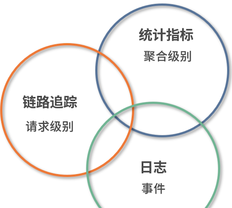
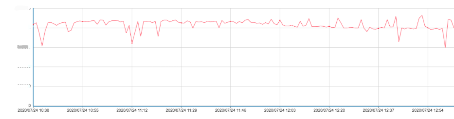
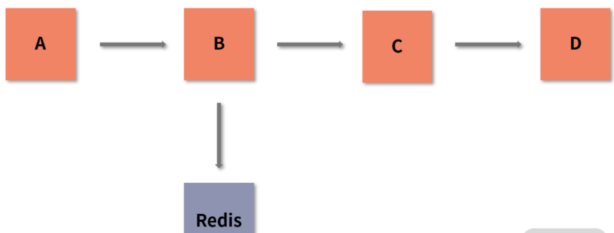
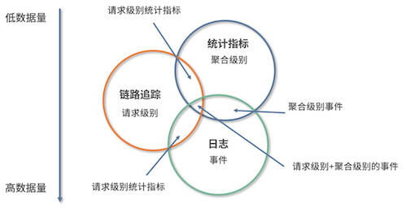

# **1 数据观测：数据追踪的基石**

## **1 监控数据来源**

### **1-1 端上访问**

我们一般可以通过以下几个方式获取端上访问的数据：

* **用户体验监控**：Web 页面中的白屏时间、DOM 元素/资源加载耗时、文档网络耗时；App 的卡顿率、崩溃率、热启动加载时长等。
* **日志**：在 Web 页面中，如果出现脚本错误，则需要将相应的异常信息通过日志的方式上报服务器；App 也会有相应的日志输出，但移动端更关注系统崩溃或出现异常时的日志信息。
* **端到端**：指的是用户端（Web/App）到后端服务器的请求情况，比如访问量、成功率、响应时间等。通过端到端观测时，我们还需要了解端上所处的地区、网络环境、响应状态码等信息，才能更好地掌握用户真实的使用情况。
* **可用率**：因运营商和地区的不同，会导致访问端上时有一些差异，比如访问是否可用、响应耗时长短等。这与 CDN、DNS 等公共资源有莫大的关系。

### **1-2 应用程序**

当端上发起请求后，一般会到达应用程序。这里是代码运行，以及处理用户请求的地方。在应用程序中，我们可能会集成各种第三方组件，比如常见的 Kafka、Redis、MySQL。

应用程序的执行效率最终会通过端上响应情况反映出来，直接影响到用户的使用体验。

* **执行情况：我们常说的响应时间、QPS **等，都可以反映应用程序的执行情况。
	* 针对端上的请求，或者我们的定时任务，应用程序的执行情况就十分关键。
	* 执行情况越差，用户的直观体验也会越差。**在组件级别，像 MySQL 中的慢查询监控，Kafka 中的 Lag 监控等，也可以反映应用程序的执行情况**。

* **资源消耗：应用程序部署后，会消耗一定的资源**，
	* 例如内存级别的 Redis 会消耗大量的内存，
	* Kakfa 则因为要进行磁盘写入所以会要求较好的 I/O。
	* **我们的应用程序会区分 I/O 密集型和 CPU 密集型，它们所对应的资源消耗是不同的**。

* **VM 指标监控**：
	* 指的是 JVM 监控，比如 GC 时间、线程数、FGC/YGC 耗时等信息。
	* 当然，其他语言也有其独特的统计指标信息。

* **容量**：**指单个系统可最大承受的容量**。
	* 容量也是一个非常重要的指标，当应用访问量到达阈值时，我们一般会对这个应用的访问容量进行扩缩容。

* **服务关系：随着分布式系统架构的流行，我们在监控单体应用的基础上，还必须考虑应用之间的调用关系和调用速度**，
	* 比如是否会存在两个服务之间的相互循环引用，
	* 下游服务出现问题是否会干扰整个流程的执行，又或是服务之间的响应时长、上下游服务的依赖程度等。

* **应用日志：应用日志应该是我们再熟悉不过的内容了**。
	* 我们开发的应用程序，会记录下自身的日志，第三方组件也会有相应的日志，比如 MySQL 的进程日志、慢查询日志等。
	* 充分利用应用日志，可以大幅提高我们的排错能力。

* **健康情况：当前服务是否存活、服务运行是否稳定等，这也是十分关键的指标**。
	* 我们在 ES 中可以看到服务的状态（RED、YELLOW、GREEN）。

### **1-3 业务监控**

业务监控也是可观测系统中一个重要的内容，如果你只是让应用程序稳定运行那肯定是远远不够的。因此，我们常常会对具体业务产生的数据进行监控，例如网站系统中我们会关注 PV、UV 等参数；

在支付系统中，我们则会关注创建订单量、成单量等。

**业务指标能很好地体现出系统是否稳定**。任何系统，如果出现了问题，最先受到影响的肯定是业务指标。当然，如果影响不是特别大，那就说明对这个指标进行监控的意义也不是很大。

**业务指标也可以衡量上线后的成效**。

* 如果我们需要通过 A/B Test 了解用户更偏好哪一种模式，可以分别观察两种模式下的业务指标来比对用户喜好。
* 再或者，我们可以通过业务指标得出的结论，在上线前进行一些改进（例如选择用户更偏好的模式）来提高成单率。

### **1-4 基础设施**

我们一般会从 2 个方向监控：

* **资源利用**：这个很好理解，像 I/O 使用率、CPU 利用率、内存使用率、磁盘使用率、网络使用率、负载等都属于资源利用的范畴。
* **通信情况**：这里是指主机与主机之间的网络情况。通信是互联网中最重要的基石之一，如果两台主机之间出现如网络延迟时间大、丢包率高这样的网络问题，会导致业务受阻。

## **2 可观测性核心概念**

**日志、统计指标和链路跟踪。**

 

### **2-1 日志（Logging）**

日志一般的描述是：**在特定时间发生的事件，被以结构化的形式记录并产生的文本数据**。

由于日志是最容易生成的，如果它大量地输出，会占据比较大的存储空间，进而影响整个应用程序的性能，比如 Java 中 logback 的日志框架，就算使用了异步线程来执行，也会对磁盘和 I/O 的使用率造成影响。

### **2-2 日统计指标（Metrics）**

统计指标也是我们经常使用的。它是一种可累加的聚合的数值结果，具有原子性。因此，我们可以通过各种数学计算方式来获取一段时间内的数值。

 

统计指标针对数据的存储、处理、压缩和检索进行了优化，所以一般可以长期存储并以很简单的方式（聚合）查询。但由于涉及数据的处理（数学计算方式）和压缩，所以它也会占用一定的 CPU 资源。

统计指标是一个压缩后的数值，因此如果指标出现异常，我们很难得知是什么原因导致的异常。

讲到这里，你应该对指标有了一定的认识。我们后端经常说的 QPS、TPS、SLA 都是计算后得到的指标；基础设施中的 CPU 使用率、负载情况也可以认为是指标。

### **2-3 链路追踪（Tracing）**

**链路追踪, 链路追踪是将链路的完整行为信息进行记录，然后通过可视化的形式展现出来。这里我用一张图来说明**

 

假设我们程序中的一个接口总共有 4 个服务参与，调用的关系分别是 A->B->C->D，其中 B 服务还与 Redis 这种第三方应用产生了调用/请求关系。

这一过程，我们就可以在链路追踪中，通过类似于上面这张图的形式来展示。

链路是支持跨应用的，比如我们常见的 RPC 请求，就可以说是链路中的一部分。

**与日志一样，链路追踪也会造成一定的性能损耗，因为任何形式的观测都需要存储一定的数据和时间信息，这必然会占用一定的 CPU 和内存资源**。

**三者之间关系**

我们一般可以将数据的来源分为 2 个级别：

* **请求级别**： 数据来源于真实的请求，比如一次 HTTP 调用，RPC 调用；
* **聚合级别**： 真实的请求指标，或是系统的一些参数数据聚合，比如 QPS、CPU 数值。

根据这 2 个级别，我们可以对上面的 3 个内容加以细化，

* **其中链路追踪是请求级别，因为它和每个请求都挂钩；**
* **日志和统计指标可以是请求级别，也可以是聚合级别**，因为它们可能是真实的请求，也可能是系统在对自身诊断时记录下来的信息。

 

* **链路追踪+统计指标（Request-scoped metrics）**，请求级别的统计：在链路追踪的基础上，与相关的统计数据结合，从而得知数据与数据、应用与应用之间的关系。
* **链路追踪+日志（Request-scoped events）**，请求级别的事件：这是链路中一个比较常见的组合模式。日志本身是每一条单独存在的，将链路追踪收集到的信息集成在日志中，可以让日志之间具备关联性，使其具有除了事件维度以外的另一个新的维度，上下文信息。
* **日志+统计指标（Aggregatable events）**，聚合级别的事件：这是在日志中的比较常见的组合。通过解析这部分具有统计指标的信息，我们可以获取相关的指标数据。
* **三者结合（Request-scoped,aggregatable events）**：三者结合可以理解为请求级别+聚合级别的事件，由此就形成了一个丰富的、全局的观测体系。

**最终会输出的数据量（Volume）**

* **统计指标**是数值的形式，同时又可以压缩，所以它所需的存储量是最小的；
* **日志**的输出量最大，但相对的，它也有比较全的内容记录；
* **链路追踪**则正好处于二者之间，它不会像日志一样大量地输出，也不像统计指标一样节能。

