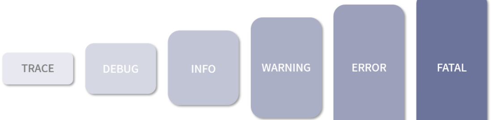
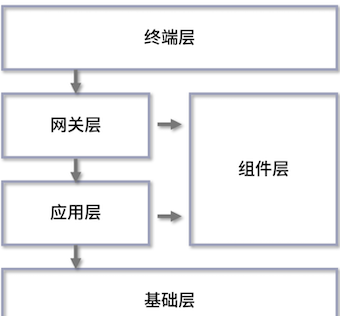
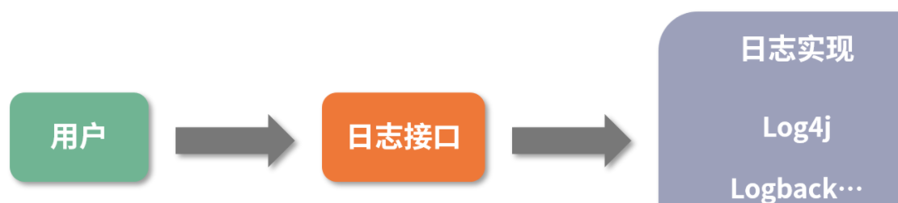
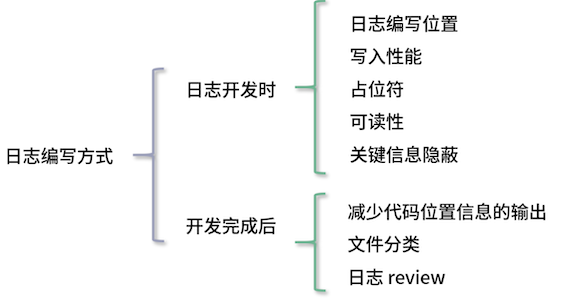

# **2 系统稳定性的关键系统日志&编写可观测的日志**

## **1 日志功能**

日志可以记录系统中硬件、软件和系统的信息，同时还可以观测系统中发生的事件。用户可以通过它来检查错误发生的原因。

一般来说，日志具有以下几个功能：

* 便于调试
* 快速定位问题
* 高度定制化
* 追踪数据变化
* 数据分析：基于对信息的埋点，我们可以将收集到的信息统一写入一个文件中

## **2 日志级别**

日志级别，这是一个为人熟知的概念。

 

* **debug：调试级别**。
	* 在这个级别，通常会记录一些调试的内容，比如程序进入方法或函数时，其中的参数信息
	* **debug 级别的日志会极大地影响 CPU 和磁盘 I/O 写入的性能，所以我们一般只会在测试或本机环境中使用。**
	* 除了自己编写的日志，一些常见的第三方框架也会记录一些日志以方便对程序的调试。

* **info：信息级别**。这个应该是开发人员最常用的日志等级了。
	* 我们一般也是通过这个日志等级完成上面提到的功能，比如信息埋点、追踪数据变化、数据分析等。

* warning 与 error：许多人会使用 error 级别来记录 warning 级别的内容，这使得不太关键的信息也会在查看故障日志时被筛选出来，导致对故障原因产生误判，浪费大量的时间。

* **这里我会带你区分这两个级别的日志**。 
	* a. warning：警告级别。这一级别经常用来记录一些虽然出现了错误，但是并不会真正对程序执行构成影响的内容。当你想要使用 error 级别，如果感觉这个错误并不会影响程序往后执行或业务逻辑不会产生错误，就可以使用 warning 级别。
	*  b. error：错误级别。只有当整个接口、方法调用都产生了不可避免的问题，对业务的主流程造成影响时才会采用的日志级别。

## **3 日志常见来源**

 

### **3-1 终端层**

这里的终端层我指的是像网页、App、小程序这样的形式。在这一层的所有日志信息都不在我们的服务器端，而是在用户的电脑、手机中。

所以我们想要收集的话，一般是通过打点的形式上传到后端服务，再记录下来。

终端层更偏向用户的真实操作行为和一些异常信息的记录，比如用户当前的网络环境、系统状态、手机型号等。

### **3-2 网关层**

网关层可以理解为请求被接收之后，最先经过的地方，就像水龙头流出的水会先经过过滤器。最常见的网关层是 Nginx、Kong，当然也有像我们在 Spring 中经常说的 Zuul 和 Spring Cloud Gateway。

网关层的日志通常会产生如下 2 个日志文件：

* 访问日志：当服务请求到达网关层后，会生成一条日志，记录这个请求从开始接收到最终反向代理的整个流程信息，其中不仅包括请求中的基本信息，如请求 IP、请求 UA，还包含与下游服务相关的 IP 地址、响应时长信息等。同时，这个文件也支持高度定制化。以 Nginx 举例，在 Nginx 中有相当多的环境变量可供选择，这些变量基本覆盖了一个请求生命周期中绝大部分的数据信息。
* 错误日志：记录网关服务在执行过程中出现的问题。不过除非是使用了第三方框架，不然网关层一般不会出现问题。

### **3-3 应用层**

应用层一般指的是我们业务程序代码的执行位置。**我们一般将应用程序分为基于容器托管的应用程序和普通的应用程序**。

* 基于容器托管的应用程序，比如 Java 开发人员使用最多，最熟悉的 Tomcat。这一类型的应用程序会有以下 2 个相对关键的日志文件： 
	* a. 容器启动日志：以 Tomcat 为例，容器的 logs 目录中经常会有“catalina.日期.log”，这部分日志就是 Tomcat 在启动时的日志，它通常会随着控制台日志一同被打印出来。有时候某些程序异常没有被记录，在这里会有显示。下次如果你发现程序启动时莫名挂掉、无法启动，但是在自己的应用程序日志中又找不到输出信息，不妨到这个日志里看看。 
	* b. 请求访问日志：这个和我们刚才在网关层讲的类似，请求访问日志会记录与上游相关的访问时间、访问地址等信息，这里的日志信息和网关层的日志是一一对应的。
* **普通应用程序：其日志文件我们通常会通过框架编写，这里面的写法就相对多样和自由**。


### **3-4 组件层**

像我们经常使用的 MySQL 和 Redis 会产生日志，这些日志就属于组件层。我会列举应用中比较常见的日志来向大家说明这一层级的日志：

* **应用运行时产生的日志**：一般第三方应用运行时，会输出一些程序执行时的日志内容。当业务程序与组件通信出问题了，我们可以尝试通过这个日志定位，看应用当时是否出现了某些数值的波动或是其他异常。
* **慢查询日志**：在一般的数据库类型的应用中，都会有这种日志，用于记录业务系统在进行数据库查询时出现的“查询速度慢”这一现象。如果某个系统中突然出现了大量的“慢查询”，我们就需要监控这个问题，从而获取更加完整的数据库查询语句和来源信息，以便更好地解决问题。
* **审计日志**：**这个同样适用于数据库**。
	* 审计日志的主要作用是在进行相关操作的时候，将相关的操作行为记录下来，比如一次数据库查询、一次数据插入。
	* 一般这样的数据日志输出量会比较大，对应用的性能有一定的损耗，所以大多数情况下并不会使用。但是像金融行业中有特殊审计场景的需求，审计日志就是必不可少的。

### **3-5 基础层**

基础层中的日志就更偏向于运维。

* **系统日志：一般指的是 Linux 平台中的`“/var/log/messages”`，这里会记录系统中比较关键的日志**。当系统启动了某个程序，或某个程序因为内存过高引发了系统级别的 kill ，就会记录在这个文件中。
* **操作日志：通常 Linux 的日志会通过环境变量定制**。通过这个日志，我们可以查询到哪个人在哪个时间点进行了哪些操作，也可以在系统出现异常问题时，查看是谁，因为什么操作而导致的。

## **4、编写“可观测”的系统日志**

### **4-1 日志框架**

在介绍日志框架之前，我需要说明一下，如果你仍在使用 `System.out.println`、`Exception.printStackTrace` 或**类似的控制台输出日志的方式**，**我推荐你改用第三方日志框架编写**。

这种控制台输出的方式，可以从它们的源码了解到它们是线程同步的，大量使用这种方式，会对程序性能造成严重的影响，因为它们同一时间只能有一个线程在进行执行。

日志框架在系统中一般分为 2 种类型：**日志实现框架和日志接口框架**。

**日志实现框架:**

日志的实现方，每个框架都提供自己的日志管理和写入的方式。Java 中的日志框架很不统一，这里我就以认知度最高的 3 个项目来说明。

* **log4j 1.x**：2001 年发布，后来成为 Apache 基金会的顶级项目。log4j 1.x 当年可以说是基本都在使用的日志实现框架，即便到了现在，仍有很多项目在使用它。log4j 1.x 使用起来确实很方便，但是 1.x 版本在高并发的情况下，存在比较严重的锁竞争关系，会导致性能不能得到有效的发挥；
* **logback**：log4j 1.x 创始人的另一个项目。它提供了更加高效的写入性能，据官方说明是 log4j 1.x 性能的 10 倍，以及更多的功能，比如异步日志。
* **log4j 2.x**：随着 logback 流行，log4j 1.x 的开发人员也想跟上步伐，于是推出了一套新的日志框架，号称比 logback 更快。
	* log4j 2.x 借鉴了很多 logback 中的想法和功能，并解决了 log4j 1.x 架构上存在的一些问题。同时，它采用 Disruptor 来进行异步日志，相比较 Java 自带的队列，它提供了更高效且更完整的队列实现方案。

**日志接口框架**

可以看到，Java 中是存在多种不同日志框架的实现的，这就会造成 2 个问题：

* **多框架协作**：在一个项目中，不光有你的代码，还有各种各样的框架代码，比如分布式协调会用到 Zookeeper、Curator；RPC 通信会用到 Dubbo、Thrift。
	* 为了方便开发，业务系统中往往集成了许多第三方框架。我们需要日志来了解各个第三方框架之间的协作状态，这些第三方框架又依赖于各个日志框架进行输出。这时候如果直接使用像 logback、log4j 这样的日志框架，岂不是业务系统要接入每个日志框架？
* **不同框架竞争**：如果要引入多个日志框架，我们还需要考虑各个框架的输出位置。要是多个日志框架同时写入一个日志文件，还会涉及竞争问题，导致性能无法发挥。

由此就出现了面向接口的日志框架，它提供了统一的 API。开发人员在编写代码的时候，直接使用这套面向接口的日志框架，当业务项目人员在使用时，只需要选择好实现框架，就可以统一日志实现框架。

 

目前使用最为广泛的日志接口框架是 SLF4J，出自 logback 的开发者，目前基本已经形成规范。SLF4J 提供了动态占位符的功能，大大提高了程序的性能，无须开发人员再对参数信息进行拼接。

比如默认情况下程序是 info 级别的，在原先的代码方式中想要进行日志输出需要自行拼接字符串：

```
logger.debug("用户" + userId + "开始下单:" + orderNo + ",请求信息:" + Gson.toJson(req));
```

这会产生一个问题，系统中如果存在大量类似的代码，同时系统只输出 info 及 info 以上级别的日志，那么，在输出 debug 日志时会产生大量的字符串，而并不会输出 debug 日志，最后造成字符串不停地拼接，浪费系统性能。

此时，SLF4J 就可以使用占位符的功能编写日志，比如像下面这样：

```
logger.debug("用户{}开始下单:{},请求信息:", userId, orderNo,  Gson.toJson(req));
```

**通过这样的形式，SLF4J 就可以根据日志等级判断，只对符合要求的日志进行数据拼接和打印。**

有些时候日志输出需要进行数值计算，或者 JSON 转换，此时就需要一定的计算任务。但方法调用如果被当作参数传递的话一样会被执行，**所以 Java8 中 SLF4J 还可以通过 Supplier 来传递**。如下所示：

```
logger.debug("用户{}开始下单:{},请求信息:", userId, orderNo, () -> Gson.toJson(req))
```

**日志编写方式**

”我会从日志编写位置、写入性能、占位符、可读性、关键信息隐蔽、减少代码位置信息的输出、文件分类、和日志 review 这 8 个点来讲解，并将它们分成了 2 个方向：

* 日志开发时（前 5 项）：怎么样写出更有效率的日志？
* 日志完成后（后 3 项）：上线前后有哪些需要注意的？

 

**日志编写位置**

* **系统/应用启动和参数变更**
	* 当系统启动时，可以将相关的参数信息进行打印，以便出现问题时，更准确地查询原因；参数信息可能并不存储在本地，需要通过配置中心获取，而参数信息有变更时，也需要将变更后的内容输出在日志中。

* **关键操作节点**：最典型的就是在关键位置添加日志，记录用户进行的某个操作。当出现问题时，你可以通过这个位置的日志了解到用户的操作。同样你也可以在系统进行某些操作时添加日志，比如你准备启动某个线程池来进行数据处理时，可以加上日志便于以后分析问题。

* **大型任务进度上报**：当系统在处理某个比较大型的任务时，可以在这个过程中增加相关的日志来表明任务处理的进度，防止因为长时间没有处理而无法得知程序执行的状态，比如在文件下载时，可以按照百分比来定时/定次地上报数据。

* **异常**：当程序出现异常时，我们通常是通过 try-catch 来记录当时的情况，然后以日志的形式表现出来。如果是通过 try-catch 处理，你需要注意日志编写的位置。如果你需要将日志在本层抛出，则不需要进行日志记录，否则会出现日志重复的问题。如果你除了异常以外还需要记录其他的内容，则可以通过定制异常信息来实现。


**写入性能**

日志的写入性能则会受到如下 5 个因素的影响：

* **日志编写位置**：日志编写的位置在程序中十分重要，如果在 for 循环中编写，因为这个循环会持续很多次，那么就会产生大量的日志记录。此时可以考虑一下，这个日志的记录是否有必要。
* **日志数量**：如果你大量地编写日志，那么日志的质量一定会降低。同时，大量的日志会让你很难去查看问题，反而成了一种负担。在高访问量时，过多的日志也会影响程序的执行效率。
* **日志编写等级**：日志等级很容易被滥用，不正确的日志等级会导致我们查询问题的时间增加。
* **日志输出级别**：这里指的是对于配置日志输出级别的选择。在线上环境，不建议使用 debug 级别，因为线上一直有请求，debug 级别会输出大量的基础和请求信息，极其浪费资源，因此建议开启 info 或者以上。
* **无用输出参数**：不对大字段、无用字段输出，因为这很影响程序执行效率和日志的内容。我曾遇到一个案例，A 同学在线上打印了一个完整的 HTML 内容，导致当日的部分日志内容错乱，部分日志无法检索，原因就在于 HTML 存在多行内容导致无法解析的问题。当开发人员到线上服务器上查看时，日志文件的大小已经扩大了 3 倍。


**占位符**

* 节约性能。在生成较高级别的日志时，低级别的日志会不停叠加字符串而占用过多的内存、CPU 资源，导致性能浪费。
* 便于编写。先确认日志所想要表达的内容，再确认你所需要编写的参数，这样在写日志时，目的也会更加明确。
* 便于查看。在代码 review 时，更方便查看日志想表达的意思，而不会被日志的参数打乱。

**可读性**

* 会话标识：当前操作的用户和与当前请求相关的信息，类似 Session。当出现问题/查看行为时，可以根据这个值来快速识别到相关的日志。
* 请求标识：每个请求都拥有一个唯一的标识，这样在查看问题时，我们只需要查看这一个请求中的所有日志即可。一般我们会配合链路追踪系统一同使用，因为后者可以实现跨应用的日志追踪，从而帮助我们过滤掉不相关的信息。
* 参数信息：在日志中增加参数信息能帮你了解到，是什么情况下产生的问题，这样你也很容易复现问题，以及辨别错误的原因。
* 发生数据的结果：和参数信息相互对应，一个是执行前，一个是执行后。发生数据的结果可以帮你了解程序执行的结果，出错时也是很重要的参考条件。

**关键信息隐蔽**

**减少代码位置信息的输出**

**文件分类**


**日志 review**
