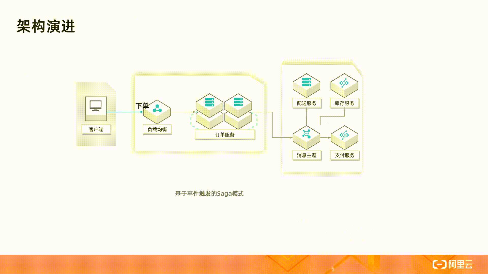

# **L1 Serverless 价值与机构**

## **1 Serverless 的价值**

其实我们都知道，虽然说是 Serverless，但 Server（服务器）是不可能真正消失的，Serverless 里这个 less 更确切地说，应该是开发者不用关心服务器的意思。这就好比现代编程语言 Java 和 Python，开发不用手工分配和释放内存，但内存依然在哪里，只不过交给垃圾收集器管理了。

称一个能帮助你管理服务器的平台为 Serverless 平台，就好比称呼 Java 和 Python 为 Memoryless 语言一样。

云上的资源除了服务器所包含的基础计算、网络、存储资源之外，还包括各种类别的更上层的资源，例如数据库、缓存、消息等。

我认为 Serverless 的愿景应该是 **Write locally, compile to the cloud**，即代码只关心业务逻辑，由工具和云去管理资源。

### **1-1 Serverless 的价值**

1. **不用关心服务器**
	* 如何自动识别故障，摘除有问题的实例，这是 Serverless 平台必须具备的能力；
	* 操作系统的安全补丁升级，需要做到不影响业务，自动完成；
	* 日志和监控系统需要默认打通；
	* 系统的安全策略需要自动配置好以避免风险；
	* 当资源不够时，需要能够自动分配资源并安装相关的代码和配置

2. **自动弹性**
	* Serverless 平台都能够及时且稳定地实现自动弹性。
	* 为了实现这个能力，平台需要有非常强大的资源调度能力，以及对应用各项指标（如 load、并发）非常敏锐的感知能力。

3. **按实际资源使用计费**
	* 而在 Serverless 模式下，用户是按实际使用的资源付费的，例如一个请求实际使用了一台 1core2g 规格资源 100ms 的时间，那么用户就只需要为该规格的单价乘以时间（即100ms）付费
	* 类似的，用户如果用的是 Serverless 数据库，那么就只需要为 query 实际消耗的资源，以及数据存储的资源付费。 	

4. **更少的代码，更快的交付速度**
	* 基于 Serverless 架构的代码通常会重度使用后端的服务，将数据、状态管理等内容从代码中分离出去；
	* 此外，更彻底的 FaaS 架构则把代码的 Runtime 也交给了平台管理。
	* 这就意味着，同样的应用，Serverless 模式下的代码相比 Serverful 模式会少很多，因此不论是从分发还是启动，都会更快。
	* Serverless 平台也通常能够提供非常成熟的代码构建发布、版本切换等特性，提升交付速度。

## **2 常见 Serverless 架构模式**

什么是 Serverless 架构？

按照 CNCF 对 Serverless 计算的定义，Serverless 架构应该是采用 FaaS（函数即服务）和 BaaS（后端服务）服务来解决问题的一种设计。

* 随着需求和技术的发展，业界出现了一些 FaaS 以外的其它形态的 Serverless 计算服务，比如 Google Cloud Run，阿里云推出的面向应用的 Serverless 应用引擎服务以及 Serverless K8s，这些服务也提供了弹性伸缩能力和按使用计费的收费模式，具备 Serverless 服务的形态，可以说进一步扩大了 Serverless 计算的阵营；
* 为了消除冷启动影响，FaaS 类服务如阿里云的函数计算和 AWS 的 Lambda 相继推出了预留功能，变得不那么“按使用付费”了；
* 一些基于服务器（Serverful）的后端服务也推出了 Serverless 形态产品，比如 AWS Serverless Aurora，

### **场景 1: 静态 Web 站点**

 

 Serverless 架构去构建一个静态站点，它有其它方案无法比拟的优势，比如：
 
* 可运维性：无需管理服务器，比如操作系统的安全补丁升级、故障升级、高可用性，这些云服务（OSS，CDN）都帮着做了；
* 可扩展性：无需对资源做预估和考虑未来的扩展，因为 OSS 本身是弹性的，使用 CDN 使得系统延迟更小、费用更低、可用性更高；
* 成本：按实际使用的资源付费，包括存储费用和请求费用，没有请求时不收取请求费用；
* 安全性：这样一个系统甚至看不到服务器，不需要通过 SSH 登录，DDoS 攻击也交给云服务来解决。

### **场景 2: 单体和微服务应用**

 

上图右侧的架构引入了 API 网关、函数计算或者 Serverless 应用引擎来实现计算层，将大量的工作交给了云服务完成，让用户最大程度上专注实现业务逻辑。

其中系统内部多个微服务的交互如下图所示，通过提供一个商品聚合服务，将内部的多个微服务统一呈现给外部。这里的微服务可以通过 SAE 或者函数实现。

 

### **场景 3: 事件触发**

 

* 基于服务器的单体架构：多媒体文件被上传到服务器，由服务器处理，对多媒体的显示请求也由服务器完成；
* 基于服务器的微服务架构：多媒体文件被上传到服务器，服务器处理转存到 OSS，然后将文件地址加入消息队列，由另一组服务器处理文件，将处理结果保存到 OSS，对多媒体的显示请求由 OSS 和 CDN 完成；
* Serverless 架构：多媒体直接上传到 OSS，由 OSS 的事件触发能力直接触发函数，函数处理结果保存到 OSS，对多媒体的显示请求由 OSS 和 CDN 完成。

基于服务器的微服务架构很好地解决了上述的大部分问题，但是仍然面临一些问题：

* 管理应用服务器的高可用性和弹性；
* 管理文件处理服务器的弹性；
* 管理消息队列的弹性。

这里的 Serverless 架构主要体现的价值是：

* **事件触发能力**：函数计算服务与事件源（OSS）的原生集成让使用者无需管理队列资源，队列自动扩展，实时处理上传的多媒体文件；
* **高弹性和按需付费**：图片和视频（不同大小的视频）需要的计算资源规格是不同的，流量的波峰波谷对资源的需求是不同的，现在这种弹性由服务提供，按照用户的真实使用去扩容缩容，让用户 100% 地利用资源，无需为闲置资源付费。

Serverless 让生产者发送事件，维护连接枢纽都从用户职责中省略了，而只需关注消费者的逻辑，这就是 Serverless 的价值所在。

函数计算服务还集成其它云服务事件源，让你更方便地在业务中使用一些常见的模式，如 Pub/Sub、事件流模式、Event Sourcing 模式。

 

### **场景 4: 服务编排**

一种做法是采用事件驱动模式，驱动流程完成。在这个架构里，有一个消息总线，感兴趣的服务如库存服务监听事件，监听者可以使用服务器或者函数。借助于函数计算和消息主题的集成，这个架构也可以完全不使用服务器。

这个架构模块是松耦合的，职责清晰。不足之处是随着流程变得更长更加复杂，这个系统变得难以维护。比如很难直观地了解业务逻辑，执行时的状态也不宜跟踪，可运维性比较差。

 

另外一种架构是基于工作流的 Saga 模式。在这个架构里，各个服务之间是独立的，也不通过事件传递信息，而是有一个集中的协调者服务来调度单个业务服务，业务逻辑和状态由集中协调者维护。而实现这个集中的协调者通常面临以下问题：

* 编写大量代码来实现编排逻辑、状态维护和错误重试等功能，而这些实现又很难被其它应用重用；
* 维护运行编排应用的基础设施，以确保编排应用的高可用性和可伸缩性；
* 考虑状态持久性，以支持多步骤长时间运行流程并确保流程的事务性。

 

### **场景 5: 数据流水线**

随着业务的进一步发展，数据变得越来越多，这时候就可以挖掘数据的价值。比如，分析用户对网站的使用行为并做相应的推荐。一个数据流水线包括数据采集、处理、分析等多个环节。

* 日志服务（SLS）提供了数据采集、分析和投递功能；
* 函数计算（FC）可以对日志服务的数据进行实时处理，将结果写入其它服务，如日志服务、OSS；
* Serverless 工作流服务可以定时批量处理数据，通过函数定义灵活的数据处理逻辑，构建 ETL 作业；
* 数据湖分析（DLA）提供了 Serverless 化的交互式查询服务，它使用标准 SQL 分析对象存储(OSS)、数据库（PostgreSQL / MySQL 等）、NoSQL（TableStore 等）等多个数据源的数据。

## **3 Serverless 技术选型**

### **3-1 函数计算**

**1 函数计算介绍**

 

上图展示了函数计算的使用方式。从用户角度，他需要做的只是编码，然后把代码上传到函数计算中。这个时候还不会产生费用，只有到被调用的时候才有费用。

另外，函数计算能够提供非常好的弹性能力，最终的费用是根据时长和内存数进行计费的，如果调用量小的话，只会有很少的费用。并且它在语言方面也非常丰富，常用的 nodejs、php、python、java 都直接支持。同时提供自定义的运行环境，可以支持任意的可执行的语言。

**2 函数计算典型场景**

 

从使用场景来说，主要有三类：

* Web 应用。可以是各种语言写的，这种可以使用 Serverless 框架新编写的程序，也可以是已有的应用。比如小程序后端、或者发布到 API 市场的 API 后端应用等。
* 对计算能力有很强的弹性诉求的应用。比如 AI 推理、音视频处理、文档转换等。
* 事件驱动型的应用。比如通过其他阿里云产品驱动的场景、Web Hook、定时任务等。函数计算已经与很多产品进行了打通，比如对象存储、表格存储、定时器、CDN、日志服务、云监控等，可以非常快速地组装出一些业务逻辑

**3 函数计算核心竞争力**

函数计算对客户的一个最大的价值，就是能够让用户只关注自己的业务逻辑开发，完全不需要管理运维，诸如计算资源、网络设置等都不需要关心。

 

* 在隔离性上提供 vm 级别的隔离，保证用户在运行时的数据安全、运行时安全等；
* 在可用性方面默认提供 3az 的高可用架构，保证客户默认就是高可用的最佳实践架构；
* 在弹性方面，可以做到毫秒级的弹性效率，满足客户突发的流量冲击；
* 在计费方面也非常灵活，真正按照用户的请求情况进行收费，也支持对 long run 的应用更友好的预付费模式。

### **3-2 Serverless Kubernetes**

**ASK 典型场景**

 

 