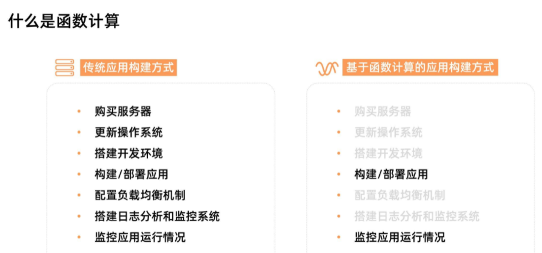
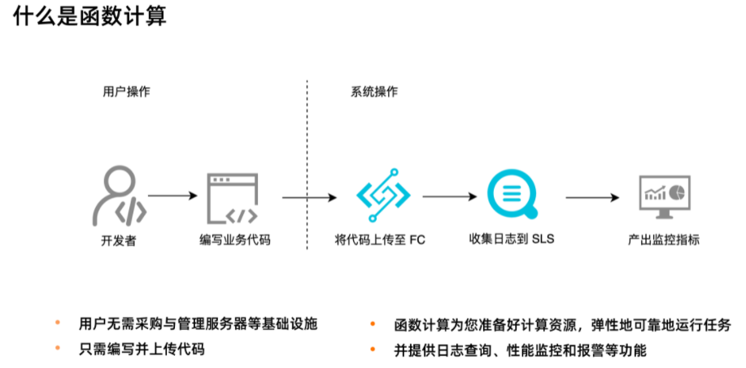
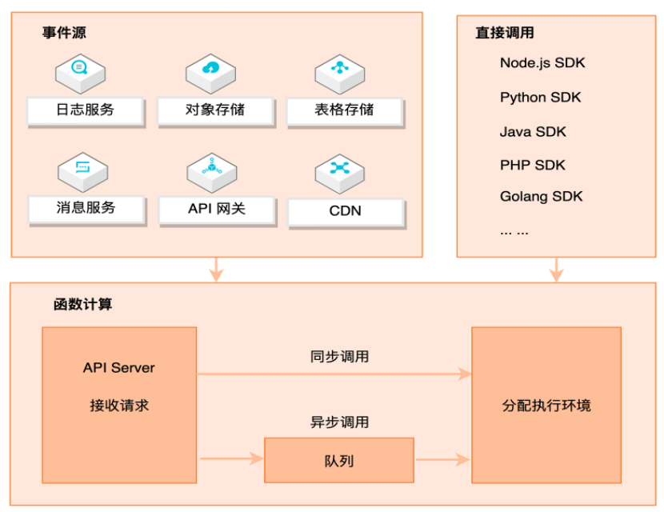
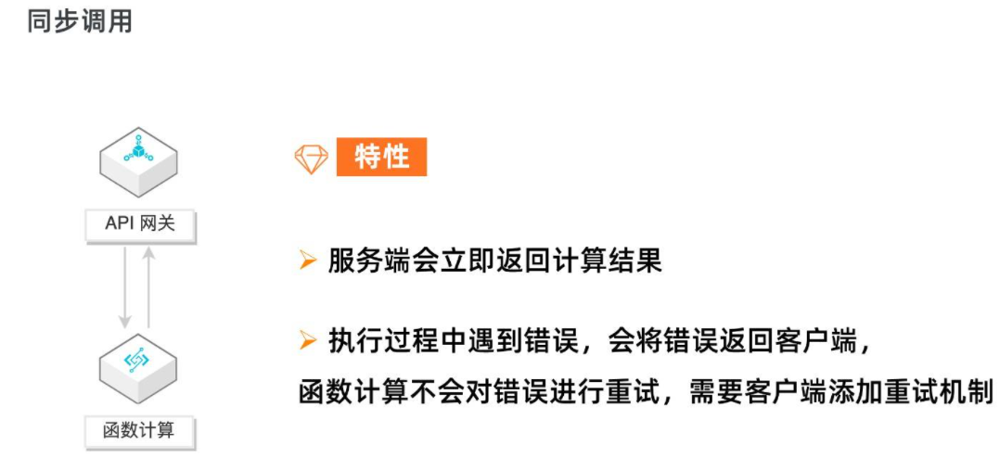
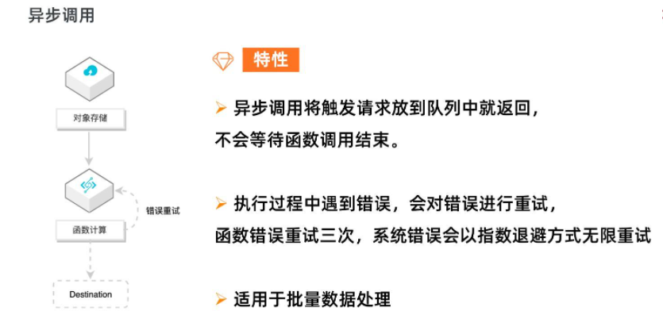
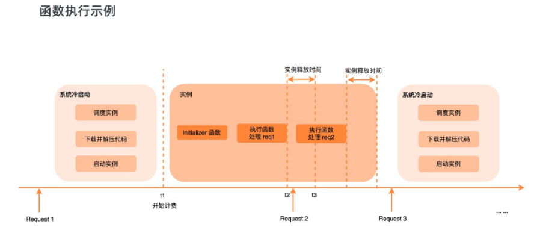
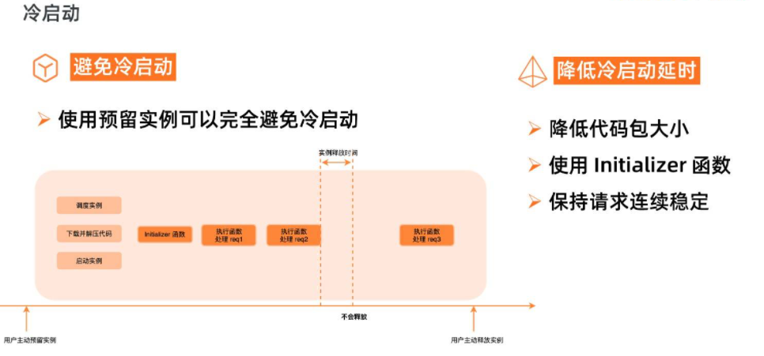
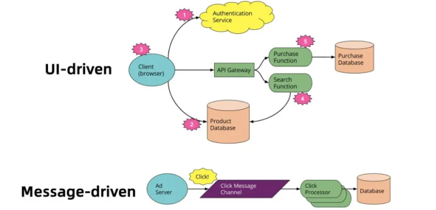
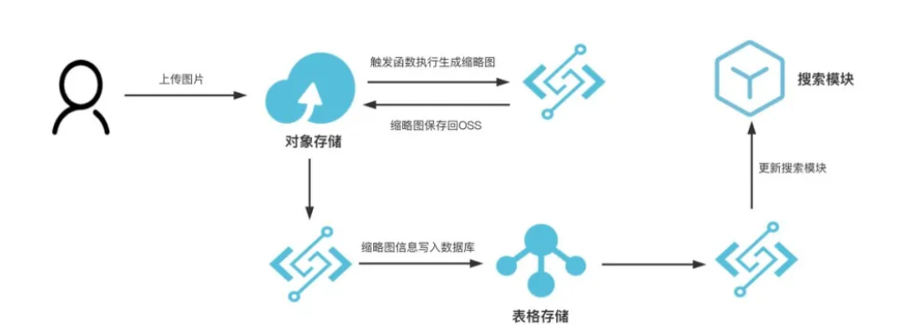

# **L2 Serverless 函数的简介**

## **1 函数计算简介**

Serverless 并不是没有服务器，而是开发者不再需要关心服务器。下图是一个应用从开发到上线的对比图：

 

在传统 Serverful 架构下，部署一个应用需要购买服务器，部署操作系统，搭建开发环境，编写代码，构建应用，部署应用，配置负载均衡机制，搭建日志分析与监控系统，应用上线后，继续监控应用的运行情况。

而在 Serverless 架构下，开发者只需要关注应用的开发构建和部署，无需关心服务器相关操作与运维，在函数计算架构下，**开发者只需要编写业务代码并监控业务运行情况**。这将开发者从繁重的运维工作中解放出来，把精力投入到更有意义的业务开发上。

 

### **函数计算核心优势**

**敏捷开发**

* 使用函数计算时，用户只需聚焦于业务逻辑的开发，编写最重要的 “核心代码”；
* 不再需要关心服务器购买、负载均衡、自动伸缩等运维操作；
* 极大地降低了服务搭建的复杂性，有效提升开发和迭代的速度。

**弹性扩容**

* 函数计算根据请求量自动进行弹性扩容，无需任何手动配置；
* 毫秒级调度计算资源，轻松应对业务洪峰。

**稳定好可用**

* 函数计算分布式集群化部署，支持多可用区；
* 如果某个可用区因自然灾害或电力故障导致瘫痪，函数计算会迅速切换到同区域其他可用区的基础设施运行函数，确保服务高可用。

**有竞争力的成本**

* 函数计算提供了丰富的计量模式，帮助您在不同场景获得显著成本优势；
* 后付费模型按实际使用计算资源计费，不占用计算资源则不计费，资源利用率高达 100% ；
* 预付费模型根据业务负载估算提前预购计算力，单价更低，组合使用后付费和预付费方式将有效降低成本。

### **函数计算使用场景**

* **Web 应用**： 可以是各种语言写的，这种可以是使用 Serverless 框架新编写的程序，也可以是已有的应用。比如可能是小程序后端，也可能是 Web API；
* **对计算能力有很强的弹性诉求的应用**： 比如 AI 推理、音视频处理、图文转换等；
* **事件驱动型的应用**： 比如通过其他阿里云产品驱动的场景，Web Hook、定时任务等。

## **2 函数计算是如何工作**

### **2-1 函数计算调用链路**

 

上图展示了函数计算完整的请求和调用链路。

函数计算是事件驱动的无服务器应用，事件驱动是说可以通过事件源自动触发函数执行，比如当有对象上传至 OSS 中时，自动触发函数，对新上传的图片进行处理。函数计算支持丰富的事件源类型，包括日志服务、对象存储、表格存储、消息服务、API 网关、CDN 等。

除了事件触发外，也可以直接通过 API/SDK 直接调用函数。调用可以分为同步调用与异步调用，当请求到达函数计算后，函数计算会为请求分配执行环境，如果是异步调用，函数计算会将请求事件存入队列中，等待消费。

### **2-2 函数计算调用方式**

 

同步调用的特性是，客户端期待服务端立即返回计算结果。请求到达函数计算时，会立即分配执行环境执行函数。

以 API 网关为例，API 网关同步触发函数计算，客户端会一直等待服务端的执行结果，如果执行过程中遇到错误， 函数计算会将错误直接返回，而不会对错误进行重试。

这种情况下，需要客户端添加重试机制来做错误处理。

 

异步调用的特性是，客户端不急于立即知道函数结果，函数计算将请求丢入队列中即可返回成功，而不会等待到函数调用结束。

函数计算会逐渐消费队列中的请求，分配执行环境，执行函数。如果执行过程中遇到错误，函数计算会对错误的请求进行重试，对函数错误重试三次，系统错误会以指数退避方式无限重试，直至成功。

异步调用适用于数据的处理，比如 OSS 触发器触发函数处理音视频，日志触发器触发函数清洗日志，都是对延时不敏感，又需要尽可能保证任务执行成功的场景。如果用户需要了解失败的请求并对请求做自定义处理，可以使用 Destination 功能。

### **2-3 函数计算执行过程**

函数计算是 Serverless 的，这不是说无服务器，而是开发者无需关心服务器，函数计算会为开发者分配实例执行函数。

 

如上图所示，当函数第一次被调用的时候，**函数计算需要动态调度实例、下载代码、解压代码、启动实例，得到一个可执行函数的代码环境**。

然后才开始在系统分配的实例中真正地执行用户的初始化函数，执行函数业务逻辑。这个调度实例启动实例的过程，就是系统的冷启动过程。

**函数逻辑执行结束后，不会立即释放掉实例，会等一段时间**，如果在这段时间内有新的调用，会复用这个实例，比如上图中的 Request 2，由于执行环境已经分配好了，Request 2 可以直接使用，所以 Request 2 就不会遇到冷启动。

**Request 2 执行结束后，等待一段时间，如果这段时间没有新的请求分配到这个实例上，那系统会回收实例，释放执行环境**。

此实例释放后，新的请求 Request 3 来到函数计算，需要重新调度实例、下载代码、解压代码，启动实例，又会遇到冷启动。

所以，为了减小冷启动带来的影响，要尽可能避免冷启动，降低冷启动带来的延时。

 

使用预留实例可以完全避免冷启动，预留实例是在用户预留后就分配实例，准备执行环境；请求结束后系统也不会自动回收实例。

**预留实例不由系统自动分配与回收，由用户控制实例的生命周期，可以长驻不销毁，这将彻底消除实例冷启动带来的延时毛刺，提供极致性能，也为在线应用迁移至函数计算扫清障碍。**

如果业务场景不适合使用预留实例，那就要设法降低冷启动的延时，比如降低代码包大小，可以降低下载代码包、解压代码包的时间。Initializer 函数是实例的初始化函数，Initializer 在同一实例中执行且只执行一次，所以可以将一些耗时的公共逻辑放到 Initializer 中，比如在 NAS 中加载依赖、建立连接等等。另外要尽量保持请求连续稳定，避免突发的流量，由于系统已启动的实例不足以支撑大量的突发流量，就会带来不可避免的冷启动。

## **4 函数粘合云服务提供端到端解决方案**

而在 Message-driven 异步消息处理这种模式中，需要用户实现一个常驻的、弹性高可用的消费者服务。

为了更专注具体业务逻辑的开发，对一个庞大的单体应用进行拆解，充分利用云服务体系结构是一个非常好的解决方案。

**在这里，最大的关键是如何为应用程序的各个组件选择和使用正确的云服务，而通过函数作为粘合剂来串联云上的托管服务，就是一个非常好的实践。**

 

Message-driven 切换到 Serverless 架构以后：

与单体应用示例相比，这里改动很小，同时使用 FaaS 功能替换了长期存在的消息消费者应用程序，消息消费的高可用性交给了云平台去负责。

目前，在很多的人的第一印象中，一般将 FaaS，也就是 Fucntion as a Service（函数即服务）等同于 Serverless， 比如阿里云的函数计算、AWS 的 Lambda，但是实际上有许多其他的云服务也是 Serverless，他们和 FC 一起构建成完整的 Serverless 应用，让用户完全聚焦他最上层和核心的原始业务。

比如，用户直接使用 API 网关， 就可以从 API 限流、鉴权等许多 API 层面上需要考虑的繁杂工作中解放出来；

* 直接使用 Serverless 的 NoSQL 数据库 TableStore 或者对象存储 OSS 来持久化数据，替代自己管理数据库实例；
* 使用 SLS 或者 Datahub 从外部系统收集数据流；使用消息服务 MNS/MQ 来管理消息等。

如果是一个庞大复杂的单体应用或者是一个面向服务体系的架构，开发者需要负责所有的事情，包括代码的编写、管理和部署数据库以及其他相关的后端服务等，切换到 Servrless 架构， 可以看到：**特定的的模块交由特定的托管云服务去处理， 之后再使用实现了具体业务代码的函数将它们串联起来， 也实现了解耦**。 

为了使这种架构运转的更有效率， 事件驱动是一个必不可少的特性， 比如用户尝试往 OSS 上传一个文件或者更新表格存储会自动做一些逻辑处理，对于开发者来说， 最关心的是什么样的事件可以触发我的编写逻辑。

Serverless 粘合云服务示例

 

如上图所示，用户上传图片文件，产生消息事件触发了 FC 函数执行，处理生成了图片缩略图，并将缩略图存储至对象存储 OSS，之后触发了另一个 FC 函数将图片产生的更新信息写入表格存储数据库，最后再触发一个 FC 函数完成搜索模块的更新。整个过程中文件处理存储、搜索服务、表格存储数据库服务被几个 FC 函数粘合为一个业务处理逻辑。

