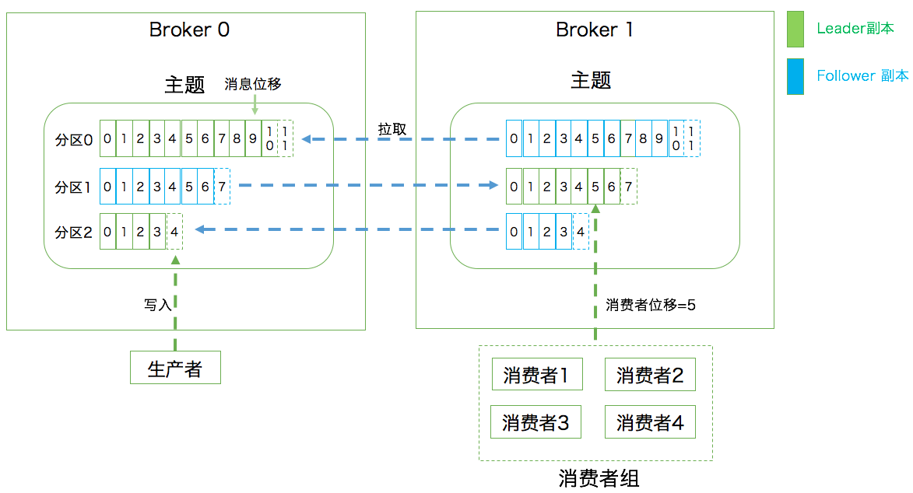
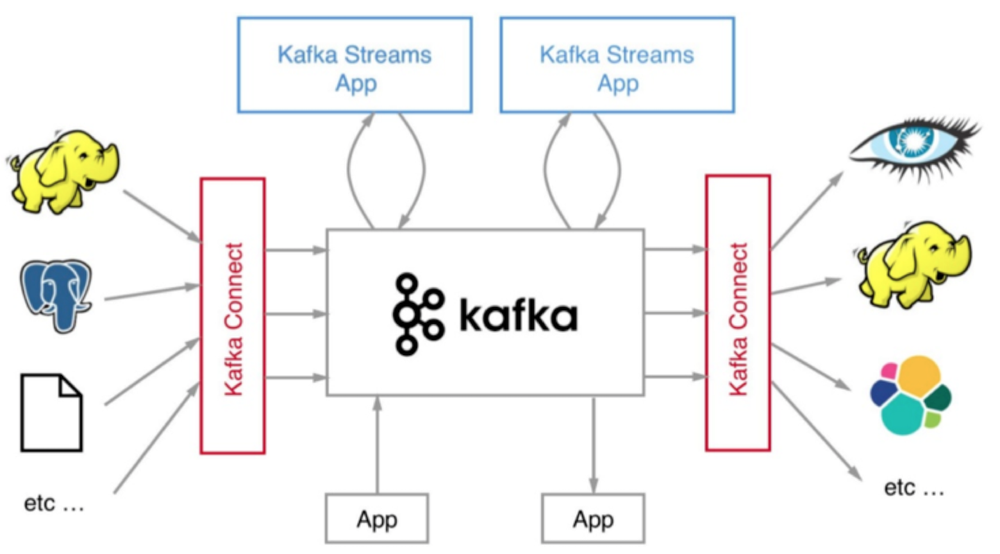

# **Chap=1 Kafka 入门**

## **1 消息引擎系统ABC**

**Apache Kafka 是一款开源的消息引擎系统**

消息引擎系统还要设定具体的传输协议，即我用什么方法把消息传输出去。常见的有两种方法：

* **点对点模型**：也叫消息队列模型。系统 A 发送的消息只能被系统 B 接收，其他任何系统都不能读取 A 发送的消息
* **发布 / 订阅模型**：与上面不同的是，**它有一个主题（Topic）的概念**，该模型也有发送方和接收方，只不过提法不同。
	* 发送方也称为发布者（Publisher），接收方称为订阅者（Subscriber）。
	* 和点对点模型不同的是，这个模型可能存在多个发布者向相同的主题发送消息，而订阅者也可能存在多个，它们都能接收到相同主题的消息

## **2 快速搞定Kafka术语**

向主题发布消息的客户端应用程序称为生产者（Producer），生产者程序通常持续不断地向一个或多个主题发送消息，而订阅这些主题消息的客户端应用程序就被称为消费者（Consumer）。

**和生产者类似，消费者也能够同时订阅多个主题的消息。**

我们把生产者和消费者统称为客户端（Clients）。你可以同时运行多个生产者和消费者实例，这些实例会不断地向 Kafka 集群中的多个主题生产和消费消息。

有客户端自然也就有服务器端。**Kafka 的服务器端由被称为 Broker 的服务进程构成，即一个 Kafka 集群由多个 Broker 组成，Broker 负责接收和处理客户端发送过来的请求，以及对消息进行持久化。**

虽然多个 Broker 进程能够运行在同一台机器上，**但更常见的做法是将不同的 Broker 分散运行在不同的机器上**，这样如果集群中某一台机器宕机，即使在它上面运行的所有 Broker 进程都挂掉了，其他机器上的 Broker 也依然能够对外提供服务。这其实就是 Kafka 提供高可用的手段之一。

**实现高可用的另一个手段就是备份机制（Replication）。**

备份的思想很简单，就是把相同的数据拷贝到多台机器上，而这些相同的数据拷贝在 Kafka 中被称为副本（Replica）。副本的数量是可以配置的，这些副本保存着相同的数据，但却有不同的角色和作用。

Kafka 定义了两类副本：领导者副本（Leader Replica）和追随者副本（Follower Replica）。

* 前者对外提供服务，这里的对外指的是与客户端程序进行交互；
* 而后者只是被动地追随领导者副本而已，不能与外界进行交互。

当然了，你可能知道在很多其他系统中追随者副本是可以对外提供服务的，**比如 MySQL 的从库是可以处理读操作的，但是在 Kafka 中追随者副本不会对外提供服务**。

副本的工作机制也很简单：生产者总是向领导者副本写消息；而消费者总是从领导者副本读消息。至于追随者副本，它只做一件事：向领导者副本发送请求，请求领导者把最新生产的消息发给它，这样它能保持与领导者的同步。

### **Kafka 伸缩性Scalability**

这种机制就是所谓的分区（Partitioning）。如果你了解其他分布式系统，你可能听说过分片、分区域等提法，比如 MongoDB 和 Elasticsearch 中的 Sharding、HBase 中的 Region，其实它们都是相同的原理，只是 Partitioning 是最标准的名称。

**Kafka 中的分区机制指的是将每个主题划分成多个分区（Partition），每个分区是一组有序的消息日志。**

生产者生产的每条消息只会被发送到一个分区中，也就是说如果向一个双分区的主题发送一条消息，这条消息要么在分区 0 中，要么在分区 1 中。如你**所见，Kafka 的分区编号是从 0 开始的，如果 Topic 有 100 个分区，那么它们的分区号就是从 0 到 99。**

**副本是在分区这个层级定义的。每个分区下可以配置若干个副本，其中只能有 1 个领导者副本和 N-1 个追随者副本**。生产者向分区写入消息，每条消**息在分区中的位置信息由一个叫位移（Offset**）的数据来表征。分区位移总是从 0 开始，假设一个生产者向一个空分区写入了 10 条消息，那么这 10 条消息的位移依次是 0、1、2、…、9。

### **Kafka 的三层消息架构：**

* 第一层是主题层，**每个主题可以配置 M 个分区，而每个分区又可以配置 N 个副本**。
* 第二层是分区层，**每个分区的 N 个副本中只能有一个充当领导者角色，对外提供服务**；**其他 N-1 个副本是追随者副本，只是提供数据冗余之用**。
* 第三层是消息层，分区中包含若干条消息，每条消息的位移从 0 开始，依次递增。
* **最后，客户端程序只能与分区的领导者副本进行交互**。

### **Kafka Broker 是如何持久化数据的**

* 总的来说，**Kafka 使用消息日志（Log）来保存数据，一个日志就是磁盘上一个只能追加写（Append-only）消息的物理文件**
* 因为只能追加写入，故避免了缓慢的随机 I/O 操作，改为性能较好的顺序 I/O 写操作，这也是实现 Kafka 高吞吐量特性的一个重要手段
* 如果你不停地向一个日志写入消息，最终也会耗尽所有的磁盘空间，因此 Kafka 必然要定期地删除消息以回收磁盘

**怎么删除呢？** 简单来说就是通过日志段（Log Segment）机制。

* 在 Kafka 底层，一个日志又近一步细分成多个日志段，消息被追加写到当前最新的日志段中，当写满了一个日志段后，Kafka 会自动切分出一个新的日志段，并将老的日志段封存起来。
* Kafka 在后台还有定时任务会定期地检查老的日志段是否能够被删除，从而实现回收磁盘空间的目的。

### **消费者**

两种消息模型，即**点对点模型（Peer to Peer，P2P）和发布订阅模型**。

这里面的点对点指的是同一条消息只能被下游的一个消费者消费，其他消费者则不能染指。在 Kafka 中实现这种 P2P 模型的方法就是引入了消费者组（Consumer Group）。

所谓的消费者组，指的是多个消费者实例共同组成一个组来消费一组主题。这组主题中的每个分区都只会被组内的一个消费者实例消费，其他消费者实例不能消费它。

**为什么要引入消费者组呢？**

* 主要是为了提升消费者端的吞吐量。
* 多个消费者实例同时消费，加速整个消费端的吞吐量（TPS）。
* 另外这里的消费者实例可以是运行消费者应用的进程，也可以是一个线程，它们都称为一个消费者实例（Consumer Instance）。

消费者组里面的所有消费者实例不仅“瓜分”订阅主题的数据，而且更酷的是它们还能**彼此协助**。

假设组内某个实例挂掉了，**Kafka 能够自动检测到，然后把这个 Failed 实例之前负责的分区转移给其他活着的消费者**。这个过程就是 Kafka 中大名鼎鼎的“重平衡”（Rebalance）

每个消费者在消费消息的过程中必然需要有个字段记录它当前消费到了分区的哪个位置上，这个字段就是消费者位移（Consumer Offset）。

注意，这和上面所说的位移完全不是一个概念。上面的“位移”表征的是分区内的消息位置，它是不变的，即一旦消息被成功写入到一个分区上，它的位移值就是固定的了。

而消费者位移则不同，它可能是随时变化的，毕竟它是消费者消费进度的指示器嘛。另外每个消费者有着自己的消费者位移，因此一定要区分这两类位移的区别。我个人把消息在分区中的位移称为分区位移，而把消费者端的位移称为消费者位移。

### **小结**

* 消息：Record。Kafka 是消息引擎嘛，**这里的消息就是指 Kafka 处理的主要对象**。
* 主题：Topic。**主题是承载消息的逻辑容器**，在实际使用中多用来区分具体的业务。
* 分区：Partition。**一个有序不变的消息序列**。**每个主题下可以有多个分区**。
* 消息位移：**Offset。表示分区中每条消息的位置信息，是一个单调递增且不变的值**。
* 副本：Replica。**Kafka 中同一条消息能够被拷贝到多个地方以提供数据冗余，这些地方就是所谓的副本**。
	* 副本还分为领导者副本和追随者副本，各自有不同的角色划分。副本是在分区层级下的，即每个分区可配置多个副本实现高可用。
* 生产者：Producer。**向主题发布新消息的应用程序**。
* 消费者：Consumer。**从主题订阅新消息的应用程序**。
* 消费者位移：Consumer Offset。表征消费者消费进度，每个消费者都有自己的消费者位移。
* 消费者组：Consumer Group。**多个消费者实例共同组成的一个组，同时消费多个分区以实现高吞吐。**
* 重平衡：Rebalance。消费者组内某个消费者实例挂掉后，其他消费者实例自动重新分配订阅主题分区的过程。**Rebalance 是 Kafka 消费者端实现高可用的重要手段**。

## **3 Kafka只是消息引擎系统吗？**

Apache Kafka 是消息引擎系统，也是一个分布式流处理平台（Distributed Streaming Platform）。

**Kafka 是消息引擎系统，也是分布式流处理平台。**

Kafka 在设计之初就旨在提供三个方面的特性：

* 提供一套 API 实现生产者和消费者；
* 降低网络传输和磁盘存储开销；
* 实现高伸缩性架构。

**作为流处理平台，Kafka 与其他主流大数据流式计算框架相比，优势在哪里呢？**

* 第一点是更容易实现**端到端的正确性**（Correctness）
* 可能助力 Kafka 胜出的第二点是**它自己对于流式计算的定位**
	* 官网上明确标识 Kafka Streams 是一个用于搭建实时流处理的客户端库而非是一个完整的功能系统。
	* 这就是说，**你不能期望着 Kafka 提供类似于集群调度、弹性部署等开箱即用的运维特性，你需要自己选择适合的工具或系统来帮助 Kafka 流处理应用实现这些功能**。

## **4 应该选择哪种Kafka？**

整个 Kafka 生态圈如下图所示。值得注意的是，这张图中的外部系统只是 Kafka Connect 组件支持的一部分而已。目前还有一个可喜的趋势是使用 Kafka Connect 组件的用户越来越多，相信在未来会有越来越多的人开发自己的连接器。

### **4-1 你知道几种 Kafka？**

* **Apache Kafka**
* **Confluent Kafka**
* **Cloudera/Hortonworks Kafka**
	* Cloudera 提供的 CDH 和 Hortonworks 提供的 HDP 是非常著名的大数据平台，里面集成了目前主流的大数据框架，能够帮助用户实现从分布式存储、集群调度、流处理到机器学习、实时数据库等全方位的数据处理

### **4-2 特点比较**

* Apache Kafka，如果你仅仅需要一个消息引擎系统亦或是简单的流处理应用场景，同时需要对系统有较大把控度，那么使用 Apache Kafka。
	* Apache Kafka，也称社区版 Kafka。
	* 优势在于迭代速度快，社区响应度高，使用它可以让你有更高的把控度；
	* 缺陷在于仅提供基础核心组件，缺失一些高级的特性。

**Confluent Kafka**

* 如果你需要用到 Kafka 的一些高级特性，那么推荐你使用 Confluent Kafka。
	* 优势在于集成了很多高级特性且由 Kafka 原班人马打造，质量上有保证；
	* 缺陷在于相关文档资料不全，普及率较低，没有太多可供参考的范例。

**CDH/HDP Kafka**
 
* 最后说说大数据云公司发布的 Kafka（CDH/HDP Kafka）。这些大数据平台天然集成了 Apache Kafka，通过便捷化的界面操作将 Kafka 的安装、运维、管理、监控全部统一在控制台中
* 如果你需要快速地搭建消息引擎系统，或者你需要搭建的是多框架构成的数据平台且 Kafka 只是其中一个组件，那么我推荐你使用这些大数据云公司提供的 Kafka。
* CDH/HDP Kafka，大数据云公司提供的 Kafka，内嵌 Apache Kafka。优势在于操作简单，节省运维成本；缺陷在于把控度低，演进速度较慢。

