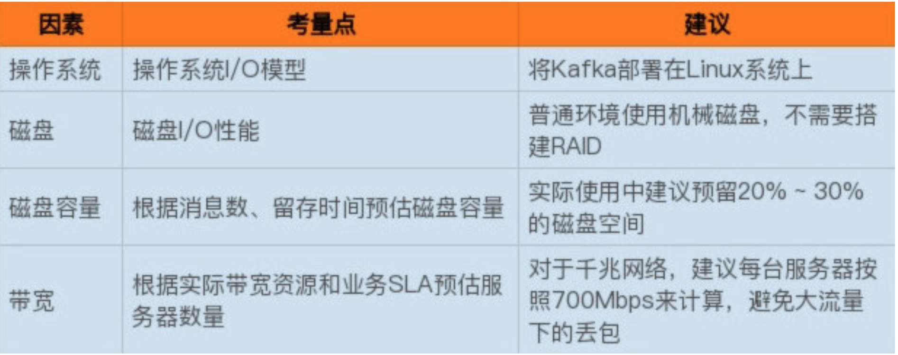

# **Chap2 kafka基本部署参数**

## **1 Kafka线上集群部署**

### **1-1 操作系统**

* **I/O 模型的使用**

主流的 I/O 模型通常有 5 种类型：**阻塞式 I/O、非阻塞式 I/O、I/O 多路复用、信号驱动 I/O 和异步 I/O**。

每种 I/O 模型都有各自典型的使用场景，比如 Java 中 Socket 对象的阻塞模式和非阻塞模式就对应于前两种模型；

* 而 Linux 中的系统调用 **select 函数就属于 I/O 多路复用模型**；
* 大名鼎鼎的 epoll 系统调用则介于第三种和第四种模型之间；
* 至于第五种模型，其实很少有 Linux 系统支持，反而是 Windows 系统提供了一个叫 IOCP 线程模型属于这一种。

实际上 Kafka 客户端底层使用了 Java 的 selector，selector 在 Linux 上的实现机制是 epoll，而在 Windows 平台上的实现机制是 select。

因此在这一点上将 Kafka 部署在 Linux 上是有优势的，因为能够获得更高效的 I/O 性能。

* **其次是网络传输效率的差别。**

Kafka 生产和消费的消息都是通过网络传输的，而消息保存在哪里呢？肯定是磁盘。

故 Kafka 需要在磁盘和网络间进行大量数据传输。如果你熟悉 Linux，你肯定听过零拷贝（Zero Copy）技术，就是当数据在磁盘和网络进行传输时避免昂贵的内核态数据拷贝从而实现快速地数据传输。

一句话总结一下，在 Linux 部署 Kafka 能够享受到零拷贝技术所带来的快速数据传输特性。

**Windows 平台上部署 Kafka 只适合于个人测试或用于功能验证，千万不要应用于生产环境。**

### **1-2 磁盘**

* 追求性价比的公司可以不搭建 RAID，使用普通磁盘组成存储空间即可。
* 使用机械磁盘完全能够胜任 Kafka 线上环境。

### **1-3 磁盘容量**

规划磁盘容量时你需要考虑下面这几个元素：

* 新增消息数
* 消息留存时间
* 平均消息大小
* 备份数
* 是否启用压缩

### **1-4 带宽**



## **2 重要的集群参数配置**

### **2-1 Broker 端参数**

目前 Kafka Broker 提供了近 200 个参数，这其中绝大部分参数都不用你亲自过问。

首先 Broker 是需要配置存储信息的，即 Broker 使用哪些磁盘。那么针对存储信息的重要参数有以下这么几个：

首先 Broker 是需要配置存储信息的，即 Broker 使用哪些磁盘。那么针对存储信息的重要参数有以下这么几个：

* **`log.dirs`：这是非常重要的参数，指定了 Broker 需要使用的若干个文件目录路径**。要知道这个参数是没有默认值的，这说明什么？这说明它必须由你亲自指定。
* **`log.dir`：注意这是 dir，结尾没有 s，说明它只能表示单个路径，它是补充上一个参数用的**。

这两个参数应该怎么设置呢？很简单，你只要设置`log.dirs`，即第一个参数就好了，不要设置`log.dir`。

而且更重要的是，在线上生产环境中一定要为`log.dirs`配置多个路径，具体格式是一个 CSV 格式，也就是用逗号分隔的多个路径，比如`/home/kafka1,/home/kafka2,/home/kafka3`这样。如果有条件的话你最好保证这些目录挂载到不同的物理磁盘上。这样做有两个好处：

* 提升读写性能：比起单块磁盘，**多块物理磁盘同时读写数据有更高的吞吐量**。
* **能够实现故障转移：即 Failover**。
	* 这是 Kafka 1.1 版本新引入的强大功能。要知道在以前，只要 Kafka Broker 使用的任何一块磁盘挂掉了，整个 Broker 进程都会关闭。
	* 但是自 1.1 开始，这种情况被修正了，坏掉的磁盘上的数据会自动地转移到其他正常的磁盘上，而且 Broker 还能正常工作。

### **2-2 ZooKeeper 相关的设置**

首先 ZooKeeper 是做什么的呢？它是一个分布式协调框架，负责协调管理并保存 Kafka 集群的所有元数据信息，**比如集群都有哪些 Broker 在运行、创建了哪些 Topic**，每个 Topic 都有多少分区以及这些分区的 Leader 副本都在哪些机器上等信息。

* Kafka 与 ZooKeeper 相关的最重要的参数当属`zookeeper.connect`。这也是一个 CSV 格式的参数，比如我可以指定它的值为`zk1:2181,zk2:2181,zk3:2181`。`2181` 是 ZooKeeper 的默认端口。
* 如果我让多个 Kafka 集群使用同一套 ZooKeeper 集群，那么这个参数应该怎么设置呢？**这时候 chroot 就派上用场了。这个 chroot 是 ZooKeeper 的概念，类似于别名**。

### **2-3 Broker 连接**

即客户端程序或其他 Broker 如何与该 Broker 进行通信的设置。有以下三个参数：

* **listeners：学名叫监听器**，其实就是告诉**外部连接者要通过什么协议访问指定主机名和端口开放的 Kafka 服务**。
* advertised.listeners：和 listeners 相比多了个 advertised。Advertised 的含义表示宣称的、公布的，**就是说这组监听器是 Broker 用于对外发布的**。
* host.name/port：列出这两个参数就是想说你把它们忘掉吧，压根不要为它们指定值，毕竟都是过期的参数了。

监听器的概念，从构成上来说，它是若干个逗号分隔的三元组，每个三元组的格式为`<协议名称，主机名，端口号>`。

* 这里的协议名称可能是标准的名字，比如 PLAINTEXT 表示明文传输、SSL 表示使用 SSL 或 TLS 加密传输等；
* 也可能是你自己定义的协议名字，比如`CONTROLLER: //localhost:9092`。

一旦你自己定义了协议名称，你必须还要指定`listener.security.protocol.map`参数告诉这个协议底层使用了哪种安全协议，比如指定`listener.security.protocol.map=CONTROLLER:PLAINTEXT`表示`CONTROLLER`这个自定义协议底层使用明文不加密传输数据。


至于三元组中的主机名和端口号则比较直观，不需要做过多解释。不过有个事情你还是要注意一下，经常有人会问主机名这个设置中我到底使用 IP 地址还是主机名。

这里我给出统一的建议：**最好全部使用主机名，即 Broker 端和 Client 端应用配置中全部填写主机名。 Broker 源代码中也使用的是主机名，如果你在某些地方使用了 IP 地址进行连接，可能会发生无法连接的问题**。

第四组参数是关于 Topic 管理的。我来讲讲下面这三个参数：

* **`auto.create.topics.enable`：是否允许自动创建 Topic**。
* **`unclean.leader.election.enable`：是否允许 Unclean Leader 选举**。
* **`auto.leader.rebalance.enable`：是否允许定期进行 Leader 选举**。

### **1 `auto.create.topics.enable`**

**`auto.create.topics.enable`参数我建议最好设置成 false，即不允许自动创建 Topic。**

在我们的线上环境里面有很多名字稀奇古怪的 Topic，我想大概都是因为该参数被设置成了 true 的缘故。

### **2 `unclean.leader.election.enable`**

第二个参数`unclean.leader.election.enable`是关闭 `Unclean Leader` 选举的。**何谓 Unclean？还记得 Kafka 有多个副本这件事吗？每个分区都有多个副本来提供高可用。在这些副本中只能有一个副本对外提供服务，即所谓的 Leader 副本。**

那么问题来了，这些副本都有资格竞争 Leader 吗？显然不是，**只有保存数据比较多的那些副本才有资格竞选，那些落后进度太多的副本没资格做这件事。**

如果设置成 false，那么就坚持之前的原则，坚决不能让那些落后太多的副本竞选 Leader。这样做的后果是这个分区就不可用了，因为没有 Leader 了。

**反之如果是 true，那么 Kafka 允许你从那些“跑得慢”的副本中选一个出来当 Leader。这样做的后果是数据有可能就丢失了，因为这些副本保存的数据本来就不全，当了 Leader 之后它本人就变得膨胀了，认为自己的数据才是权威的。**


### **3 `auto.leader.rebalance.enable`**

第三个参数 `auto.leader.rebalance.enable` 的影响貌似没什么人提，但其实对生产环境影响非常大。**设置它的值为 `true` 表示允许 `Kafka` 定期地对一些 Topic 分区进行 Leader 重选举，当然这个重选举不是无脑进行的，它要满足一定的条件才会发生。**

严格来说它与上一个参数中 Leader 选举的最大不同在于，**它不是选 Leader，而是换 Leader！**

比如 Leader A 一直表现得很好，但若 `auto.leader.rebalance.enable=true`，那么有可能一段时间后 Leader A 就要被强行卸任换成 Leader B。

最后一组参数是数据留存方面的，即：

* `log.retention.{hour|minutes|ms}`：这是个“三兄弟”，**都是控制一条消息数据被保存多长时间**。从优先级上来说 ms 设置最高、minutes 次之、hour 最低。
* `log.retention.bytes`：**这是指定 Broker 为消息保存的总磁盘容量大小**。
* `message.max.bytes`：**控制 Broker 能够接收的最大消息大小**。


虽然 ms 设置有最高的优先级，但是通常情况下我们还是设置 hour 级别的多一些，比如`log.retention.hour=168`表示默认保存 `7 `天的数据，自动删除 `7` 天前的数据。很多公司把 Kafka 当做存储来使用，那么这个值就要相应地调大。

其次是这个`log.retention.bytes`。这个值默认是 `-1`，表明你想在这台 `Broker` 上保存多少数据都可以，至少在容量方面 `Broker` 绝对为你开绿灯，不会做任何阻拦。这个参数真正发挥作用的场景其实是在云上构建多租户的 Kafka 集群：设想你要做一个云上的 Kafka 服务，每个租户只能使用 100GB 的磁盘空间，为了避免有个“恶意”租户使用过多的磁盘空间，设置这个参数就显得至关重要了。

`message.max.bytes`。实际上今天我和你说的重要参数都是指那些不能使用默认值的参数，这个参数也是一样，默认的 1000012 太少了，还不到 1MB。实际场景中突破 1MB 的消息都是屡见不鲜的，因此在线上环境中设置一个比较大的值还是比较保险的做法。

### **3 Topic 级别参数**

如果同时设置了 Topic 级别参数和全局 Broker 参数，到底听谁的呢？哪个说了算呢？

**答案就是 Topic 级别参数会覆盖全局 Broker 参数的值，而每个 Topic 都能设置自己的参数值，这就是所谓的 Topic 级别参数**。

在实际生产环境中，如果为所有 Topic 的数据都保存相当长的时间，这样做既不高效也无必要。

**更适当的做法是允许不同部门的 Topic 根据自身业务需要，设置自己的留存时间。如果只能设置全局 Broker 参数，那么势必要提取所有业务留存时间的最大值作为全局参数值，此时设置 Topic 级别参数把它覆盖，就是一个不错的选择。**


下面我们依然按照用途分组的方式引出重要的 Topic 级别参数。从保存消息方面来考量的话，下面这组参数是非常重要的：

* **`retention.ms`：规定了该 Topic 消息被保存的时长**。默认是 7 天，即该 Topic 只保存最近 7 天的消息。一旦设置了这个值，它会覆盖掉 Broker 端的全局参数值。
* `retention.bytes`：规定了要为该 Topic 预留多大的磁盘空间。和全局参数作用相似，这个值通常在多租户的 Kafka 集群中会有用武之地。当前默认值是 `-1`，表示可以无限使用磁盘空间。
* 如果从能处理的消息大小这个角度来看的话，有一个参数是必须要设置的，即`max.message.bytes`。**它决定了 Kafka Broker 能够正常接收该 Topic 的最大消息大小**。
	* 目前在很多公司都把 Kafka 作为一个基础架构组件来运行，上面跑了很多的业务数据。如果在全局层面上，我们不好给出一个合适的最大消息值，那么不同业务部门能够自行设定这个 Topic 级别参数就显得非常必要了。

### **创建 Topic 时设置这些参数**

创建 Topic 时设置这些参数。我用上面提到的`retention.ms`和`max.message.bytes`举例。设想你的部门需要将交易数据发送到 Kafka 进行处理，需要保存最近半年的交易数据，同时这些数据很大，通常都有几 MB，但一般不会超过 5MB。现在让我们用以下命令来创建 Topic：

```
bin/kafka-topics.sh--bootstrap-serverlocalhost:9092--create--topictransaction--partitions1--replication-factor1--configretention.ms=15552000000--configmax.message.bytes=5242880
```

我们只需要知道 Kafka 开放了`kafka-topics`命令供我们来创建 `Topic` 即可。

对于上面这样一条命令，请注意结尾处的`--config`设置，**我们就是在 config 后面指定了想要设置的 Topic 级别参数**。

```
bin/kafka-configs.sh--zookeeperlocalhost:2181--entity-typetopics--entity-nametransaction--alter--add-configmax.message.bytes=10485760
```

总体来说，你只能使用这么两种方式来设置 Topic 级别参数。我个人的建议是，你最好始终坚持使用第二种方式来设置，**并且在未来，Kafka 社区很有可能统一使用`kafka-configs`脚本来调整 Topic 级别参数**。

### **JVM 参数**

Kafka 服务器端代码是用 Scala 语言编写的，但终归还是编译成 Class 文件在 JVM 上运行，因此 JVM 参数设置对于 Kafka 集群的重要性不言而喻。


说到 JVM 端设置，堆大小这个参数至关重要。虽然在后面我们还会讨论如何调优 Kafka 性能的问题，给出一个通用的建议：**将你的 JVM 堆大小设置成 6GB 吧，这是目前业界比较公认的一个合理值**。

很多人就是使用默认的 Heap Size 来跑 Kafka，说实话默认的 1GB 有点小，毕竟 Kafka Broker 在与客户端进行交互时会在 JVM 堆上创建大量的 ByteBuffer 实例，Heap Size 不能太小。

JVM 端配置的另一个重要参数就是垃圾回收器的设置，也就是平时常说的 GC 设置。如果你依然在使用 Java 7，那么可以根据以下法则选择合适的垃圾回收器：

* **如果 Broker 所在机器的 CPU 资源非常充裕，建议使用 CMS 收集器。启用方法是指定`-XX:+UseCurrentMarkSweepGC`**。
* 否则，使用吞吐量收集器。开启方法是指定`-XX:+UseParallelGC`。

当然了，如果你已经在使用 Java 8 了，那么就用默认的 G1 收集器就好了。

在没有任何调优的情况下，G1 表现得要比 CMS 出色，主要体现在更少的 Full GC，需要调整的参数更少等，所以使用 G1 就好了。

* `KAFKA_HEAP_OPTS`：指定堆大小。
* `KAFKA_JVM_PERFORMANCE_OPTS`：指定 GC 参数。

比如你可以这样启动 Kafka Broker，即在启动 Kafka Broker 之前，先设置上这两个环境变量：

```
$> export KAFKA_HEAP_OPTS=--Xms6g  --Xmx6g
$> export  KAFKA_JVM_PERFORMANCE_OPTS= -server -XX:+UseG1GC -XX:MaxGCPauseMillis=20 -XX:InitiatingHeapOccupancyPercent=35 -XX:+ExplicitGCInvokesConcurrent -Djava.awt.headless=true
$> bin/kafka-server-start.sh config/server.properties
```


### **操作系统参数**


通常情况下，Kafka 并不需要设置太多的 OS 参数，但有些因素最好还是关注一下，比如下面这几个：

* 文件描述符限制: 首先是`ulimit -n`
* 文件系统类型
	* 这里所说的文件系统指的是如 ext3、ext4 或 XFS 这样的日志型文件系统。根据官网的测试报告，XFS 的性能要强于 ext4，所以生产环境最好还是使用 XFS
* Swappiness
	* 建议将 swappniess 配置成一个接近 0 但不为 0 的值，比如 1。
* 提交时间