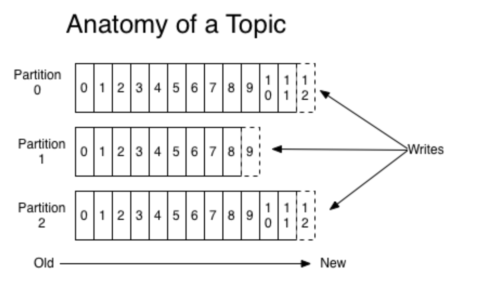
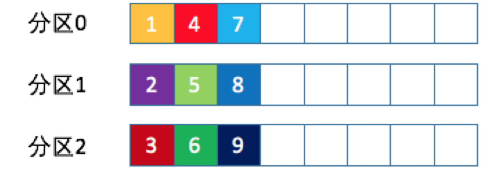
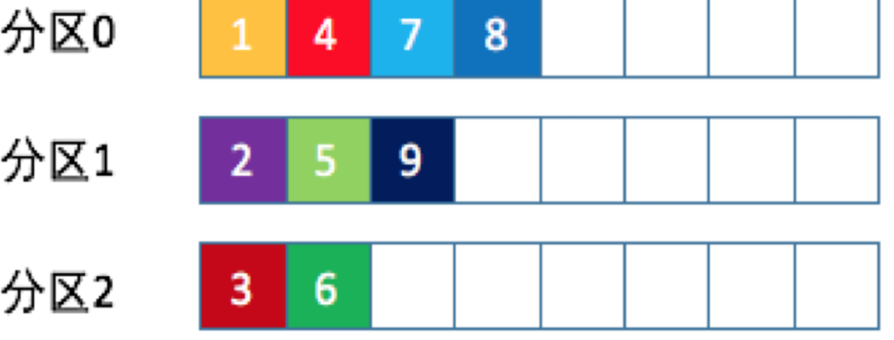
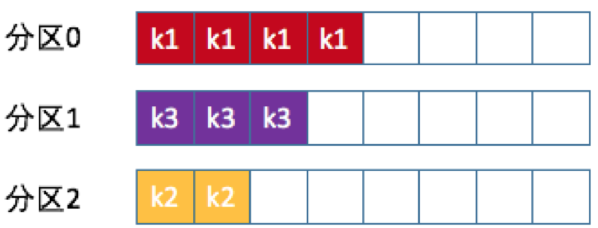
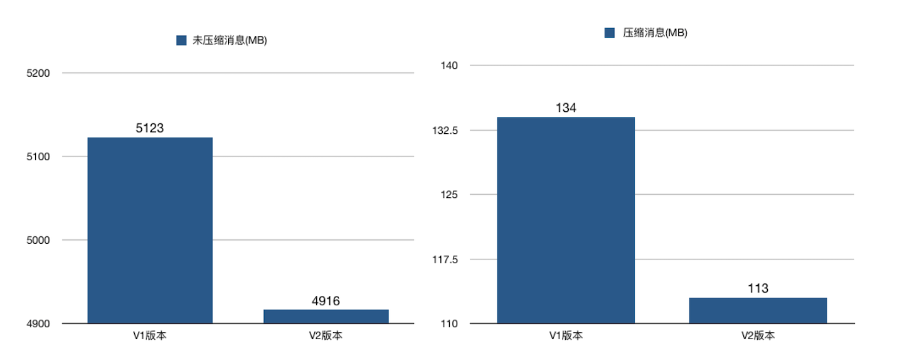
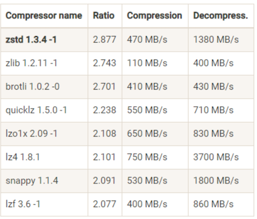
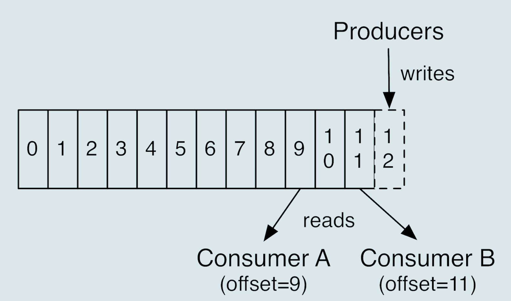
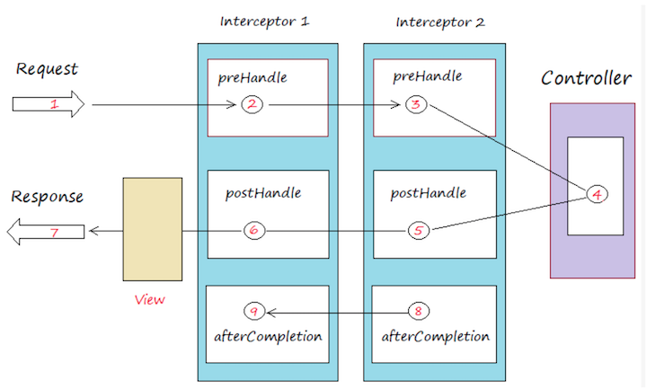
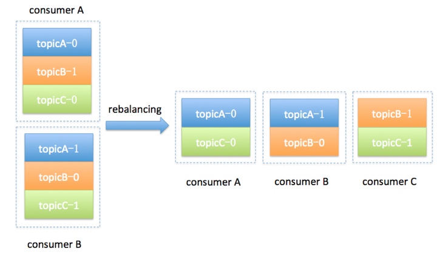
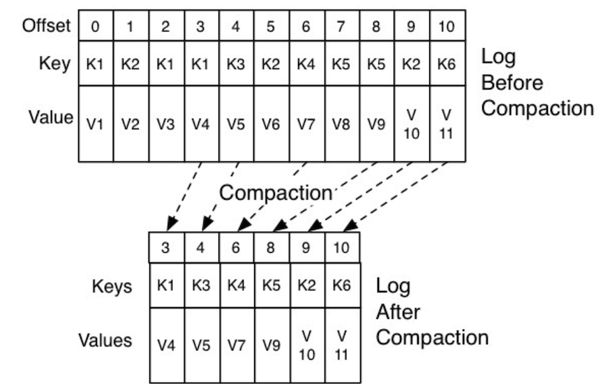

# **chap3 客户端实践及原理1**

## **1 生产者消息分区机制原理剖析**

Kafka 收集应用服务器的日志数据，这种数据都是很多的，特别是对于那种大批量机器组成的集群环境，每分钟产生的日志量都能以 GB 数，因此如何将这么大的数据量均匀地分配到 Kafka 的各个 Broker 上，就成为一个非常重要的问题。

### **1-1 为什么分区？**

Kafka 有主题（Topic）的概念，它是承载真实数据的逻辑容器，而在主题之下还分为若干个分区，也就是说 Kafka 的消息组织方式实际上是三级结构：**主题 - 分区 - 消息**。




**其实分区的作用就是提供负载均衡的能力，或者说对数据进行分区的主要原因，就是为了实现系统的高伸缩性（Scalability）。不同的分区能够被放置到不同节点的机器上，而数据的读写操作也都是针对分区这个粒度而进行的，这样每个节点的机器都能独立地执行各自分区的读写请求处理**。并且，我们还可以通过添加新的节点机器来增加整体系统的吞吐量

不同的分布式系统对分区的叫法也不尽相同。

**比如在 Kafka 中叫分区，在 MongoDB 和 Elasticsearch 中就叫分片 Shard，而在 HBase 中则叫 Region，在 Cassandra 中又被称作 vnode**从表面看起来它们实现原理可能不尽相同，但对底层分区（Partitioning）的整体思想却从未改变。

### **1-2 分区策略**

Kafka 为我们提供了默认的分区策略，同时它也支持你自定义分区策略。

如果要自定义分区策略，你需要显式地配置生产者端的参数`partitioner.class`。这个参数该怎么设定呢？方法很简单，在编写生产者程序时，你可以编写一个具体的类实现

`org.apache.kafka.clients.producer.Partitioner`接口。这个接口也很简单，只定义了两个方法：`partition()`和`close()`，通常你只需要实现最重要的 partition 方法。我们来看看这个方法的方法签名：

```
int partition(String topic, Object key, byte[] keyBytes, Object value, byte[] valueBytes, Cluster cluster);
```

**这里的topic、key、keyBytes、value和valueBytes都属于消息数据**，cluster则是集群信息（比如当前 Kafka 集群共有多少主题、多少 Broker 等）。

Kafka 给你这么多信息，就是希望让你能够充分地利用这些信息对消息进行分区，计算出它要被发送到哪个分区中。

**只要你自己的实现类定义好了 partition 方法，同时设置`partitioner.class`参数为你自己实现类的 Full Qualified Name**，那么生产者程序就会按照你的代码逻辑对消息进行分区。

### **1-3 轮询策略**

也称 Round-robin 策略，即顺序分配。比如一个主题下有 3 个分区，那么第一条消息被发送到分区 0，第二条被发送到分区 1，第三条被发送到分区 2，以此类推。当生产第 4 条消息时又会重新开始，即将其分配到分区 0，就像下面这张图展示的那样。



这就是所谓的轮询策略。**轮询策略是 `Kafka Java` 生产者 API 默认提供的分区策略**。如果你未指定partitioner.class参数，那么你的生产者程序会按照轮询的方式在主题的所有分区间均匀地“码放”消息。

**轮询策略有非常优秀的负载均衡表现，它总是能保证消息最大限度地被平均分配到所有分区上，故默认情况下它是最合理的分区策略，也是我们最常用的分区策略之一。**


### **1-4 随机策略**

也称 Randomness 策略。所谓随机就是我们随意地将消息放置到任意一个分区上，如下面这张图所示。



如果要实现随机策略版的 partition 方法，

```
List<PartitionInfo> partitions = cluster.partitionsForTopic(topic);
return ThreadLocalRandom.current().nextInt(partitions.size());
```
先计算出该主题总的分区数，然后随机地返回一个小于它的正整数。

本质上看随机策略也是力求将数据均匀地打散到各个分区，**但从实际表现来看，它要逊于轮询策略，所以如果追求数据的均匀分布，还是使用轮询策略比较好**。事实上，随机策略是老版本生产者使用的分区策略，在新版本中已经改为轮询了。

**按消息键保序策略**

**Kafka 允许为每条消息定义消息键，简称为 Key。** 

这个 Key 的作用非常大，它可以是一个有着明确业务含义的字符串，比如客户代码、部门编号或是业务 ID 等；

也可以用来表征消息元数据。**特别是在 Kafka 不支持时间戳的年代，在一些场景中，工程师们都是直接将消息创建时间封装进 Key 里面的**。

一旦消息被定义了 Key，那么你就可以保证同一个 Key 的所有消息都进入到相同的分区里面，由于每个分区下的消息处理都是有顺序的，故这个策略被称为按消息键保序策略，如下图所示。



实现这个策略的 partition 方法同样简单，只需要下面两行代码即可：

```
List<PartitionInfo> partitions = cluster.partitionsForTopic(topic);
return Math.abs(key.hashCode()) % partitions.size();
```
我们就可以根据 Broker 所在的 IP 地址实现定制化的分区策略。比如下面这段代码：

```
List<PartitionInfo> partitions = cluster.partitionsForTopic(topic);
return partitions.stream().filter(p -> isSouth(p.leader().host())).map(PartitionInfo::partition).findAny().get();
```


切记分区是实现负载均衡以及高吞吐量的关键，故在生产者这一端就要仔细盘算合适的分区策略，避免造成消息数据的“倾斜”，使得某些分区成为性能瓶颈，这样极易引发下游数据消费的性能下降。

## **2 生产者压缩算法**

怎么压缩？

不论是哪个版本，Kafka 的消息层次都分为两层：**消息集合（message set）以及消息（message）。** 一个消息集合中包含若干条日志项（record item），而日志项才是真正封装消息的地方。Kafka 底层的消息日志由一系列消息集合日志项组成。Kafka 通常不会直接操作具体的一条条消息，它总是在消息集合这个层面上进行写入操作。

我来举个例子。原来在 V1 版本中，每条消息都需要执行 CRC 校验，但有些情况下消息的 CRC 值是会发生变化的。

* **比如在 Broker 端可能会对消息时间戳字段进行更新，那么重新计算之后的 CRC 值也会相应更新；**
* 再比如 Broker 端在执行消息格式转换时（主要是为了兼容老版本客户端程序），也会带来 CRC 值的变化。

鉴于这些情况，再对每条消息都执行 CRC 校验就有点没必要了，不仅浪费空间还耽误 CPU 时间，因此在 V2 版本中，消息的 CRC 校验工作就被移到了消息集合这一层。

**V2 版本还有一个和压缩息息相关的改进，就是保存压缩消息的方法发生了变化**。之前 V1 版本中保存压缩消息的方法是把多条消息进行压缩然后保存到外层消息的消息体字段中；而 V2 版本的做法是对整个消息集合进行压缩。显然后者应该比前者有更好的压缩效果。



### **2-1 何时压缩？**

在 Kafka 中，压缩可能发生在两个地方：**生产者端和 Broker 端**。

生产者程序中配置 compression.type 参数即表示启用指定类型的压缩算法。比如下面这段程序代码展示了如何构建一个开启 GZIP 的 Producer 对象：

```
 Properties props = new Properties();
 props.put("bootstrap.servers", "localhost:9092");
 props.put("acks", "all");
 props.put("key.serializer", "org.apache.kafka.common.serialization.StringSerializer");
 props.put("value.serializer", "org.apache.kafka.common.serialization.StringSerializer");
 // 开启 GZIP 压缩
 props.put("compression.type", "gzip");
 
 Producer<String, String> producer = new KafkaProducer<>(props);
```
 
 这里比较关键的代码行是 `props.put("compression.type", "gzip")`，它表明该 Producer 的压缩算法使用的是 GZIP。
 
 这样 Producer 启动后生产的每个消息集合都是经 GZIP 压缩过的，故而能很好地节省网络传输带宽以及 Kafka Broker 端的磁盘占用。
 
 
 实大部分情况下 Broker 从 Producer 端接收到消息后仅仅是原封不动地保存而不会对其进行任何修改，但这里的“大部分情况”也是要满足一定条件的。
 
有两种例外情况就可能让 Broker 重新压缩消息。

* 情况一：Broker 端指定了和 Producer 端不同的压缩算法。
	* Producer 说：“我要使用 GZIP 进行压缩。”
	* Broker 说：“不好意思，我这边接收的消息必须使用 Snappy 算法进行压缩。”

这种情况下 Broker 接收到 GZIP 压缩消息后，只能解压缩然后使用 Snappy 重新压缩一遍。如果你翻开 Kafka 官网，**你会发现 Broker 端也有一个参数叫 `compression.type`**  

**但是这个参数的默认值是 producer，这表示 Broker 端会“尊重”Producer 端使用的压缩算法。** 可一旦你在 Broker 端设置了不同的 compression.type 值，就一定要小心了，因为可能会发生预料之外的压缩 / 解压缩操作，通常表现为 Broker 端 CPU 使用率飙升。

### **2-2 情况二：Broker 端发生了消息格式转换。**

在一个生产环境中，Kafka 集群中同时保存多种版本的消息格式非常常见。为了兼容老版本的格式，Broker 端会对新版本消息执行向老版本格式的转换。这个过程中会涉及消息的解压缩和重新压缩。一般情况下这种消息格式转换对性能是有很大影响的，除了这里的压缩之外，它还让 Kafka 丧失了引以为豪的 Zero Copy 特性。

### **2-3 何时解压缩？**


常来说解压缩发生在消费者程序中，也就是说 Producer 发送压缩消息到 Broker 后，Broker 照单全收并原样保存起来。当 Consumer 程序请求这部分消息时，Broker 依然原样发送出去，**当消息到达 Consumer 端后，由 Consumer 自行解压缩还原成之前的消息**。

**Consumer 怎么知道这些消息是用何种压缩算法压缩的呢**？

其实答案就在消息中。**Kafka 会将启用了哪种压缩算法封装进消息集合中，这样当 Consumer 读取到消息集合时，它自然就知道了这些消息使用的是哪种压缩算法**。如果用一句话总结一下压缩和解压缩，那么我希望你记住这句话：**Producer 端压缩、Broker 端保持、Consumer 端解压缩**。

**除了在 Consumer 端解压缩，Broker 端也会进行解压缩**。注意了，这和前面提到消息格式转换时发生的解压缩是不同的场景。每个压缩过的消息集合在 Broker 端写入时都要发生解压缩操作，目的就是为了对消息执行各种验证。我们必须承认这种解压缩对 Broker 端性能是有一定影响的，特别是对 CPU 的使用率而言。

### **2-4 各种压缩算法对比**

在 Kafka 2.1.0 版本之前，Kafka 支持 3 种压缩算法：GZIP、Snappy 和 LZ4。从 2.1.0 开始，Kafka 正式支持 Zstandard 算法（简写为 zstd）。它是 Facebook 开源的一个压缩算法，能够提供超高的压缩比（compression ratio）。

看一个压缩算法的优劣，有两个重要的指标：

* 一个指标是压缩比，原先占 100 份空间的东西经压缩之后变成了占 20 份空间，那么压缩比就是 5，显然压缩比越高越好；
* 另一个指标就是压缩 / 解压缩吞吐量，比如每秒能压缩或解压缩多少 MB 的数据。同样地，吞吐量也是越高越好。



 zstd 算法有着最高的压缩比，而在吞吐量上的表现只能说中规中矩。反观 LZ4 算法，它在吞吐量方面则是毫无疑问的执牛耳者

但对于 Kafka 而言，它们的性能测试结果却出奇得一致，

* 即在吞吐量方面：LZ4 > Snappy > zstd 和 GZIP；
* 而在压缩比方面，zstd > LZ4 > GZIP > Snappy。

具体到物理资源，使用 Snappy 算法占用的网络带宽最多，zstd 最少，这是合理的，毕竟 zstd 就是要提供超高的压缩比；在 CPU 使用率方面，各个算法表现得差不多，只是在压缩时 Snappy 算法使用的 CPU 较多一些，而在解压缩时 GZIP 算法则可能使用更多的 CPU。

### **2-5 最佳实践**

你现在已经知道 Producer 端完成的压缩，那么启用压缩的一个条件就是 Producer 程序运行机器上的 CPU 资源要很充足。如果 Producer 运行机器本身 CPU 已经消耗殆尽了，那么启用消息压缩无疑是雪上加霜，只会适得其反。

除了 CPU 资源充足这一条件，如果你的环境中带宽资源有限，那么我也建议你开启压缩。事实上我见过的很多 Kafka 生产环境都遭遇过带宽被打满的情况。这年头，带宽可是比 CPU 和内存还要珍贵的稀缺资源，毕竟万兆网络还不是普通公司的标配，因此千兆网络中 Kafka 集群带宽资源耗尽这件事情就特别容易出现。如果你的客户端机器 CPU 资源有很多富余，我强烈建议你开启 zstd 压缩，这样能极大地节省网络资源消耗。


## **3 无消息丢失配置**

**Kafka 只对“已提交”的消息（committed message）做有限度的持久化保证。**

* 什么是已提交的消息？当 Kafka 的若干个 Broker 成功地接收到一条消息并写入到日志文件后，它们会告诉生产者程序这条消息已成功提交。此时，这条消息在 Kafka 看来就正式变为“已提交”消息了。
* 第二个核心要素就是“有限度的持久化保证”，**也就是说 Kafka 不可能保证在任何情况下都做到不丢失消息**

### **3-1 “消息丢失”案例**

* **案例 1：生产者程序丢失数据**

实际上，解决此问题的方法非常简单：**Producer 永远要使用带有回调通知的发送 API，也就是说不要使用 `producer.send(msg)`，而要使用 `producer.send(msg, callback)`**。

不要小瞧这里的 callback（回调），它能准确地告诉你消息是否真的提交成功了。一旦出现消息提交失败的情况，你就可以有针对性地进行处理。

举例来说，如果是因为那些瞬时错误，那么仅仅让 Producer 重试就可以了；如果是消息不合格造成的，那么可以调整消息格式后再次发送。总之，处理发送失败的责任在 Producer 端而非 Broker 端。

* **案例 2：消费者程序丢失数据**

Consumer 端丢失数据主要体现在 Consumer 端要消费的消息不见了。**Consumer 程序有个“位移”的概念**，表示的是这个 Consumer 当前消费到的 Topic 分区的位置。下面这张图来自于官网，它清晰地展示了 Consumer 端的位移数据。



比如对于 Consumer A 而言，它当前的位移值就是 9；Consumer B 的位移值是 11。

这里的“位移”类似于我们看书时使用的书签，它会标记我们当前阅读了多少页，下次翻书的时候我们能直接跳到书签页继续阅读。

同理，Kafka 中 Consumer 端的消息丢失就是这么一回事。要对抗这种消息丢失，办法很简单：**维持先消费消息（阅读），再更新位移（书签）的顺序即可。这样就能最大限度地保证消息不丢失**。

* **多线程异步处理消费消息丢失**

这就好比 Consumer 程序从 Kafka 获取到消息后开启了多个线程异步处理消息，而 Consumer 程序自动地向前更新位移。假如其中某个线程运行失败了，它负责的消息没有被成功处理，但位移已经被更新了，因此这条消息对于 Consumer 而言实际上是丢失了

这个问题的解决方案也很简单：**如果是多线程异步处理消费消息，Consumer 程序不要开启自动提交位移，而是要应用程序手动提交位移。**

### **3-2 最佳实践**

* 不要使用 `producer.send(msg)`，**而要使用 `producer.send(msg, callback)`**。记住，一定要使用带有回调通知的 send 方法。
* **设置 `acks = all`。**`acks` 是 Producer 的一个参数，代表了你对“已提交”消息的定义。如果设置成 all，则表明所有副本 Broker 都要接收到消息，该消息才算是“已提交”。这是最高等级的“已提交”定义。
* **设置 retries 为一个较大的值**。这里的 retries 同样是 Producer 的参数，对应前面提到的 Producer 自动重试。当出现网络的瞬时抖动时，消息发送可能会失败，此时配置了 retries > 0 的 Producer 能够自动重试消息发送，避免消息丢失。
* **设置 `unclean.leader.election.enable = false`。**这是 Broker 端的参数，它控制的是哪些 Broker 有资格竞选分区的 Leader。如果一个 Broker 落后原先的 Leader 太多，那么它一旦成为新的 Leader，必然会造成消息的丢失。故一般都要将该参数设置成 false，即不允许这种情况的发生
* **设置 `replication.factor >= 3`。这也是 Broker 端的参数**。其实这里想表述的是，最好将消息多保存几份，毕竟目前防止消息丢失的主要机制就是冗余。
* **设置 `min.insync.replicas > 1`。这依然是 Broker 端参数，控制的是消息至少要被写入到多少个副本才算是“已提交**”。设置成大于 1 可以提升消息持久性。在实际环境中千万不要使用默认值 1。
* **确保 `replication.factor > min.insync.replicas`**。如果两者相等，那么只要有一个副本挂机，整个分区就无法正常工作了。我们不仅要改善消息的持久性，防止数据丢失，还要在不降低可用性的基础上完成。推荐设置成 `replication.factor = min.insync.replicas + 1`。
* **确保消息消费完成再提交**。`Consumer` 端有个参数 `enable.auto.commit`，最好把它设置成 `false`，并采用手动提交位移的方式。就像前面说的，这对于单 Consumer 多线程处理的场景而言是至关重要的。

## **4 客户端都的高级的功能： Kafka 拦截器**

### **4-1 什么是拦截器？**

用过 Spring Interceptor 或是 Apache Flume，那么应该不会对拦截器这个概念感到陌生，其基本思想就是允许应用程序在不修改逻辑的情况下，**动态地实现一组可插拔的事件处理逻辑链**。

它能够在主业务操作的前后多个时间点上插入对应的“拦截”逻辑。下面这张图展示了 Spring MVC 拦截器的工作原理：



**拦截器 1 和拦截器 2 分别在请求发送之前、发送之后以及完成之后三个地方插入了对应的处理逻辑。**

而 Flume 中的拦截器也是同理，它们插入的逻辑可以是修改待发送的消息，也可以是创建新的消息，甚至是丢弃消息。这些功能都是以配置拦截器类的方式动态插入到应用程序中的，故可以快速地切换不同的拦截器而不影响主程序逻辑。

Kafka 拦截器借鉴了这样的设计思路。你可以在消息处理的前后多个时点动态植入不同的处理逻辑，比如在消息发送前或者在消息被消费后。


### **4-2 Kafka 拦截器**

**Kafka 拦截器分为生产者拦截器和消费者拦截器。**

* 生产者拦截器允许**你在发送消息前以及消息提交成功后植入你的拦截器逻辑**；
* 而消费者拦截器支持**在消费消息前以及提交位移后编写特定逻辑**。


这两种拦截器都支持链的方式，即你可以将一组拦截器串连成一个大的拦截器，Kafka 会按照添加顺序依次执行拦截器逻辑。

举个例子，假设你想在生产消息前执行两个**“前置动作”**：

* 第一个是为消息增加一个头信息，封装发送该消息的时间，
* 第二个是更新发送消息数字段，那么当你将这两个拦截器串联在一起统一指定给 Producer 后，Producer 会按顺序执行上面的动作，然后再发送消息。


当前 Kafka 拦截器的设置方法是通过参数配置完成的。生产者和消费者两端有一个相同的参数，名字叫 `interceptor.classes`，它指定的是一组类的列表，每个类就是特定逻辑的拦截器实现类。

拿上面的例子来说，假设第一个拦截器的完整类路径是 

```
com.yourcompany.kafkaproject.interceptors.AddTimeStampInterceptor
```

**第二个类是** 

```
com.yourcompany.kafkaproject.interceptors.UpdateCounterInterceptor
```

那么你需要按照以下方法在 Producer 端指定拦截器：

```
Properties props = new Properties();
List<String> interceptors = new ArrayList<>();
interceptors.add("com.yourcompany.kafkaproject.interceptors.AddTimestampInterceptor"); // 拦截器 1
interceptors.add("com.yourcompany.kafkaproject.interceptors.UpdateCounterInterceptor"); // 拦截器 2
props.put(ProducerConfig.INTERCEPTOR_CLASSES_CONFIG, interceptors);
……
```

编写 `AddTimeStampInterceptor` 和 `UpdateCounterInterceptor` 类，这两个类以及你自己编写的所有 Producer 端拦截器实现类都要继承 `org.apache.kafka.clients.producer.ProducerInterceptor` 接口。

该接口是 Kafka 提供的，里面有两个核心的方法。

* onSend：该方法会在消息发送之前被调用。
* onAcknowledgement：该方法会在消息成功提交或发送失败之后被调用。还记得我在上一期中提到的发送回调通知 callback 吗
	* onAcknowledgement 的调用要早于 callback 的调用。**值得注意的是，这个方法和 onSend 不是在同一个线程中被调用的，因此如果你在这两个方法中调用了某个共享可变对象，一定要保证线程安全哦**。还有一点很重要，这个方法处在 Producer 发送的主路径中，所以最好别放一些太重的逻辑进去，否则你会发现你的 Producer TPS 直线下降。


同理，指定消费者拦截器也是同样的方法，只是具体的实现类要实现 `org.apache.kafka.clients.consumer.ConsumerInterceptor` 接口，这里面也有两个核心方法。

* onConsume：该方法在消息返回给 Consumer 程序之前调用。也就是说在开始正式处理消息之前，拦截器会先拦一道，搞一些事情，之后再返回给你。
* onCommit：Consumer 在提交位移之后调用该方法。通常你可以在该方法中做一些记账类的动作，比如打日志等。

**一定要注意的是，指定拦截器类时要指定它们的全限定名，即 full qualified name。**

### **4-3 典型使用场景**

Kafka 拦截器都能用在哪些地方呢？**其实，跟很多拦截器的用法相同，Kafka 拦截器可以应用于包括客户端监控、端到端系统性能检测、消息审计等多种功能在内的场景。**

**以端到端系统性能检测和消息审计为例来展开介绍下**。

今天 Kafka 默认提供的监控指标都是针对单个客户端或 Broker 的，你很难从具体的消息维度去追踪集群间消息的流转路径。

同时，如何监控一条消息从生产到最后消费的端到端延时也是很多 Kafka 用户迫切需要解决的问题。

从技术上来说，我们可以在客户端程序中增加这样的统计逻辑，但是对于那些将 Kafka 作为企业级基础架构的公司来说，**在应用代码中编写统一的监控逻辑其实是很难的，毕竟这东西非常灵活，不太可能提前确定好所有的计算逻辑。另外，将监控逻辑与主业务逻辑耦合也是软件工程中不提倡的做法**。

现在，通过实现拦截器的逻辑以及可插拔的机制，我们能够快速地观测、验证以及监控集群间的客户端性能指标，特别是能够从具体的消息层面上去收集这些数据。这就是 Kafka 拦截器的一个非常典型的使用场景。


### **4-2 案例分享**

学习了拦截器之后，我们现在知道可以用拦截器来满足这个需求。

既然是要计算总延时，那么一定要有个公共的地方来保存它，并且这个公共的地方还是要让生产者和消费者程序都能访问的。在这个例子中，我们假设数据被保存在 Redis 中。

这个需求显然要实现生产者拦截器，也要实现消费者拦截器。我们先来实现前者：

```
public class AvgLatencyProducerInterceptor implements ProducerInterceptor<String, String> {
 
 
    private Jedis jedis; // 省略 Jedis 初始化
 
 
    @Override
    public ProducerRecord<String, String> onSend(ProducerRecord<String, String> record) {
        jedis.incr("totalSentMessage");
        return record;
    }
 
 
    @Override
    public void onAcknowledgement(RecordMetadata metadata, Exception exception) {
    }
 
 
    @Override
    public void close() {
    }
 
 
    @Override
    public void configure(Map<java.lang.String, ?> configs) {
    }
```

下面是消费者端的拦截器实现，代码如下：

```
public class AvgLatencyConsumerInterceptor implements ConsumerInterceptor<String, String> {
 
 
    private Jedis jedis; // 省略 Jedis 初始化
 
 
    @Override
    public ConsumerRecords<String, String> onConsume(ConsumerRecords<String, String> records) {
        long lantency = 0L;
        for (ConsumerRecord<String, String> record : records) {
            lantency += (System.currentTimeMillis() - record.timestamp());
        }
        jedis.incrBy("totalLatency", lantency);
        long totalLatency = Long.parseLong(jedis.get("totalLatency"));
        long totalSentMsgs = Long.parseLong(jedis.get("totalSentMessage"));
        jedis.set("avgLatency", String.valueOf(totalLatency / totalSentMsgs));
        return records;
    }
 
 
    @Override
    public void onCommit(Map<TopicPartition, OffsetAndMetadata> offsets) {
    }
 
 
    @Override
    public void close() {
    }
 
 
    @Override
    public void configure(Map<String, ?> configs) {
```

创建好生产者和消费者拦截器后，我们按照上面指定的方法分别将它们配置到各自的 Producer 和 Consumer 程序中，这样就能计算消息从 Producer 端到 Consumer 端平均的处理延时了。这种端到端的指标监控能够从全局角度俯察和审视业务运行情况，及时查看业务是否满足端到端的 SLA 目标。

## **5 Java生产者是如何管理TCP连接的**

### **5-1 Kafka 生产者程序概览**

Kafka 的 Java 生产者 API 主要的对象就是 KafkaProducer。通常我们开发一个生产者的步骤有 4 步。

* 第 1 步：构造生产者对象所需的参数对象。
* 第 2 步：利用第 1 步的参数对象，创建 KafkaProducer 对象实例。
* 第 3 步：使用 KafkaProducer 的 send 方法发送消息。
* 第 4 步：调用 KafkaProducer 的 close 方法关闭生产者并释放各种系统资源。

首先，生产者应用在创建 KafkaProducer 实例时是会建立与 Broker 的 TCP 连接的。其实这种表述也不是很准确，应该这样说：**在创建 KafkaProducer 实例时，生产者应用会在后台创建并启动一个名为 Sender 的线程，该 Sender 线程开始运行时首先会创建与 Broker 的连接**。

* **TCP 连接是在创建 KafkaProducer 实例时建立的**
* **TCP 连接还可能在两个地方被创建：一个是在更新元数据后，另一个是在消息发送时**

接下来，我们来看看 Producer 更新集群元数据信息的两个场景。

* 场景一：当 Producer 尝试给一个不存在的主题发送消息时，Broker 会告诉 Producer 说这个主题不存在。此时 Producer 会发送 METADATA 请求给 Kafka 集群，去尝试获取最新的元数据信息。

* 场景二：Producer 通过 `metadata.max.age.ms` 参数定期地去更新元数据信息。该参数的默认值是 300000，即 5 分钟，也就是说不管集群那边是否有变化，Producer 每 5 分钟都会强制刷新一次元数据以保证它是最及时的数据。


### **5-2 何时关闭 TCP 连接？**

Producer 端关闭 TCP 连接的方式有两种：**一种是用户主动关闭；一种是 Kafka 自动关闭**。

我们先说第一种。这里的主动关闭实际上是广义的主动关闭，甚至包括用户调用 kill -9 主动“杀掉”Producer 应用。当然最推荐的方式还是调用 producer.close() 方法来关闭。

第二种是 Kafka 帮你关闭，这与 Producer 端参数 connections.max.idle.ms 的值有关。默认情况下该参数值是 9 分钟，即如果在 9 分钟内没有任何请求“流过”某个 TCP 连接，那么 Kafka 会主动帮你把该 TCP 连接关闭。用户可以在 Producer 端设置 `connections.max.idle.ms=-1` 禁掉这种机制。

一旦被设置成 -1，TCP 连接将成为永久长连接。当然这只是软件层面的“长连接”机制，由于 Kafka 创建的这些 Socket 连接都开启了 keepalive，因此 keepalive 探活机制还是会遵守的。


对最新版本的 Kafka（2.1.0）而言，Java Producer 端管理 TCP 连接的方式是：

* KafkaProducer 实例创建时启动 Sender 线程，从而创建与 bootstrap.servers 中所有 Broker 的 TCP 连接。
* KafkaProducer 实例首次更新元数据信息之后，还会再次创建与集群中所有 Broker 的 TCP 连接。
* 如果 Producer 端发送消息到某台 Broker 时发现没有与该 Broker 的 TCP 连接，那么也会立即创建连接。
* 如果设置 Producer 端 connections.max.idle.ms 参数大于 0，则步骤 1 中创建的 TCP 连接会被自动关闭；如果设置该参数 =-1，那么步骤 1 中创建的 TCP 连接将无法被关闭，从而成为“僵尸”连接。


## **6 幂等生产者和事务生产者**

所谓的消息交付可靠性保障，是指 Kafka 对 Producer 和 Consumer 要处理的消息提供什么样的承诺。常见的承诺有以下三种：

* 最多一次（at most once）：消息可能会丢失，但绝不会被重复发送。
* 至少一次（at least once）：消息不会丢失，但有可能被重复发送。
* 精确一次（exactly once）：消息不会丢失，也不会被重复发送。

**目前，Kafka 默认提供的交付可靠性保障是第二种，即至少一次。**

即只有 Broker 成功“提交”消息且 Producer 接到 Broker 的应答才会认为该消息成功发送。不过倘若消息成功“提交”，但 Broker 的应答没有成功发送回 Producer 端（比如网络出现瞬时抖动），那么 Producer 就无法确定消息是否真的提交成功了。因此，它只能选择重试，也就是再次发送相同的消息。这就是 Kafka 默认提供至少一次可靠性保障的原因，不过这会导致消息重复发送。

Kafka 也可以提供最多一次交付保障，只需要让 Producer 禁止重试即可。这样一来，消息要么写入成功，要么写入失败，但绝不会重复发送。我们通常不会希望出现消息丢失的情况，但一些场景里偶发的消息丢失其实是被允许的，相反，消息重复是绝对要避免的。此时，使用最多一次交付保障就是最恰当的。

### **6-1 什么是幂等性（Idempotence）？**

**“幂等”这个词原是数学领域中的概念，指的是某些操作或函数能够被执行多次，但每次得到的结果都是不变的。**

在计算机领域中，幂等性的含义稍微有一些不同：

幂等性有很多好处，**其最大的优势在于我们可以安全地重试任何幂等性操作，反正它们也不会破坏我们的系统状态**

### **6-2 幂等性 Producer**

在 Kafka 中，Producer 默认不是幂等性的，但我们可以创建幂等性 Producer。它其实是 0.11.0.0 版本引入的新功能。在此之前，Kafka 向分区发送数据时，可能会出现同一条消息被发送了多次，导致消息重复的情况。

**在 0.11 之后，指定 Producer 幂等性的方法很简单，仅需要设置一个参数即可，即 `props.put(“enable.idempotence”, ture)`，或 `props.put(ProducerConfig.ENABLE_IDEMPOTENCE_CONFIG， true)`。**

**`enable.idempotence` 被设置成 `true` 后，`Producer` 自动升级成幂等性 `Producer`，其他所有的代码逻辑都不需要改变。**

`Kafka` 自动帮你做消息的重复去重。底层具体的原理很简单，就是经典的用空间去换时间的优化思路，即在 Broker 端多保存一些字段。

当 Producer 发送了具有相同字段值的消息后，Broker 能够自动知晓这些消息已经重复了，于是可以在后台默默地把它们“丢弃”掉。当然，实际的实现原理并没有这么简单，但你大致可以这么理解。

### **6-3 事务**

Kafka 的事务概念类似于我们熟知的数据库提供的事务。在数据库领域，事务提供的安全性保障是经典的 ACID，即原子性（Atomicity）、一致性 (Consistency)、隔离性 (Isolation) 和持久性 (Durability)。

通常来说，**隔离性表明并发执行的事务彼此相互隔离，互不影响**。经典的数据库教科书把隔离性称为可串行化 (serializability)，即每个事务都假装它是整个数据库中唯一的事务。

* 很多数据库厂商对于隔离级别的实现都有自己不同的理解，比如有的数据库提供 Snapshot 隔离级别，而在另外一些数据库中，它们被称为可重复读（repeatable read）。
* 好在对于已提交读（read committed）隔离级别的提法，各大主流数据库厂商都比较统一。
* 所谓的 read committed，指的是当读取数据库时，你只能看到已提交的数据，即无脏读。

同时，当写入数据库时，你也只能覆盖掉已提交的数据，即无脏写。

### **6-4 事务型 Producer**

事务型 Producer 能够保证将消息原子性地写入到多个分区中。这批消息要么全部写入成功，要么全部失败。另外，事务型 Producer 也不惧进程的重启。Producer 重启回来后，Kafka 依然保证它们发送消息的精确一次处理。

设置事务型 Producer 的方法也很简单，满足两个要求即可：

* 和幂等性 Producer 一样，开启 `enable.idempotence = true`。
* 设置 Producer 端参数 transctional. id。最好为其设置一个有意义的名字。

此外，你还需要在 Producer 代码中做一些调整，如这段代码所示：

```
producer.initTransactions();
try {
            producer.beginTransaction();
            producer.send(record1);
            producer.send(record2);
            producer.commitTransaction();
} catch (KafkaException e) {
            producer.abortTransaction();
}
```

和普通 Producer 代码相比，事务型 Producer 的显著特点是调用了一些事务 API，**如 initTransaction、beginTransaction、commitTransaction 和 abortTransaction，它们分别对应事务的初始化、事务开始、事务提交以及事务终止。**

这段代码能够保证 Record1 和 Record2 被当作一个事务统一提交到 Kafka，要么它们全部提交成功，要么全部写入失败。

实际上即使写入失败，Kafka 也会把它们写入到底层的日志中，也就是说 Consumer 还是会看到这些消息。因此在 Consumer 端，读取事务型 Producer 发送的消息也是需要一些变更的。修改起来也很简单，设置 isolation.level 参数的值即可。当前这个参数有两个取值：

* `read_uncommitted`：这是默认值，表明 Consumer 能够读取到 Kafka 写入的任何消息，不论事务型 Producer 提交事务还是终止事务，其写入的消息都可以读取。很显然，如果你用了事务型 Producer，那么对应的 Consumer 就不要使用这个值。
* `read_committed`：表明 Consumer 只会读取事务型 Producer 成功提交事务写入的消息。当然了，它也能看到非事务型 Producer 写入的所有消息。

## **7 消费者组**

消费者组，即 Consumer Group，应该算是 Kafka 比较有亮点的设计了。

那么何谓 Consumer Group 呢？用一句话概括就是：Consumer Group 是 Kafka 提供的可扩展且具有容错性的消费者机制。既然是一个组，那么组内必然可以有多个消费者或消费者实例（Consumer Instance），它们共享一个公共的 ID，这个 ID 被称为 Group ID。

组内的所有消费者协调在一起来消费订阅主题（Subscribed Topics）的所有分区（Partition）。当然，每个分区只能由同一个消费者组内的一个 Consumer 实例来消费。

 Consumer Group 三个特性。
 
*  **Consumer Group 下可以有一个或多个 Consumer 实例。这里的实例可以是一个单独的进程，也可以是同一进程下的线程**。在实际场景中，使用进程更为常见一些。
* Group ID 是一个字符串，在一个 Kafka 集群中，**它标识唯一的一个 Consumer Group**。
* **Consumer Group 下所有实例订阅的主题的单个分区**，只能分配给组内的某个 Consumer 实例消费。这个分区当然也可以被其他的 Group 消费。


传统的消息引擎模型就是这两大类：**点对点模型和发布 / 订阅模型**，它们各有优劣。

传统的消息队列模型的特性在于消息一旦被消费，就会从队列中被删除，而且只能被下游的一个 Consumer 消费。**这种模型的伸缩性（scalability）很差，因为下游的多个 Consumer 都要“抢”这个共享消息队列的消息**

发布 / 订阅模型倒是允许消息被多个 Consumer 消费，但它的问题也是伸缩性不高，**因为每个订阅者都必须要订阅主题的所有分区**。这种全量订阅的方式既不灵活，也会影响消息的真实投递效果。


Kafka 的 Consumer Group 可以避免上述的问题。当 Consumer Group 订阅了多个主题后，组内的每个实例不要求一定要订阅主题的所有分区，它只会消费部分分区中的消息。

Consumer Group 之间彼此独立，互不影响，它们能够订阅相同的一组主题而互不干涉。再加上 Broker 端的消息留存机制，Kafka 的 Consumer Group 完美地规避了上面提到的伸缩性差的问题。**可以这么说，Kafka 仅仅使用 Consumer Group 这一种机制，却同时实现了传统消息引擎系统的两大模型**：

* 如果所有实例都属于同一个 Group，那么它实现的就是消息队列模型；
* 如果所有实例分别属于不同的 Group，那么它实现的就是发布 / 订阅模型。

### **一个 Group 下该有多少个 Consumer 实例呢？**

**理想情况下，Consumer 实例的数量应该等于该 Group 订阅主题的分区总数**。

**举个简单的例子，假设一个 Consumer Group 订阅了 3 个主题，分别是 A、B、C，它们的分区数依次是 1、2、3，那么通常情况下，为该 Group 设置 6 个 Consumer 实例是比较理想的情形**，因为它能最大限度地实现高伸缩性。


### **针对 Consumer Group，Kafka 是怎么管理位移的呢？**

你还记得吧，消费者在消费的过程中需要记录自己消费了多少数据，即消费位置信息。在 Kafka 中，这个位置信息有个专门的术语：位移（Offset）。

看上去该 Offset 就是一个数值而已，其实对于 Consumer Group 而言，它是一组 KV 对，Key 是分区，V 对应 Consumer 消费该分区的最新位移。

如果用 Java 来表示的话，你大致可以认为是这样的数据结构，即 `Map<TopicPartition, Long>`，其中 TopicPartition 表示一个分区，而 Long 表示位移的类型。

当然，我必须承认 Kafka 源码中并不是这样简单的数据结构，而是要比这个复杂得多，不过这并不会妨碍我们对 Group 位移的理解。

老版本的 Consumer Group 把位移保存在 ZooKeeper 中。

Apache ZooKeeper 是一个分布式的协调服务框架，Kafka 重度依赖它实现各种各样的协调管理。**将位移保存在 ZooKeeper 外部系统的做法，最显而易见的好处就是减少了 Kafka Broker 端的状态保存开销**。

现在比较流行的提法是将服务器节点做成无状态的，这样可以自由地扩缩容，实现超强的伸缩性。Kafka 最开始也是基于这样的考虑，才将 Consumer Group 位移保存在独立于 Kafka 集群之外的框架中。

即 ZooKeeper 这类元框架其实并不适合进行频繁的写更新，而 Consumer Group 的位移更新却是一个非常频繁的操作。这种大吞吐量的写操作会极大地拖慢 ZooKeeper 集群的性能，因此 Kafka 社区渐渐有了这样的共识：**将 Consumer 位移保存在 ZooKeeper 中是不合适的做法**。

于是，在新版本的 Consumer Group 中，Kafka 社区重新设计了 Consumer Group 的位移管理方式，**采用了将位移保存在 Kafka 内部主题的方法**。这个内部主题就是让人既爱又恨的 `__consumer_offsets`。

### **Consumer Group 的重平衡 Rebalance**

Rebalance 本质上是一种协议，规定了一个 Consumer Group 下的所有 Consumer 如何达成一致，来分配订阅 Topic 的每个分区。

比如某个 Group 下有 20 个 Consumer 实例，它订阅了一个具有 100 个分区的 Topic。正常情况下，Kafka 平均会为每个 Consumer 分配 5 个分区。这个分配的过程就叫 Rebalance。

那么 Consumer Group 何时进行 Rebalance 呢？Rebalance 的触发条件有 3 个。

* **组成员数发生变更**。比如有新的 Consumer 实例加入组或者离开组，抑或是有 Consumer 实例崩溃被“踢出”组。
* **订阅主题数发生变更**。Consumer Group 可以使用正则表达式的方式订阅主题，比如 `consumer.subscribe(Pattern.compile(“t.*c”))` 就表明该 Group 订阅所有以字母 t 开头、字母 c 结尾的主题。在 `Consumer Group` 的运行过程中，你新创建了一个满足这样条件的主题，那么该 Group 就会发生 Rebalance。
* **订阅主题的分区数发生变更**。Kafka 当前只能允许增加一个主题的分区数。当分区数增加时，就会触发订阅该主题的所有 Group 开启 Rebalance。

Rebalance 发生时，Group 下所有的 Consumer 实例都会协调在一起共同参与。每个 Consumer 实例怎么知道应该消费订阅主题的哪些分区呢？**这就需要分配策略的协助了**。

**保证提供最公平的分配策略**，即每个 Consumer 实例都能够得到较为平均的分区数。**比如一个 Group 内有 10 个 Consumer 实例，要消费 100 个分区，理想的分配策略自然是每个实例平均得到 10 个分区**。这就叫公**平的分配策略**。如果出现了严重的分配倾斜，势必会出现这种情况：有的实例会“闲死”，而有的实例则会“忙死”。

我们举个简单的例子来说明一下 Consumer Group 发生 Rebalance 的过程。假设目前某个 Consumer Group 下有两个 Consumer，比如 A 和 B，当第三个成员 C 加入时，Kafka 会触发 Rebalance，并根据默认的分配策略重新为 A、B 和 C 分配分区，如下图所示：



显然，Rebalance 之后的分配依然是公平的，即每个 Consumer 实例都获得了 3 个分区的消费权。这是我们希望出现的情形。

**Rebalance 的劣势**

* 首先，Rebalance 过程对 Consumer Group 消费过程有极大的影响。stop the world，简称 STW。在 STW 期间，所有应用线程都会停止工作，表现为整个应用程序僵在那边一动不动。Rebalance 过程也和这个类似，在 Rebalance 过程中，所有 Consumer 实例都会停止消费，等待 Rebalance 完成。
* 其次，目前 Rebalance 的设计是所有 Consumer 实例共同参与，全部重新分配所有分区。其实更高效的做法是尽量减少分配方案的变动。例如实例 A 之前负责消费分区 1、2、3，那么 Rebalance 之后，如果可能的话，最好还是让实例 A 继续消费分区 1、2、3，而不是被重新分配其他的分区。这样的话，实例 A 连接这些分区所在 Broker 的 TCP 连接就可以继续用，不用重新创建连接其他 Broker 的 Socket 资源。


## **8 Kafa 位移主题**

**`__consumer_offsets` 在 Kafka 源码中有个更为正式的名字，叫位移主题，即 `Offsets Topic`**

新版本 Consumer 的位移管理机制其实也很简单，就是**将 Consumer 的位移数据作为一条条普通的 Kafka 消息，提交到 `__consumer_offsets `中。可以这么说，`__consumer_offsets` 的主要作用是保存 Kafka 消费者的位移信息。**

它要求这个提交过程不仅要实现高持久性，还要支持高频的写操作。

位移主题是一个普通的 Kafka 主题，**但它的消息格式却是 Kafka 自己定义的，用户不能修改**，也就是说你不能随意地向这个主题写消息，因为一旦你写入的消息不满足 Kafka 规定的格式，那么 Kafka 内部无法成功解析，就会造成 Broker 的崩溃。

事实上，Kafka Consumer 有 API 帮你提交位移，也就是向位移主题写消息。你千万不要自己写个 Producer 随意向该主题发送消息。

### **8-1 这个主题存的到底是什么格式的消息呢？**

首先从 Key 说起。

一个 Kafka 集群中的 Consumer 数量会有很多，既然这个主题保存的是 Consumer 的位移数据，**那么消息格式中必须要有字段来标识这个位移数据是哪个 Consumer 的**。

这种数据放在哪个字段比较合适呢？显然放在 Key 中比较合适。

* 主题消息的 Key 中应该保存标识 Consumer 的字段,  Group ID 
* 除了 Consumer Group，Kafka 还支持独立 Consumer，**也称 Standalone Consumer**。它的运行机制与 Consumer Group 完全不同，但是位移管理的机制却是相同的。**因此，即使是 Standalone Consumer，也有自己的 Group ID 来标识它自己，所以也适用于这套消息格式**

**移主题的 Key 中应该保存 3 部分内容：<Group ID，主题名，分区号 >**

位移主题的消息格式可不是只有这一种。事实上，它有 3 种消息格式

* **用于保存 Consumer Group 信息的消息**。
* **用于删除 Group 过期位移甚至是删除 Group 的消息**。

### **8-2 位移主题是怎么被创建的**

**当 Kafka 集群中的第一个 Consumer 程序启动时，Kafka 会自动创建位移主题。**

我们说过，位移主题就是普通的 Kafka 主题，那么它自然也有对应的分区数。但如果是 Kafka 自动创建的，分区数是怎么设置的呢？

这就要看 Broker 端参数 `offsets.topic.num.partitions` 的取值了。它的默认值是 50，因此 Kafka 会自动创建一个 50 分区的位移主题。

如果你曾经惊讶于 Kafka 日志路径下冒出很多 `__consumer_offsets-xxx` 这样的目录，那么现在应该明白了吧，这就是 Kafka 自动帮你创建的位移主题。

你可能会问，除了分区数，副本数或备份因子是怎么控制的呢？答案也很简单，这就是 Broker 端另一个参数 offsets.topic.replication.factor 要做的事情了。它的默认值是 3。


**<mark>总结一下，如果位移主题是 Kafka 自动创建的，那么该主题的分区数是 50，副本数是 3。</mark>**

### **8-3 手动创建位移主题**

在 Kafka 集群尚未启动任何 Consumer 之前，**使用 Kafka API 创建它**。

手动创建的好处在于，你可以创建满足你实际场景需要的位移主题**。比如很多人说 50 个分区对我来讲太多了，我不想要这么多分区，那么你可以自己创建它，不用理会 `offsets.topic.num.partitions` 的值**。

**建议是，还是让 Kafka 自动创建比较好**

目前 Kafka Consumer 提交位移的方式有两种：**自动提交位移和手动提交位移**。


* Consumer 端有个参数叫 `enable.auto.commit`，如果值是 true，则 `Consumer` 在后台默默地为你定期提交位移，提交间隔由一个专属的参数 `auto.commit.interval.ms` 来控制。
	* **优点**： 自动提交位移有一个显著的优点，就是省事，你不用操心位移提交的事情，就能保证消息消费不会丢失。
	* **缺点**： 因为它太省事了，以至于丧失了很大的灵活性和可控性，你完全没法把控 Consumer 端的位移管理。

事实上，很多与 Kafka 集成的大数据框架都是禁用自动提交位移的，如 Spark、Flink 等。

这就引出了另一种位移提交方式：手动提交位移，即设置 `enable.auto.commit = false`。一旦设置了 false，作为 Consumer 应用开发的你就要承担起位移提交的责任。

**Kafka Consumer API 为你提供了位移提交的方法，如 `consumer.commitSync` 等。当调用这些方法时，Kafka 会向位移主题写入相应的消息。**

如果你选择的是自动提交位移，那么就可能存在一个问题：只要 Consumer 一直启动着，它就会无限期地向位移主题写入消息。

### **8-4 Kafka 是怎么删除位移主题中的过期消息的呢？**

Kafka 使用Compact 策略来删除位移主题中的过期消息，避免该主题无限期膨胀。那么应该如何定义 Compact 策略中的过期呢？**对于同一个 Key 的两条消息 M1 和 M2，如果 M1 的发送时间早于 M2，那么 M1 就是过期消息。Compact 的过程就是扫描日志的所有消息**，剔除那些过期的消息，然后把剩下的消息整理在一起。



图中位移为 0、2 和 3 的消息的 Key 都是 K1。Compact 之后，分区只需要保存位移为 3 的消息，因为它是最新发送的。


**Kafka 提供了专门的后台线程定期地巡检待 Compact 的主题，看看是否存在满足条件的可删除数据**。这个后台线程叫 Log Cleaner。很多实际生产环境中都出现过位移主题无限膨胀占用过多磁盘空间的问题，如果你的环境中也有这个问题，我建议你去检查一下 Log Cleaner 线程的状态，通常都是这个线程挂掉了导致