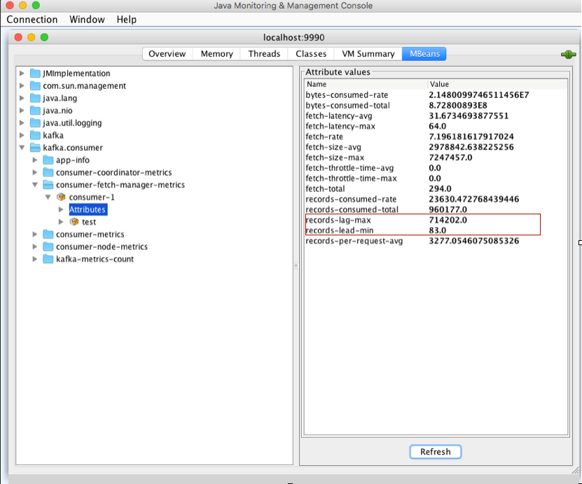

# **chap4 客户端实践及原理2**

## **1 消费者组重平衡**

Rebalance 就是让一个 Consumer Group 下所有的 Consumer 实例就如何消费订阅主题的所有分区达成共识的过程。

**在 Rebalance 过程中，所有 Consumer 实例共同参与，在协调者组件的帮助下，完成订阅主题分区的分配**。但是，在整个过程中，所有实例都不能消费任何消息，因此它对 Consumer 的 TPS 影响很大

所谓协调者，**在 Kafka 中对应的术语是 Coordinator**，它专门为 Consumer Group 服务，负责为 Group 执行 Rebalance 以及提供位移管理和组成员管理等。

具体来讲，Consumer 端应用程序在提交位移时，其实是向 Coordinator 所在的 Broker 提交位移。同样地，当 Consumer 应用启动时，也是向 Coordinator 所在的 Broker 发送各种请求，**然后由 Coordinator 负责执行消费者组的注册、成员管理记录等元数据管理操作**。

Kafka 为某个 Consumer Group 确定 Coordinator 所在的 Broker 的算法有 2 个步骤。

* 第 1 步：确定由位移主题的哪个分区来保存该 Group 数据：

```
partitionId=Math.abs(groupId.hashCode() % offsetsTopicPartitionCount)。
```

* 第 2 步：找出该分区 Leader 副本所在的 Broker，该 Broker 即为对应的 Coordinator。


* 首先，Kafka 会计算该 Group 的 group.id 参数的哈希值。
	* 比如你有个 Group 的 `group.id` 设置成了“test-group”，那么它的 hashCode 值就应该是 627841412。

* 其次，Kafka 会计算 `__consumer_offsets` 的分区数，通常是 50 个分区，之后将刚才那个哈希值对分区数进行取模加求绝对值计算，即 `abs(627841412 % 50) = 12`。
	* 此时，我们就知道了位移主题的分区 12 负责保存这个 Group 的数据
	* 有了分区号，算法的第 2 步就变得很简单了，我们只需要找出位移主题分区 12 的 Leader 副本在哪个 Broker 上就可以了。

* 这个 Broker，就是我们要找的 Coordinator。


在实际使用过程中，Consumer 应用程序，特别是 Java Consumer API，能够自动发现并连接正确的 Coordinator，我们不用操心这个问题。

当 Consumer Group 出现问题，需要快速排查 Broker 端日志时，我们能够**根据这个算法准确定位 Coordinator 对应的 Broker，不必一台 Broker 一台 Broker 地盲查。**

### Rebalance 的弊端是什么呢

* Rebalance 影响 Consumer 端 TPS。**总之就是，在 Rebalance 期间，Consumer 会停下手头的事情，什么也干不了**。
* Rebalance 很慢。如果你的 Group 下成员很多，就一定会有这样的痛点。**他的 Group 下有几百个 Consumer 实例，Rebalance 一次要几个小时**。在那种场景下，Consumer Group 的 Rebalance 已经完全失控了。
* **Rebalance 效率不高**。当前 Kafka 的设计机制决定了每次 Rebalance 时，Group 下的所有成员都要参与进来，而且通常不会考虑局部性原理，但局部性原理对提升系统性能是特别重要的。

要避免 Rebalance，还是要从 Rebalance 发生的时机入手。我们在前面说过，Rebalance 发生的时机有三个：

* 组成员数量发生变化
* 订阅主题数量发生变化
* 订阅主题的分区数发生变化


Consumer 实例增加的情况很好理解，当我们启动一个配置有相同 `group.id` 值的 Consumer 程序时，实际上就向这个 Group 添加了一个新的 Consumer 实例。

此时，Coordinator 会接纳这个新实例，将其加入到组中，并重新分配分区。通**常来说，增加 Consumer 实例的操作都是计划内的，可能是出于增加 TPS 或提高伸缩性的需要。总之，它不属于我们要规避的那类“不必要 Rebalance”**。

我们更在意的是 Group 下实例数减少这件事。如果你就是要停掉某些 Consumer 实例，那自不必说，关键是在某些情况下，Consumer 实例会被 Coordinator 错误地认为“已停止”从而被“踢出”Group。如果是这个原因导致的 Rebalance，我们就不能不管了。

### 哪些 Rebalance 是“不必要的”

**第一类非必要 Rebalance 是因为未能及时发送心跳，导致 Consumer 被“踢出”Group 而引发的**。因此，你需要仔细地设置`session.timeout.ms` 和 `heartbeat.interval.ms` 的值。

* 设置 `session.timeout.ms = 6s`。
* 设置 `heartbeat.interval.ms = 2s`。
* **要保证 Consumer 实例在被判定为“dead”之前，能够发送至少 3 轮的心跳请求，即 `session.timeout.ms >= 3 * heartbeat.interval.ms`**。

将 session.timeout.ms 设置成 6s 主要是为了让 Coordinator 能够更快地定位已经挂掉的 Consumer。希望这份配置能够较好地帮助你规避第一类“不必要”的 Rebalance。

**第二类非必要 Rebalance 是 Consumer 消费时间过长导致的。**

Consumer 消费数据时需要将消息处理之后写入到 MongoDB。显然，这是一个很重的消费逻辑。

MongoDB 的一丁点不稳定都会导致 Consumer 程序消费时长的增加。此时，`max.poll.interval.ms` 参数值的设置显得尤为关键。

如果要避免非预期的 Rebalance，你最好将该参数值设置得大一点，比你的下游最大处理时间稍长一点。就拿 MongoDB 这个例子来说，如果写 MongoDB 的最长时间是 7 分钟，那么你可以将该参数设置为 8 分钟左右。

要为的业务处理逻辑留下充足的时间。**这样，Consumer 就不会因为处理这些消息的时间太长而引发 Rebalance 了**。


一定要避免因为各种参数或逻辑不合理而导致的组成员意外离组或退出的情形, 与之相关的主要参数有：

* session.timeout.ms
* heartbeat.interval.ms
* max.poll.interval.ms
* GC 参数

## **2 Kafka中位移提交**

Kafka Consumer 的位移提交，是实现 Consumer 端语义保障的重要手段。

位移提交分为**自动提交和手动提交**，而手**动提交又分为同步提交和异步提交**。

在实际使用过程中，**推荐你使用手动提交机制，因为它更加可控，也更加灵活**。

另外，**建议你同时采用同步提交和异步提交两种方式**，这样既不影响 TPS，又支持自动重试，改善 Consumer 应用的高可用性。

总之，Kafka Consumer API 提供了多种灵活的提交方法，方便你根据自己的业务场景定制你的提交策略。


## **3 CommitFailedException异常处理**

**所谓 CommitFailedException，顾名思义就是 Consumer 客户端在提交位移时出现了错误或异常，而且还是那种不可恢复的严重异常**

如果异常是可恢复的瞬时错误，提交位移的 API 自己就能规避它们了，因为很多提交位移的 API 方法是支持自动错误重试的，提到的commitSync 方法。

### 3-1 场景一

当消息处理的总时间超过预设的 `max.poll.interval.ms` 参数值时，Kafka `Consumer` 端会抛出 `CommitFailedException` 异常。

你只需要写一个 Consumer 程序，使用 `KafkaConsumer.subscribe` 方法随意订阅一个主题，之后设置 Consumer 端参数 `max.poll.interval.ms=5 `秒，最后在循环调用 `KafkaConsumer.poll` 方法之间，插入 Thread.sleep(6000) 和手动提交位移，就可以成功复现这个异常了。

```
…
Properties props = new Properties();
…
props.put("max.poll.interval.ms", 5000);
consumer.subscribe(Arrays.asList("test-topic"));
 
while (true) {
    ConsumerRecords<String, String> records = 
		consumer.poll(Duration.ofSeconds(1));
    // 使用 Thread.sleep 模拟真实的消息处理逻辑
    Thread.sleep(6000L);
    consumer.commitSync();
}
```

如果要防止这种场景下抛出异常，需要简化消息处理逻辑。具体来说有 4 种方法。

1. **缩短单条消息处理的时间**。
	* 比如，之前下游系统消费一条消息的时间是 100 毫秒，优化之后成功地下降到 50 毫秒，那么此时 Consumer 端的 TPS 就提升了一倍。
2. 增加 Consumer 端允许下游系统消费一批消息的最大时长
3. 减少下游系统一次性消费的消息总数
	* 取决于 Consumer 端参数 max.poll.records 的值。当前该参数的默认值是 500 条，表明调用一次 KafkaConsumer.poll 方法，最多返回 500 条消息。
4. 下游系统使用多线程来加速消费。
	* 具体的思路就是，让下游系统手动创建多个消费线程处理 poll 方法返回的一批消息。之前你使用 Kafka Consumer 消费数据更多是单线程的，所以当消费速度无法匹及 Kafka Consumer 消息返回的速度时，它就会抛出 CommitFailedException 异常
	
**推荐你首先尝试采用方法 1 来预防此异常的发生**

首先，你需要弄清楚你的下游系统消费每条消息的平均延时是多少。

比如你的消费逻辑是从 Kafka 获取到消息后写入到下游的 MongoDB 中，假设访问 MongoDB 的平均延时不超过 2 秒，那么你可以认为消息处理需要花费 2 秒的时间。如果按照 max.poll.records 等于 500 来计算，一批消息的总消费时长大约是 1000 秒，因此你的 Consumer 端的 max.poll.interval.ms 参数值就不能低于 1000 秒。如果你使用默认配置，那默认值 5 分钟显然是不够的，你将有很大概率遭遇 CommitFailedException 异常。将 `max.poll.interval.ms` 增加到 1000 秒以上的做法就属于上面的第 2 种方法。

除了调整 `max.poll.interval.ms` 之外，你还可以选择调整 `max.poll.records` 值，减少每次 poll 方法返回的消息数。还拿刚才的例子来说，你可以设置 max.poll.records 值为 150，甚至更少，这样每批消息的总消费时长不会超过 300 秒（150*2=300），即 `max.poll.interval.ms` 的默认值 5 分钟。这种减少 max.poll.records 值的做法就属于上面提到的方法 3。

## **2 消费者组消费进度监控**

对于 Kafka 消费者来说，最重要的事情就是监控它们的消费进度了，或者说是监控它们消费的滞后程度。

这个滞后程度有个专门的名称：**消费者 Lag 或 Consumer Lag**。

**所谓滞后程度，就是指消费者当前落后于生产者的程度**。


比方说，Kafka 生产者向某主题成功生产了 100 万条消息，你的消费者当前消费了 80 万条消息，那么我们就说你的消费者滞后了 20 万条消息，即 Lag 等于 20 万。

* Lag 的单位是消息数，而且我们一般是在主题这个级别上讨论 Lag 的，但实际上，Kafka 监控 Lag 的层级是在分区上的。
* 如果要计算主题级别的，你需要手动汇总所有主题分区的 Lag，将它们累加起来，合并成最终的 Lag 值。


一个正常工作的消费者，它的 Lag 值应该很小，甚至是接近于 0 的，这表示该消费者能够及时地消费生产者生产出来的消息，滞后程度很小。**反之，如果一个消费者 Lag 值很大，通常就表明它无法跟上生产者的速度，最终 Lag 会越来越大，从而拖慢下游消息的处理速度。**

你在实际业务场景中必须时刻关注消费者的消费进度。**一旦出现 Lag 逐步增加的趋势，一定要定位问题，及时处理，避免造成业务损失。**

既然消费进度这么重要，我们应该怎么监控它呢？简单来说，有 3 种方法。

* 使用 Kafka 自带的命令行工具 kafka-consumer-groups 脚本。
* 使用 Kafka Java Consumer API 编程。
* 使用 Kafka 自带的 JMX 监控指标。

### **2-1 Kafka 自带命令**

**`kafka-consumer-groups`**

使用 Kafka 自带的命令行工具 `bin/kafka-consumer-groups.sh(bat)`。kafka-consumer-groups 脚本是 Kafka 为我们提供的最直接的监控消费者消费进度的工具。当然，除了监控 Lag 之外，它还有其他的功能。

它也能够监控独立消费者（Standalone Consumer）的 Lag。

之前说过，独立消费者就是没有使用消费者组机制的消费者程序。和消费者组相同的是，它们也要配置 `group.id` 参数值，但和消费者组调用 `KafkaConsumer.subscribe()` 不同的是，独立消费者调用 `KafkaConsumer.assign() `方法直接消费指定分区。

使用 kafka-consumer-groups 脚本很简单。该脚本位于 Kafka 安装目录的 bin 子目录下，我们可以通过下面的命令来查看某个给定消费者的 Lag 值：

```
$ bin/kafka-consumer-groups.sh --bootstrap-server <Kafka broker 连接信息 > --describe --group <group 名称 >
```

**Kafka 连接信息就是 `< 主机名：端口 >` 对，而 group 名称就是你的消费者程序中设置的 group.id 值**。


Kafka-consumer-groups 脚本的输出信息很丰富。

* 首先，它会按照消费者组订阅主题的分区进行展示，每个分区一行数据
* 其次，除了主题、分区等信息外，**它会汇报每个分区当前最新生产的消息的位移值（即 LOG-END-OFFSET 列值）、该消费者组当前最新消费消息的位移值（即 CURRENT-OFFSET 值）、LAG 值（前两者的差值）、消费者实例 ID、消费者连接 Broker 的主机名以及消费者的 CLIENT-ID 信息**。

运行这个脚本可能会出现下面这种情况，如下图所示


### **2-2 Kafka Java Consumer API**

社区提供的 Java Consumer API 分别提供了查询当前分区最新消息位移和消费者组最新消费消息位移两组方法，我们使用它们就能计算出对应的 Lag。

下面这段代码展示了如何利用 Consumer 端 API 监控给定消费者组的 Lag 值：


```
public static Map<TopicPartition, Long> lagOf(String groupID, String bootstrapServers) throws TimeoutException {
        Properties props = new Properties();
        props.put(CommonClientConfigs.BOOTSTRAP_SERVERS_CONFIG, bootstrapServers);
        try (AdminClient client = AdminClient.create(props)) {
            ListConsumerGroupOffsetsResult result = client.listConsumerGroupOffsets(groupID);
            try {
                Map<TopicPartition, OffsetAndMetadata> consumedOffsets = result.partitionsToOffsetAndMetadata().get(10, TimeUnit.SECONDS);
                props.put(ConsumerConfig.ENABLE_AUTO_COMMIT_CONFIG, false); // 禁止自动提交位移
                props.put(ConsumerConfig.GROUP_ID_CONFIG, groupID);
                props.put(ConsumerConfig.KEY_DESERIALIZER_CLASS_CONFIG, StringDeserializer.class.getName());
                props.put(ConsumerConfig.VALUE_DESERIALIZER_CLASS_CONFIG, StringDeserializer.class.getName());
                try (final KafkaConsumer<String, String> consumer = new KafkaConsumer<>(props)) {
                    Map<TopicPartition, Long> endOffsets = consumer.endOffsets(consumedOffsets.keySet());
                    return endOffsets.entrySet().stream().collect(Collectors.toMap(entry -> entry.getKey(),
                            entry -> entry.getValue() - consumedOffsets.get(entry.getKey()).offset()));
                }
            } catch (InterruptedException e) {
                Thread.currentThread().interrupt();
                // 处理中断异常
                // ...
                return Collections.emptyMap();
            } catch (ExecutionException e) {
                // 处理 ExecutionException
                // ...
                return Collections.emptyMap();
            } catch (TimeoutException e) {
                throw new TimeoutException("Timed out when getting lag for consumer group " + groupID);
            }
        }
    }
```

* 第 1 处是调用 AdminClient.listConsumerGroupOffsets 方法获取给定消费者组的最新消费消息的位移；
* 第 2 处则是获取订阅分区的最新消息位移；
* 最后 1 处就是执行相应的减法操作，获取 Lag 值并封装进一个 Map 对象。


实现程序化监控消费者 Lag 的目的。不过请注意，这段代码只适用于 Kafka 2.0.0 及以上的版本，2.0.0 之前的版本中没有 AdminClient.listConsumerGroupOffsets 方法。

### **2-3 Kafka JMX 监控指标**

第三种方法，使用 Kafka 默认提供的 JMX 监控指标来监控消费者的 Lag 值。

当前，Kafka 消费者提供了一个名为 `kafka.consumer:type=consumer-fetch-manager-metrics,client-id="{client-id}"` 的 JMX 指标，里面有很多属性。

和我们今天所讲内容相关的有两组属性：**`records-lag-max` 和 `records-lead-min`，它们分别表示此消费者在测试窗口时间内曾经达到的最大的 Lag 值和最小的 Lead 值**。

这里的 Lead 值是指消费者最新消费消息的位移与分区当前第一条消息位移的差值。很显然，Lag 和 Lead 是一体的两个方面：**Lag 越大的话，Lead 就越小，反之也是同理**。

**在实际生产环境中，请你一定要同时监控 Lag 值和 Lead 值**



**Kafka 消费者还在分区级别提供了额外的 JMX 指标，用于单独监控分区级别的 Lag 和 Lead 值。**

JMX 名称为：`kafka.consumer:type=consumer-fetch-manager-metrics,partition=“{partition}”,topic=“{topic}”,client-id=“{client-id}”`。

### 总结

* **使用Kafka自带的命令行工具`kafka-con-sumer-groups`脚本。（推荐指数：三颗星）** 
* **使用`Kafka Java Consumer API`编程。（推荐指数：三颗星）** 
* **使用Kafka自带的JMX监控指标。（推荐指数：五颗星）** 
