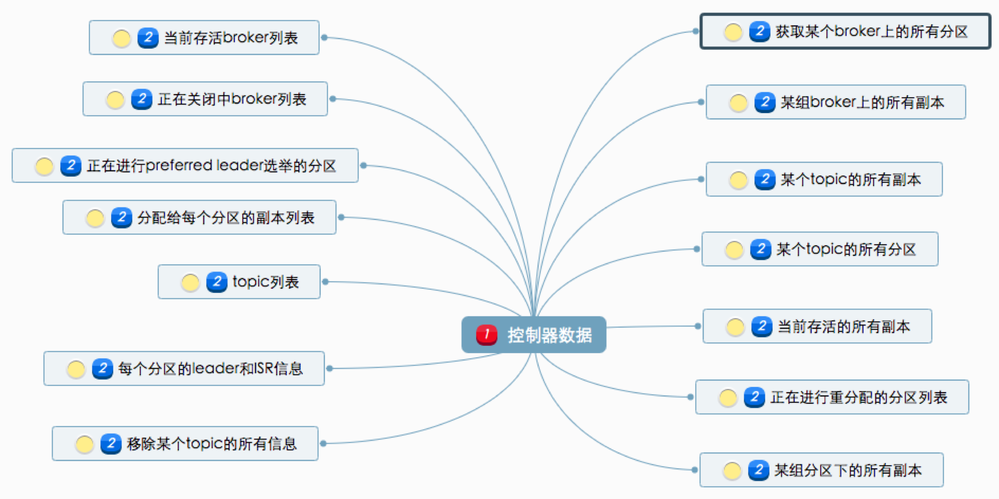

# **Chap5 Kafka 内核**

1. Kafka副本机制
2. 请求是怎么被处理
3. Kafka控制器
4. Kafka 中的高水位和 Leader Epoch 机制

## **1 Kafka副本机制**

所谓的副本机制（Replication），也可以称之为备份机制，通常是指分布式系统在多台网络互联的机器上保存有相同的数据拷贝。副本机制有什么好处呢？

* **提供数据冗余**。即使系统部分组件失效，系统依然能够继续运转，因而增加了整体可用性以及数据持久性。
* **提供高伸缩性**。支持横向扩展，能够通过增加机器的方式来提升读性能，进而提高读操作吞吐量。
* **改善数据局部性**。允许将数据放入与用户地理位置相近的地方，从而降低系统延时。

对于 Apache Kafka 而言，目前只能享受到副本机制带来的第 1 个好处，也就是提供数据冗余实现高可用性和高持久性。

### **1-1 副本定义**

Kafka 是有主题概念的，而每个主题又进一步划分成若干个分区。副本的概念实际上是在分区层级下定义的，每个分区配置有若干个副本。

**所谓副本（Replica），本质就是一个只能追加写消息的提交日志**。根据 Kafka 副本机制的定义，同一个分区下的所有副本保存有相同的消息序列，这些副本分散保存在不同的 Broker 上，从而能够对抗部分 Broker 宕机带来的数据不可用。

在实际生产环境中，**每台 Broker 都可能保存有各个主题下不同分区的不同副本**，因此，单个 Broker 上存有成百上千个副本的现象是非常正常的。

一个有 3 台 Broker 的 Kafka 集群上的副本分布情况。

从这张图中，我们可以看到，主题 1 分区 0 的 3 个副本分散在 3 台 Broker 上，其他主题分区的副本也都散落在不同的 Broker 上，从而实现数据冗余。


### 副本角色

何确保副本中所有的数据都是一致的呢？特别是对 Kafka 而言，当生产者发送消息到某个主题后，消息是如何同步到对应的所有副本中的呢？

**针对这个问题，最常见的解决方案就是采用基于领导者（Leader-based）的副本机制。Apache Kafka 就是这样的设计。**


第一，在 Kafka 中，副本分成两类：**领导者副本（Leader Replica）和追随者副本（Follower Replica）**。

每个分区在创建时都要选举一个副本，称为领导者副本，其余的副本自动称为追随者副本。

第二，Kafka 的副本机制比其他分布式系统要更严格一些。**在 Kafka 中，追随者副本是不对外提供服务的**。这就是说，任何一个追随者副本都不能响应消费者和生产者的读写请求。

所有的请求都必须由领导者副本来处理，或者说，所有的读写请求都必须发往领导者副本所在的 Broker，由该 Broker 负责处理。

`<mark>`追随者副本不处理客户端请求，**它唯一的任务就是从领导者副本异步拉取消息**，并写入到自己的提交日志中，从而实现与领导者副本的同步`</mark>`。

第三，当领导者副本挂掉了，或者说领导者副本所在的 Broker 宕机时，Kafka 依托于 ZooKeeper 提供的监控功能能够实时感知到，并立即开启新一轮的领导者选举，从追随者副本中选一个作为新的领导者。**老 Leader 副本重启回来后，只能作为追随者副本加入到集群中**。

对于客户端用户而言，Kafka 的追随者副本没有任何作用，它既不能像 MySQL 那样帮助领导者副本“抗读”，也不能实现将某些副本放到离客户端近的地方来改善数据局部性。

### 副本机制

**1.方便实现“Read-your-writes”。**

所谓 `Read-your-writes`，顾名思义就是，当你使用生产者 API 向 Kafka 成功写入消息后，马上使用消费者 API 去读取刚才生产的消息。

**2.方便实现单调读（Monotonic Reads）**。

就是对于一个消费者用户而言，在多次消费消息时，它不会看到某条消息一会儿存在一会儿不存在。

### **In-sync Replicas（ISR）**

我们刚刚反复说过，追随者副本不提供服务，只是定期地异步拉取领导者副本中的数据而已。既然是异步的，就存在着不可能与 Leader 实时同步的风险。

基于这个想法，Kafka 引入了 In-sync Replicas，也就是所谓的 ISR 副本集合。ISR 中的副本都是与 Leader 同步的副本，相反，不在 ISR 中的追随者副本就被认为是与 Leader 不同步的

### 到底什么副本能够进入到 ISR 中呢

Leader 副本天然就在 ISR 中。也就是说，ISR 不只是追随者副本集合，它必然包括 Leader 副本。甚至在某些情况下，ISR 只有 Leader 这一个副本


**标准就是 Broker 端参数 replica.lag.time.max.ms 参数值**。

这个参数的含义是 Follower 副本能够落后 Leader 副本的最长时间间隔，当前默认值是 10 秒。

这就是说，只要一个 Follower 副本落后 Leader 副本的时间不连续超过 10 秒，那么 Kafka 就认为该 Follower 副本与 Leader 是同步的，**即使此时 Follower 副本中保存的消息明显少于 Leader 副本中的消息**

Follower 副本唯一的工作就是不断地从 Leader 副本拉取消息，然后写入到自己的提交日志中。

如果这个同步过程的速度持续慢于 `Leader` 副本的消息写入速度，那么在 replica.lag.time.max.ms 时间后，此 Follower 副本就会被认为是与 Leader 副本不同步的，因此不能再放入 ISR 中。此时，Kafka 会自动收缩 ISR 集合，将该副本“踢出”ISR。

**值得注意的是，倘若该副本后面慢慢地追上了 Leader 的进度，那么它是能够重新被加回 ISR 的。这也表明，ISR 是一个动态调整的集合，而非静态不变的**

### **Unclean 领导者选举（Unclean Leader Election）**

既然 ISR 是可以动态调整的，那么自然就可以出现这样的情形

ISR 为空。因为 Leader 副本天然就在 ISR 中，如果 ISR 为空了，就说明 Leader 副本也“挂掉”了，Kafka 需要重新选举一个新的 Leader。可是 ISR 是空，此时该怎么选举新 Leader 呢？

**Kafka 把所有不在 ISR 中的存活副本都称为非同步副本**。

通常来说，非同步副本落后 Leader 太多，因此，如果选择这些副本作为新 Leader，就可能出现数据的丢失。毕竟，这些副本中保存的消息远远落后于老 Leader 中的消息。在 Kafka 中，选举这种副本的过程称为 Unclean 领导者选举。

**Broker 端参数 `unclean.leader.election.enable` 控制是否允许 Unclean 领导者选举。**

**开启 Unclean 领导者选举可能会造成数据丢失**，但好处是，它使得分区 Leader 副本一直存在，不至于停止对外提供服务，因此提升了高可用性。

反之，禁止 Unclean 领导者选举的好处在于维护了数据的一致性，避免了消息丢失，但牺牲了高可用性。

* 副本的含义：本质就是一个只能追加写消息的提交日志。
* 副本机制的3个好处：提供数据冗余；提供高 伸缩性；改善数据局部性。
* Kafka的追随者副本不对外提供服务的2点好 处：
  * 方便实现“Read-your-writes"；
  * 方便实现单调读（Monotonic Reads)。
* 判断Follower是否与Leader同步的标准： `Broker`端参数 `replica.lag.time.max.ms`的参数值

## **2 请求是怎么被处理**

无论是 Kafka 客户端还是 Broker 端，它们之间的交互都是通过“请求 / 响应”的方式完成的。

比如，客户端会通过网络发送消息生产请求给 Broker，而 Broker 处理完成后，会发送对应的响应给到客户端。

Apache Kafka 自己定义了一组请求协议，用于实现各种各样的交互操作。比如常见的 PRODUCE 请求是用于生产消息的，**FETCH 请求是用于消费消息的，METADATA 请求是用于请求 Kafka 集群元数据信息的。**

1.**顺序处理请求**。如果写成伪代码，大概是这个样子：

```
while (true) {
            Request request = accept(connection);
            handle(request);
}
```

是**吞吐量太差**。由于只能顺序处理每个请求，因此，每个请求都必须等待前一个请求处理完毕才能得到处理。这种方式只适用于请求发送非常不频繁的系统。

2.**每个请求使用单独线程处理**。也就是说，我们为每个入站请求都创建一个新的线程来异步处理

```
while (true) {
            Request = request = accept(connection);
            Thread thread = new Thread(() -> {
	handle(request);});
            thread.start();
}
```

* 这个方法反其道而行之，完全采用异步的方式。系统会为每个入站请求都创建单独的线程来处理。
* 它是完全异步的，每个请求的处理都不会阻塞下一个请求。但缺陷也同样明显。为每个请求都创建线程的做法开销极大，在某些场景下甚至会压垮整个服务。这个方法只适用于请求发送频率很低的业务场景。

### **Kafka 使用的是Reactor 模式。**

**Reactor 模式是事件驱动架构的一种实现方式，特别适合应用于处理多个客户端并发向服务器端发送请求的场景**


从这张图中，我们可以发现，多个客户端会发送请求给到 Reactor。Reactor 有个请求分发线程 Dispatcher，也就是图中的 Acceptor，它会将不同的请求下发到多个工作线程中处理。

在这个架构中，Acceptor 线程只是用于请求分发，不涉及具体的逻辑处理，非常得轻量级，因此有很高的吞吐量表现。而这些工作线程可以根据实际业务处理需要任意增减，从而动态调节系统负载能力。


Kafka 的 Broker 端有个 **SocketServer** 组件，类似于 **Reactor** 模式中的 Dispatcher，它也有对应的 Acceptor 线程和一个工作线程池，只不过在 Kafka 中，这个工作线程池有个专属的名字，叫网络线程池。

Kafka 提供了 Broker 端参数 `num.network.threads`，用于调整该网络线程池的线程数。**其默认值是 3，表示每台 Broker 启动时会创建 3 个网络线程，专门处理客户端发送的请求。**

当网络线程接收到请求后，它是怎么处理的呢


Acceptor 线程采用轮询的方式将入站请求公平地发到所有网络线程中，因此，在实际使用过程中，这些线程通常都有相同的几率被分配到待处理请求。

好了，你现在了解了客户端发来的请求会被 Broker 端的 Acceptor 线程分发到任意一个网络线程中，由它们来进行处理。那么，当网络线程接收到请求后，它是怎么处理的呢？


当网络线程拿到请求后，它不是自己处理，而是将请求放入到一个共享请求队列中。

**Broker 端还有个 IO 线程池，负责从该队列中取出请求，执行真正的处理。如果是 PRODUCE 生产请求，则将消息写入到底层的磁盘日志中；如果是 FETCH 请求，则从磁盘或页缓存中读取消息。**

IO 线程池处中的线程才是执行请求逻辑的线程。**Broker 端参数num.io.threads控制了这个线程池中的线程数。目前该参数默认值是 8，表示每台 Broker 启动后自动创建 8 个 IO 线程处理请求**。你可以根据实际硬件条件设置此线程池的个数。

机器上 CPU 资源非常充裕，你完全可以调大该参数，允许更多的并发请求被同时处理。当 IO 线程处理完请求后，会将生成的响应发送到网络线程池的响应队列中，然后由对应的网络线程负责将 Response 返还给客户端。

请求队列和响应队列的差别：**请求队列是所有网络线程共享的，而响应队列则是每个网络线程专属的**

这么设计的原因就在于，**Dispatcher 只是用于请求分发而不负责响应回传，因此只能让每个网络线程自己发送 Response 给客户端，所以这些 Response 也就没必要放在一个公共的地方**。

Purgatory 的组件。**它是用来缓存延时请求（Delayed Request）的。所谓延时请求，就是那些一时未满足条件不能立刻处理的请求**

比如设置了 `acks=all` 的 PRODUCE 请求，一旦设置了 `acks=all`，那么该请求就必须等待 ISR 中所有副本都接收了消息后才能返回，此时处理该请求的 IO 线程就必须等待其他 Broker 的写入结果. 当请求不能立刻处理时，它就会暂存在 Purgatory 中。稍后一旦满足了完成条件，IO 线程会继续处理该请求，并将 Response 放入对应网络线程的响应队列中。

### **LeaderAndIsr**

Kafka 社区把 PRODUCE 和 FETCH 这类请求称为数据类请求，把 **LeaderAndIsr、StopReplica 这类请求称为控制类请求**。

一视同仁的处理方式对控制类请求是不合理的。为什么呢？**因为控制类请求有这样一种能力：它可以直接令数据类请求失效！**

我来举个例子说明一下。**假设我们有个主题只有 1 个分区，该分区配置了两个副本，其中 Leader 副本保存在 Broker 0 上，Follower 副本保存在 Broker 1 上**。

假设 Broker 0 这台机器积压了很多的 PRODUCE 请求，此时你如果使用 Kafka 命令强制将该主题分区的 Leader、Follower 角色互换，那么 Kafka 内部的控制器组件（Controller）会发送 LeaderAndIsr 请求给 Broker 0，显式地告诉它，当前它不再是 Leader，而是 Follower 了，而 Broker 1 上的 Follower 副本因为被选为新的 Leader，因此停止向 Broker 0 拉取消息。

如果刚才积压的 PRODUCE 请求都设置了 acks=all，那么这些在 LeaderAndIsr 发送之前的请求就都无法正常完成了。**就像前面说的，它们会被暂存在 Purgatory 中不断重试，直到最终请求超时返回给客户端。**

**设想一下，如果 Kafka 能够优先处理 LeaderAndIsr 请求，Broker 0 就会立刻抛出 `NOT_LEADER_FOR_PARTITION `异常**，快速地标识这些积压 PRODUCE 请求已失败，这样客户端不用等到 Purgatory 中的请求超时就能立刻感知，从而降低了请求的处理时间。

即使 acks 不是 all，积压的 PRODUCE 请求能够成功写入 Leader 副本的日志，但处理 LeaderAndIsr 之后，Broker 0 上的 Leader 变为了 Follower 副本，也要执行显式的日志截断（Log Truncation，即原 Leader 副本成为 Follower 后，会将之前写入但未提交的消息全部删除），依然做了很多无用功。

**社区是如何解决的呢？**

Kafka Broker 启动后，会在后台分别创建网络线程池和 IO 线程池，它们分别处理数据类请求和控制类请求。至于所用的 Socket 端口，自然是使用不同的端口了，你需要提供不同的listeners 配置，显式地指定哪套端口用于处理哪类请求。

### **小结**

请求处理过程的最大意义在于，它是你日后执行 Kafka 性能优化的前提条件

* Acceptor线程：采用轮询的方式将入站请求公平地发到所有网络线程中。 网络线程池：处理数据类请求。网络线程拿到请 求后，将请求放入到共享请求队列中。
* IO线程池：处理控制类请求。从共享请求队列中 取出请求，执行真正的处理。如果是PRODUCE 生产请求，则将消息写入到底层的磁盘日志中； 如果是FETCH请求，则从磁盘或页缓存中读取消 息。
* Purgatory组件：用来缓存延时请求。延时请求 就是那些一时未满足条件不能立刻处理的请求。

## **3 Kafka控制器**

**控制器组件（Controller），是 Apache Kafka 的核心组件。它的主要作用是在 Apache ZooKeeper 的帮助下管理和协调整个 Kafka 集群。**

集群中任意一台 Broker 都能充当控制器的角色，但是，在运行过程中，只能有一个 Broker 成为控制器，行使其管理和协调的职责。

换句话说，每个正常运转的 Kafka 集群，在任意时刻都有且只有一个控制器。官网上有个名为 activeController 的 JMX 指标，可以帮助我们实时监控控制器的存活状态。这个 JMX 指标非常关键，你在实际运维操作过程中，一定要实时查看这个指标的值。

**控制器是重度依赖 ZooKeeper 的**

**Apache ZooKeeper 是一个提供高可靠性的分布式协调服务框架**。它使用的数据模型类似于文件系统的树形结构，根目录也是以 `“/”`开始。该结构上的每个节点被称为 znode，用来保存一些元数据协调信息。

* **如果以 znode 持久性来划分，znode 可分为持久性 znode 和临时 znode**。
* 持久性 znode 不会因为 ZooKeeper 集群重启而消失，而临时 znode 则与创建该 znode 的 ZooKeeper 会话绑定，一旦会话结束，该节点会被自动删除。
* **ZooKeeper 赋予客户端监控 znode 变更的能力，即所谓的 Watch 通知功能**。
* 一旦 znode 节点被创建、删除，子节点数量发生变化，抑或是 znode 所存的数据本身变更，ZooKeeper 会通过节点变更监听器 (ChangeHandler) 的方式显式通知客户端。

依托于这些功能，ZooKeeper 常被用来实现**集群成员管理、分布式锁、领导者选举等功能**。Kafka 控制器大量使用 Watch 功能实现对集群的协调管理。


### **控制器是如何被选出来的？**

实际上，Broker 在启动时，会尝试去 ZooKeeper 中创建 /controller 节点。Kafka 当前选举控制器的规则是：**第一个成功创建 /controller 节点的 Broker 会被指定为控制器**。

### **控制器是做什么的？**

* **主题管理（创建、删除、增加分区）**

这里的主题管理，就是指控制器帮助我们完成对 Kafka 主题的创建、删除以及分区增加的操作。换句话说，当我们执行**kafka-topics 脚本**时，大部分的后台工作都是控制器来完成的。

* **分区重分配**

分区重分配主要是指，**kafka-reassign-partitions** 脚本提供的对已有主题分区进行细粒度的分配功能。这部分功能也是控制器实现的。

* **Preferred 领导者选举**

Preferred 领导者选举主要是 Kafka 为了避免部分 Broker 负载过重而提供的一种换 Leader 的方案。

* **集群成员管理（新增 Broker、Broker 主动关闭、Broker 宕机）**

这是控制器提供的第 4 类功能，**包括自动检测新增 Broker、Broker 主动关闭及被动宕机**。这种自动检测是依赖于前面提到的 Watch 功能和 ZooKeeper 临时节点组合实现的。

比如，控制器组件会利用Watch 机制检查 ZooKeeper 的 `/brokers/ids` 节点下的子节点数量变更。

目前，**当有新 Broker 启动后**，它会在 `/brokers` 下创建专属的 znode 节点。一旦创建完毕，ZooKeeper 会通过 Watch 机制将消息通知推送给控制器，这样，控制器就能自动地感知到这个变化，进而开启后续的新增 Broker 作业。

侦测 Broker 存活性则是依赖于刚刚提到的另一个机制：临时节点。

每个 Broker 启动后，会在 `/brokers/ids` 下创建一个临时 `znode`。

当 Broker 宕机或主动关闭后，该 Broker 与 ZooKeeper 的会话结束，这个 znode 会被自动删除。

同理，ZooKeeper 的 Watch 机制将这一变更推送给控制器，这样控制器就能知道有 Broker 关闭或宕机了，从而进行“善后”。

* **数据服务**

控制器的最后一大类工作，就是向其他 Broker 提供数据服务。控制器上保存了最全的集群元数据信息，其他所有 Broker 会定期接收控制器发来的元数据更新请求，从而更新其内存中的缓存数据。

### **控制器保存了什么数据？**



* **所有主题信息**。
  * 包括具体的**分区信息，比如领导者副本是谁，ISR 集合中有哪些副本等**。
* **所有 Broker 信息**。
  * 包括当前都有**哪些运行中的 Broker，哪些正在关闭中的 Broker 等**。
* **所有涉及运维任务的分区**。
  * 包括当前正在进行 Preferred 领导者选举以及分区重分配的分区列表。

值得注意的是，这些数据其实在 ZooKeeper 中也保存了一份。每当控制器初始化时，它都会从 ZooKeeper 上读取对应的元数据并填充到自己的缓存中。有了这些数据，控制器就能对外提供数据服务了

**这里的对外主要是指对其他 Broker 而言，控制器通过向这些 Broker 发送请求的方式将这些数据同步到其他 Broker 上**

### **控制器故障转移（Failover）**

在 Kafka 集群运行过程中，只能有一台 Broker 充当控制器的角色，那么这就存在**单点失效（Single Point of Failure）的风险**，Kafka 是如何应对单点失效的呢？

**答案就是，为控制器提供故障转移功能，也就是说所谓的 Failover。**

**故障转移指的是，当运行中的控制器突然宕机或意外终止时，Kafka 能够快速地感知到，并立即启用备用控制器来代替之前失败的控制器** 这个过程就被称为 Failover，该过程是自动完成的，无需你手动干预。


* 最开始时，Broker 0 是控制器。
* 当 Broker 0 宕机后，**ZooKeeper 通过 Watch 机制感知到并删除了 ` /controller` 临时节点**。
* 之后，**所有存活的 Broker 开始竞选新的控制器身份。Broker 3 最终赢得了选举，成功地在 ZooKeeper 上重建了 `/controller` 节点。**
* 之后，Broker 3 会从 ZooKeeper 中读取集群元数据信息，并初始化到自己的缓存中。
* 至此，**控制器的 Failover 完成，可以行使正常的工作职责了**。

### **控制器内部设计原理**

社区于 0.11 版本重构了控制器的底层设计，**最大的改进就是，把多线程的方案改成了单线程加事件队列的方案。**


社区引入了一个事件处理线程，**统一处理各种控制器事件**，然后控制器将原来执行的操作全部建模成一个个独立的事件，发送到专属的事件队列中，供此线程消费。这就是所谓的单线程 + 队列的实现方式。

针对控制器的第二个改进就是，**将之前同步操作 ZooKeeper 全部改为异步操作。**ZooKeeper 本身的 API 提供了同步写和异步写两种方式。之前控制器操作 ZooKeeper 使用的是同步的 API，性能很差，集中表现为，**当有大量主题分区发生变更时，ZooKeeper 容易成为系统的瓶颈**

举个简单的例子，假设我们删除了某个主题，那么控制器就会给该主题所有副本所在的 Broker 发送一个名为StopReplica的请求。如果此时 Broker 上存有大量积压的 Produce 请求，那么这个 StopReplica 请求只能排队等。

如果这些 Produce 请求就是要向该主题发送消息的话，这就显得很讽刺了：主题都要被删除了，处理这些 Produce 请求还有意义吗？此时最合理的处理顺序应该是，**赋予 StopReplica 请求更高的优先级，使它能够得到抢占式的处理。**

### **小结**

**`<mark>`当你觉得控制器组件出现问题时，比如主题无法删除了，或者重分区 hang 住了，你不用重启 Kafka Broker 或控制器`</mark>`**

有一个简单快速的方式是，**去 ZooKeeper 中手动删除 /controller 节点。具体命令是 rmr /controller**。这样做的好处是，**既可以引发控制器的重选举，又可以避免重启 Broker 导致的消息处理中断**。

* 在集群运行过程中，控制器只能有一个。Kafka提供了一个 重要的JMX指标 `activeController`,帮你监控此事。
  * 无论何时，如果你发现该值大于1，要赶快处理，因为，这通常都预示着集群出现了如“脑裂”这样的严重问题。
* 控制器组件或代码在每台Broker上都存在，在Broker启动过程中，所有Broker都会去“抢”当控制器。
* 控制器的5种职贵：
  * 主题管理；
  * 分区重分配；
  * Preferred领导者选举；
  * 集群成员管理；数据服务。
* **Kafka提供了控制器Failover机制，可以自动地侦测控制器生存状态，并进行必要的选举**。
* **控制器之前是多线程设计，自0.11版本开始改为单线程加事件队列的方案，规避了多线程之间的线程同步开销**。

## **4 Kafka 中的高水位和 Leader Epoch 机制**

水位是一个单调增加且表征最早未完成工作（oldest work not yet completed）的时间戳。


图中标注“Completed”的蓝色部分代表已完成的工作，标注“In-Flight”的红色部分代表正在进行中的工作，两者的边界就是水位线。

在 Kafka 的世界中，水位的概念有一点不同。

**Kafka 的水位不是时间戳，更与时间无关**。它是和位置信息绑定的，具体来说，**它是用消息位移来表征的**。

* 另外，Kafka 源码使用的表述是高水位，因此，今天我也会统一使用“高水位”或它的缩写 HW 来进行讨论。值
* 得注意的是，Kafka 中也有低水位（Low Watermark），它是与 Kafka 删除消息相关联的概念

### **高水位的作用**

在 Kafka 中，高水位的作用主要有 2 个。

* 定义消息可见性，即用来标识分区下的哪些消息是可以被消费者消费的。
* 帮助 Kafka 完成副本同步。

位移值等于高水位的消息也属于未提交消息。也就是说，高水位上的消息是不能被消费者消费的。


在分区高水位以下的消息被认为是已提交消息，反之就是未提交消息。消费者只能消费已提交消息，它依靠一个名为 LSO（Log Stable Offset）的位移值来判断事务型消费者的可见性。

**位移值等于高水位的消息也属于未提交消息。也就是说，高水位上的消息是不能被消费者消费的。**

它依靠一个名为 LSO（Log Stable Offset）的位移值来判断事务型消费者的可见性。

有一个日志末端位移的概念，即 Log End Offset，简写是 LEO。它表示副本写入下一条消息的位移值。 **同一个副本对象，其高水位值不会大于 LEO 值。**

**高水位和 LEO 是副本对象的两个重要属性**。Kafka 所有副本都有对应的高水位和 LEO 值，而不仅仅是 Leader 副本。只不过 Leader 副本比较特殊，Kafka 使用 Leader 副本的高水位来定义所在分区的高水位。**换句话说，分区的高水位就是其 Leader 副本的高水位。**

* 高水位的2个主要作用：定义消息可见性 Kafka完成副本同步。
* 在分区高水位以下的消息被认为是已提交； 反之就是未提交消息，消费者只能消费已提交消息。
* 日志末端位移（LEO)：表示副本写入下一条消息的位移值。
  帮助 肖息
* Leader Epoch：我们大致可以认为是Leader版本。 它由两部分数据组成。一个是Epoch，一个单调增加的版本号。每当副本领导权发生变更时，都会增加该版本号。
  * **小版本号的Leader被认为是过期 Leader**。
  * **另一个是起始位移，Leader副本在该 Epoch值上写入的首条消息的位移**。

## **5 消费者组重平衡全流程**

* **重平衡的3个触发条件**：
	* 组成员数虽发生变化； 
	* 订阅主题数量发生变化；
	* 订阅主题的分区数发生变化。 
* Kafka为消费者组定义的5种状态：**Empty, Dead. PreparingRebalance、CompletingRebalance和 Stable**。 
* 一消费者端的重平衡的2个步骤：
	* 加入组和等待领导者消费者分配方案。
	* **这2个步骤分别对应`JoiniGroup`请求和`SyncGroup`请求**。 
* 协调者端处理重平衡的4个场景：
	* 新成员入组；
	* 组成员主动离组；
	* 组成员崩溃离组；
	* 重平衡时协调者对组内成员提交位移的处理。 
