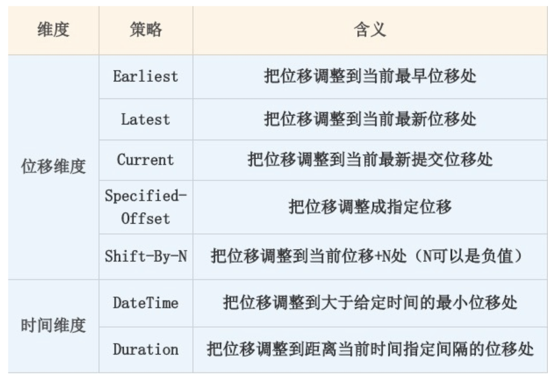

# **Chap6 Kafka 管理&工具脚本**

## **1 主题管理**

### **1-1 主题日常管理**

**如何使用命令创建 Kafka 主题。**

Kafka 提供了自带的 kafka-topics 脚本，用于帮助用户创建主题。

* 该脚本文件位于 Kafka 安装目录的 bin 子目录下。
* 如果你是在 Windows 上使用 Kafka，那么该脚本位于 bin 路径的 windows 子目录下。

一个典型的创建命令如下：

```
bin/kafka-topics.sh --bootstrap-server broker_host:port --create --topic my_topic_name  --partitions 1 --replication-factor 1
```

create 表明我们要创建主题，**而 partitions 和 replication factor 分别设置了主题的分区数以及每个分区下的副本数**

**从 Kafka 2.2 版本开始，社区推荐用 `--bootstrap-server` 参数替换 `--zookeeper` 参数，并且显式地将后者标记为“已过期”，因此，如果你已经在使用 2.2 版本了，那么创建主题请指定` --bootstrap-server` 参数**。

社区推荐使用 `--bootstrap-serve`r 而非 `--zookeeper` 的原因主要有两个。

* 使用 `--zookeeper` 会绕过 Kafka 的安全体系。
	* 这就是说，即使你为 Kafka 集群设置了安全认证，限制了主题的创建，如果你使用 `--zookeeper` 的命令，依然能成功创建任意主题，不受认证体系的约束
* 使用 `--bootstrap-server` 与集群进行交互，越来越成为使用 Kafka 的标准姿势。

**查询所有主题的列表**

```
bin/kafka-topics.sh --bootstrap-server broker_host:port --list
```

如果要查询单个主题的详细数据。

```
bin/kafka-topics.sh --bootstrap-server broker_host:port --describe --topic <topic_name>
```

如果 describe 命令不指定具体的主题名称，那么 Kafka 默认会返回所有“可见”主题的详细数据给你。

**是指发起这个命令的用户能够看到的 Kafka 主题**

* 如果指定了 `--bootstrap-server`，那么这条命令就会受到安全认证体系的约束，即对命令发起者进行权限验证，然后返回它能看到的主题。

* 否则，如果指定 `--zookeeper `参数，那么默认会返回集群中所有的主题详细数据。


**基于这些原因，我建议你最好统一使用 `--bootstrap-server` 连接参数**


**Kafka 中涉及到主题变更的地方有 5 处**。

**1. 修改主题分区**。

其实就是增加分区，**目前 `Kafka` 不允许减少某个主题的分区数**。你可以使用 `kafka-topics` 脚本，结合 `--alter` 参数来增加某个主题的分区数，命令如下：

```
bin/kafka-topics.sh --bootstrap-server broker_host:port --alter --topic <topic_name> --partitions < 新分区数 >
```

这里要注意的是，你指定的分区数一定要比原有分区数大，否则 Kafka 会抛出 InvalidPartitionsException 异常。

**2. 修改主题级别参数。**

在主题创建之后，可以使用 kafka-configs 脚本修改对应的参数。

假设我们要设置主题级别参数 max.message.bytes，那么命令如下：

```
bin/kafka-configs.sh --zookeeper zookeeper_host:port --entity-type topics --entity-name <topic_name> --alter --add-config max.message.bytes=10485760
```

**3. 变更副本数**

使用自带的 `kafka-reassign-partitions `脚本，帮助我们增加主题的副本数。

**4. 修改主题限速**

**这里主要是指设置 Leader 副本和 Follower 副本使用的带宽**

有时候，我们想要让某个主题的副本在执行副本同步机制时，不要消耗过多的带宽。Kafka 提供了这样的功能。

假设我有个主题，名为 test，让该主题各个分区的 Leader 副本和 Follower 副本在处理副本同步时，不得占用超过 100MBps 的带宽。注意是大写 B，即每秒不超过 100MB

要达到这个目的，我们必须先设置 Broker 端参数 `leader.replication.throttled.rate` 和 `follower.replication.throttled.rate`，命令如下：

```
bin/kafka-configs.sh --zookeeper zookeeper_host:port --alter --add-config 'leader.replication.throttled.rate=104857600,follower.replication.throttled.rate=104857600' --entity-type brokers --entity-name 0
```

这条命令结尾处的 `--entity-name` 就是 `Broker ID`。倘若该主题的副本分别在 0、1、2、3 多个 Broker 上，那么你还要依次为 Broker 1、2、3 执行这条命令。

设置好这个参数之后，我们还需要为该主题设置要限速的副本。在这个例子中，我们想要为所有副本都设置限速，因此统一使用通配符 `*` 来表示，命令如下：

```
bin/kafka-configs.sh --zookeeper zookeeper_host:port --alter --add-config 'leader.replication.throttled.replicas=*,follower.replication.throttled.replicas=*' --entity-type topics --entity-name test
```

**5. 主题分区迁移**。

同样是使用 `kafka-reassign-partitions` 脚本，对主题各个分区的副本进行“手术”般的调整，比如把某些分区批量迁移到其他 Broker 上。这


何删除主题

```
bin/kafka-topics.sh --bootstrap-server broker_host:port --delete  --topic <topic_name>
```

删除主题的命令并不复杂，关键是删除操作是异步的，执行完这条命令不代表主题立即就被删除了。它仅仅是被标记成“已删除”状态而已

### **1-2 特殊主题管理与运维**

**`__consumer_offsets` 的副本数问题**

0.11 之后，Kafka 会严格遵守 `offsets.topic.replication.factor` 值。**如果当前运行的 Broker 数量小于 `offsets.topic.replication.factor` 值，Kafka 会创建主题失败，并显式抛出异常。**

那么，如果该主题的副本值已经是 1 了，我们能否把它增加到 3 呢？

第 1 步是创建一个 json 文件，显式提供 50 个分区对应的副本数。注意，replicas 中的 3 台 Broker 排列顺序不同，目的是将 Leader 副本均匀地分散在 Broker 上。该文件具体格式如下：

```
{"version":1, "partitions":[
 {"topic":"__consumer_offsets","partition":0,"replicas":[0,1,2]}, 
  {"topic":"__consumer_offsets","partition":1,"replicas":[0,2,1]},
  {"topic":"__consumer_offsets","partition":2,"replicas":[1,0,2]},
  {"topic":"__consumer_offsets","partition":3,"replicas":[1,2,0]},
  ...
  {"topic":"__consumer_offsets","partition":49,"replicas":[0,1,2]}
]}`
```


第 2 步是执行 `kafka-reassign-partitions` 脚本，命令如下：

```
bin/kafka-reassign-partitions.sh --zookeeper zookeeper_host:port --reassignment-json-file reassign.json --execute
```

除了修改内部主题，可能还想查看这些内部主题的消息内容。


特别是对于 `__consumer_offsets` 而言，由于它保存了消费者组的位移数据，有时候直接查看该主题消息是很方便的事情。


**下面的命令可以帮助我们直接查看消费者组提交的位移数据**

```
bin/kafka-console-consumer.sh --bootstrap-server kafka_host:port --topic __consumer_offsets --formatter "kafka.coordinator.group.GroupMetadataManager\$OffsetsMessageFormatter" --from-beginning
```

**除了查看位移提交数据，还可以直接读取该主题消息，查看消费者组的状态信息**。

```
bin/kafka-console-consumer.sh --bootstrap-server kafka_host:port --topic __consumer_offsets --formatter "kafka.coordinator.group.GroupMetadataManager\$GroupMetadataMessageFormatter" --from-beginning
```

对于内部主题 `__transaction_state` 而言，方法是相同的。你只需要指定 `kafka.coordinator.transaction.TransactionLog$TransactionLogMessageFormatte` 即可。

### **1-3 常见主题错误处理**

**常见错误 1：主题删除失败。**

**实际上，造成主题删除失败的原因有很多，最常见的原因有两个：副本所在的 Broker 宕机了；待删除主题的部分分区依然在执行迁移过程。**

如果是因为前者，通常你重启对应的 Broker 之后，删除操作就能自动恢复；如果是因为后者，那就麻烦了，很可能两个操作会相互干扰。

一旦你碰到主题无法删除的问题，可以采用这样的方法：

* 第 1 步，手动删除 ZooKeeper 节点 `/admin/delete_topics` 下以待删除主题为名的 znode。
* 第 2 步，手动删除该主题在磁盘上的分区目录。
* 第 3 步，在 ZooKeeper 中执行 `rmr /controller`，触发 Controller 重选举，刷新 Controller 缓存

在执行最后一步时，你一定要谨慎，因为它可能造成大面积的分区 Leader 重选举。**事实上，仅仅执行前两步也是可以的，只是 Controller 缓存中没有清空待删除主题罢了，也不影响使用**。

**常见错误 2：`__consumer_offsets` 占用太多的磁盘。**

一旦你发现这个主题消耗了过多的磁盘空间，那么，你一定要显式地用jstack 命令查看一下 `kafka-log-cleaner-thread` 前缀的线程状态。

通常情况下，这都是因为该线程挂掉了，无法及时清理此内部主题。倘若真是这个原因导致的，那我们就只能重启相应的 Broker 了


### **Kafka 主题日常管理的“增删改查”** 

* 增：Kafka提供了自带的`kafka-topics`脚本，用于帮助用户创建主题
*  删：命令并不复杂，关健是删除操作是异步的，执行完这条 命令不代表主题立即就被删除了。 
*  改：修改主题分区；修改主题级别参数；变更副本数；修改主题限速；主题分区迁移。
*  查：查询所有主题的列表；查询单个主题的详细数据

**特殊主题管理与运维**

* 主要是内部主题`__consumer_offsets`和`__transaction_state`: 

**常见主题错误** 

* 主题侧除失败
* `__consumer_offsets`占用太多的磁盘

## **2 Kafka动态配置**

### **什么是动态 Broker 参数配置？**

在 Kafka 安装目录的 config 路径下，有个 `server.properties` 文件。

社区于 1.1.0 版本中正式引入了动态 Broker 参数（Dynamic Broker Configs）。

**所谓动态，就是指修改参数值后，无需重启 Broker 就能立即生效，而之前在 `server.properties` 中配置的参数则称为静态参数（Static Configs）**。

如果你打开 1.1 版本之后（含 1.1）的 Kafka 官网，你会发现Broker Configs表中增加了 Dynamic Update Mode 列。该列有 3 类值，分别是 `read-only`、`per-broker` 和 `cluster-wide`。


* `read-only`。被标记为 read-only 的参数和原来的参数行为一样，只有重启 Broker，才能令修改生效。
* `per-broker`。被标记为 per-broker 的参数属于动态参数，修改它之后，只会在对应的 Broker 上生效。
* `cluster-wide`。被标记为 cluster-wide 的参数也属于动态参数，修改它之后，会在整个集群范围内生效，也就是说，对所有 Broker 都生效。你也可以为具体的 Broker 修改 cluster-wide 参数。


我来举个例子说明一下 per-broker 和 cluster-wide 的区别。

* Broker 端参数 listeners 是一个 `per-broker` 参数，这表示你只能为单个 Broker 动态调整 listeners，而不能直接调整一批 Broker 的 listeners。
	* `log.retention.ms `参数是 cluster-wide 级别的，Kafka 允许为集群内所有 Broker 统一设置一个日志留存时间值。当然了，你也可以为单个 Broker 修改此值。
* **`log.retention.ms` 参数是 `cluster-wide` 级别的，Kafka 允许为集群内所有 Broker 统一设置一个日志留存时间值**。当然了，你也可以为单个 Broker 修改此值。

### **使用场景**

实际上，因为不必重启 Broker，动态 Broker 参数的使用场景非常广泛，通常包括但不限于以下几种：

* 动态调整 Broker 端各种线程池大小，实时应对突发流量。
* 动态调整 Broker 端连接信息或安全配置信息。
* 动态更新 SSL Keystore 有效期。
* 动态调整 Broker 端 Compact 操作性能。
* 实时变更 JMX 指标收集器 (JMX Metrics Reporter)。

在这些使用场景中，动态调整线程池大小应该算是最实用的功能了。很多时候，当 Kafka Broker 入站流量（inbound data）激增时，会造成 Broker 端请求积压（Backlog）。有了动态参数，我们就能够动态增加网络线程数和 I/O 线程数，快速消耗一些积压。

### **如何配置？**


如何配置动态 Broker 参数。目前，设置动态参数的工具行命令只有一个，那就是 Kafka 自带的 `kafka-configs `脚本。接下来，以 `unclean.leader.election.enable` 参数为例，演示一下如何动态调整。

下面这条命令展示了如何在集群层面设置全局值，即设置 `cluster-wide` 范围值。

```
$ bin/kafka-configs.sh --bootstrap-server kafka-host:port --entity-type brokers --entity-default --alter --add-config unclean.leader.election.enable=true
Completed updating default config for brokers in the cluster,
```

总体来说命令很简单，但有一点需要注意。**如果要设置 cluster-wide 范围的动态参数，需要显式指定 entity-default**。现在，我们使用下面的命令来查看一下刚才的配置是否成功。

总体来说命令很简单，但有一点需要注意。如果要设置 cluster-wide 范围的动态参数，需要显式指定 entity-default。

现在，我们使用下面的命令来查看一下刚才的配置是否成功。

```
$ bin/kafka-configs.sh --bootstrap-server kafka-host:port --entity-type brokers --entity-default --describe
Default config for brokers in the cluster are:
  unclean.leader.election.enable=true sensitive=false synonyms={DYNAMIC_DEFAULT_BROKER_CONFIG:unclean.leader.election.enable=true}
 ```
 
从输出来看，我们成功地在全局层面上设置该参数值为 true。注意 `sensitive=false` 的字眼，它表明我们要调整的参数不是敏感数据。如果我们调整的是类似于密码这样的参数时，该字段就会为 true，表示这属于敏感数据。

**调整完 `cluster-wide `范围的参数，我来演示下如何设置 per-broker 范围参数。我们还是以 `unclean.leader.election.enable` 参数为例，我现在为 ID 为 1 的 Broker 设置一个不同的值**。命令如下

```
$ bin/kafka-configs.sh --bootstrap-server kafka-host:port --entity-type brokers --entity-name 1 --alter --add-config unclean.leader.election.enable=false
Completed updating config for broker: 1.
```

同样，我们使用下列命令，来查看一下刚刚的设置是否生效了。

```
$ bin/kafka-configs.sh --bootstrap-server kafka-host:port --entity-type brokers --entity-name 1 --describe
Configs for broker 1 are:
  unclean.leader.election.enable=false sensitive=false synonyms={DYNAMIC_BROKER_CONFIG:unclean.leader.election.enable=false, DYNAMIC_DEFAULT_BROKER_CONFIG:unclean.leader.election.enable=true, DEFAULT_CONFIG:unclean.leader.election.enable=false}
```

* 在 Broker 1 层面上，该参数被设置成了 false，这表明命令运行成功了。
* 从倒数第二行可以看出，在全局层面上，该参数值依然是 true。这表明，我们之前设置的 cluster-wide 范围参数值依然有效。


如果我们要删除 cluster-wide 范围参数或 per-broker 范围参数，也非常简单，分别执行下面的命令就可以了。

```
# 删除 cluster-wide 范围参数
$ bin/kafka-configs.sh --bootstrap-server kafka-host:port --entity-type brokers --entity-default --alter --delete-config unclean.leader.election.enable
Completed updating default config for brokers in the cluster,
# 删除 per-broker 范围参数
$ bin/kafka-configs.sh --bootstrap-server kafka-host:port --entity-type brokers --entity-name 1 --alter --delete-config unclean.leader.election.enable
Completed updating config for broker: 1.
```


**删除动态参数要指定 delete-config**。当我们删除完动态参数配置后，再次运行查看命令，结果如下：

```
# 查看 cluster-wide 范围参数
$ bin/kafka-configs.sh --bootstrap-server kafka-host:port  --entity-type brokers --entity-default --describe
Default config for brokers in the cluster are:
# 查看 Broker 1 上的动态参数配置
$ bin/kafka-configs.sh --bootstrap-server kafka-host:port  --entity-type brokers --entity-name 1 --describe
Configs for broker 1 are:
```

此时，刚才配置的所有动态参数都已经被成功移除了。

```
For entity-type 'brokers':
	log.message.timestamp. type
	ssl.client.auth
	log.retention.ms
	sasl.login.refresh.window.jitter
	sasl.kerberos.ticket.renew.window.
	factor
	log.preallocate
	log.index.size.max.bytes
	sasl.login.refresh.window. factor
	ssl.truststore.type
	ssl.keymanager.algorithm
	log.cleaner.io.buffer.load.factor
	sasl.login.refresh.min.period.seconds
	ssl.key.password
	background. threads
	log.retention.bytes
	ssl.trustmanager.algorithm
	log.segment.bytes
	max.connections.per.ip.overrides
	log.cleaner.delete.retention.ms
	log.segment.delete.delay.ms
	min.insync.replicas
	ssl.keystore.location
	ssl.cipher.suites
	log.roll.jitter.ms
	log.cleaner.backoff.ms
	sasl.jaas.config
	principal.builder.class
	log.flush. interval.ms
	log.cleaner.dedupe.buffer.size
	loq.flush.interval.messages
	advertised.listeners
	num.io.threads
	listener.security.protocol.map
	log.message. downconversion. enable
	sasl.enabled.mechanisms
	sasl.login.refresh.buffer.seconds
	ssl.truststore.password
	listeners
	metric.reporters
	ssl.protocol
	sasl.kerberos.ticket.renew.jitter
	ssl.keystore.password
	sasl.mechanism.inter.broker.protocol
	log.cleanup.policy
	sasl.kerberos.principal.to.local.rules
	sasl.kerberos.min.time.before.relogin
	num.recovery.threads.per.data.dir
	log.cleaner.io.max.bytes.per.second
	log.roll.ms
	ssl.endpoint. identification.algorithm
	unclean.leader.election.enable
	message.max.bytes
	log.cleaner. threads
	log.cleaner.io.buffer.size
	max.connections.per.ip
	sasl.kerberos.service.name
	ssl.provider
	follower.replication.throttled.rate
	log.index.interval.bytes
	log.cleaner.min.compaction.lag.ms
	log.message.timestamp.difference.max.ms
	ssl.enabled.protocols
	log.cleaner.min.cleanable.ratio
	replica.alter.log.dirs.io.max.bytes.
	per.second
	ssl. keystore.type
	ssl.secure.random. implementation
	ssl.truststore.location
	sasl.kerberos.kinit.cmd
	leader.replication.throttled.rate
	num.network.threads
	compression.type
	num.replica.fetchers
```

**1.log.retention.ms。**

修改日志留存时间应该算是一个比较高频的操作，毕竟，我们不可能完美地预估所有业务的消息留存时长。虽然该参数有对应的主题级别参数可以设置，但拥有在全局层面上动态变更的能力，依然是一个很好的功能亮点。

**2.num.io.threads 和 num.network.threads。**

这是我们在前面提到的两组线程池。就我个人而言，我觉得这是动态 Broker 参数最实用的场景了。毕竟，在实际生产环境中，Broker 端请求处理能力经常要按需扩容。如果没有动态 Broker 参数，我们是无法做到这一点的。

**3. 与 SSL 相关的参数**。

主要是 4 个参数（ssl.keystore.type、ssl.keystore.location、ssl.keystore.password 和 ssl.key.password）。允许动态实时调整它们之后，我们就能创建那些过期时间很短的 SSL 证书。每当我们调整时，Kafka 底层会重新配置 Socket 连接通道并更新 Keystore。新的连接会使用新的 Keystore，阶段性地调整这组参数，有利于增加安全性。

**4.num.replica.fetchers。**

最实用的动态 Broker 参数之一。Follower 副本拉取速度慢，在线上 Kafka 环境中一直是一个老大难的问题。针对这个问题，常见的做法是增加该参数值，确保有充足的线程可以执行 Follower 副本向 Leader 副本的拉取。现在有了动态参数，你不需要再重启 Broker，就能立即在 Follower 端生效，因此我说这是很实用的应用场景。

### **小结**

**动态Broker参数**

指修改参数值后，无需重启Brolser就能立即生效。

**动态Broker参数常见的5种使用场景**

* 动态调整Broker端各种线程池大小，实时应对突发流量。
* 动态调整Broker端连接信总或安全配置信息。
* 动态更新SSL Keystore有效期。
* 实时变更JMX指标收集器。


**有较大几率被动态调整值的参数**

* `log.retention.ms`
* `num.io.threads` 和 `num.network.threads`
* 与SSL相关的參数。
* `num.replica.fetchers`


## **3 重设消费者组位移**

### **为什么要重设消费者组位移？**

Kafka 和传统的消息引擎在设计上是有很大区别的，其中一个比较显著的区别就是，**Kafka 的消费者读取消息是可以重演的（replayable）**。

**<mark>像 RabbitMQ 或 ActiveMQ 这样的传统消息中间件，它们处理和响应消息的方式是破坏性的（destructive），即一旦消息被成功处理，就会被从 Broker 上删除。</mark>**

<mark>反观 Kafka，由于它是基于日志结构（log-based）的消息引擎，消费者在消费消息时，**仅仅是从磁盘文件上读取数据而已，是只读的操作，因此消费者不会删除消息数据</mark>**。

同时，由于位移数据是由消费者控制的，因此它能够很容易地修改位移的值，实现重复消费历史数据的功能。

* 如果在你的场景中，消息处理逻辑非常复杂，处理代价很高，同时你又不关心消息之间的顺序，那么传统的消息中间件是比较合适的；
* 反之，如果你的场景需要较高的吞吐量，但每条消息的处理时间很短，同时你又很在意消息的顺序，此时，Kafka 就是你的首选。

### **重设位移策略**

* 位移维度。这是指根据位移值来重设。也就是说，直接把消费者的位移值重设成我们给定的位移值。
* 时间维度。我们可以给定一个时间，让消费者把位移调整成大于该时间的最小位移；也可以给出一段时间间隔，比如 30 分钟前，然后让消费者直接将位移调回 30 分钟之前的位移值。



### Earliest

Earliest 策略表示将位移调整到主题当前最早位移处。这个最早位移不一定就是 0，因为在生产环境中，很久远的消息会被 Kafka 自动删除，所以当前最早位移很可能是一个大于 0 的值。

**如果你想要重新消费主题的所有消息，那么可以使用 Earliest 策略。**

### Latest

Latest 策略表示把位移重设成最新末端位移。如果你总共向某个主题发送了 15 条消息，那么最新末端位移就是 15。

**如果你想跳过所有历史消息，打算从最新的消息处开始消费的话，可以使用 Latest 策略。**

### Current

**Current 策略表示将位移调整成消费者当前提交的最新位移**。有时候你可能会碰到这样的场景：你修改了消费者程序代码，并重启了消费者，结果发现代码有问题，你需要回滚之前的代码变更，同时也要把位移重设到消费者重启时的位置，那么，Current 策略就可以帮你实现这个功能。


### **Specified-Offset 策略则是比较通用的策略**，

**表示消费者把位移值调整到你指定的位移处。这个策略的典型使用场景是，消费者程序在处理某条错误消息时，你可以手动地“跳过”此消息的处理**。

在实际使用过程中，**可能会出现 corrupted 消息无法被消费的情形，此时消费者程序会抛出异常，无法继续工作。一旦碰到这个问题，你就可以尝试使用 Specified-Offset 策略来规避**。

### **`Shift-By-N`**

 Specified-Offset 策略要求你指定位移的绝对数值的话，那么 Shift-By-N 策略指定的就是位移的相对数值，即你给出要跳过的一段消息的距离即可。这里的“跳”是双向的，你既可以向前“跳”，也可以向后“跳”。比如，你想把位移重设成当前位移的前 100 条位移处，此时你需要指定 N 为 -100。
 
 
### **时间维度重设位移的 DateTime 和 Duration 策略**

DateTime 允许你指定一个时间，然后将位移重置到该时间之后的最早位移处。**常见的使用场景是，你想重新消费昨天的数据，那么你可以使用该策略重设位移到昨天 0 点**。

Duration 策略则是指给定相对的时间间隔，然后将位移调整到距离当前给定时间间隔的位移处，具体格式是 PnDTnHnMnS 它就是一个符合 ISO-8601 规范的 Duration 格式，以字母 P 开头，后面由 4 部分组成，即 D、H、M 和 S，分别表示天、小时、分钟和秒。举个例子，如果你想将位移调回到 15 分钟前，那么你就可以指定 PT0H15M0S。

### **消费者 API 方式设置**

通过 Java API 的方式来重设位移，你需要调用 KafkaConsumer 的 seek 方法，或者是它的变种方法 seekToBeginning 和 seekToEnd。我们来看下它们的方法签名。

```
void seek(TopicPartition partition, long offset);
void seek(TopicPartition partition, OffsetAndMetadata offsetAndMetadata);
void seekToBeginning(Collection<TopicPartition> partitions);
void seekToEnd(Collection<TopicPartition> partitions);
```

根据方法的定义，我们可以知道，每次调用 seek 方法只能重设一个分区的位移。

`OffsetAndMetadata` 类是一个封装了` Long` 型的位移和自定义元数据的复合类，只是一般情况下，自定义元数据为空，因此你基本上可以认为这个类表征的主要是消息的位移值。

seek 的变种方法 `seekToBeginning` 和 `seekToEnd` 则拥有一次重设多个分区的能力。  我们在调用它们时，可以一次性传入多个主题分区。

我们先来看 Earliest 策略的实现方式，代码如下：

```
Properties consumerProperties = new Properties();
consumerProperties.put(ConsumerConfig.ENABLE_AUTO_COMMIT_CONFIG, false);
consumerProperties.put(ConsumerConfig.GROUP_ID_CONFIG, groupID);
consumerProperties.put(ConsumerConfig.AUTO_OFFSET_RESET_CONFIG, "earliest");
consumerProperties.put(ConsumerConfig.KEY_DESERIALIZER_CLASS_CONFIG, StringDeserializer.class.getName());
consumerProperties.put(ConsumerConfig.VALUE_DESERIALIZER_CLASS_CONFIG, StringDeserializer.class.getName());
consumerProperties.put(ConsumerConfig.BOOTSTRAP_SERVERS_CONFIG, brokerList);
 
String topic = "test";  // 要重设位移的 Kafka 主题 
try (final KafkaConsumer<String, String> consumer = 
	new KafkaConsumer<>(consumerProperties)) {
         consumer.subscribe(Collections.singleton(topic));
         consumer.poll(0);
         consumer.seekToBeginning(
	consumer.partitionsFor(topic).stream().map(partitionInfo ->          
	new TopicPartition(topic, partitionInfo.partition()))
	.collect(Collectors.toList()));
} 
```

* 你要创建的消费者程序，要禁止自动提交位移。
* 组 ID 要设置成你要重设的消费者组的组 ID。
* 调用 `seekToBeginning` 方法时，需要一次性构造主题的所有分区对象。
* 最重要的是，一定要调用带长整型的 poll 方法，而不要调用 `consumer.poll(Duration.ofSecond(0))`。

Latest 策略和 Earliest 是类似的，我们只需要使用 seekToEnd 方法即可，如下面的代码所示：

```
consumer.seekToEnd(
	consumer.partitionsFor(topic).stream().map(partitionInfo ->          
	new TopicPartition(topic, partitionInfo.partition()))
	.collect(Collectors.toList()));
```

实现 Current 策略的方法很简单，我们需要借助 KafkaConsumer 的 committed 方法来获取当前提交的最新位移，代码如下：

```
consumer.partitionsFor(topic).stream().map(info -> 
	new TopicPartition(topic, info.partition()))
	.forEach(tp -> {
	long committedOffset = consumer.committed(tp).offset();
	consumer.seek(tp, committedOffset);
});
```

这段代码首先调用 partitionsFor 方法获取给定主题的所有分区，然后依次获取对应分区上的已提交位移，最后通过 seek 方法重设位移到已提交位移处。

如果要实现 Specified-Offset 策略，直接调用 seek 方法即可，如下所示：

```
long targetOffset = 1234L;
for (PartitionInfo info : consumer.partitionsFor(topic)) {
	TopicPartition tp = new TopicPartition(topic, info.partition());
	consumer.seek(tp, targetOffset);
}
```

**Shift-By-N 策略**

```
for (PartitionInfo info : consumer.partitionsFor(topic)) {
         TopicPartition tp = new TopicPartition(topic, info.partition());
	// 假设向前跳 123 条消息
         long targetOffset = consumer.committed(tp).offset() + 123L; 
         consumer.seek(tp, targetOffset);
}
```

**如果要实现 DateTime 策略，我们需要借助另一个方法：KafkaConsumer. offsetsForTimes 方法**。假设我们要重设位移到 22 年 6 月 20 日晚上 8 点，那么具体代码如下：

```
long ts = LocalDateTime.of(
	2022, 6, 20, 20, 0).toInstant(ZoneOffset.ofHours(8)).toEpochMilli();
Map<TopicPartition, Long> timeToSearch = 
         consumer.partitionsFor(topic).stream().map(info -> 
	new TopicPartition(topic, info.partition()))
	.collect(Collectors.toMap(Function.identity(), tp -> ts));
 
for (Map.Entry<TopicPartition, OffsetAndTimestamp> entry : 
	consumer.offsetsForTimes(timeToSearch).entrySet()) {
consumer.seek(entry.getKey(), entry.getValue().offset());
}
```

这段代码构造了 LocalDateTime 实例，然后利用它去查找对应的位移值，最后调用 seek，实现了重设位移。

最后，我来给出实现 Duration 策略的代码。假设我们要将位移调回 30 分钟前，那么代码如下：

```
Map<TopicPartition, Long> timeToSearch = consumer.partitionsFor(topic).stream()
         .map(info -> new TopicPartition(topic, info.partition()))
         .collect(Collectors.toMap(Function.identity(), tp -> System.currentTimeMillis() - 30 * 1000  * 60));
 
for (Map.Entry<TopicPartition, OffsetAndTimestamp> entry : 
         consumer.offsetsForTimes(timeToSearch).entrySet()) {
         consumer.seek(entry.getKey(), entry.getValue().offset());
}
```

**总之，使用 Java API 的方式来实现重设策略的主要入口方法，就是 seek 方法。**

### **命令行方式设置**

通过 `kafka-consumer-groups` 脚本。需要注意的是，这个功能是在 Kafka 0.11 版本中新引入的。这就是说，如果你使用的 Kafka 是 0.11 版本之前的，那么你只能使用 API 的方式来重设位移。

比起 API 的方式，用命令行重设位移要简单得多。

Earliest 策略直接指定 **`–to-earliest`**。

```
bin/kafka-consumer-groups.sh --bootstrap-server kafka-host:port --group test-group --reset-offsets --all-topics --to-earliest –execute
```

Latest 策略直接指定 **–to-latest**。

```
bin/kafka-consumer-groups.sh --bootstrap-server kafka-host:port --group test-group --reset-offsets --all-topics --to-latest --execute
```

Current 策略直接指定 **–to-current**。

```
bin/kafka-consumer-groups.sh --bootstrap-server kafka-host:port --group test-group --reset-offsets --all-topics --to-current --execute
```

Specified-Offset 策略直接指定**–to-offset**。

```
bin/kafka-consumer-groups.sh --bootstrap-server kafka-host:port --group test-group --reset-offsets --all-topics --to-offset <offset> --execute
```

Shift-By-N 策略直接指定 **–shift-by N**。

```
bin/kafka-consumer-groups.sh --bootstrap-server kafka-host:port --group test-group --reset-offsets --shift-by <offset_N> --execute
```

DateTime 策略直接指定 **–to-datetime**。

```
bin/kafka-consumer-groups.sh --bootstrap-server kafka-host:port --group test-group --reset-offsets --to-datetime 2019-06-20T20:00:00.000 --execute
```

最后是实现 Duration 策略，我们直接指定**–by-duration**。

```
bin/kafka-consumer-groups.sh --bootstrap-server kafka-host:port --group test-group --reset-offsets --by-duration PT0H30M0S --execute
```


### **重设消费者组位移的7种策略和2种方法**

**7种策略**


* Earliest：把位移调整到当前最早位移处。
* Latest：把位移调繁到当前最新位移处。
* Current：把位移调整到当前最新提交位移处。
* Specified-Offset：把位移调整成指定位移。
* Shift-By-N：把位移调整到当前位移+N处（N可以是负值）。
* DateTime：把位移调整到大于给定时间的最小位移处
* Duration：把位移调整到距离当前时间指定间隔的位移处。

**2种方法**

* 通过Java AFI的方式来重设位移：调用KatkaConsumer的seek方法，或者是它的变种方法seekToBeginningfIseekToEnd.
* 用命令行方式重设位移。

## **4 常见工具脚本大汇总**

### **命令行脚本概览**

以 2.2 版本为例

```
connect-distributed.sh
connect-standalone.sh
kafka-acls.sh
kafka-broker-api-versions.sh
kafka-configs.sh
kafka-console-consumer.sh
kafka-console-producer.sh
kafka-consumer-groups.sh
kafka-consumer-perf-test.sh
kafka-delegation-tokens.sh
kafka-delete-records.sh
kafka-dump-log.sh
kafka-log-dirs.sh
kafka-mirror-maker.sh
kafka-preferred-replica-election.sh
kafka-producer-perf-test.sh
kafka-reassign-partitions.sh
kafka-replica-verification.sh
kafka-run-class.sh
kafka-server-start.sh
kafka-server-stop.sh
kafka-streams-application-reset.sh
kafka-topics.sh
kafka-verifiable-consumer.sh
kafka-verifiable-producer.sh
trogdor.sh
windows
zookeeper-security-migration.sh
zookeeper-server-start.sh
zookeeper-server-stop.sh
zookeeper-shell.sh
```


从图中我们可以知道，2.2 版本总共提供了 30 个 SHELL 脚本。图中的 windows 实际上是个子目录，里面保存了 Windows 平台下的 BAT 批处理文件。其他的.sh 文件则是 Linux 平台下的标准 SHELL 脚本。

默认情况下，不加任何参数或携带 `--help` 运行 SHELL 文件，会得到该脚本的使用方法说明。下面这张图片展示了 `kafka-log-dirs `脚本的调用方法。

```
$ bin/kafka-log-dirs.sh --help
This tool helps to query log directory usage on the specified brokers.
                        
* --bootstrap-server	
<String: The server(s) to use for bootstrapping>
* -broker-list <String: Broker list>
* --command-config ‹String: Admin client property file>
* --describe
* --help
* --topic-list ‹String: Topic list>
```

* `connect-standalone` 和 `connect-distributed` 两个脚本。这两个脚本是 Kafka Connect 组件的启动脚本
* 社区提供了 Kafka Connect 组件，用于实现 Kafka 与外部世界系统之间的数据传输。
* **Kafka Connect 支持单节点的 Standalone 模式，也支持多节点的 Distributed 模式。这两个脚本分别是这两种模式下的启动脚本**。
*  kafka-acls 脚本。它是用于设置 Kafka 权限的，比如设置哪些用户可以访问 Kafka 的哪些主题之类的权限。
*  `kafka-broker-api-versions` 脚本。这个脚本的主要目的是验证不同 Kafka 版本之间服务器和客户端的适配性

下面展示了 2.2 版本 Server 端与 2.2 版本 Client 端和 1.1.1 版本 Client 端的适配性。

```
bin/kafka-broker-api-versions.sh --bootstrap-server localhost:9092
localhost:9092 (id: 0 rack: null) -> (
	Produce (0): 0 to 7 [usable: 7],
	Fetch(1): 0 to 10 [usable: 101,
	Listoffsets(2): 0 to 5 [usable: 5],
	Metadata(3): 0 to 7 [usable: 7],
LeaderAndIsr(4): 0 to 2 [usable: 2]
```

```
bin/kafka-broker-api-versions.sh --bootstrap-server localhost:9092
localhost:9092 (id: 0 rack: null) -> (
	Produce (0): 0 to 7 [usable: 5],
```

我们以第一行为例：

```
Produce(0): 0 to 7 [usable: 7]
```

"Produce”表示 Produce 请求，生产者生产消息本质上就是向 Broker 端发送 Produce 请求。

* 该请求是 Kafka 所有请求类型中的第一号请求，因此序号是 0。
* 后面的“0 to 7”表示 Produce 请求在 Kafka 2.2 中总共有 8 个版本，序号分别是 0 到 7。
* “usable：7”表示当前连入这个 Broker 的客户端 API 能够使用的版本号是 7，即最新的版本。


如果你想了解你的客户端版本与服务器端版本的兼容性，那么最好使用这个命令来检验一下。值得注意的是，**在 0.10.2.0 之前，Kafka 是单向兼容的，即高版本的 Broker 能够处理低版本 Client 发送的请求，反过来则不行。自 0.10.2.0 版本开始，Kafka 正式支持双向兼容，也就是说，低版本的 Broker 也能处理高版本 Client 的请求了**。


**`kafka-console-consumer` 和 `kafka-console-producer`**


**`kafka-producer-perf-test` 和 `kafka-consumer-perf-test`。它们分别是生产者和消费者的性能测试工具**

**`kafka-consumer-groups` 命令，重设消费者组位移**

**`kafka-delegation-tokens` 脚本可能不太为人所知，它是管理 Delegation Token 的**。基于 Delegation Token 的认证是一种轻量级的认证机制，补充了现有的 SASL 认证机制。

**`kafka-delete-records` 脚本用于删除 Kafka 的分区消息。鉴于 Kafka 本身有自己的自动消息删除策略，这个脚本的实际出场率并不高**。

**`kafka-dump-log` 脚本可谓是非常实用的脚本。它能查看 Kafka 消息文件的内容，包括消息的各种元数据信息，甚至是消息体本身**

**`kafka-log-dirs` 脚本是比较新的脚本，可以帮助查询各个 Broker 上的各个日志路径的磁盘占用情况。**

**`kafka-mirror-maker` 脚本是帮助你实现 Kafka 集群间的消息同步的。**

**`kafka-preferred-replica-election` 脚本是执行 `Preferred Leader` 选举的。它可以为指定的主题执行“换 Leader”的操作。**


**`kafka-reassign-partitions` 脚本用于执行分区副本迁移以及副本文件路径迁移。**


**`kafka-topics` ，所有的主题管理操作，都是由该脚本来实现的**。

**`kafka-run-class`  用这个脚本执行任何带 main 方法的 Kafka 类**

**对于 `kafka-server-start` 和 `kafka-server-stop` 脚本是用于启动和停止 Kafka Broker 进程的。**

**`kafka-streams-application-reset `脚本用来给 Kafka Streams 应用程序重设位移，以便重新消费数据。如果你没有用到 Kafka Streams 组件，这个脚本没有用的。**

**kafka-verifiable-producer 和 kafka-verifiable-consumer 脚本是用来测试生产者和消费者功能的。它们是很“古老”的脚本了，你几乎用不到它们**

### **重点脚本操作**

**生产消息**

生产消息使用 kafka-console-producer 脚本即可，一个典型的命令如下所示：

```
$ bin/kafka-console-producer.sh --broker-list kafka-host:port --topic test-topic --request-required-acks -1 --producer-property compression.type=lz4
>
```

* `--request-required-acks -1`
* `-producer-property compression.type=lz4`

在这段命令中，**我们指定生产者参数 acks 为 -1，同时启用了 LZ4 的压缩算法**。这个脚本可以很方便地让我们使用控制台来向 Kafka 的指定主题发送消息。

**消费消息**

如果要快速地消费主题中的数据来验证消息是否存在，运行 kafka-console-consumer 脚本应该算是最便捷的方法了。常用的命令用法如下

```
$ bin/kafka-console-consumer.sh --bootstrap-server kafka-host:port --topic test-topic --group test-group --from-beginning --consumer-property enable.auto.commit=false 
```

`--group test-group`

注意，在这段命令中，我们指定了 group 信息。如果没有指定的话，每次运行 Console Consumer，**它都会自动生成一个新的消费者组来消费。久而久之，你会发现你的集群中有大量的以 console-consumer 开头的消费者组。通常情况下，你最好还是加上 group**。

**`from-beginning` 等同于将 Consumer 端参数 `auto.offset.reset` 设置成 earliest，表明我想从头开始消费主题。**

如果不指定的话，它会默认从最新位移读取消息。如果此时没有任何新消息，那么该命令的输出为空，你什么都看不到。

**最后，我在命令中禁掉了自动提交位移。通常情况下，让 Console Consumer 提交位移是没有意义的**

### **测试生产者性能**

测试生产者的脚本：**kafka-producer-perf-test**。它的参数有不少，但典型的命令调用方式是这样的

```
$ bin/kafka-producer-perf-test.sh --topic test-topic --num-records 10000000 --throughput -1 --record-size 1024 --producer-props bootstrap.servers=kafka-host:port acks=-1 linger.ms=2000 compression.type=lz4
 
2175479 records sent, 435095.8 records/sec (424.90 MB/sec), 131.1 ms avg latency, 681.0 ms max latency.
4190124 records sent, 838024.8 records/sec (818.38 MB/sec), 4.4 ms avg latency, 73.0 ms max latency.
10000000 records sent, 737463.126844 records/sec (720.18 MB/sec), 31.81 ms avg latency, 681.00 ms max latency, 4 ms 50th, 126 ms 95th, 604 ms 99th, 672 ms 99.9th.
```

上述命令向指定主题发送了 1 千万条消息，每条消息大小是 1KB。该命令允许你在 producer-props 后面指定要设置的生产者参数，比如本例中的压缩算法、延时时间等。

它会打印出测试生产者的吞吐量 (MB/s)、消息发送延时以及各种分位数下的延时。

一般情况下，消息延时不是一个简单的数字，而是一组分布。

 或者说，**我们应该关心延时的概率分布情况，仅仅知道一个平均值是没有意义的。**
 
这就是这里计算分位数的原因。通常我们关注到99th 分位就可以了。比如在上面的输出中，**99th 值是 604ms**，这表明测试生产者生产的消息中，有 99% 消息的延时都在 604ms 以内。你完全可以把这个数据当作这个生产者对外承诺的 SLA。


 **测试消费者性能**

测试消费者也是类似的原理，只不过我们使用的是kafka-consumer-perf-test脚本，命令如下：

```
$ bin/kafka-consumer-perf-test.sh --broker-list kafka-host:port --messages 10000000 --topic test-topic
start.time, end.time, data.consumed.in.MB, MB.sec, data.consumed.in.nMsg, nMsg.sec, rebalance.time.ms, fetch.time.ms, fetch.MB.sec, fetch.nMsg.sec
2019-06-26 15:24:18:138, 2019-06-26 15:24:23:805, 9765.6202, 1723.2434, 10000000, 1764602.0822, 16, 5651, 1728.1225, 1769598.3012
```

虽然输出格式有所差别，但该脚本也会打印出消费者的吞吐量数据。比如本例中的 1723MB/s。有点令人遗憾的是，它没有计算不同分位数下的分布情况。因此，在实际使用过程中，这个脚本的使用率要比生产者性能测试脚本的使用率低。

**查看主题消息总数**

```
$ bin/kafka-run-class.sh kafka.tools.GetOffsetShell --broker-list kafka-host:port --time -2 --topic test-topic
 
test-topic:0:0
test-topic:1:0
 
$ bin/kafka-run-class.sh kafka.tools.GetOffsetShell --broker-list kafka-host:port --time -1 --topic test-topic
 
test-topic:0:5500000
test-topic:1:5500000
```

我们要使用 Kafka 提供的工具类**GetOffsetShell来计算给定主题特定分区当前的最早位移和最新位移，将两者的差值累加起来，就能得到该主题当前总的消息数**。对于本例来说，`test-topic` 总的消息数为 5500000 + 5500000，等于 1100 万条。

**查看消息文件数据**

```
$ bin/kafka-dump-log.sh --files ../data_dir/kafka_1/test-topic-1/00000000000000000000.log 
Dumping ../data_dir/kafka_1/test-topic-1/00000000000000000000.log
Starting offset: 0
baseOffset: 0 lastOffset: 14 count: 15 baseSequence: -1 lastSequence: -1 producerId: -1 producerEpoch: -1 partitionLeaderEpoch: 0 isTransactional: false isControl: false position: 0 CreateTime: 1561597044933 size: 1237 magic: 2 compresscodec: LZ4 crc: 646766737 isvalid: true
baseOffset: 15 lastOffset: 29 count: 15 baseSequence: -1 lastSequence: -1 producerId: -1 producerEpoch: -1 partitionLeaderEpoch: 0 isTransactional: false isControl: false position: 1237 CreateTime: 1561597044934 size: 1237 magic: 2 compresscodec: LZ4 crc: 3751986433 isvalid: true
......
```

如果只是指定 `--files`，那么该命令显示的是消息批次（RecordBatch）或消息集合（MessageSet）的元数据信息，比如创建时间、使用的压缩算法、CRC 校验值等。

如果我们想深入看一下每条具体的消息，那么就需要显式指定 `--deep-iteration` 参数，如下所示：

```
$ bin/kafka-dump-log.sh --files ../data_dir/kafka_1/test-topic-1/00000000000000000000.log --deep-iteration
Dumping ../data_dir/kafka_1/test-topic-1/00000000000000000000.log
Starting offset: 0
baseOffset: 0 lastOffset: 14 count: 15 baseSequence: -1 lastSequence: -1 producerId: -1 producerEpoch: -1 partitionLeaderEpoch: 0 isTransactional: false isControl: false position: 0 CreateTime: 1561597044933 size: 1237 magic: 2 compresscodec: LZ4 crc: 646766737 isvalid: true
| offset: 0 CreateTime: 1561597044911 keysize: -1 valuesize: 1024 sequence: -1 headerKeys: []
| offset: 1 CreateTime: 1561597044932 keysize: -1 valuesize: 1024 sequence: -1 headerKeys: []
| offset: 2 CreateTime: 1561597044932 keysize: -1 valuesize: 1024 sequence: -1 headerKeys: []
| offset: 3 CreateTime: 1561597044932 keysize: -1 valuesize: 1024 sequence: -1 headerKeys: []
| offset: 4 CreateTime: 1561597044932 keysize: -1 valuesize: 1024 sequence: -1 headerKeys: []
| offset: 5 CreateTime: 1561597044932 keysize: -1 valuesize: 1024 sequence: -1 headerKeys: []
| offset: 6 CreateTime: 1561597044932 keysize: -1 valuesize: 1024 sequence: -1 headerKeys: []
| offset: 7 CreateTime: 1561597044932 keysize: -1 valuesize: 1024 sequence: -1 headerKeys: []
| offset: 8 CreateTime: 1561597044932 keysize: -1 valuesize: 1024 sequence: -1 headerKeys: []
| offset: 9 CreateTime: 1561597044932 keysize: -1 valuesize: 1024 sequence: -1 headerKeys: []
| offset: 10 CreateTime: 1561597044932 keysize: -1 valuesize: 1024 sequence: -1 headerKeys: []
| offset: 11 CreateTime: 1561597044932 keysize: -1 valuesize: 1024 sequence: -1 headerKeys: []
| offset: 12 CreateTime: 1561597044932 keysize: -1 valuesize: 1024 sequence: -1 headerKeys: []
| offset: 13 CreateTime: 1561597044933 keysize: -1 valuesize: 1024 sequence: -1 headerKeys: []
| offset: 14 CreateTime: 1561597044933 keysize: -1 valuesize: 1024 sequence: -1 headerKeys: []
baseOffset: 15 lastOffset: 29 count: 15 baseSequence: -1 lastSequence: -1 producerId: -1 producerEpoch: -1 partitionLeaderEpoch: 0 isTransactional: false isControl: false position: 1237 CreateTime: 1561597044934 size: 1237 magic: 2 compresscodec: LZ4 crc: 3751986433 isvalid: true
......

```

如果你还想看消息里面的实际数据，那么还需要指定 `--print-data-log` 参数，如下所示：

```
$ bin/kafka-dump-log.sh --files ../data_dir/kafka_1/test-topic-1/00000000000000000000.log --deep-iteration --print-data-log
```

**查询消费者组位移**
 
使用 kafka-consumer-groups 脚本查看消费者组位移 当时我们用的是 `--reset-offsets` 参数，今天我们使用的是 `--describe` 参数。假设我们要查询 Group ID 是 test-group 的消费者的位移，那么命令如图所示：

```
bin/kafka-consumer-aroups.sh --bootstrap-server localhost:9092 --descripe --group test-aroud

CURRENT-OFFSET LOG-END-OFFSET  LAG   CONSUMER-ID  HOST  CLIENT-ID
1112985.  5000000.  3887015.  consumer-1-02a50537-2805-4659-2084-331746103048 /127.0.0.1  consumer-1
```

CURRENT-OFFSET 表示该消费者当前消费的最新位移，LOG-END-OFFSET 表示对应分区最新生产消息的位移，LAG 列是两者的差值。CONSUMER-ID 是 Kafka 消费者程序自动生成的一个 ID

### **小结**

Kafka 2.2 版本自带的所有脚本，

* 生产消息，使用kafka-console-producer脚本
* 消费消息，使用kafka-console-consumer脚本
* 测试生产者性能：使用`kafka-producer-perf-test`脚本。 
* 查看主题消息总数：使用Kafka提供的工具类`GetOffsetShell`来计算给定主题特定分区当前的最早位 移和最新位移，将两者的差值累加起来。 
* 查看消息文件数据：使用`kafka-dump-log`脚本。如果想深入查看每条具体的消息，那么就需要显式指 定`--deep一iteration`参数。 
* 查询消费者组位移：使用`kafka-consumer-groups`脚本。 


