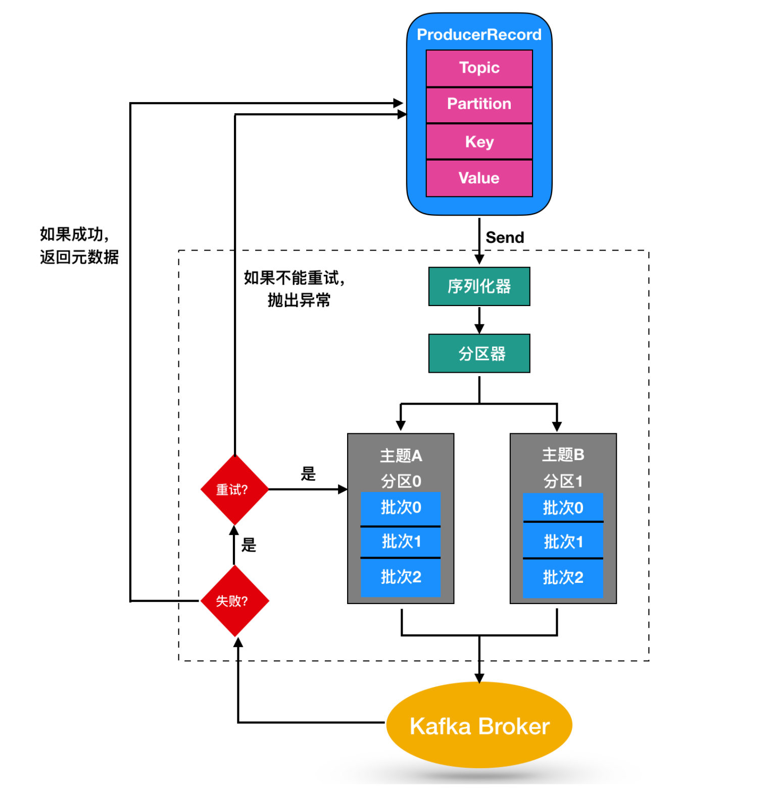
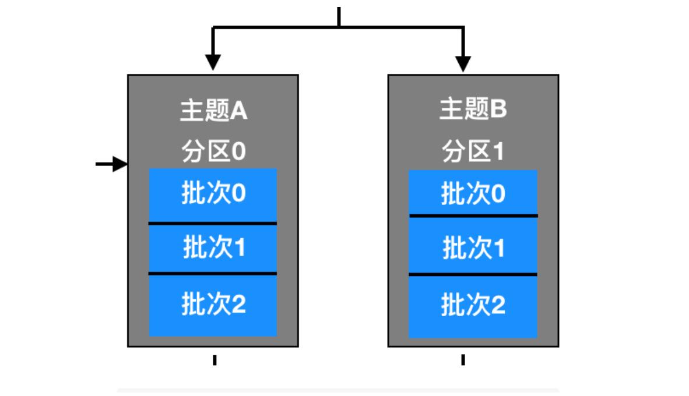
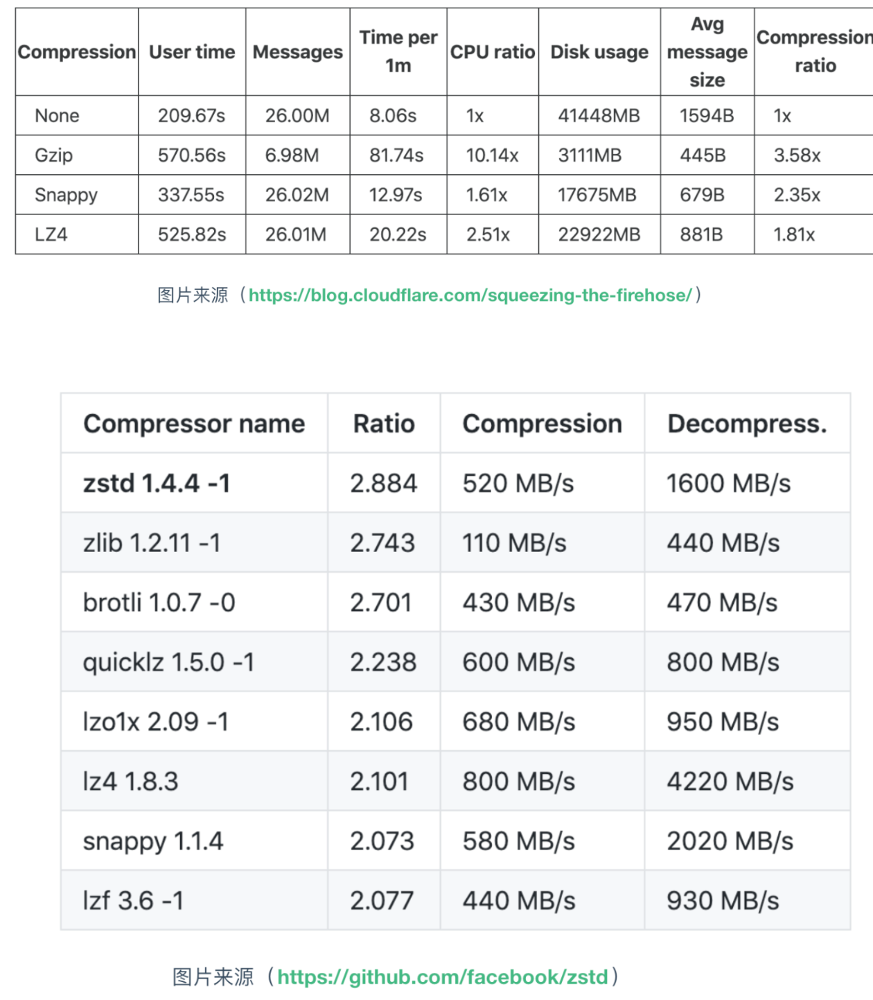

# 3 Kafka Producer

在 Kafka 中，我们把产生消息的那一方称为生产者，比如我们经常回去淘宝购物，你打开淘宝的那一刻，你的登陆信息，登陆次数都会作为消息传输到 Kafka 后台，当你浏览购物的时候，你的浏览信息，你的搜索指数，你的购物爱好都会作为一个个消息传递给 Kafka 后台，然后淘宝会根据你的爱好做智能推荐，致使你的钱包从来都禁不住诱惑，那么这些生产者产生的消息是怎么传到 Kafka 应用程序的呢？发送过程是怎么样的呢？

尽管消息的产生非常简单，但是消息的发送过程还是比较复杂的，如图



我们从创建一个ProducerRecord 对象开始，**ProducerRecord 是 Kafka 中的一个核心类，它代表了一组 Kafka 需要发送的 key/value 键值对，它由记录要发送到的主题名称（Topic Name），可选的分区号（Partition Number）以及可选的键值对构成。**

在发送 ProducerRecord 时，**我们需要将键值对对象由序列化器转换为字节数组，这样它们才能够在网络上传输**。然后消息到达了分区器。

如果发送过程中指定了有效的分区号，那么在发送记录时将使用该分区。如果发送过程中未指定分区，**则将使用key 的 hash 函数映射指定一个分区**。如果发送的过程中既没有分区号也没有，则将以循环的方式分配一个分区。选好分区后，生产者就知道向哪个主题和分区发送数据了。

ProducerRecord 还有关联的时间戳，如果用户没有提供时间戳，那么生产者将会在记录中使用当前的时间作为时间戳。

**Kafka 最终使用的时间戳取决于 topic 主题配置的时间戳类型。**


* 如果将主题配置为使用 **CreateTime**，则生产者记录中的时间戳将由 broker 使用。
* 如果将主题配置为使用**LogAppendTime**，则生产者记录中的时间戳在将消息添加到其日志中时，将由 broker 重写

**然后，这条消息被存放在一个记录批次里，这个批次里的所有消息会被发送到相同的主题和分区上**。

由一个独立的线程负责把它们发到 Kafka Broker 上。


Kafka Broker 在收到消息时会返回一个响应，如果写入成功，会返回一个 RecordMetaData 对象，**它包含了主题和分区信息，以及记录在分区里的偏移量，上面两种的时间戳类型也会返回给用户**。

如果写入失败，会返回一个错误。生产者在收到错误之后会尝试重新发送消息，几次之后如果还是失败的话，就返回错误消息。

## 创建 Kafka 生产者

要向 Kafka 写入消息，首先需要创建一个生产者对象，并设置一些属性。Kafka 生产者有3个必选的属性

### bootstrap.servers

该属性指定 broker 的地址清单，地址的格式为 `host:port`。

清单里不需要包含所有的 broker 地址，生产者会从给定的 broker 里查找到其他的 broker 信息。

**不过建议至少要提供两个 broker 信息，一旦其中一个宕机，生产者仍然能够连接到集群上**。

### key.serializer

broker 需要接收到序列化之后的 key/value值，所以生产者发送的消息需要经过序列化之后才传递给 Kafka Broker。


生产者需要知道采用何种方式把 Java 对象转换为字节数组。

**`key.serializer `必须被设置为一个实现了`org.apache.kafka.common.serialization.Serializer `接口的类，生产者会使用这个类把键对象序列化为字节数组。**

这里拓展一下 Serializer 类

Serializer 是一个接口，它表示类将会采用何种方式序列化，它的作用是把对象转换为字节，**实现了 Serializer 接口的类主要有 ByteArraySerializer、StringSerializer、IntegerSerializer **，

**其中 ByteArraySerialize 是 Kafka 默认使用的序列化器，**其他的序列化器还有很多，你可以通过 这里 查看其他序列化器。**要注意的一点：`key.serializer` 是必须要设置的，即使你打算只发送值的内容**。

### value.serializer

与 `key.serializer` 一样，value.serializer 指定的类会将值序列化。

下面代码演示了如何创建一个 Kafka 生产者，这里只指定了必要的属性，其他使用默认的配置

```
private Properties properties = new Properties();
properties.put("bootstrap.servers","broker1:9092,broker2:9092");
properties.put("key.serializer","org.apache.kafka.common.serialization.StringSerializer");
properties.put("value.serializer","org.apache.kafka.common.serialization.StringSerializer");
properties = new KafkaProducer<String,String>(properties);
```

来解释一下这段代码


* 首先创建了一个 `Properties `对象
* 使用 `StringSerializer `序列化器序列化 `key / value` 键值对
* 在这里我们创建了一个新的生产者对象，并为键值设置了恰当的类型，然后把 Properties 对象传递给他。

## Kafka 消息发送

实例化生产者对象后，接下来就可以开始发送消息了，发送消息主要由下面几种方式

### 简单消息发送

Kafka 最简单的消息发送如下：

```
ProducerRecord<String,String> record =
                new ProducerRecord<String, String>("CustomerCountry","West","France");

producer.send(record);
```

代码中生产者(`producer`)的 `send() `方法需要把 `ProducerRecord `的对象作为参数进行发送，ProducerRecord 有很多构造函数，这个我们下面讨论，这里调用的是

```
public ProducerRecord(String topic, K key, V value) {}
```

这个构造函数，需要传递的是 topic主题，key 和 value。


把对应的参数传递完成后，生产者调用 `send()` 方法发送消息（ProducerRecord对象）。我们可以从生产者的架构图中看出，消息是先被写入分区中的缓冲区中，然后分批次发送给 Kafka Broker。



发送成功后，send() 方法会返回一个 `Future(java.util.concurrent)` 对象，Future 对象的类型是 `RecordMetadata` 类型，我们上面这段代码没有考虑返回值，所以没有生成对应的 Future 对象，所以没有办法知道消息是否发送成功。如果不是很重要的信息或者对结果不会产生影响的信息，可以使用这种方式进行发送。


我们可以忽略发送消息时可能发生的错误或者在服务器端可能发生的错误，但在消息发送之前，生产者还可能发生其他的异常。这些异常有可能是 `SerializationException`(序列化失败)，`BufferedExhaustedException `或 `TimeoutException`(说明缓冲区已满)，又或是 `InterruptedException`(说明发送线程被中断)

## 同步发送消息

第二种消息发送机制如下所示

这种发送消息的方式较上面的发送方式有了改进，

* 首先调用 `send() `方法，然后再调用 get() 方法等待 Kafka 响应。
* 如果服务器返回错误，`get() `方法会抛出异常，如果没有发生错误，我们会得到 `RecordMetadata` 对象，可以用它来查看消息记录。


生产者（KafkaProducer）在发送的过程中会出现两类错误：

* 其中一类是重试错误，这类错误可以通过重发消息来解决。比如连接的错误，可以通过再次建立连接来解决；
* 无主错误则可以通过重新为分区选举首领来解决。

**KafkaProducer 被配置为自动重试，如果多次重试后仍无法解决问题，则会抛出重试异常。另一类错误是无法通过重试来解决的，比如消息过大对于这类错误，KafkaProducer 不会进行重试，直接抛出异常**。

## 异步发送消息

同步发送消息都有个问题，**那就是同一时间只能有一个消息在发送，这会造成许多消息无法直接发送，造成消息滞后，无法发挥效益最大化**。

比如消息在应用程序和 Kafka 集群之间一个来回需要 10ms。如果发送完每个消息后都等待响应的话，那么发送100个消息需要 1 秒，**但是如果是异步方式的话，发送 100 条消息所需要的时间就会少很多很多。大多数时候，虽然Kafka 会返回 RecordMetadata 消息，但是我们并不需要等待响应。**

为了在异步发送消息的同时能够对异常情况进行处理，生产者提供了回掉支持。下面是回调的一个例子

```
ProducerRecord<String, String> producerRecord = new ProducerRecord<String, String>("CustomerCountry", "Huston", "America");
        producer.send(producerRecord,new DemoProducerCallBack());


class DemoProducerCallBack implements Callback {

  public void onCompletion(RecordMetadata metadata, Exception exception) {
    if(exception != null){
      exception.printStackTrace();;
    }
  }
}
```

首先实现回调需要定义一个实现了`org.apache.kafka.clients.producer.Callback`的类，这个接口只有一个 `onCompletion`方法。

**如果 kafka 返回一个错误，`onCompletion` 方法会抛出一个非空`(non null)`异常，这里我们只是简单的把它打印出来，如果是生产环境需要更详细的处理，然后在 `send()` 方法发送的时候传递一个 `Callback `回调的对象**。

## 生产者分区机制

Kafka 对于数据的读写是以**分区**为粒度的，分区可以分布在多个主机（Broker）中，这样每个节点能够实现独立的数据写入和读取，并且能够通过增加新的节点来增加 Kafka 集群的吞吐量，**通过分区部署在多个 Broker 来实现负载均衡的效果**。

上面我们介绍了生产者的发送方式有三种：**不管结果如何直接发送、发送并返回结果、发送并回调。**

由于消息是存在主题（topic）的分区（partition）中的，所以当 Producer 生产者发送产生一条消息发给 topic 的时候，你如何判断这条消息会存在哪个分区中呢？


这其实就设计到 Kafka 的分区机制了。


## 分区策略

Kafka 的分区策略指的就是将生产者发送到哪个分区的算法。Kafka 为我们提供了默认的分区策略，同时它也支持你自定义分区策略。

如果要自定义分区策略的话，你需要显示配置生产者端的参数 `Partitioner.class`，我们可以看一下这个类它位于 `org.apache.kafka.clients.producer `包下

```
public interface Partitioner extends Configurable, Closeable {
  
  public int partition(String topic, Object key, byte[] keyBytes, Object value, byte[] valueBytes, Cluster cluster);

  public void close();
  
  default public void onNewBatch(String topic, Cluster cluster, int prevPartition) {}
}
```

Partitioner 类有三个方法，分别来解释一下

* partition(): 这个类有几个参数: 
	* topic，表示需要传递的主题；
	* key 表示消息中的键值；
		* keyBytes表示分区中序列化过后的key，byte数组的形式传递；
		* value 表示消息的 value 值；
		* valueBytes 表示分区中序列化后的值数组；
		* cluster表示当前集群的原数据。
		* Kafka 给你这么多信息，就是希望让你能够充分地利用这些信息对消息进行分区，计算出它要被发送到哪个分区中。
* `close()` : 继承了 Closeable 接口能够实现 close() 方法，在分区关闭时调用。
* `onNewBatch():` 表示通知分区程序用来创建新的批次

其中与分区策略息息相关的就是 `partition() `方法了，分区策略有下面这几种

上面代码表明该 Producer 的压缩算法使用的是 GZIP

**有压缩必有解压缩**，Producer 使用压缩算法压缩消息后并发送给服务器后，由 Consumer 消费者进行解压缩，因为采用的何种压缩算法是随着 key、value 一起发送过去的，所以消费者知道采用何种压缩算法。


## **Kafka 重要参数配置**

### `key.serializer`

用于 key 键的序列化，它实现了 `org.apache.kafka.common.serialization.Serializer` 接口

### `value.serializer`

用于 value 值的序列化，实现了 `org.apache.kafka.common.serialization.Serializer` 接口

### acks

acks 参数指定了要有多少个分区副本接收消息，生产者才认为消息是写入成功的。此参数对消息丢失的影响较大

* 如果 acks = 0，就表示生产者也不知道自己产生的消息是否被服务器接收了，它才知道它写成功了。如果发送的途中产生了错误，生产者也不知道，它也比较懵逼，因为没有返回任何消息。这就类似于 UDP 的运输层协议，只管发，服务器接受不接受它也不关心。
* 如果 acks = 1，只要集群的 Leader 接收到消息，就会给生产者返回一条消息，告诉它写入成功。如果发送途中造成了网络异常或者 Leader 还没选举出来等其他情况导致消息写入失败，生产者会受到错误消息，这时候生产者往往会再次重发数据。因为消息的发送也分为 同步 和 异步，Kafka 为了保证消息的高效传输会决定是同步发送还是异步发送。如果让客户端等待服务器的响应（通过调用 Future 中的 get() 方法），显然会增加延迟，如果客户端使用回调，就会解决这个问题。
* 如果 acks = all，这种情况下是只有当所有参与复制的节点都收到消息时，生产者才会接收到一个来自服务器的消息。不过，它的延迟比 acks =1 时更高，因为我们要等待不只一个服务器节点接收消息。


### buffer.memory

此参数用来设置生产者内存缓冲区的大小，生产者用它缓冲要发送到服务器的消息。如果应用程序发送消息的速度超过发送到服务器的速度，会导致生产者空间不足。这个时候，send() 方法调用要么被阻塞，要么抛出异常，具体取决于 `block.on.buffer.null` 参数的设置。

### compression.type

此参数来表示生产者启用何种压缩算法，默认情况下，消息发送时不会被压缩。该参数可以设置为 snappy、gzip 和 lz4，它指定了消息发送给 broker 之前使用哪一种压缩算法进行压缩。下面是各压缩算法的对比




### retries

生产者从服务器收到的错误有可能是临时性的错误（比如分区找不到首领），在这种情况下，reteis 参数的值决定了生产者可以重发的消息次数，如果达到这个次数，生产者会放弃重试并返回错误。默认情况下，生产者在每次重试之间等待 100ms，这个等待参数可以通过 `retry.backoff.ms` 进行修改。

### batch.size

当有多个消息需要被发送到同一个分区时，生产者会把它们放在同一个批次里。该参数指定了一个批次可以使用的内存大小，按照字节数计算。当批次被填满，批次里的所有消息会被发送出去。不过生产者井不一定都会等到批次被填满才发送，任意条数的消息都可能被发送。

### client.id

此参数可以是任意的字符串，服务器会用它来识别消息的来源，一般配置在日志里

### max.in.flight.requests.per.connection

此参数指定了生产者在收到服务器响应之前可以发送多少消息，它的值越高，就会占用越多的内存，不过也会提高吞吐量。把它设为1 可以保证消息是按照发送的顺序写入服务器。

### timeout.ms、request.timeout.ms 和 metadata.fetch.timeout.ms

`request.timeout.ms` 指定了生产者在发送数据时等待服务器返回的响应时间，`metadata.fetch.timeout.ms` 指定了生产者在获取元数据（比如目标分区的首领是谁）时等待服务器返回响应的时间。如果等待时间超时，生产者要么重试发送数据，要么返回一个错误。timeout.ms 指定了 broker 等待同步副本返回消息确认的时间，与 asks 的配置相匹配----如果在指定时间内没有收到同步副本的确认，那么 broker 就会返回一个错误。

### max.block.ms

此参数指定了在调用 send() 方法或使用 partitionFor() 方法获取元数据时生产者的阻塞时间当生产者的发送缓冲区已捕，或者没有可用的元数据时，这些方法就会阻塞。在阻塞时间达到 `max.block.ms` 时，生产者会抛出超时异常。

### max.request.size

该参数用于控制生产者发送的请求大小。它可以指能发送的单个消息的最大值，也可以指单个请求里所有消息的总大小。

### receive.buffer.bytes 和 send.buffer.bytes

Kafka 是基于 TCP 实现的，为了保证可靠的消息传输，这两个参数分别指定了 TCP Socket 接收和发送数据包的缓冲区的大小。如果它们被设置为` -1`，就使用操作系统的默认值。

如果生产者或消费者与 broker 处于不同的数据中心，那么可以适当增大这些值。
