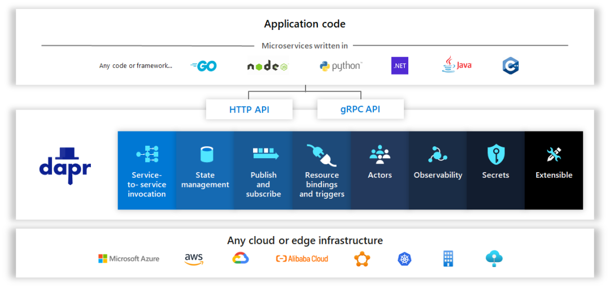
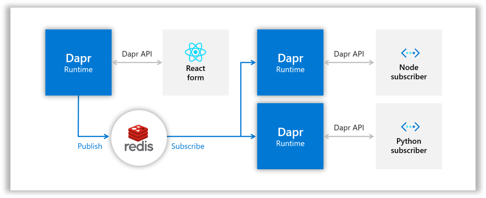
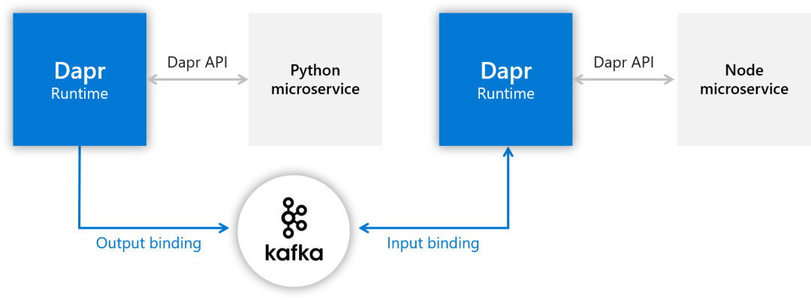
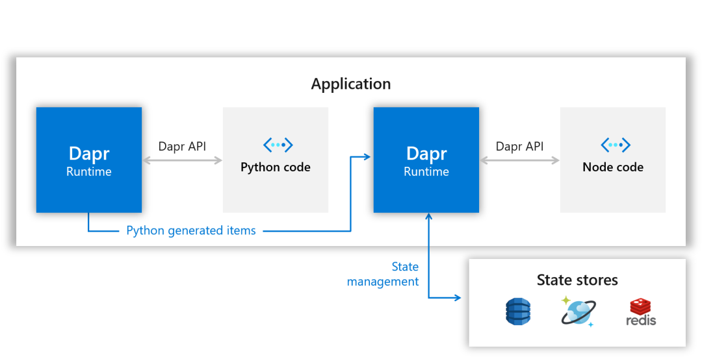
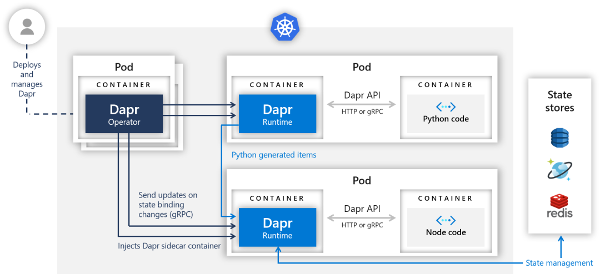
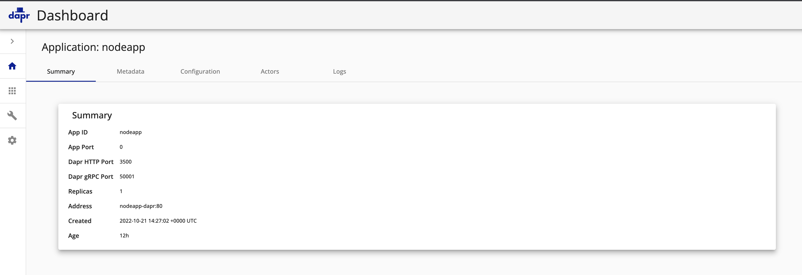
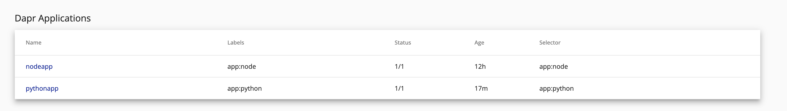

# **1 Dapr 入门教程**

Dapr(Distributed Application Runtime) 是微软于 2019 年 10 月 16 日 首次发布 的分布式程序运行时，到现在已经过去1年多，从最初的v0.1.0 到现在的 v1.0.0-rc2，加入了好多新的功能。

**支持的中间件越来越多，基本上主流的中间件(本地版和各云提供商的托管版)都可以被支持。**

Dapr 运行时也从原来的只支持单 Instance变成了v1.0.0-rc1以后的支持多 Instance（HA mode），让我们一起进入精彩的 Dapr 的世界。



## **Dapr 是什么？**

参考 Dapr 官方网站，**"An event-driven, portable runtime for building microservices on cloud and edge"**，或者复杂点说，"**Dapr is a portable, event-driven runtime that makes it easy for any developer to build resilient, stateless and stateful applications that run on the cloud and edge and embraces the diversity of languages and developer frameworks"**。

翻译过来就是，**Dapr 是一个在云和边缘构建微服务用的事件驱动的，可移植的运行时**。更复杂的来说，**"Dapr 是一个可移植的，事件驱动的运行时，使开发人员可以轻松创建在云和边缘上运行的有弹性，无状态和有状态的应用程序，支持语言和开发人员框架的多样性"**。

* 分布式程序(Distributed Application)指的是什么？
  * 跟微服务是一个意思。大的系统分成彼此独立的小的模块，模块和模块之间通过API互相通信，这样每个模块可以用不同的语言开发，一个模块升级的时候不会影响到别的模块。
* 云和边缘(cloud and edge)指的是什么？
  * 这里的云和边缘指的是 Dapr 的 App 可以跑在 AWS，Azure，GCP 等云服务器上，也可以跑在本地的服务器上。
* 事件驱动(event-driven)指的是什么？
  * 可以理解成 Dapr 在没有监听（Listening）到请求到来的时候会一直处于待机的状态，什么也不做，只有监听到请求事件来了才开始处理。
* 可移植(portable)指的是什么？
  * 就是说写的程序和运行的环境，用的中间件无关。比如说原来跑在 AWS 上，现在想跑在 Azure 上，Nosql 数据库原来用 DynamoDB，现在想用 CosmosDB，消息中间件原来用 SNS/SQS，现在想用 Service Bus，没问题，只要在 Dapr 设定这边做一下切换，程序无需改动。
* 运行时(runtime)指的是什么？
  * **运行时指的是 Dapr 的运行环境**。
  * Dapr 的 Control Plane（不知道怎么翻译，直接用英文，就是 Dapr 管理用的模块）会单独启动，同时你的程序在启动的时候 Dapr 会在你的程序上挂一个 Sidecar（所谓的边车模式），你的程序就可以通过 Sidecar 和 Dapr 的 Control Plane 联系上。所有挂有 Dapr Sidecar 的各个微服务之间就可以互相调用了，也可以通过 Dapr 调用各种中间件。
* 有弹性(resilient)指的是什么？
* 指的是可以从故障中自动恢复的能力，比如说超时、重试等。不会卡住或陷入一种死循环。
* 无状态和有状态(stateless and stateful)指的是什么？
  * 无状态指的是一个微服务经过计算得到结果，返回给调用者以后这个值在微服务这边是不保存的（DB，内存等）。**有状态指的是在微服务这边要把这个结果保存起来**。
* 支持语言的多样性(the diversity of languages)指的是什么？
  * 指的是 Dapr 有各种语言的 SDK，比如 java，python，go，.net 等都支持。
* 开发人员框架(developer frameworks)指的是什么？
  * 指的是 Dapr 跟框架无关，你可以把各种语言的各种框架（比如 java 的 spring boot 框架）和 Dapr(API 或者 SDK)混合使用。

说了这么多，Dapr 到底是个什么东西？

我的理解是**Dapr 就是一个代理**。

什么意思呢，就是说它把不同组件的接口隐藏了起来，给你提供一个统一的接口让你来通信。这样做的好处不言而喻，不管你的组件怎么变，平台怎么变，我 Dapr 这边只要接口是不变的，你程序就不用变。所以它是 Makes it easy for any developer。

从程序来看我只是把数据交给 Dapr 就可以了，由 Dapr 来处理，这块的逻辑不写在我的程序逻辑里。所以通过 Dapr 可以做到平台无关，中间件无关。打个比方，如果你不用 Dapr，而是用 springboot redis 库来实现的 Message Queue，忽然有一天让你不用 redis 而是 RebbitMQ，你怎么办，是不是只能用 springboot rebbitmq 重写程序。不同于工作在网络层的 Service Mesh(如 Istio 和 Linkerd)，Dapr 算是一个 App Mesh，工作于 APP 层，专注于提供构建模块(Building blocks)，使开发人员更容易构建微服务。可以说 Dapr 以开发人员为中心，而 Service Mesh 则以基础架构为中心。两者可以共存。

## **Dapr 能为我做什么？**

Dapr 提供如下的 Building blocks:

* Service-to-service invocation，服务间调用，指的是一个微服务可以通过 Dapr 调用另一个微服务。
* State management，状态管理，指**的是一个微服务通过 Dapr 把状态数据保存到某个地方（PostgreSQL，Redis，DynamoDB 等等）**。
* **Publish and subscribe，就是所谓的消息总线（Message Bus），或者说发布者/订阅者模**式。一个微服务把消息通过 Dapr 发布（Publish）给某个 Topic，所有订阅（Subscribe）这个 Topic 的微服务都能通过 Dapr 收到这个消息。



* Resource bindings，就是所谓的消息队列（Message Queue，或者叫消息代理，Message Broker），分为两种绑定，**一种是输出绑定（Output Binding），一种是输入绑定（Input Binding）**。

出和入是看数据的流向，输出绑定就是作为 Producer 的 App 把消息通过 Dapr 传给消息队列，输入绑定就是作为 Consumer 的 App 通过 Dapr 从消息队列里得到消息。

补充一点，这里的消息队列和 Pub/Sub 里的消息总线有什么区别呢？可以这样理解:**一个消息进入消息总线的话，所有订阅者都能得到这个消息。而一个消息进入消息队列的话，由 Consumer 来取，一次只有一个人能得**到。此外，**消息总线是不要求处理顺序的，两个消息进入消息总线，谁先被拿到顺序是不一定的，而消息队列可以保证是先入先出的**。



* Actors，实现了 Actor Model。
* Observability， 可观测性，就是 Dapr 提供了模板让你方便地进行观测，比如说用 Prometheus+Grafana 来看系统的 Metrics，用 Zipkin 来进行分布链路追踪，用 Elasticsearch+Fluentd+Kibana（俗称 EFK）来对日志进行检索。
* Secrets，就是密钥，指的是一个微服务通过 Dapr 从 Secret Store 取得密钥

## **安装 Dapr**

### 安装 CLI

在安装 Dapr runtime 之前需要先安装 Dapr 的 CLI。有两个原因，

第一，如果你以后不是用 Helm 来安装 Dapr 的话，需要用 Dapr CLI 来执行 dapr init。

第二，即使你不用 Dapr CLI，而是用 Helm 来安装，以后查看 Dapr 系统状态的时候还是要用到 Dapr CLI，比如查看 Runtime 的状态（`dapr status -k`）、查看 Components 状态（`dapr components -k`）、查看 Configurations 状态（`dapr configurations -k`），甚至启动 Dashboard 的时候还是要执行（dapr dashboard -k）。

你可以在很多 OS 上安装 Dapr CLI，比如 Windows，Linux，Mac OS，我用的是 Windows10 系统，可以选择在 Windows 上直接装，也可以在 WSL(Windows Subsystem for Linux)上装，这里选择在 WSL 上安装（没有 WSL 的话在 windows 商店里选一个免费的 Linux 装上。我选的是 Ubuntu）。参考官方文档 How-To: `Install Dapr CLI`，在Mac里执行:

```
$ wget -q https://raw.githubusercontent.com/dapr/cli/master/install/install.sh -O - | /bin/bash
Your system is linux_amd64
Installing Dapr CLI...

Getting the latest Dapr CLI...
Installing v0.11.0 Dapr CLI...
Downloading https://github.com/dapr/cli/releases/download/v0.11.0/dapr_linux_amd64.tar.gz ...
[sudo] password for ubuntu:
dapr installed into /usr/local/bin successfully.
CLI version: 0.11.0
Runtime version: n/a

To get started with Dapr, please visit https://docs.dapr.io/getting-started/
```

安装完成。看看版本号:

```
$ curl -fsSL https://raw.githubusercontent.com/dapr/cli/master/install/install.sh | /bin/bash
Getting the latest Dapr CLI...
Your system is darwin_amd64
Installing Dapr CLI...

Installing v1.9.1 Dapr CLI...
Downloading https://github.com/dapr/cli/releases/download/v1.9.1/dapr_darwin_amd64.tar.gz ...
Password:
dapr installed into /usr/local/bin successfully.
CLI version: 1.9.1 
Runtime version: n/a

To get started with Dapr, please visit https://docs.dapr.io/getting-started/
```

```
$ dapr --version
CLI version: 1.9.1 
Runtime version: n/a
```

**在Ubuntu里执行:**

```
$ wget -q https://raw.githubusercontent.com/dapr/cli/master/install/install.sh -O - | /bin/bash
Your system is linux_amd64
Installing Dapr CLI...

Getting the latest Dapr CLI...
Installing v0.11.0 Dapr CLI...
Downloading https://github.com/dapr/cli/releases/download/v0.11.0/dapr_linux_amd64.tar.gz ...
[sudo] password for ubuntu:
dapr installed into /usr/local/bin successfully.
CLI version: 0.11.0
Runtime version: n/a

To get started with Dapr, please visit https://docs.dapr.io/getting-started/
```

```
$ dapr --version
CLI version: 0.11.0
Runtime version: n/a
```

CLI 是 0.11.0 版的，Runtime 因为还没装，所以显示 n/a。

因为接下来要安装 1.0.0-rc.2 的 Runtime，1.x 相对于 0.x 版有了重大的改进(比如多 Instance 模式)，为了版本的统一性(低版本的 CLI 操作高版本的 Runtime 可能会出问题)，把 CLI 升级到 v1.0.0-rc.2 版的吧

```
curl -LO https://github.com/dapr/cli/releases/download/v1.0.0-rc.2/dapr_linux_amd64.tar.gz
tar -xzf dapr_linux_amd64.tar.gz
sudo cp dapr /usr/local/bin/dapr
```

CLI 安装完毕。接下来安装 Runtime。

## **安装 Runtime**

这里有两种选择，一个是 Standalone mode，一个是 Kubernetes mode。我们两个都试一下。

### **安装 Docker Engine**

Dapr Runtime 安装的前提条件是要先安装 Docker。不然安装 Dapr 的时候会报"could not connect to Docker. Docker may not be installed or running"的错。这里参考 Docker 的官方文档 Install Docker Engine on Ubuntu 来安装Docker Engine。

```
$ sudo apt-get update
$ sudo apt-get install \
    apt-transport-https \
    ca-certificates \
    curl \
    gnupg-agent \
    software-properties-common
$ curl -fsSL https://download.docker.com/linux/ubuntu/gpg | sudo apt-key add -
$ sudo apt-key fingerprint 0EBFCD88
$ sudo add-apt-repository \
   "deb [arch=amd64] https://download.docker.com/linux/ubuntu \
   $(lsb_release -cs) \
   stable"
$ sudo apt-get update
$ sudo apt-get install docker-ce docker-ce-cli containerd.io
```

安装完成。把 docker 的 service 启动:

```
$ sudo service docker start
```

看看 service 是否启动:

```
$ service docker status
 * Docker is running
```

OK，Docker Engine 安装完成。

**安装 Standalone 版的 Runtime**

用 dapr init 来安装单机版，可以指定版本号。目前最新的是 1.0.0-rc.2。

```
$ dapr init --runtime-version=1.0.0-rc.2
⌛  Making the jump to hyperspace...
←↑→↓←↑→↓←↑→↓←↑→↓←↑→↓←↑→↓←↑→↓←↑→↓←↑→↓←↑→↓←↑→↓←↑→↓←↑→↓←↑→↓←↑→↓←↑→↓←↑→↓←↑→↓←↑→↓←↑→↓←↑→↓←↑↗  Downloading binaries and setting up components...
Dapr runtime installed to /root/.dapr/bin, you may run the following to add it to your path if you want to run daprd directly:
    export PATH=$PATH:/root/.dapr/bin
→↓←↑→↓←↑→↓←↑→↓←↑→↓←↑→↓←↑→↓←↑→↓←↑→↓←↑→↓←↑→↓←↑→↓←↑→↓←↑→↓←↑→↓←↑→↓←↑→↓←↑→↓←↑→↓←↑→↓←↑→↓←↑→↓←↑→↓←↑→↓←↑→↓←↑→↓←↑→↓←↑→↓←↑→↓←↑→↓←↑→↓←↑→↓←↑→↓←↑→↓←↑→↓←↑→↓←↑→↓←↑→↓←↑→↓←↑→↓←↑→↓←↑→↓←↑→↓←↑→↓←↑→↓←↑→↓←✅  Downloaded binaries and completed components set up.
ℹ️  daprd binary has been installed to /root/.dapr/bin.
ℹ️  dapr_placement container is running.
ℹ️  dapr_redis container is running.
ℹ️  dapr_zipkin container is running.
ℹ️  Use `docker ps` to check running containers.
✅  Success! Dapr is up and running. To get started, go here: https://aka.ms/dapr-getting-started
export PATH=$PATH:/root/.dapr/bin
```

完成。看看都装了什么东西。

```
$ docker ps
CONTAINER ID   IMAGE               COMMAND                  CREATED         STATUS                   PORTS                              NAMES
293b479ed26c   openzipkin/zipkin   "start-zipkin"           5 minutes ago   Up 4 minutes (healthy)   9410/tcp, 0.0.0.0:9411->9411/tcp   dapr_zipkin
a07696221fd2   daprio/dapr         "./placement"            5 minutes ago   Up 4 minutes             0.0.0.0:50005->50005/tcp           dapr_placement
c475c415332b   redis               "docker-entrypoint.s…"   6 minutes ago   Up 6 minutes             0.0.0.0:6379->6379/tcp             dapr_redis
```

**跑起来三个 Container。一个 `dapr_zipkin`，一个 `dapr_placement`，一个 `dapr_redis`** 看看版本号:

```
$ dapr --version
CLI version: 1.0.0-rc.2
Runtime version: 1.0.0-rc.2
```

至此单机版的 Dapr Runtime 安装完成。dapr list 一下看看，什么也没有。因为我们还没有启动 App。

### 安装 Kubernetes 版的 Runtime

安装之前需要先有 Kubernetes 环境，minikube，AWS 托管的 EKS，Azure 托管的 AKS，GCP 托管的 GKE 等等。这里选择在本地安装 minikube

```
$ curl -LO https://storage.googleapis.com/minikube/releases/latest/minikube-linux-amd64
$ sudo install minikube-linux-amd64 /usr/local/bin/minikube
```

看看版本:

```
$ minikube version
minikube version: v1.16.0
commit: 9f1e482427589ff8451c4723b6ba53bb9742fbb1
```

先执行

```
$ sudo usermod -aG docker $USER && newgrp dockers
```

不然 minikube 启动的时候会报错。然后启动 minikube 环境:

```
$ minikube start
😄  minikube v1.16.0 on Ubuntu 20.04
✨  Automatically selected the docker driver
👍  Starting control plane node minikube in cluster minikube
🚜  Pulling base image ...
💾  Downloading Kubernetes v1.20.0 preload ...
    > preloaded-images-k8s-v8-v1....: 491.00 MiB / 491.00 MiB  100.00% 2.56 MiB

🔥  Creating docker container (CPUs=2, Memory=3100MB) ...
🐳  Preparing Kubernetes v1.20.0 on Docker 20.10.0 ...
    ▪ Generating certificates and keys ...
    ▪ Booting up control plane ...
    ▪ Configuring RBAC rules ...
🔎  Verifying Kubernetes components...
🌟  Enabled addons: storage-provisioner, default-storageclass
💡  kubectl not found. If you need it, try: 'minikube kubectl -- get pods -A'
🏄  Done! kubectl is now configured to use "minikube" cluster and "default" namespace by default
```

看看 docker ps 的结果:

```
$ docker ps
CONTAINER ID   IMAGE                                           COMMAND                  CREATED          STATUS                    PORTS                                                                                                      NAMES
cc47e6e56d32   gcr.io/k8s-minikube/kicbase:v0.0.15-snapshot4   "/usr/local/bin/entr…"   4 minutes ago    Up 4 minutes              127.0.0.1:49156->22/tcp, 127.0.0.1:49155->2376/tcp, 127.0.0.1:49154->5000/tcp, 127.0.0.1:49153->8443/tcp   minikube
fedf3508c0f4   daprio/dapr:1.0.0-rc.2                          "./placement"            43 minutes ago   Up 43 minutes             0.0.0.0:50005->50005/tcp                                                                                   dapr_placement
c52f4a72abc4   redis                                           "docker-entrypoint.s…"   44 minutes ago   Up 44 minutes             0.0.0.0:6379->6379/tcp                                                                                     dapr_redis
af7b8dd7dcf3   openzipkin/zipkin                               "start-zipkin"           44 minutes ago   Up 44 minutes (healthy)   9410/tcp, 0.0.0.0:9411->9411/tcp                                                                           dapr_zipkin
```

多了个 minikube 的 Container。接下来安装 kubectl:

```
$ curl -LO "https://storage.googleapis.com/kubernetes-release/release/$(curl -s https://storage.googleapis.com/kubernetes-release/release/stable.txt)/bin/linux/amd64/kubectl"
$ chmod +x ./kubectl
$ sudo mv ./kubectl /usr/local/bin/kubectl
```

看看版本:

```
$ kubectl version --client
Client Version: version.Info{Major:"1", Minor:"20", GitVersion:"v1.20.1", GitCommit:"c4d752765b3bbac2237bf87cf0b1c2e307844666", GitTreeState:"clean", BuildDate:"2020-12-18T12:09:25Z", GoVersion:"go1.15.5", Compiler:"gc", Platform:"linux/amd64"}
```

安装 Dapr Runtime 可以用 Dapr CLI 也可以用 Helm。我们选择用 Helm 来安装:

```
$ curl https://baltocdn.com/helm/signing.asc | sudo apt-key add -
$ sudo apt-get install apt-transport-https --yes
$ echo "deb https://baltocdn.com/helm/stable/debian/ all main" | sudo tee /etc/apt/sources.list.d/helm-stable-debian.list
$ sudo apt-get update
$ sudo apt-get install helm
```

看下版本:

```
$ helm version
version.BuildInfo{Version:"v3.4.2", GitCommit:"23dd3af5e19a02d4f4baa5b2f242645a1a3af629", GitTreeState:"clean", GoVersion:"go1.14.13"}
```

终于可以安装 Dapr 了。这里指定目前最新的版本号 1.9.1。

```
$ helm repo add dapr https://dapr.github.io/helm-charts/
$ helm repo update
$ kubectl create namespace dapr-system
$ helm install dapr dapr/dapr --version 1.9.0 --namespace dapr-system


....
NAME: dapr
LAST DEPLOYED: Thu Oct 20 23:08:14 2022
NAMESPACE: dapr-system
STATUS: deployed
REVISION: 1
TEST SUITE: None
NOTES:
Thank you for installing Dapr: High-performance, lightweight serverless runtime for cloud and edge

Your release is named dapr.

To get started with Dapr, we recommend using our quickstarts:
https://github.com/dapr/quickstarts

For more information on running Dapr, visit:
https://dapr.io
```

看下版本号:

```
 dapr status -k
  NAME                   NAMESPACE    HEALTHY  STATUS   REPLICAS  VERSION  AGE  CREATED            
  dapr-sidecar-injector  dapr-system  True     Running  1         1.9.0    9h   2022-10-20 23:08.16  
  dapr-sentry            dapr-system  True     Running  1         1.9.0    9h   2022-10-20 23:08.16  
  dapr-operator          dapr-system  True     Running  1         1.9.0    9h   2022-10-20 23:08.16  
  dapr-dashboard         dapr-system  True     Running  1         0.11.0   9h   2022-10-20 23:08.16  
  dapr-placement-server  dapr-system  True     Running  1         1.9.0    9h   2022-10-20 23:08.18  
```

我们看看启动了什么 Pod:

```
$ kubectl get pods -n dapr-system
NAME                                     READY   STATUS    RESTARTS        AGE
dapr-dashboard-7d4d9c6c6f-9cft2          1/1     Running   0               9h
dapr-operator-655d848cd8-5bm49           1/1     Running   1 (6h43m ago)   9h
dapr-placement-server-0                  1/1     Running   1 (6h43m ago)   9h
dapr-sentry-5c554c8995-8shnk             1/1     Running   0               9h
dapr-sidecar-injector-5cc5586566-chd2m   1/1     Running   0               9h
```

启动了 5 个 Pod：dapr-dashboard、dapr-operator、dapr-placement、dapr-sentry、dapr-sidecar-injector。

* `dapr-dashboard` 负责显示 Dapr Dashboard
* `dapr-operator` 负责管理 Dapr Component 的更新和 Kubernetes Service Endpoint（State stores，pub/sub 等）
* `dapr-sidecar-injector ` 负责将 Dapr 的 sidecar 注入带 Dapr 注释的 Pod（如果 App 的 Deploy 里有 `dapr.io/app-id`、`dapr.io/app-port` 之类的 annotation，就会被注入 Dapr sidecar。这时你会发现 Pod 里有两个 Container）。
* dapr-placement 用于 Actor，创建将 Actor 实例映射到 Pod 的映射表。
* dapr-sentry 负责管理服务之间的 mTLS 并充当证书颁发机构。

把 Dapr Dashboard 起来看看:

```
$ dapr dashboard -k


ℹ️  Dapr dashboard found in namespace:   dapr-system
ℹ️  Dapr dashboard available at: http://localhost:8080
```

效果和 kubectl port-forward svc/dapr-dashboard 8080:8080 -n dapr-system 是一样的。在浏览器里输入 http://localhost:8080。

恭喜，Dapr Runtime 终于安装完成了！

下面我们来部署一个 Dapr 的微服务的例子。

### **Dapr 程序的部署(Standalone 模式)**

上面 Dapr 的运行时环境已经安装完成。今天我们在 Standalone 模式部署第一个 Dapr 程序。程序来自 Dapr 官方的 quickstarts 教程里的 Hello World[7] ，我们用目前的最新版本v1.0.0-rc.2。

```

$ git clone -b v1.0.0-rc.2 https://github.com/dapr/quickstarts.git
$ cd quickstarts
```

hello-world 下面是 Standalone 版的，进去看看。程序很简单，一个 Node 的程序，提供 3 个 Endpoint(在 StateStore 里保存，取得，删除发过来的 OrderId)。还有一个 Python 的程序，每秒发 1 个 HTTP Request 给 Node 程序。



下面开始部署。Standalone 模式下首先要先安装 Node 和 Python 的运行环境。不然 dapr run 的时候会报错。Node 的运行环境:

```
$ sudo apt update
$ sudo apt install nodejs
$ sudo apt install npm
$ sudo npm install
$ npm list
```

里面有 express 和 body-parser 的话就可以用 Dapr 启动 node 的程序了。

```
$ dapr run --app-id nodeapp --app-port 3000 --dapr-http-port 3500 node app.js
ℹ️  Starting Dapr with id nodeapp. HTTP Port: 3500. gRPC Port: 43509
INFO[0000] starting Dapr Runtime -- version 1.0.0-rc.2 -- commit 196483d  app_id=nodeapp instance=PC57-064 scope=dapr.runtime type=log ver=1.0.0-rc.2
INFO[0000] log level set to: info                        app_id=nodeapp instance=PC57-064 scope=dapr.runtime type=log ver=1.0.0-rc.2
INFO[0000] metrics server started on :37057/             app_id=nodeapp instance=PC57-064 scope=dapr.metrics type=log ver=1.0.0-rc.2
INFO[0000] standalone mode configured                    app_id=nodeapp instance=PC57-064 scope=dapr.runtime type=log ver=1.0.0-rc.2
INFO[0000] app id: nodeapp                               app_id=nodeapp instance=PC57-064 scope=dapr.runtime type=log ver=1.0.0-rc.2
INFO[0000] mTLS is disabled. Skipping certificate request and tls validation  app_id=nodeapp instance=PC57-064 scope=dapr.runtime type=log ver=1.0.0-rc.2
INFO[0000] local service entry announced: nodeapp -> 172.17.183.23:44399  app_id=nodeapp instance=PC57-064 scope=dapr.contrib type=log ver=1.0.0-rc.2
INFO[0000] Initialized name resolution to standalone     app_id=nodeapp instance=PC57-064 scope=dapr.runtime type=log ver=1.0.0-rc.2
INFO[0000] component loaded. name: pubsub, type: pubsub.redis  app_id=nodeapp instance=PC57-064 scope=dapr.runtime type=log ver=1.0.0-rc.2
INFO[0000] waiting for all outstanding components to be processed  app_id=nodeapp instance=PC57-064 scope=dapr.runtime type=log ver=1.0.0-rc.2
INFO[0000] component loaded. name: statestore, type: state.redis  app_id=nodeapp instance=PC57-064 scope=dapr.runtime type=log ver=1.0.0-rc.2
INFO[0000] all outstanding components processed          app_id=nodeapp instance=PC57-064 scope=dapr.runtime type=log ver=1.0.0-rc.2
INFO[0000] enabled gRPC tracing middleware               app_id=nodeapp instance=PC57-064 scope=dapr.runtime.grpc.api type=log ver=1.0.0-rc.2
INFO[0000] enabled gRPC metrics middleware               app_id=nodeapp instance=PC57-064 scope=dapr.runtime.grpc.api type=log ver=1.0.0-rc.2
INFO[0000] API gRPC server is running on port 43509      app_id=nodeapp instance=PC57-064 scope=dapr.runtime type=log ver=1.0.0-rc.2
INFO[0000] enabled metrics http middleware               app_id=nodeapp instance=PC57-064 scope=dapr.runtime.http type=log ver=1.0.0-rc.2
INFO[0000] enabled tracing http middleware               app_id=nodeapp instance=PC57-064 scope=dapr.runtime.http type=log ver=1.0.0-rc.2
INFO[0000] http server is running on port 3500           app_id=nodeapp instance=PC57-064 scope=dapr.runtime type=log ver=1.0.0-rc.2
INFO[0000] enabled gRPC tracing middleware               app_id=nodeapp instance=PC57-064 scope=dapr.runtime.grpc.internal type=log ver=1.0.0-rc.2
INFO[0000] enabled gRPC metrics middleware               app_id=nodeapp instance=PC57-064 scope=dapr.runtime.grpc.internal type=log ver=1.0.0-rc.2
INFO[0000] internal gRPC server is running on port 44399  app_id=nodeapp instance=PC57-064 scope=dapr.runtime type=log ver=1.0.0-rc.2
INFO[0000] application host: 127.0.0.1. application protocol: http. waiting on port 3000.  This will block until the app is listening on that port.  app_id=nodeapp instance=PC57-064 scope=dapr.runtime type=log ver=1.0.0-rc.2
== APP == Node App listening on port 3000!

INFO[0000] application discovered on port 3000           app_id=nodeapp instance=PC57-064 scope=dapr.runtime type=log ver=1.0.0-rc.2
INFO[0000] application configuration loaded              app_id=nodeapp instance=PC57-064 scope=dapr.runtime type=log ver=1.0.0-rc.2
INFO[0000] actor runtime started. actor idle timeout: 1h0m0s. actor scan interval: 30s  app_id=nodeapp instance=PC57-064 scope=dapr.runtime.actor type=log ver=1.0.0-rc.2
INFO[0000] dapr initialized. Status: Running. Init Elapsed 418.37829999999997ms  app_id=nodeapp instance=PC57-064 scope=dapr.runtime type=log ver=1.0.0-rc.2
INFO[0000] placement tables updated, version: 0          app_id=nodeapp instance=PC57-064 scope=dapr.runtime.actor.internal.placement type=log ver=1.0.0-rc.2
ℹ️  Updating metadata for app command: node app.js
✅  You're up and running! Both Dapr and your app logs will appear here.
```

log 显示 Node 程序已经跑起来了。APP 自己的 HTTP Endpoint 端口是 3000，Dapr(Sidecar)的 HTTP 端口是 3500。现在再开另一个窗口，用 Dapr CLI 执行:

```
$ dapr invoke --app-id nodeapp --method neworder --data '{"data": { "orderId": "42" } }'
✅  App invoked successfully
```

成功了。再看看原来的窗口，多了下面两条:

```
== APP == Got a new order! Order ID: 42

== APP == Successfully persisted state.
```

显示持久化成功。用 Node 程序的 GET API 确认一下:

```
$ curl http://localhost:3000/order
{"orderId":42}
```

用 Dapr 的 API 确认一下:

```
$ curl http://localhost:3500/v1.0/invoke/nodeapp/method/order
{"orderId":"42"}
```

我们看看数据存在了哪里。用 docker ps 看看 redis 跑在哪个 Container 里:

```
$ docker ps
CONTAINER ID   IMAGE               COMMAND                  CREATED          STATUS                    PORTS                              NAMES
a51c086c8bbe   daprio/dapr         "./placement"            31 minutes ago   Up 31 minutes             0.0.0.0:50005->50005/tcp           dapr_placement
fdca40421094   redis               "docker-entrypoint.s…"   31 minutes ago   Up 31 minutes             0.0.0.0:6379->6379/tcp             dapr_redis
9dc60b00db4d   openzipkin/zipkin   "start-zipkin"           31 minutes ago   Up 31 minutes (healthy)   9410/tcp, 0.0.0.0:9411->9411/tcp   dapr_zipkin
```

Container 名是 dapr_redis。进去看看:

```
$ docker exec -it dapr_redis redis-cli
127.0.0.1:6379>
```

看看有什么 Key:

```
127.0.0.1:6379> keys *
1) "nodeapp||order"
127.0.0.1:6379> type nodeapp||order
hash
127.0.0.1:6379> hgetall nodeapp||order
1) "data"
2) "{\"orderId\":\"42\"}"
3) "version"
4) "3"
```

OK，刚才的 orderId(42)找到了。除了用 Dapr CLI 保存 OrderId，我们还可以用 Dapr 的 API。

```
$ curl -XPOST -d @sample.json -H "Content-Type:application/json" http://localhost:3500/v1.0/invoke/nodeapp/method/neworder
```

其中 sample.json 的内容如下。调用 Dapr 的 invoke API 可以起到 Dapr CLI(dapr invoke)一样的效果。

```
{"data":{"orderId":"42"}}
```

当然我们也可以用 Node 程序自己的 Endpoint，这样不通过 Dapr Sidecar。

```
$ curl -XPOST -d @sample.json -H "Content-Type:application/json" http://localhost:3000/neworder
```

你也许会问，为什么 Redis 直接就能用了呢？答案就是 Dapr Runtime 安装的时候，自动就跑起来了 Redis 的服务用的 `Docker Container`(配置文件在 `~/.dapr/components/`下面的 statestore.yaml 和 pubsub.yaml)，所以基于 Redis 的 statestore 和 pubsub 是开箱即用的。

OK。接下来部署 Python 的程序。Python 也得先装运行环境:

```
$ sudo apt install python3-pip
```

用 Dapr CLI 启动 Python 程序:

```
$ dapr run --app-id pythonapp --dapr-http-port 3501 python3 app.py
ℹ️  Starting Dapr with id pythonapp. HTTP Port: 3501. gRPC Port: 34093
ℹ️  Checking if Dapr sidecar is listening on HTTP port 3501
INFO[0000] starting Dapr Runtime -- version 1.0.0-rc.2 -- commit 196483d  app_id=pythonapp instance=PC57-064 scope=dapr.runtime type=log ver=1.0.0-rc.2
INFO[0000] log level set to: info                        app_id=pythonapp instance=PC57-064 scope=dapr.runtime type=log ver=1.0.0-rc.2
INFO[0000] metrics server started on :37435/             app_id=pythonapp instance=PC57-064 scope=dapr.metrics type=log ver=1.0.0-rc.2
INFO[0000] standalone mode configured                    app_id=pythonapp instance=PC57-064 scope=dapr.runtime type=log ver=1.0.0-rc.2
INFO[0000] app id: pythonapp                             app_id=pythonapp instance=PC57-064 scope=dapr.runtime type=log ver=1.0.0-rc.2
INFO[0000] mTLS is disabled. Skipping certificate request and tls validation  app_id=pythonapp instance=PC57-064 scope=dapr.runtime type=log ver=1.0.0-rc.2
INFO[0000] local service entry announced: pythonapp -> 172.17.183.23:44129  app_id=pythonapp instance=PC57-064 scope=dapr.contrib type=log ver=1.0.0-rc.2
INFO[0000] Initialized name resolution to standalone     app_id=pythonapp instance=PC57-064 scope=dapr.runtime type=log ver=1.0.0-rc.2
INFO[0000] component loaded. name: pubsub, type: pubsub.redis  app_id=pythonapp instance=PC57-064 scope=dapr.runtime type=log ver=1.0.0-rc.2
INFO[0000] waiting for all outstanding components to be processed  app_id=pythonapp instance=PC57-064 scope=dapr.runtime type=log ver=1.0.0-rc.2
INFO[0000] component loaded. name: statestore, type: state.redis  app_id=pythonapp instance=PC57-064 scope=dapr.runtime type=log ver=1.0.0-rc.2
INFO[0000] all outstanding components processed          app_id=pythonapp instance=PC57-064 scope=dapr.runtime type=log ver=1.0.0-rc.2
INFO[0000] enabled gRPC tracing middleware               app_id=pythonapp instance=PC57-064 scope=dapr.runtime.grpc.api type=log ver=1.0.0-rc.2
INFO[0000] enabled gRPC metrics middleware               app_id=pythonapp instance=PC57-064 scope=dapr.runtime.grpc.api type=log ver=1.0.0-rc.2
INFO[0000] API gRPC server is running on port 34093      app_id=pythonapp instance=PC57-064 scope=dapr.runtime type=log ver=1.0.0-rc.2
INFO[0000] enabled metrics http middleware               app_id=pythonapp instance=PC57-064 scope=dapr.runtime.http type=log ver=1.0.0-rc.2
INFO[0000] enabled tracing http middleware               app_id=pythonapp instance=PC57-064 scope=dapr.runtime.http type=log ver=1.0.0-rc.2
INFO[0000] http server is running on port 3501           app_id=pythonapp instance=PC57-064 scope=dapr.runtime type=log ver=1.0.0-rc.2
INFO[0000] enabled gRPC tracing middleware               app_id=pythonapp instance=PC57-064 scope=dapr.runtime.grpc.internal type=log ver=1.0.0-rc.2
INFO[0000] enabled gRPC metrics middleware               app_id=pythonapp instance=PC57-064 scope=dapr.runtime.grpc.internal type=log ver=1.0.0-rc.2
INFO[0000] internal gRPC server is running on port 44129  app_id=pythonapp instance=PC57-064 scope=dapr.runtime type=log ver=1.0.0-rc.2
INFO[0000] actor runtime started. actor idle timeout: 1h0m0s. actor scan interval: 30s  app_id=pythonapp instance=PC57-064 scope=dapr.runtime.actor type=log ver=1.0.0-rc.2
WARN[0000] failed to read from bindings: app channel not initialized   app_id=pythonapp instance=PC57-064 scope=dapr.runtime type=log ver=1.0.0-rc.2
INFO[0000] dapr initialized. Status: Running. Init Elapsed 4.716900000000001ms  app_id=pythonapp instance=PC57-064 scope=dapr.runtime type=log ver=1.0.0-rc.2
INFO[0000] placement tables updated, version: 0          app_id=pythonapp instance=PC57-064 scope=dapr.runtime.actor.internal.placement type=log ver=1.0.0-rc.2
ℹ️  Checking if Dapr sidecar is listening on GRPC port 34093
ℹ️  Dapr sidecar is up and running.
ℹ️  Updating metadata for app command: python3 app.py
✅  You're up and running! Both Dapr and your app logs will appear here.
```

启动成功了。因为 Python 自己不提供服务，所以--app-port 不用指定。`--dapr-http-port` 是 3501，这是自己的 Sidecar 用的端口，不能跟别人的重了。再看看刚才 Node 的窗口，不停的有新的 Request 过来，就是 Python 程序来的每隔一秒的 Request。

最后看一下 dapr list 的结果:

```
$ dapr list
  APP ID     HTTP PORT  GRPC PORT  APP PORT  COMMAND         AGE  CREATED              PID
  nodeapp    3500       35485      3000      node app.js     41m  2020-12-27 00:54.54  18395
  pythonapp  40175      33349      0         python3 app.py  1m   2020-12-27 01:36.27  31185
```

要结束这两个 APP，在各自窗口里 Ctrl+c 就可以。如果在别的窗口，可以用 Dapr CLI 的命令:

```
$ dapr stop --app-id nodeapp
$ dapr stop --app-id pythonapp
```

至此在 Standalone 模式下的第一个 Dapr 程序部署成功！下一篇讲讲在 Kubernetes 模式下部署的方法。

## **Dapr 程序的部署(Kubernetes 模式)**

上一篇我们在 Standalone 模式部署了第一个 Dapr 程序。这一次我们换成在 Kubernetes 模式下部署同样的程序。程序来自 Dapr 官方的 quickstarts 教程里的[ Hello Kubernetes ](https://github.com/dapr/quickstarts/tree/v1.0.0-rc.2/hello-kubernetes)，我们用目前的最新版本v1.0.0-rc.2。

```
$ git clone -b v1.0.0-rc.2 https://github.com/dapr/quickstarts.git
$ cd quickstarts/hello-kubernetes
```

里面包括一个 Python 的程序，每秒发 1 个 HTTP Request 给 Node 程序。一个 Node 程序，用来在 StateStore 里保存发过来的 OrderId。



首先要先部署 Redis。跟 Standalone 模式不同，Kubernetes 模式的 Dapr Runtime 安装的时候不会自动安装 Redis,需要手动安装。

```
$ helm repo add bitnami https://charts.bitnami.com/bitnami
$ helm repo update
$ helm install redis bitnami/redis

NAME: redis
LAST DEPLOYED: Sun Jan  3 12:42:17 2021
NAMESPACE: default
STATUS: deployed
REVISION: 1
TEST SUITE: None
NOTES:
** Please be patient while the chart is being deployed **
Redis can be accessed via port 6379 on the following DNS names from within your cluster:

redis-master.default.svc.cluster.local for read/write operations
redis-slave.default.svc.cluster.local for read-only operations

To get your password run:

    export REDIS_PASSWORD=$(kubectl get secret --namespace default redis -o jsonpath="{.data.redis-password}" | base64 --decode)

To connect to your Redis server:

1. Run a Redis pod that you can use as a client:
   kubectl run --namespace default redis-client --rm --tty -i --restart='Never' \
    --env REDIS_PASSWORD=$REDIS_PASSWORD \
   --image docker.io/bitnami/redis:6.0.9-debian-10-r38 -- bash

2. Connect using the Redis CLI:
   redis-cli -h redis-master -a $REDIS_PASSWORD
   redis-cli -h redis-slave -a $REDIS_PASSWORD

To connect to your database from outside the cluster execute the following commands:

    kubectl port-forward --namespace default svc/redis-master 6379:6379 &
    redis-cli -h 127.0.0.1 -p 6379 -a $REDIS_PASSWORD
```

安装完成。看一下 Pod 里多了什么:

```
$ kubectl get pods
NAME             READY   STATUS    RESTARTS   AGE
redis-master-0   1/1     Running   0          2m5s
redis-slave-0    1/1     Running   0          2m5s
redis-slave-1    1/1     Running   0          1m7s
```

接下来部署 Statestore。

```
$ cd quickstarts/hello-kubernetes/deploy
$ kubectl apply -f redis.yaml
component.dapr.io/statestore created
```

redis.yaml 的内容如下:

```
apiVersion: dapr.io/v1alpha1
kind: Component
metadata:
  name: statestore
spec:
  type: state.redis
  metadata:
  # These settings will work out of the box if you use `helm install
  # bitnami/redis`.  If you have your own setup, replace
  # `redis-master:6379` with your own Redis master address, and the
  # Redis password with your own Secret's name. For more information,
  # see https://docs.dapr.io/operations/components/component-secrets .
  - name: redisHost
    value: redis-master:6379
  - name: redisPassword
    secretKeyRef:
      name: redis
      key: redis-password
auth:
  secretStore: kubernetes
```

```
$ git clone https://github.com/dapr/quickstarts.git
$ git checkout -b release-1.9 remotes/origin/release-1.9
...
Updating files: 100% (724/724), done.
Previous HEAD position was 2244065 Update hello-kubernetes and distributed-calculator quickstarts to use a redis.yaml that can work out-of-the-box (#348)
branch 'release-1.9' set up to track 'origin/release-1.9'.
Switched to a new branch 'release-1.9'

$ cd quickstarts/hello-kubernetes
```

里面包括一个 Python 的程序，每秒发 1 个 HTTP Request 给 Node 程序。一个 Node 程序，用来在 StateStore 里保存发过来的 OrderId。


首先要先部署 Redis。跟 Standalone 模式不同，Kubernetes 模式的 Dapr Runtime 安装的时候不会自动安装 Redis,需要手动安装。

```
$ helm repo add bitnami https://charts.bitnami.com/bitnami

$ helm repo update


 helm install redis bitnami/redis
NAME: redis
LAST DEPLOYED: Fri Oct 21 21:30:06 2022
NAMESPACE: default
STATUS: deployed
REVISION: 1
TEST SUITE: None
NOTES:
CHART NAME: redis
CHART VERSION: 17.3.7
APP VERSION: 7.0.5

** Please be patient while the chart is being deployed **

Redis® can be accessed on the following DNS names from within your cluster:

    redis-master.default.svc.cluster.local for read/write operations (port 6379)
    redis-replicas.default.svc.cluster.local for read-only operations (port 6379)


To get your password run:

    export REDIS_PASSWORD=$(kubectl get secret --namespace default redis -o jsonpath="{.data.redis-password}" | base64 -d)

To connect to your Redis® server:

1. Run a Redis® pod that you can use as a client:

   kubectl run --namespace default redis-client --restart='Never'  --env REDIS_PASSWORD=$REDIS_PASSWORD  --image docker.io/bitnami/redis:7.0.5-debian-11-r7 --command -- sleep infinity

   Use the following command to attach to the pod:

   kubectl exec --tty -i redis-client \
   --namespace default -- bash

2. Connect using the Redis® CLI:
   REDISCLI_AUTH="$REDIS_PASSWORD" redis-cli -h redis-master
   REDISCLI_AUTH="$REDIS_PASSWORD" redis-cli -h redis-replicas

To connect to your database from outside the cluster execute the following commands:

    kubectl port-forward --namespace default svc/redis-master 6379:6379 &
    REDISCLI_AUTH="$REDIS_PASSWORD" redis-cli -h 127.0.0.1 -p 6379
```

安装完成。看一下 Pod 里多了什么:

```
$ kubectl get pods
NAME               READY   STATUS    RESTARTS   AGE
redis-master-0     1/1     Running   0          43m
redis-replicas-0   1/1     Running   0          43m
redis-replicas-1   1/1     Running   0          2m50s
redis-replicas-2   1/1     Running   0          2m24s
```

接下来部署 Statestore。

```
$ cd quickstarts/tutorials/hello-kubernetes/deploy
$ kubectl apply -f redis.yaml
component.dapr.io/statestore created
```

redis.yaml 的内容如下:

```
apiVersion: dapr.io/v1alpha1
kind: Component
metadata:
  name: statestore
spec:
  type: state.redis
  metadata:
  # These settings will work out of the box if you use `helm install
  # bitnami/redis`.  If you have your own setup, replace
  # `redis-master:6379` with your own Redis master address, and the
  # Redis password with your own Secret's name. For more information,
  # see https://docs.dapr.io/operations/components/component-secrets .
  - name: redisHost
    value: redis-master:6379
  - name: redisPassword
    secretKeyRef:
      name: redis
      key: redis-password
auth:
  secretStore: kubernetes
```

```
$ kubectl get component
NAME         AGE
statestore   10m
```

意思是部署一个名字叫 statestore 的 Component，类型为 state.redis。

用 dapr cli 看一下 components:

```
$ dapr components -k
⚠  In future releases, this command will only query the "default" namespace by default. Please use the --namespace flag for a specific namespace, or the --all-namespaces (-A) flag for all namespaces.
  NAMESPACE  NAME        TYPE         VERSION  SCOPES  CREATED              AGE  
  default    statestore  state.redis  v1               2022-10-21 22:05.06  20m 
```

接下来部署 Node 的 APP。

```
$ kubectl apply -f node.yaml
service/nodeapp created
deployment.apps/nodeapp created
```

其中 node.yaml 的内容如下:

```
kind: Service
apiVersion: v1
metadata:
  name: nodeapp
  labels:
    app: node
spec:
  selector:
    app: node
  ports:
  - protocol: TCP
    port: 80
    targetPort: 3000
  type: LoadBalancer

---
apiVersion: apps/v1
kind: Deployment
metadata:
  name: nodeapp
  labels:
    app: node
spec:
  replicas: 1
  selector:
    matchLabels:
      app: node
  template:
    metadata:
      labels:
        app: node
      annotations:
        dapr.io/enabled: "true"
        dapr.io/app-id: "nodeapp"
        dapr.io/app-port: "3000"
    spec:
      containers:
      - name: node
        image: dapriosamples/hello-k8s-node:latest
        ports:
        - containerPort: 3000
        imagePullPolicy: Always
```

看一下 service:

```
$ kubectl get svc
NAME             TYPE           CLUSTER-IP       EXTERNAL-IP   PORT(S)                               AGE
kubernetes       ClusterIP      10.96.0.1        <none>        443/TCP                               8d
nodeapp          LoadBalancer   10.106.97.78     localhost     80:30822/TCP                          13m
nodeapp-dapr     ClusterIP      None             <none>        80/TCP,50001/TCP,50002/TCP,9090/TCP   13m
redis-headless   ClusterIP      None             <none>        6379/TCP                              70m
redis-master     ClusterIP      10.100.189.63    <none>        6379/TCP                              70m
redis-replicas   ClusterIP      10.111.120.168   <none>        6379/TCP                              70m
```

启动了一个 nodeap 的 service 和一个 nodeapp-dapr(就是 sidecar)的 service。

因为是运行在 minikube 上，所以 nodeapp 的 service 没有 `EXTERNAL IP(显示为 pending)`。看一下 pod:

```
$ kubectl get pods
NAME                       READY   STATUS    RESTARTS   AGE
nodeapp-545dc84d88-sv425   2/2     Running   0          10h
redis-master-0             1/1     Running   0          11h
redis-replicas-0           1/1     Running   0          11h
redis-replicas-1           1/1     Running   0          10h
redis-replicas-2           1/1     Running   0          10h
```

看一下 nodeapp 的 log:

```
$ kubectl logs nodeapp-545dc84d88-sv425 -c node
Node App listening on port 3000!
```

下面部署 python 的 APP:

```
kubectl apply -f python.yaml
```

python.yaml 的内容如下:

```
apiVersion: apps/v1
kind: Deployment
metadata:
  name: pythonapp
  labels:
    app: python
spec:
  replicas: 1
  selector:
    matchLabels:
      app: python
  template:
    metadata:
      labels:
        app: python
      annotations:
        dapr.io/enabled: "true"
        dapr.io/app-id: "pythonapp"
    spec:
      containers:
      - name: python
        image: dapriosamples/hello-k8s-python:latest
```

看一下 pod 里多了什么:

```
 kubectl get pods
NAME                        READY   STATUS    RESTARTS   AGE
nodeapp-545dc84d88-sv425    2/2     Running   0          11h
pythonapp-c664d7668-cks4h   2/2     Running   0          6m35s
redis-master-0              1/1     Running   0          12h
redis-replicas-0            1/1     Running   0          12h
redis-replicas-1            1/1     Running   0          12h
redis-replicas-2            1/1     Running   0          12h
```

看一下 nodeapp 的 log:

```
kubectl logs nodeapp-545dc84d88-sv425 -c node
Node App listening on port 3000!
Got a new order! Order ID: 1
Successfully persisted state.
Got a new order! Order ID: 2
Successfully persisted state.
Got a new order! Order ID: 3
Successfully persisted state.
Got a new order! Order ID: 4
Successfully persisted state.
Got a new order! Order ID: 5
Successfully persisted state.
Got a new order! Order ID: 6
Successfully persisted state.
Got a new order! Order ID: 7
```

用 kubernetes 的端口映射查看最新的 orderid:

```
$ kubectl port-forward nodeapp-545dc84d88-sv425 8080:3000

Forwarding from 127.0.0.1:8080 -> 3000
Forwarding from [::1]:8080 -> 3000
```

把 pod 里的 nodeapp 的 http 端口 3000 映射到 localhost 的 8080。另开一个窗口，执行:

```
$ curl http://localhost:8080/order
{"orderId":156}
```

或者

```
$ kubectl port-forward nodeapp-545dc84d88-sv425 8080:3500
```

把 pod 里的 dapr sidecar 的 http 端口 3500 映射到 localhost 的 8080。另开一个窗口，执行:

```
$ curl http://127.0.0.1:8080/v1.0/invoke/nodeapp/method/order/
```

如果想在 redis 里查看最新的 orderid，执行下面的命令:

```
$ export REDIS_PASSWORD=$(kubectl get secret --namespace default redis -o jsonpath="{.data.redis-password}" | base64 --decode)


If you don't see a command prompt, try pressing enter.
I have no name!@redis-client:/$ redis-cli -h redis-master -a $REDIS_PASSWORD
Warning: Using a password with '-a' or '-u' option on the command line interface may not be safe.
redis-master:6379> hgetall nodeapp||order
```




