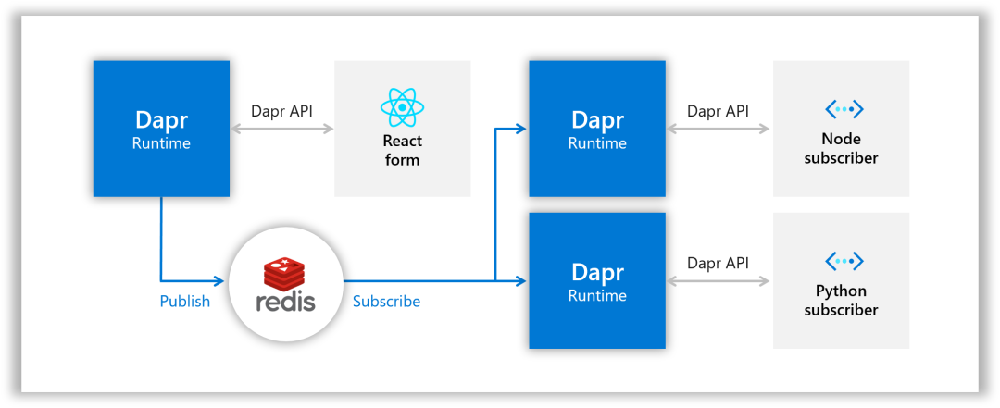
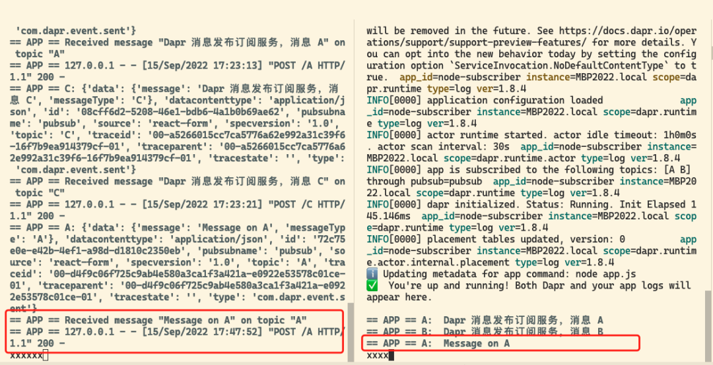
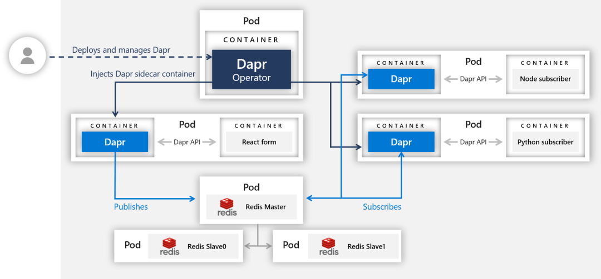
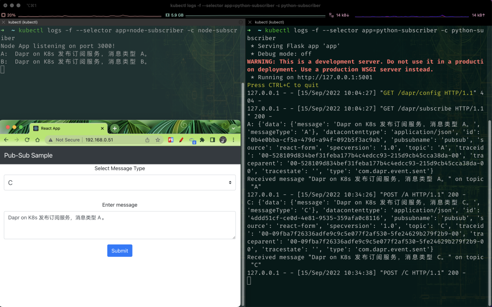

# **2 Dapr 入门教程之发布订阅**

本节我们来了解如何启用 Dapr 的发布/订阅模式，发布者将生成特定主题的消息，而订阅者将监听特定主题的信息。

* 使用发布服务，开发人员可以重复发布消息到一个主题上。
* Pub/sub 组件对这些消息进行排队处理。
* 该主题订阅者将从队列中获取到消息并处理他们。

接下来我们使用的这个示例包含一个发布者：

* React 前端消息生成器

包含另外 3 个消息订阅者：

* Node.js 订阅者
* Python 订阅者
* C# 订阅者

Dapr 使用可插拔的消息总线来支持发布-订阅，并将消息传递给 CloudEvents（一个 CNCF 项目） 作为通用的事件信封格式，以提高连接服务的互操作性。

我们这里将使用 Redis Streams（在 Redis version = > 5 中启用），当然也可以使用 RabbitMQ、Kafka 等中间件。下图是用来说明组件之间是如何在本地模式下互相连接的。



> dapr pub/sub

## **本地初始化**

Dapr 允许你将相同的微服务从本地机器部署到云环境中去，这里为了和大家说明这种便利性，我们先在本地部署这个实例项目，然后再将其部署到 Kubernetes 环境中去。

要在本地使用 Dapr 服务，需要先在本地初始化 Dapr：

```
$ dapr init
```

由于某些网络原因使用上面的命令可能并不能初始化成功，我们可以使用离线的方式进行安装，前往 https://github.com/dapr/installer-bundle/releases 下载对应系统的 Bundle 👝 包，然后解压，比如我这里是 Mac M1，使用下面的命令下载

```
$ wget https://github.com/dapr/installer-bundle/releases/download/v1.9.0%2B1/daprbundle_darwin_amd64.tar.gz
$ tar -xvf daprbundle_darwin_arm64.tar.gz
x daprbundle/
x daprbundle/README.md
x daprbundle/dapr
x daprbundle/details.json
x daprbundle/dist/
x daprbundle/dist/daprd_darwin_arm64.tar.gz
x daprbundle/dist/dashboard_darwin_arm64.tar.gz
x daprbundle/dist/placement_darwin_arm64.tar.gz
x daprbundle/docker/
x daprbundle/docker/daprio-dapr-1.8.4.tar.gz
```

然后我们可以重新使用下面的命令进行初始化：

```
 dapr init --from-dir daprbundle/
⌛  Making the jump to hyperspace...
⚠  Local bundle installation using --from-dir flag is currently a preview feature and is subject to change. It is only available from CLI version 1.7 onwards.
ℹ️  Installing runtime version 1.9.0
❌  Extracting binaries and setting up components...
❌  dapr_placement container exists or is running. please run `dapr uninstall` first before running `dapr init`
```

```
$ dapr uninstall
ℹ️  Removing Dapr from your machine...
ℹ️  Removing directory: /Users/i515190/.dapr/bin
ℹ️  Removing container: dapr_placement
✅  Dapr has been removed successfully
```

```
$ dapr init --from-dir daprbundle/
⌛  Making the jump to hyperspace...
⚠  Local bundle installation using --from-dir flag is currently a preview feature and is subject to change. It is only available from CLI version 1.7 onwards.
ℹ️  Installing runtime version 1.9.0
↘  Extracting binaries and setting up components... 
Dapr runtime installed to /Users/i515190/.dapr/bin, you may run the following to add it to your path if you want to run daprd directly:
    export PATH=$PATH:/Users/i515190/.dapr/bin
→  Extracting binaries and setting up components... Loaded image: daprio/dapr:1.9.0
✅  Extracting binaries and setting up components...
✅  Extracted binaries and completed components set up.
ℹ️  daprd binary has been installed to /Users/i515190/.dapr/bin.
ℹ️  dapr_placement container is running.
ℹ️  Use `docker ps` to check running containers.
✅  Success! Dapr is up and running. To get started, go here: https://aka.ms/dapr-getting-started
```


```
$ dapr version
CLI version: 1.9.1 
Runtime version: 1.9.0
```

> 默认会启用 zipkin 这个 tracing 服务，使用上面的命令初始化如果没有对应的容器，则可以使用 `docker run --name dapr_zipkin -d -p 9411:9411 dockerproxy.com/openzipkin/zipkin` 启动该服务。同样也需要运行一个 Redis 服务：`docker run --name dapr_redis -d -p 6379:6379 dockerproxy.com/redislabs/rejson`。


## **消息订阅服务**

这里我们还是使用前面使用的 quickstarts 这个项目，克隆项目到本地：

```
git clone [-b <dapr_version_tag>] https://github.com/dapr/quickstarts.git
```

进入 `tutorials/pub_sub` 目录下面：

```
➜  pub-sub git:(622b7d9) ls
README.md         deploy            makefile          message_b.json    node-subscriber   react-form
csharp-subscriber img               message_a.json    message_c.json    python-subscriber
```

### **运行 Node 消息订阅服务**

首先我们使用 Dapr 运行 node 消息订阅服务，导航到 node-subscriber 目录，安装依赖：

```
cd /dapr/quickstarts/tutorials/pub-sub/deploy
```

```
$ cd node-subscriber
$ npm install  # 或者 yarn
```

```
$ npm install

added 57 packages, and audited 58 packages in 6m

7 packages are looking for funding
  run `npm fund` for details

found 0 vulnerabilities
```


执行如下所示命令运行 node 消息订阅服务：


```
 dapr run --app-id node-subscriber --app-port 3000 node app.js
ℹ️  Starting Dapr with id node-subscriber. HTTP Port: 57515. gRPC Port: 57516
INFO[0000] starting Dapr Runtime -- version 1.9.0 -- commit fdce5f1f1b76012291c888113169aee845f25ef8  app_id=node-subscriber instance=C02S710EG8WM scope=dapr.runtime type=log ver=1.9.0
INFO[0000] log level set to: info                        app_id=node-
...
INFO[0000] app id: node-subscriber
...
```

上面命令中的 app-id 是微服务的唯一标识符，`--app-port` 是 Node 应用程序运行的端口，最后，运行应用程序的命令是 `node app.js`。

当看到 `== APP == Listening on port 8080!` 这样的日志时，表示应用启动成功了。然后我们就可以在浏览器中访问 http://localhost:8080 访问前端应用了。


如现在我们选择消息类型 A，然后随便输入一些消息内容，点击 Submit 发送，然后观察上面的 Node 和 Python 这两个消息订阅者服务的日志。

选择一个主题，输入一些文字，然后发送一条信息！观察通过你们各自的 Dapr 的日志


注意，Node 订阅者接收类型为 A 和 B 的消息，而 Python 订阅者接收类型为 A和 C 的消息，所以注意每个控制台窗口的日志显示。

此外 Dapr CLI 提供了一个机制来发布消息用于测试，比如我们可以使用如下命令来发布一条消息：

```
$ dapr publish --publish-app-id react-form --pubsub pubsub --topic A --data-file message_a.json
```



到这里我们就完成了使用 Dapr 来进行消息订阅发布的功能演示。


## **在 Kubernetes 中运行**

上面我们是将演示服务在本地部署的，我们知道使用 Dapr 开发的服务是和平台没关系的，可以很轻松迁移到云环境，比如现在我们再将上面的示例应用部署到 Kubernetes 集群中。

要在 Kubernetes 中运行相同的代码，首先需要设置 Redis 存储，然后部署微服务，将使用相同的微服务，但最终架构有所不同：



前面我们已经使用 Helm 安装了 bitnami 下面的 redis 应用：

```
$ helm repo add bitnami https://charts.bitnami.com/bitnami
$ helm repo update
$ helm install redis bitnami/redis
```

有了 Redis 服务过后，接着我们需要创建一个发布订阅的 Component 组件，前文是创建的一个使用 Redis 的状态管理组件，对应的组件资源清单如下所示：

```

# deploy/redis.yaml
apiVersion: dapr.io/v1alpha1
kind: Component
metadata:
  name: pubsub
spec:
  type: pubsub.redis
  version: v1
  metadata:
    # These settings will work out of the box if you use `helm install
    # bitnami/redis`.  If you have your own setup, replace
    # `redis-master:6379` with your own Redis master address, and the
    # Redis password with your own Secret's name. For more information,
    # see https://docs.dapr.io/operations/components/component-secrets .
    - name: redisHost
      value: redis-master:6379
    - name: redisPassword
      secretKeyRef:
        name: redis
        key: redis-password
auth:
  secretStore: kubernetes
```

直接应用上面的资源清单即可：

```
cd dapr/quickstarts/tutorials/pub-sub/deploy
```

```
$ kubectl apply -f deploy/redis.yaml
component.dapr.io/pubsub created

$ kubectl get components
NAME         AGE
pubsub       26s
statestore   45h
```

现在我们就有了一个使用 Redis 为中间件的发布订阅组件了，注意上面对象的类型为 `pubsub.redis`。

```
dapr dashboard -k
```


```
cd dapr/quickstarts/tutorials/pub-sub/deploy
$ kubectl apply -f node-subscriber.yaml
$ kubectl apply -f python-subscriber.yaml
$ kubectl apply -f deploy/react-form.yaml
```

部署后查看 Pod 的状态：

react-form 这个微服务会通过一个 LoadBalancer 类型的 Service 来对外暴露服务：

```
$ kubectl get svc
NAME                     TYPE           CLUSTER-IP       EXTERNAL-IP   PORT(S)                               AGE
kubernetes               ClusterIP      10.96.0.1        <none>        443/TCP                               12d
node-subscriber-dapr     ClusterIP      None             <none>        80/TCP,50001/TCP,50002/TCP,9090/TCP   16m
nodeapp                  LoadBalancer   10.106.97.78     localhost     80:30822/TCP                          4d1h
nodeapp-dapr             ClusterIP      None             <none>        80/TCP,50001/TCP,50002/TCP,9090/TCP   4d1h
python-subscriber-dapr   ClusterIP      None             <none>        80/TCP,50001/TCP,50002/TCP,9090/TCP   16m
pythonapp-dapr           ClusterIP      None             <none>        80/TCP,50001/TCP,50002/TCP,9090/TCP   3d13h
react-form               LoadBalancer   10.110.67.46     <pending>     80:31250/TCP                          13m
react-form-dapr          ClusterIP      None             <none>        80/TCP,50001/TCP,50002/TCP,9090/TCP   13m
redis-headless           ClusterIP      None             <none>        6379/TCP                              4d2h
redis-master             ClusterIP      10.100.189.63    <none>        6379/TCP                              4d2h
redis-replicas           ClusterIP      10.111.120.168   <none>        6379/TCP 
```

然后我们就可以通过分配的 `EXTERNAL-IP` 访问前端服务了。同样在前端页面发送几个不同的消息通知，然后使用 kubectl logs 观察 Node 和 Python 订阅服务的日志。

```
$ kubectl logs --selector app=node-subscriber -c node-subscriber
$ kubectl logs --selector app=python-subscriber -c python-subscriber
```



## **如何工作**

现在，我们已经在本地和 Kubernetes 中运行了订阅发布示例应用，接下来我们来分析下这是如何工作的。该应用程序分为两个订阅者和一个发布者

### **Node 消息订阅服务**

重新导航到 node-scriber 目录并查看 Node.js 订阅者代码 app.js，该服务通过 Express 暴露了三个 API 端点。第一个是 GET 端点:

```
app.get("/dapr/subscribe", (_req, res) => {
  res.json([
    {
      pubsubname: "pubsub",
      topic: "A",
      route: "A",
    },
    {
      pubsubname: "pubsub",
      topic: "B",
      route: "B",
    },
  ]);
});
```

该段代码是告诉 Dapr 要订阅 pubsub 这个组件的哪些主题，**其中的 `route` 表示使用路由到那个端点来处理消息，当部署（本地或 Kubernetes）时**，Dapr 将调用服务以确定它是否订阅了任何内容。其他两个端点是后端点：

```
app.post("/A", (req, res) => {
  console.log("A: ", req.body.data.message);
  res.sendStatus(200);
});

app.post("/B", (req, res) => {
  console.log("B: ", req.body.data.message);
  res.sendStatus(200);
});
```

这两个端点处理来自每个主题类型的消息，我们这里只是记录消息，当然在更复杂的应用程序中，这里就是需要处理业务逻辑的地方了。

此外我们也可以直接通过创建一个 Subscription 的对象来声明在哪些服务里面来订阅组件中的哪些主题。


###**Python 消息订阅服务**

同样导航到 python-subscriber 目录，查看 Python 订阅服务的代码文件 app.py。与 Node.js 订阅者一样，我们暴露了三个 API 端点，只是这里使用的是 flask，第一个是 GET 端点:

```
@app.route('/dapr/subscribe', methods=['GET'])
def subscribe():
    subscriptions = [{
        'pubsubname': 'pubsub', 'topic': 'A', 'route': 'A'
    }, {
        'pubsubname': 'pubsub', 'topic': 'C', 'route': 'C'
    }]
    return jsonify(subscriptions)
```

同样的方式，这是告诉 Dapr 要订阅 pubsub 组件的哪些主题，这里我们订阅的组件名为 pubsub 的，主题为 A 和 C，这些主题的消息通过其他两个路由进行处理

```
@app.route('/A', methods=['POST'])
def a_subscriber():
    print(f'A: {request.json}', flush=True)
    print('Received message "{}" on topic "{}"'.format(request.json['data']['message'], request.json['topic']), flush=True)
    return json.dumps({'success':True}), 200, {'ContentType':'application/json'}

@app.route('/C', methods=['POST'])
def c_subscriber():
    print(f'C: {request.json}', flush=True)
    print('Received message "{}" on topic "{}"'.format(request.json['data']['message'], request.json['topic']), flush=True)
    return json.dumps({'success':True}), 200, {'ContentType':'application/json'}
```

### **React 前端应用**


上面是两个订阅服务，接下来查看下发布者，我们的发布者分为客户端和服务器。

客户端是一个简单的单页 React 应用程序，使用 Create React App 启动，相关的客户端代码位于`react-form/client/src/MessageForm.js`，当用户提交表单时，将使用最新的聚合 JSON 数据更新 React 状态。默认情况下，数据设置为：

```
{
    messageType: "A",
    message: ""
};
```

提交表单后，聚合的 JSON 数据将发送到服务器：

```
fetch("/publish", {
  headers: {
    Accept: "application/json",
    "Content-Type": "application/json",
  },
  method: "POST",
  body: JSON.stringify(this.state),
});
```

服务端是一个典型的 express 应用程序，它暴露了一个 POST 端点：/publish。这样可以从客户端接收请求，并根据 Dapr 发布它们。Express 内置的 JSON 中间件函数用于解析传入请求中的 JSON：

```
app.use(express.json());
```

这样我们可以获取到提交的 messageType，可以确定使用哪个主题来发布消息。要使用 Dapr 来发布消息，同样也是直接使用 Dapr 提供的 API 端点 `http://localhost:<DAPR_URL>/publish/<PUBSUB_NAME>/<TOPIC>` 即可，根据获取到的数据构建 Dapr 消息发布的 URL，提交 JSON 数据，POST 请求还需要在成功完成后返回响应中的成功代码

```
const publishUrl = `${daprUrl}/publish/${pubsubName}/${req.body?.messageType}`;
await axios.post(publishUrl, req.body);
return res.sendStatus(200)
```

daprUrl 的地址所在的端口可以用下面的代码来获取：

```
const daprUrl = `http://localhost:${process.env.DAPR_HTTP_PORT || 3500}/v1.0`;
```

默认情况下，Dapr 在 3500 上运行，但如果我们在本地运行 Dapr 并将其设置为其他端口（使用 CLI run 命令中的 `--app-port` 标志），则该端口将作为环境变量注入应用程序。

此外服务端还通过将默认主页 `/ `路由请求转发到构建的客户端代码来托管 React 应用程序本身：

```
app.get("/", function (_req, res) {
  res.sendFile(path.join(__dirname, "client/build", "index.html"));
});
```

所以我们可以直接通过服务端来访问到前端页面。

发布-订阅模式是我们微服务开发中非常重要的一个模式，可以用来实现高可伸缩性和松耦合。发布订阅通常用于需要高度可伸缩的大型应用程序，发布和订阅应用程序通常比传统的 client/server 应用程序具有更好的伸缩性。Pub-sub 允许我们完全解耦组件，发布者不必知道他们的任何订阅者，订阅者也不必知道发布者。


这使得开发人员可以编写更精简的微服务，而不会直接依赖彼此。