# **4 Dapr 可观测性之分布式追踪**

在构建应用程序时，了解系统的行为方式是运维它的重要部分——这包括能够观察应用程序的内部调用、衡量其性能并在问题发生时能够立即找到问题。这对任何系统来说都是具有挑战性的，对于由多个微服务组成的分布式系统更是如此，其中由多个调用组成的流可能在一个微服务中开始，但在另一个微服务中继续调用。


可观测性在生产环境中至关重要，在开发过程中对于了解瓶颈、提高性能和跨微服务执行基本调试也很有用。


虽然可以从底层基础架构中收集有关应用程序的一些数据（例如内存消耗、CPU 使用情况），**但必须从应用程序感知层收集其他有意义的信息**——该层可以显示如何执行一系列重要的调用跨微服务。这通常意味着开发人员必须为此添加一些代码来检测应用程序。通常，检测代码只是将收集到的数据（例如追踪和指标）发送到外部监控工具或服务，以帮助存储、可视化和分析这些信息


由于这部分代码并不是应用程序的核心逻辑，所以这自然成为了开发人员的另一个负担，有时需要了解监控工具的 API，使用额外的 SDK 等。这种工具也可能会增加应用程序的可移植性挑战。应用程序可能需要不同的工具，具体取决于应用程序的部署环境。例如，不同的云提供商提供不同的监控解决方案，本地部署可能需要本地解决方案。

用于获得可观测性的系统信息**被称为 telemetry（遥测）**，它可以分为四大类。

* **Distributed tracing（分布式追踪） 提供了对参与分布式业务通信的服务之间流量的洞察力**。
* Metrics（指标） 提供了对服务性能及其资源消耗的洞察力。
* Logging（日志） 提供了对代码如何执行以及是否发生错误的洞察力。
* Health（健康） 端点提供了对服务可用性的洞察力。


Dapr 可观测性构件将可观测性与应用解耦，它自动捕捉由构成 Dapr 控制平面的 Dapr sidecar 和 Dapr 系统服务产生的流量。该模块将跨越多个服务的单个操作的流量进行关联。它还暴露了性能指标、资源利用率和系统的健康状况。遥测数据以开放标准的格式发布，使信息能够被输入你选择的监控后端。在那里，这些信息可以被可视化、查询和分析。


**由于 Dapr 进行了抽象，所以应用程序不知道可观测性是如何实现的。不需要开发者关心如何去实现这部分与核心业务逻辑无关的代码，Dapr 允许开发者专注于构建业务逻辑，而不是观察能力的建设。**观察力是在 Dapr 系统层面上配置的，并且在不同的服务中是一致的，即使是由不同的团队创建，并使用不同的技术栈构建。


## **如何工作**

Dapr 的 sidecar 架构实现了内置的可观测性功能，当服务进行通信时，Dapr sidecars 拦截流量并提取追踪、指标和日志信息，遥测数据以开放标准格式进行发布，默认 Dapr 支持 OpenTelemetry 和 Zipkin。

Dapr 提供 collectors 收集器，可以将遥测数据发布到不同的后端监控工具，这些工具将 Dapr 遥测数据呈现出来，用于分析和查询。图 10-1 显示了 Dapr 的可观察性架构

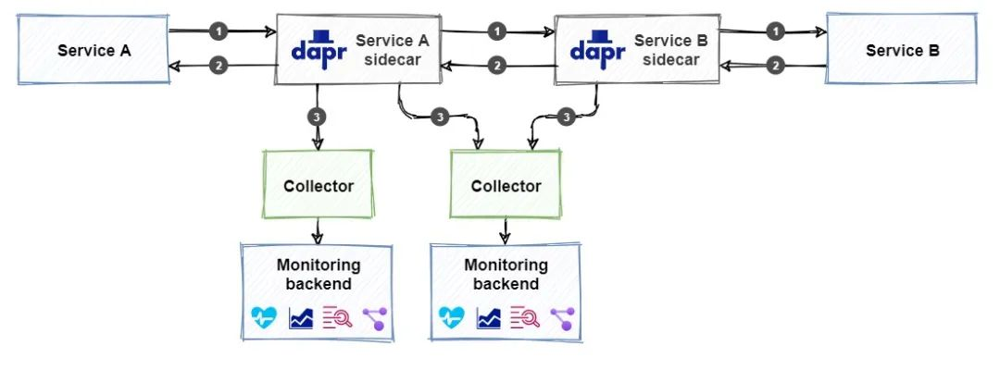

不过需要注意的是添加可观测性的支持不同于配置其他 Dapr 构建块，比如前面我们介绍的发布订阅或者状态管理这些组件，我们不需要引用构建块了，而是添加收集器和监控后端，上图显示我们可以配置多个与不同监控后端集成的收集器。

下面我们来分别对可观测性的几个遥测类型进行说明。

## **分布式追踪**

分布式追踪提供了对分布式应用中跨服务流动流量的洞察力。交换的请求和响应信息的日志是排除问题的重要信息来源，比较困难的是把属于同一业务事务的消息整合起来

Dapr 使用 W3C Trace Context 这个统一的标准来关联相关信息，它将相同的上下文信息注入到一次完整的请求和响应中。

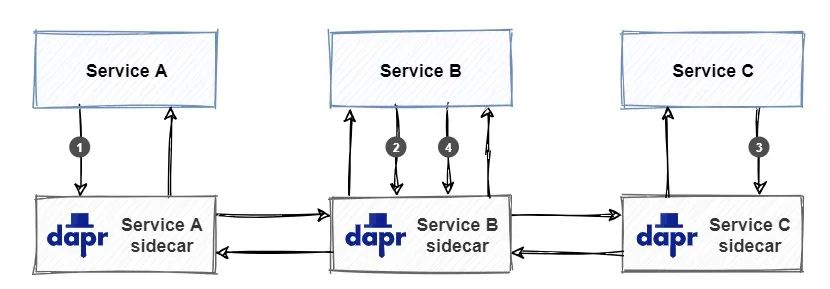

上图显示了一个 W3C Trace Context 标准的示例：

* 服务 A 调用服务 B 上的操作。当服务 A 开始调用时，**Dapr 创建一个唯一的 trace context 并将其注入到请求中**。
* 服务 B 接收请求并调用服务 C 上的操作。**Dapr 检测到传入请求包含 trace context 并通过将其注入到服务 C 的传出请求中来传播它**。
* 服务 C 接收请求并处理它。**Dapr 检测到传入的请求包含 trace context**，并通过将其注入到传出响应中返回给服务 B 来传播它。
* 服务 B 接收响应并处理它。然后它创建一个新的响应并通过将其注入到传出响应**中来传播 trace context 并返回到服务 A**。

一组属于一起的请求和响应就称为 trace（追踪），如下图所示：

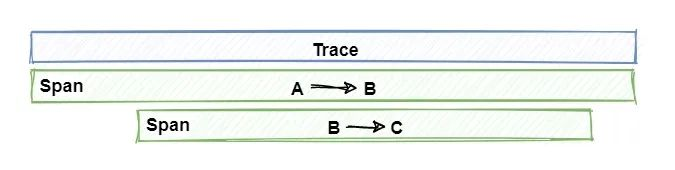

注意查看上图 trace 是如何代表一个发生在许多服务中的独特应用事务的。一个 trace 是一系列 spans 集合组成的，每个 span 代表一个单一的操作或在 trace 中完成的工作单位。Spans 是在实现单一事务的服务之间发送的请求和响应。

接下来我们来讨论如何通过将遥测数据发布到对应的监控后端。


## **使用 Zipkin**

Zipkin 是一个开源的分布式追踪系统，它可以摄取和可视化遥测数据。

Dapr 为 Zipkin 提供了默认支持。

当 Dapr 在自托管模式下初始化 (dapr init) 时，多个容器会部署到本地 Docker，可以运行 docker ps 命令查看本地运行的所有容器，确保 Zipkin 容器已启动并正在运行，并记下它正在运行的端口（默认为 9411）。

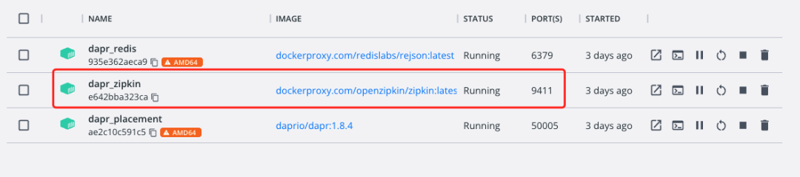

如果没有 Zipkin 容器服务运行，可以使用下面的命令来进行启动：

```
➜  docker run --name dapr_zipkin -d -p 9411:9411 openzipkin/zipkin
```

此时其实我们即可在浏览器中通过 http://localhost:9411 访问到 Zipkin 的 Web 页面，在 Dashboard 中我们可以搜索查看已通过 Dapr 可观测性构建块记录的遥测数据。

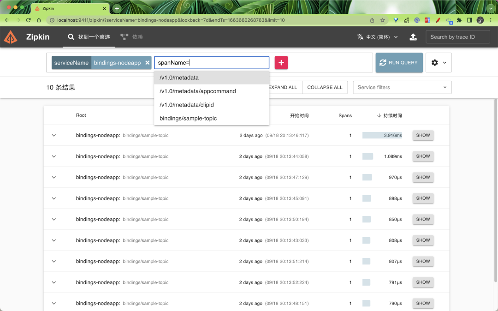

在搜索结果中点击 SHOW 按钮即可查看详细的遥测数据。

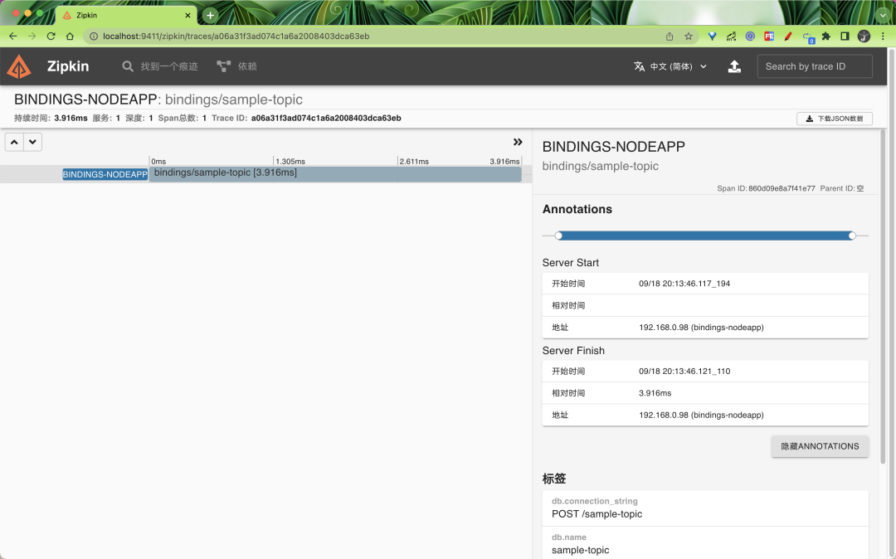

我们可以发现在本地自拓管模式下面并没有做任何的关于 Zipkin 的配置，当有服务请求经过了 `Dapr sidecar `过后，Zipkin 中就有了对应的遥测数据了，这是因为自拓管模式下面默认就启用了 Zipkin 来收集遥测数据。相关的配置位于 `$HOME/.dapr/config.yaml`，内容如下所示：

```
apiVersion: dapr.io/v1alpha1
kind: Configuration
metadata:
  name: daprConfig
spec:
  tracing:
    samplingRate: "1"
    zipkin:
      endpointAddress: http://localhost:9411/api/v2/spans
```

所以如果是在 Kubernetes 模式下面要启用 Zipkin 作为 tracing 后端，则需要单独创建 Configuration 对象才行。

首先，必须使用 `Dapr `配置文件为 Dapr 运行时启用 tracing。下面是一个名为 `dapr-config.yaml` 的配置文件示例，它启用了 tracing：

```
# dapr-config.yaml
apiVersion: dapr.io/v1alpha1
kind: Configuration
metadata:
  name: appconfig
spec:
  tracing:
    samplingRate: "1"
    zipkin:
      endpointAddress: "http://zipkin.default.svc.cluster.local:9411/api/v2/spans"
```

可以看到该配置文件和本地的配置几乎一致，唯一不同的就是 zipkin.endpointAddress 的地址不同。

**其中的 samplingRate 属性指定了用于发布追踪的间隔时间，这个值必须在 0（禁止追踪）和 1（每条追踪都被发布）之间**。

例如，值为 0.5 时，则表示每隔一段时间就发布一次 trace，这样就大大减少了发布流量。我们这里的 `zipkin.endpointAddress ` 指向 Kubernetes 集群中运行的 Zipkin 服务器，Zipkin 的默认端口是 9411。直接应用该资源对象即可：


当然还需要手动部署 Zipkin 服务，对应的资源清单文件如下所示：

```
# zipkin.yaml
kind: Deployment
apiVersion: apps/v1
metadata:
  name: zipkin
  namespace: default
  labels:
    service: zipkin
spec:
  selector:
    matchLabels:
      service: zipkin
  template:
    metadata:
      labels:
        service: zipkin
    spec:
      containers:
        - name: zipkin
          image: openzipkin/zipkin-slim
          imagePullPolicy: IfNotPresent
          ports:
            - name: http
              containerPort: 9411
              protocol: TCP
---
kind: Service
apiVersion: v1
metadata:
  name: zipkin
  namespace: default
  labels:
    service: zipkin
spec:
  type: NodePort
  ports:
    - port: 9411
      targetPort: 9411
      nodePort: 32411
      protocol: TCP
      name: zipkin
  selector:
    service: zipkin
```


这里我们使用的 `openzipkin/zipkin-slim` 容器镜像，`Zipkin Service` 暴露了 Zipkin Web 前端，可以通过 32411 端口来进行访问。同样直接应用上面的资源清单：

```
➜  kubectl apply -f zipkin.yaml
```

部署完成后可以查看 Pod 状态了解应用是否部署成功：

```

➜  kubectl get pods -l service=zipkin
NAME                     READY   STATUS    RESTARTS   AGE
zipkin-f5c696fb7-94mqz   1/1     Running   0          3m9s
➜  kubectl get svc -l service=zipkin
NAME     TYPE       CLUSTER-IP     EXTERNAL-IP   PORT(S)          AGE
zipkin   NodePort   10.102.75.84   <none>        9411:32411/TCP   30s
```

部署成功后可以通过 `http:<node-ip>:32411` 来访问 Zipkin Web 页面。

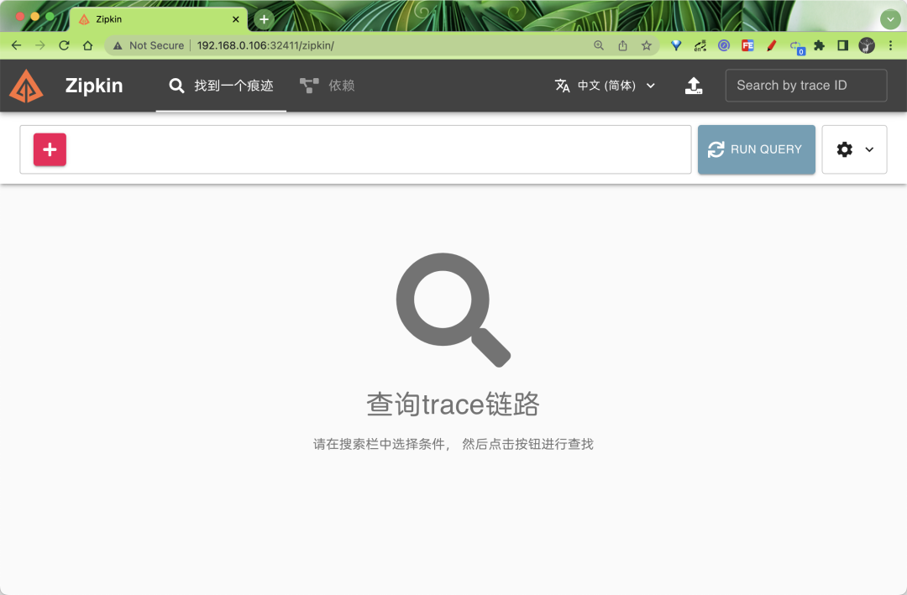

接下来我们就可以发布遥测数据了，需要注意的是我们需要在每个 Dapr sidecar 在启动时发出遥测数据，为此需要为应用添加一个 dapr.io/config 注解。

同样这里我们还是以 quickstarts 示例进行说明，定位到 tutorials/distributed-calculator 目录下面：

```
➜  git clone [-b <dapr_version_tag>] https://github.com/dapr/quickstarts.git
➜  cd tutorials/distributed-calculator
```

该示例是一个分布式计算器，展示了 Dapr 的方法调用和状态持久化功能，其中每个操作都由用不同语言/框架编写的服务提供支持:


* Addition: Go mux application
* Multiplication: Python flask application
* Division: Node Express application
* Subtraction: .NET Core application

前端应用由一个服务端和一个用 React 编写的客户端组成，源码地址：React calculator 。

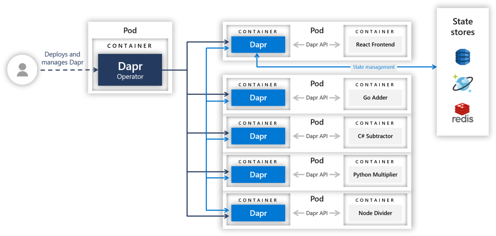

上图为该示例应用各个组件的组成和服务架构。

我们可以随便查看一个微服务的部署清单，位于 `deploy/` 目录下面，比如 

`go-adder.yaml`

```
# go-adder.yaml
apiVersion: apps/v1
kind: Deployment
metadata:
  name: addapp
  labels:
    app: add
spec:
  replicas: 1
  selector:
    matchLabels:
      app: add
  template:
    metadata:
      labels:
        app: add
      annotations:
        dapr.io/enabled: "true"
        dapr.io/app-id: "addapp"
        dapr.io/app-port: "6000"
        dapr.io/config: "appconfig"
    spec:
      containers:
        - name: add
          image: ghcr.io/dapr/samples/distributed-calculator-go:latest
          env:
            - name: APP_PORT
              value: "6000"
          ports:
            - containerPort: 6000
          imagePullPolicy: Always
```

上面的资源清单中我们通过 dapr.io/config 注解指定了使用 appconfig 这个配置文件，该配置文件中使用了 Zipkin 服务来获取遥测数据，其他微服务中也使用了该注解，所以当应用部署完成后，Zipkin 就能获取到相应的遥测数据。

> 需要注意 dapr.io/config 后面指定的 Configuration 对象需要和当前应用位于同一个命名空间之下。

直接部署该示例应用：

```
➜  kubectl apply -f deploy/
```

部署完成后我们可以通过 dapr configurations 命令查看当前集群中的所有配置信息：

```
 $ dapr configurations -k -A
  NAMESPACE  NAME       TRACING-ENABLED  METRICS-ENABLED  AGE  CREATED
  default    appconfig  true             true             1m   2022-09-20 17:01.21
```

同样在 Dashboard 中也可以看到该配置信息：

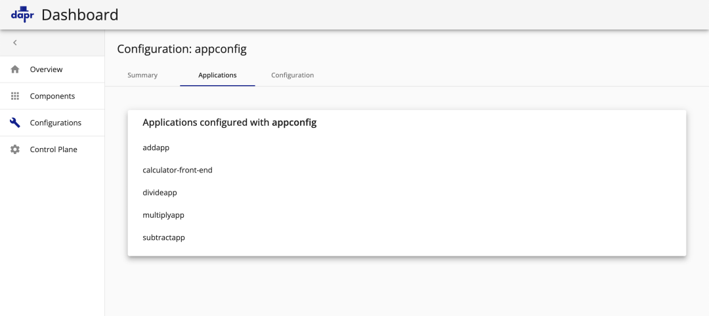

应用部署完成后查看 Pod 的状态：

```
➜  kubectl get pods
NAME                                    READY   STATUS    RESTARTS         AGE
addapp-84c9764fdb-72mxf                 2/2     Running   0                74m
calculator-front-end-59cbb6658c-rbctf   2/2     Running   0                74m
divideapp-8476b7fbb6-kr8dr              2/2     Running   0                74m
multiplyapp-7c45fbbf99-hrmff            2/2     Running   0                74m
subtractapp-58645db87-25tg9             2/2     Running   0                62m
➜  kubectl get svc
NAME                        TYPE           CLUSTER-IP       EXTERNAL-IP    PORT(S)                               AGE
addapp-dapr                 ClusterIP      None             <none>         80/TCP,50001/TCP,50002/TCP,9090/TCP   8m29s
calculator-front-end        LoadBalancer   10.110.177.32    192.168.0.54   80:31701/TCP                          8m29s
calculator-front-end-dapr   ClusterIP      None             <none>         80/TCP,50001/TCP,50002/TCP,9090/TCP   8m29s
divideapp-dapr              ClusterIP      None             <none>         80/TCP,50001/TCP,50002/TCP,9090/TCP   8m29s
multiplyapp-dapr            ClusterIP      None             <none>         80/TCP,50001/TCP,50002/TCP,9090/TCP   8m29s
subtractapp-dapr            ClusterIP      None             <none>         80/TCP,50001/TCP,50002/TCP,9090/TCP   8m29s
zipkin                      NodePort       10.108.46.223    <none>         9411:32411/TCP                        16m
```


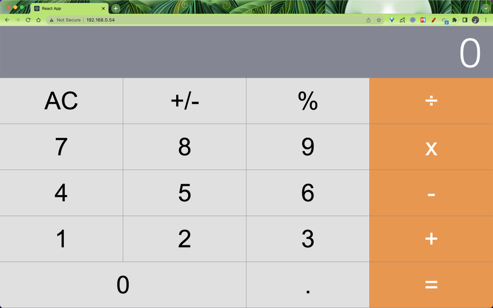

打开浏览器的控制台窗口(使用 F12 键) ，查看在使用计算器时生成的日志。请注意，每次单击按钮时，都会看到表示状态持久性的日志:

```
Rehydrating State:
{total: "21", next: "2", operation: "x"}
```

还要注意，每次输入一个完整的方程式(例如 126 ÷ 3 =) ，日志都会指示对服务的调用:

```
Calling divide service
```

客户端代码调用 Express 服务器，后者将调用通过 Dapr 路由到后端服务。在这种情况下，在 nodejs 应用程序上调用 divide 端点。

当我们操作应用的时候，后面就有网络请求产生，也就有了微服务之间的调用，所以此时就会参数对应的 trace 遥测数据，我们可以前往 Zipkin 查询下数据

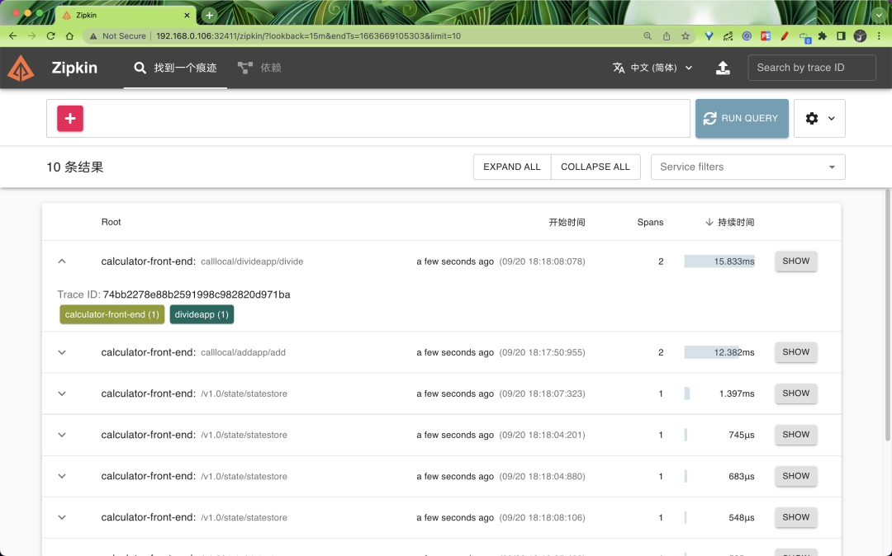

点击 SHOW 就可以看到详细的遥测数据。

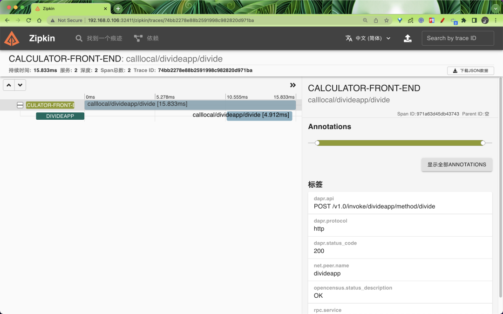


同样的除了 Zipkin，其他监视后端软件也可引入 Zipkin 格式的遥测，比如 Jaeger，Jaeger 是由 Uber 创建的开源追踪系统。它用于跟踪分布式服务之间的事务，并对复杂的微服务环境进行故障排除，又比如 New Relic 是一个全堆栈可观测性平台，它可以链接来自分散应用程序的相关数据，以提供系统的完整图片 要试用它们，只需要在 Dapr 配置文件中指定一个指向 Jaeger 或 New Relic 服务器的 endpointAddress 即可。下面是配置 Dapr 以将遥测发送到 Jaeger 服务器的配置文件示例。Jaeger 的 URL 与 Zipkin 的 URL 相同。唯一的区别是服务器运行的端口号：
       

```
apiVersion: dapr.io/v1alpha1
kind: Configuration
metadata:
  name: dapr-config
  namespace: default
spec:
  tracing:
    samplingRate: "1"
    zipkin:
      endpointAddress: "http://localhost:9415/api/v2/spans"
```

同样如果要使用 New Relic，则需要将 endpointAddress 指定为 New Relic API 的地址。
 
 


