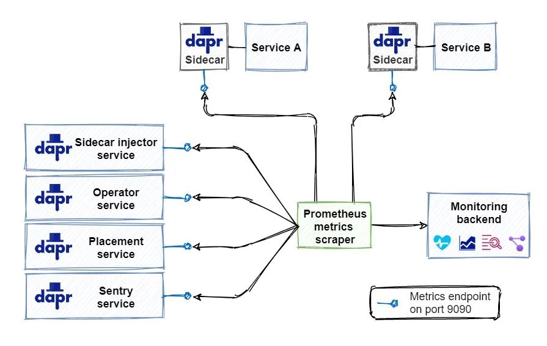
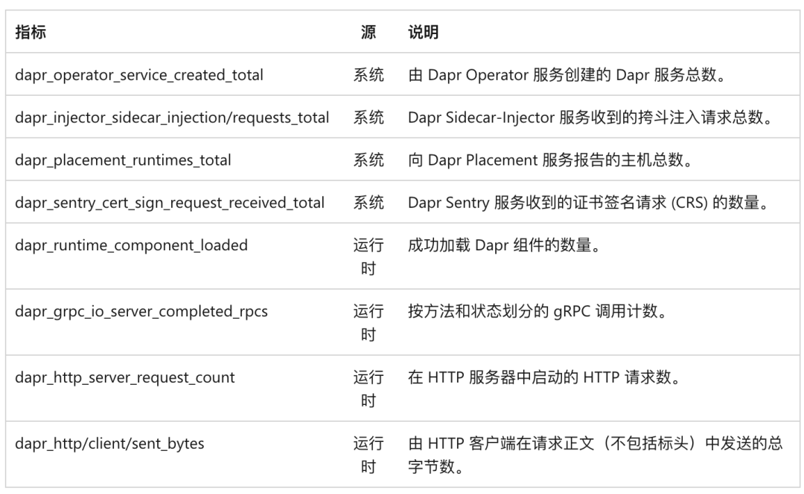
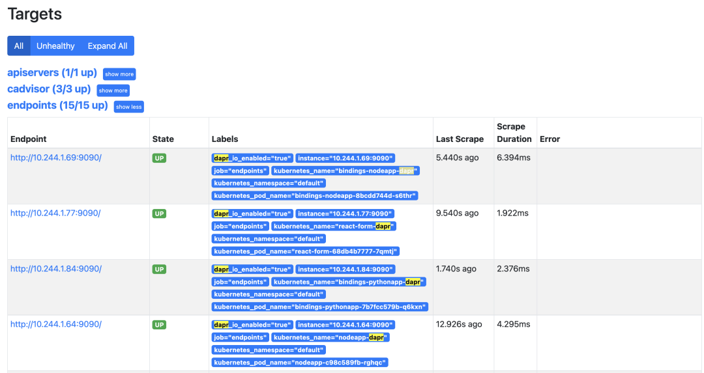
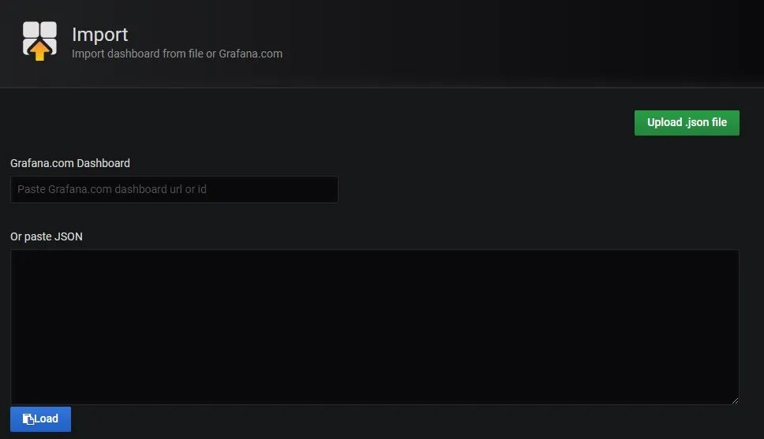
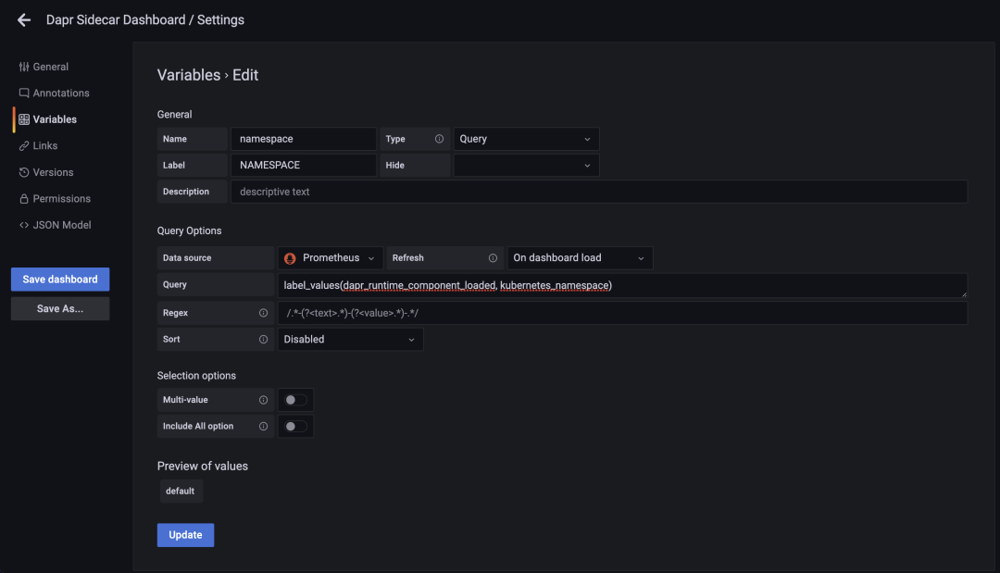
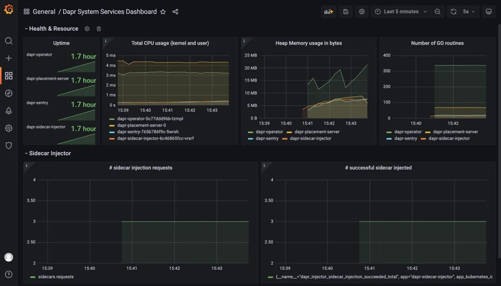
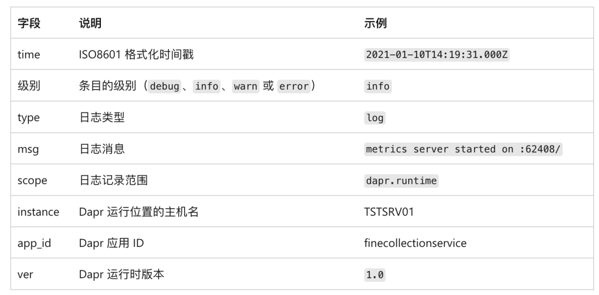

# **5 Dapr 可观测性之指标与日志**

## 指标

指标可让你深入了解应用性能和资源消耗情况，在后台，Dapr 发出各种系统和运行时指标的集合。

**Dapr 使用 Prometheus 作为指标标准，Dapr 和系统服务在端口 9090 上暴露指标数据。**

Prometheus scraper 以预定义的时间间隔调用该接口收集指标数据，scraper 将指标值发送到监控后端，如下所示：



你可能想知道指标抓取器如何知道在何处收集指标，Prometheus 可与内置在目标部署环境中的发现机制集成。

例如在 Kubernetes 中运行时，Prometheus 可与 Kubernetes API 集成，以查找环境中运行的所有可用 Kubernetes 资源。

Dapr 为 Dapr 系统服务及其运行时生成了大量指标，如下表格所示：



**在运行时，可以通过在 Dapr 命令中包含 `--enable-metrics=false` 的参数来禁用指标收集，也可使用 `--metrics-port 9090` 参数更改指标端点的默认端口**。

**你还可以通过为应用程序部署设置 `dapr.io/enable-metrics: "false"` 注解来禁用特定应用程序的指标导出器，禁用指标导出器后，daprd 将不会打开指标监听端口**。

以下示例显示使用指定为 9090 的端口显式启用指标。

```
apiVersion: apps/v1
kind: Deployment
metadata:
  name: nodeapp
spec:
  selector:
    matchLabels:
      app: node
  template:
    metadata:
      labels:
        app: node
      annotations:
        dapr.io/enabled: "true"
        dapr.io/app-id: "nodeapp"
        dapr.io/app-port: "3000"
        dapr.io/enable-metrics: "true"
        dapr.io/metrics-port: "9090"
    spec:
      containers:
        - name: node
          image: dapriosamples/hello-k8s-node:latest
          ports:
            - containerPort: 3000
          imagePullPolicy: Always
```

你也可以使用 Dapr 配置文件的方式启用或禁用运行时指标收集：

```
apiVersion: dapr.io/v1alpha1
kind: Configuration
metadata:
  name: dapr-config
spec:
  tracing:
    samplingRate: "1"
  metric:
    enabled: false # 禁用指标
```

Prometheus 抓取器收集指标并将其发布到监视后端后，此时我们就可以使用 Grafana 来创建仪表盘，包括监控 Dapr 系统服务和 sidecar，我们可以直接导入 Dapr 提供的仪表盘模板来监控 Dapr，地址 [https://github.com/dapr/dapr/tree/master/grafana](https://github.com/dapr/dapr/tree/master/grafana)，其中包含 3 个仪表盘。

* Dapr 系统服务状态 - `dapr-operator`、`dapr-sidecar-injector`、`dapr-sentry` 和 `dapr-placement`
* Dapr 边车仪表板 - **显示 Dapr sidecar 状态，包括 sidecar 运行状况/资源、HTTP 和 gRPC 的吞吐量/延迟、Actor、mTLS 等**。
* Dapr Actor 仪表板 - 显示 Dapr sidecar 状态，包括 actor 调用吞吐量/延迟、计时器/提醒触发器和基于轮次的并发。

所以首先需要安装 Prometheus 和 Grafana，并且要配置 Prometheus 基于 Kubernetes 的自动发现（基于 Endpoints 和 Pods 都需要配置），将 Prometheus 配置为 Grafana 的数据源，我们这里已经部署了这两个应用

```
$ kubectl get svc -n kube-mon
NAME          TYPE       CLUSTER-IP       EXTERNAL-IP   PORT(S)          AGE
grafana       NodePort   10.99.209.245    <none>        3000:30403/TCP   39d
prometheus    NodePort   10.100.236.253   <none>        9090:31561/TCP   81d
$ kubectl get pods -n kube-mon
NAME                           READY   STATUS    RESTARTS       AGE
grafana-d877667d6-4vgnd        1/1     Running   25 (60m ago)   39d
node-exporter-49l4f            1/1     Running   48 (60m ago)   81d
node-exporter-khqls            1/1     Running   46 (60m ago)   81d
node-exporter-wjwtb            1/1     Running   47 (60m ago)   81d
prometheus-649968556c-szb9c    1/1     Running   11 (60m ago)   14d
```

由于 Prometheus 配置了自动发现，所以正常默认情况下会自动抓取到 Dapr 应用的指标，可以在 Prometheus 的 Targets 列表中查找：



然后我们可以在 Grafana 中分别导入 [https://github.com/dapr/dapr/tree/master/grafana](https://github.com/dapr/dapr/tree/master/grafana) 提供的 3 个 Dashboard。



不过直接导入后的 Dashboard 可能不会直接显示，需要做一些修改，将数据源修改为实际配置的数据源



按照自己的系统配置后正常就可以看到仪表盘数据了。以下是显示 Dapr 系统服务指标的仪表板示例：



## **日志**

日志可让你深入了解服务在运行时发生的情况，运行应用程序时，Dapr 将自动从 Dapr sidecar 和 Dapr 系统服务发出日志数据，但是，在应用程序代码中检测到的日志不会自动包含在内。若要从应用程序代码发出日志记录，可以导入特定的 SDK，例如 OpenTelemetry SDK。

Dapr 会发出结构化日志，每个日志条目采用以下格式



在排查问题的时候，其中的 time 和 level 字段非常有用，time 字段将对日志条目进行排序，这样就可以准确查找特定的时间段。在进行故障排除时，debug 级别的日志条目会提供有关代码行为的详细信息。

此外默认情况下，Dapr 以纯文本格式发出结构化日志数据。每个日志条目都被格式化为包含键/值对的字符串，下面是纯文本格式的日志记录示例：

```
time="2020-03-11T17:08:48.303776-07:00" level=info msg="starting Dapr Runtime -- version 0.5.0-rc.3 -- commit v0.3.0-rc.0-155-g5dfcf2e" instance=dapr-pod-xxxx scope=dapr.runtime type=log ver=0.5.0-rc.3
time="2020-03-11T17:08:48.303913-07:00" level=info msg="log level set to: info" instance=dapr-pod-xxxx scope=dapr.runtime type=log ver=0.5.0-rc.3
```

虽然这种格式很简单，但很难解析，如果我们使用日志收集工具的话，使用 JSON 格式的日志则更容易解析。使用 JSON 条目时，日志工具可以索引和查询各个字段。下面是 JSON 格式的相同日志条目：

```
{"instance":"dapr-pod-xxxx","level":"info","msg":"starting Dapr Runtime -- version 0.5.0-rc.3 -- commit v0.3.0-rc.0-155-g5dfcf2e","scope":"dapr.runtime","time":"2020-03-11T17:09:45.788005Z","type":"log","ver":"0.5.0-rc.3"}
{"instance":"dapr-pod-xxxx","level":"info","msg":"log level set to: info","scope":"dapr.runtime","time":"2020-03-11T17:09:45.788075Z","type":"log","ver":"0.5.0-rc.3"}
```

若要启用 JSON 格式，需要配置每个 Dapr sidecar，在自托管模式下，可以在命令行上指定标志 `--log-as-json`：

```
dapr run --app-id nodeapp --log-level info --log-as-json node app.js
```

在 Kubernetes 中，可以为应用程序的每个部署添加一个 `dapr.io/log-as-json` 注解，如下所示：

```
annotations:
  dapr.io/enabled: "true"
  dapr.io/app-id: "calculator-front-end"
  dapr.io/app-port: "80"
  dapr.io/config: "dapr-config"
  dapr.io/log-as-json: "true"
```

当使用 Helm 在 Kubernetes 群集中安装 Dapr 时，可以为所有 Dapr 系统服务启用 JSON 格式的日志记录：

```
helm repo add dapr https://dapr.github.io/helm-charts/
helm repo update
kubectl create namespace dapr-system
helm install dapr dapr/dapr --namespace dapr-system --set global.logAsJson=true
```

由 Dapr 发出的日志可以输入到监控后端，以供分析。日志收集器是一个组件，用于从系统收集日志并将其发送到监控后端，常用的日志收集器是 Fluentd，前面课程中我们已经介绍过如何在 Kubernetes 中设置 Fluentd、Elastic search 和 Kibana 来收集日志，也可以直接参考官方文档 https://docs.dapr.io/operations/monitoring/logging/fluentd/ 再次进行了解。

## **运行状况**

服务的运行状态提供对其可用性的见解，每个 Dapr sidecar 都会暴露一个运行状况的 API，宿主环境可以使用该 API 来确定 sidecar 的运行状况。

```
GET http://localhost:3501/v1.0/healthz
```

该操作返回两个 HTTP 状态代码：

* 204：sidecar 运行正常时
* 500：sidecar 运行状况不正常

在自拓管模式下运行时，不会自动调用运行状况 API，不过，可以通过应用程序代码或运行状态监视工具调用 API。

在 Kubernetes 中运行时，Dapr sidecar-injector 会自动将 Kubernetes 配置为使用运行状况 API 来执行存活性探针和就绪探针

Kubernetes 使用存活性探针来确定容器是否已启动并正在运行，如果存活性探针返回失败代码，Kubernetes 将假定容器状态为“死亡”并自动重启该容器，此功能可提高应用程序的整体可用性。

Kubernetes 使用就绪探针来确定容器是否已准备好开始接受流量，当某个 Pod 的所有容器都准备就绪时，就视为它已经准备就绪了，就绪情况决定 Kubernetes 服务是否可以在负载均衡场景中将流量路由到 Pod，未就绪的 Pod 将自动从负载均衡器中删除。

存活性探针和就绪探针具有多个可配置参数，两者都是在 Pod 清单文件的容器规范部分配置的。对于每个 sidecar 容器，Dapr 默认使用以下配置：

```
livenessProbe:
  httpGet:
    path: v1.0/healthz
    port: 3501
  initialDelaySeconds: 5
  periodSeconds: 10
  timeoutSeconds: 5
  failureThreshold: 3
readinessProbe:
  httpGet:
    path: v1.0/healthz
    port: 3501
  initialDelaySeconds: 5
  periodSeconds: 10
  timeoutSeconds: 5
  failureThreshold: 3
```

以下参数可用于探针：

* path 指定 Dapr 运行状况 API 端点
* port 指定 Dapr 运行状况 API 端口
* initialDelaySeconds 指定 Kubernetes 在首次开始探针容器之前需等待的秒数
* periodSeconds 指定 Kubernetes 在两次探针之间等待的秒数
* timeoutSeconds 指定 Kubernetes 在超时前等待 API 响应所需的秒数。超时将被解释为失败
* failureThreshold 指定在考虑容器处于不活动状态或未就绪之前，Kubernetes 将接受的失败状态代码的数量

对于在生产环境中运行分布式系统，详细的可观测性至关重要。Dapr 提供不同类型的遥测，包括分布式追踪、日志、指标和运行状况。

需要注意的是 Dapr 仅生成 Dapr 系统服务和 sidecar 的遥测数据，应用程序代码中的遥测不会自动包括在内。不过我们可以使用特定的 SDK 从应用程序代码中发出遥测数据。

Dapr 遥测是以基于开放标准的格式生成的，因此可以由大量可用的监视工具引入。包括 Zipkin、Azure Application Insights、ELK Stack、New Relic 和 Grafana 等。此外 Dapr 还可以配置为发出结构化日志记录，建议使用 JSON 格式的结构化日志数据，因为后端监控工具可以对其进行索引，用户通过索引日志可在搜索日志记录时执行丰富的查询。同时 Dapr 也提供显示 Dapr 服务和配置相关信息的仪表板。
