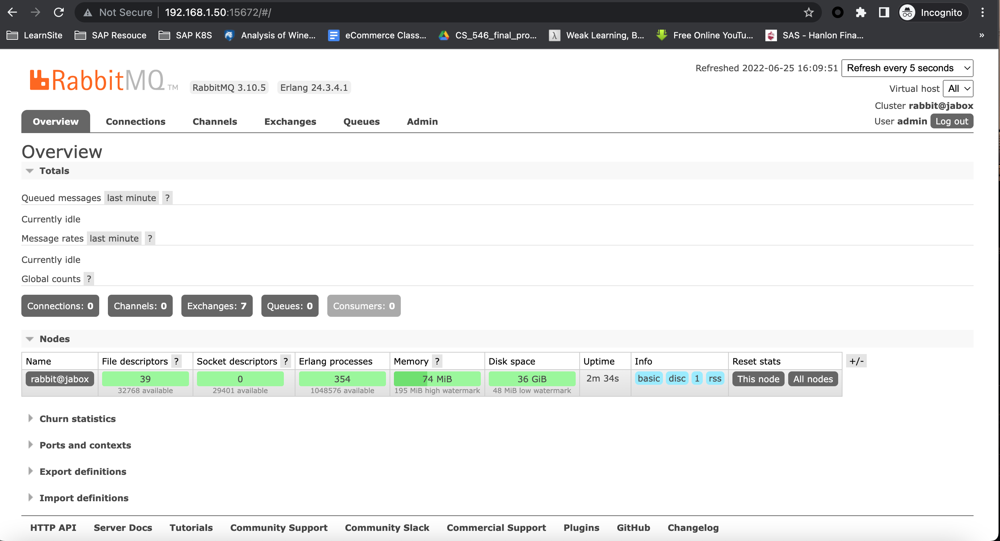

# **Chap1 Install RabbitMQ on CentOS 7**

### Init `Vagrant-VMbox` 

```
Vagrant.configure("2") do |config|
  config.vm.box = "centos/7"
  config.vm.hostname = "jabox"
  config.vm.network :private_network, ip: "192.168.56.1"
  config.vm.network :public_network, auto_config: false
  config.vm.network :forwarded_port, guest: 22, host: 22, id: "ssh"
    config.vm.provider "vmware_desktop" do |vb|
    # v.gui = true
    vb.memory = "512"
  end
end
```

```
$ ip add | grep eth2
4: eth2: <BROADCAST,MULTICAST,UP,LOWER_UP> mtu 1500 qdisc pfifo_fast state UP group default qlen 1000
    inet 192.168.1.50/24 brd 192.168.1.255 scope global noprefixroute dynamic eth2
```


### **Step 1: Update the system**

Use the following commands to update your CentOS 7 system to the latest stable status:

```
sudo yum install epel-release
sudo yum update
sudo reboot
```

### **Step 2: Install Erlang**

Since RabbitMQ is written in Erlang, you need to install Erlang before you can use RabbitMQ:

**Install Erlang**

```
wget http://packages.erlang-solutions.com/erlang-solutions-1.0-1.noarch.rpm
sudo rpm -Uvh erlang-solutions-1.0-1.noarch.rpm

sudo yum install erlang
```

Verify your installation of Erlang:

```
$ erl
Erlang/OTP 22 [erts-10.6.4] [source] [64-bit] [smp:1:1] [ds:1:1:10] [async-threads:1] [hipe]

Eshell V10.6.4  (abort with ^G)
1>
```

Press `Ctrl+C` twice to quit the Erlang shell.

### **Step 3: Install RabbitMQ**

[https://www.rabbitmq.com/download.html](https://www.rabbitmq.com/download.html)

```
wget https://github.com/rabbitmq/rabbitmq-server/releases/download/v3.10.5/rabbitmq-server-3.10.5-1.el8.noarch.rpm

sudo rpm --import https://www.rabbitmq.com/rabbitmq-signing-key-public.asc

sudo yum install rabbitmq-server-3.10.5-1.el8.noarch.rpm
```

### **Step 4: Modify firewall rules(optional)**


In order to access the RabbitMQ remote management console, you need to allow inbound TCP traffic on ports 4369, 25672, 5671, 5672, 15672, 61613, 61614, 1883, and 8883.

```
sudo firewall-cmd --zone=public --permanent --add-port=4369/tcp --add-port=25672/tcp --add-port=5671-5672/tcp --add-port=15672/tcp  --add-port=61613-61614/tcp --add-port=1883/tcp --add-port=8883/tcp


sudo firewall-cmd --reload
```

Start the RabbitMQ server and enable it to start on system boot:

```
$ sudo systemctl start rabbitmq-server.service
$ sudo systemctl enable rabbitmq-server.service
```

```
Created symlink from /etc/systemd/system/multi-user.target.wants/rabbitmq-server.service to /usr/lib/systemd/system/rabbitmq-server.service.
```

You can check the status of RabbitMQ with:

```
$ sudo rabbitmqctl status

warning: the VM is running with native name encoding of latin1 which may cause Elixir to malfunction as it expects utf8. Please ensure your locale is set to UTF-8 (which can be verified by running "locale" in your shell)
Status of node rabbit@jabox ...
Runtime

OS PID: 638
OS: Linux
Uptime (seconds): 1483
Is under maintenance?: false
RabbitMQ version: 3.10.5
Node name: rabbit@jabox
Erlang configuration: Erlang/OTP 24 [erts-12.3.2.1] [source] [64-bit] [smp:1:1] [ds:1:1:10] [async-threads:1]
Crypto library: OpenSSL 1.0.2k-fips  26 Jan 2017
Erlang processes: 354 used, 1048576 limit
Scheduler run queue: 1
Cluster heartbeat timeout (net_ticktime): 60

Plugins

Enabled plugin file: /etc/rabbitmq/enabled_plugins
Enabled plugins:

 * rabbitmq_management
 * amqp_client
 * rabbitmq_web_dispatch
 * cowboy
 * cowlib
 * rabbitmq_management_agent

Data directory

Node data directory: /var/lib/rabbitmq/mnesia/rabbit@jabox
Raft data directory: /var/lib/rabbitmq/mnesia/rabbit@jabox/quorum/rabbit@jabox

Config files


Log file(s)

 * /var/log/rabbitmq/rabbit@jabox.log
 * /var/log/rabbitmq/rabbit@jabox_upgrade.log
 * <stdout>

Alarms

(none)

Memory

Total memory used: 0.0775 gb
Calculation strategy: rss
Memory high watermark setting: 0.4 of available memory, computed to: 0.2042 gb

code: 0.0321 gb (41.49 %)
other_proc: 0.019 gb (24.56 %)
other_system: 0.0121 gb (15.66 %)
allocated_unused: 0.0067 gb (8.6 %)
other_ets: 0.0034 gb (4.33 %)
atom: 0.0014 gb (1.84 %)
plugins: 0.0013 gb (1.7 %)
reserved_unallocated: 9.0e-4 gb (1.14 %)
mgmt_db: 2.0e-4 gb (0.24 %)
binary: 1.0e-4 gb (0.15 %)
mnesia: 1.0e-4 gb (0.12 %)
metrics: 1.0e-4 gb (0.09 %)
msg_index: 0.0 gb (0.04 %)
connection_other: 0.0 gb (0.03 %)
quorum_ets: 0.0 gb (0.01 %)
quorum_queue_dlx_procs: 0.0 gb (0.0 %)
stream_queue_procs: 0.0 gb (0.0 %)
stream_queue_replica_reader_procs: 0.0 gb (0.0 %)
connection_channels: 0.0 gb (0.0 %)
connection_readers: 0.0 gb (0.0 %)
connection_writers: 0.0 gb (0.0 %)
queue_procs: 0.0 gb (0.0 %)
queue_slave_procs: 0.0 gb (0.0 %)
quorum_queue_procs: 0.0 gb (0.0 %)
stream_queue_coordinator_procs: 0.0 gb (0.0 %)

File Descriptors

Total: 2, limit: 32671
Sockets: 0, limit: 29401

Free Disk Space

Low free disk space watermark: 0.05 gb
Free disk space: 38.8178 gb

Totals

Connection count: 0
Queue count: 0
Virtual host count: 1

Listeners

Interface: [::], port: 15672, protocol: http, purpose: HTTP API
Interface: [::], port: 25672, protocol: clustering, purpose: inter-node and CLI tool communication
Interface: [::], port: 5672, protocol: amqp, purpose: AMQP 0-9-1 and AMQP 1.0
```

### **Step 5: Enable and use the RabbitMQ management console**

Enable the RabbitMQ management console so that you can monitor the RabbitMQ server processes from a web browser:

```
$ sudo rabbitmq-plugins enable rabbitmq_management

warning: the VM is running with native name encoding of latin1 which may cause Elixir to malfunction as it expects utf8. Please ensure your locale is set to UTF-8 (which can be verified by running "locale" in your shell)
Enabling plugins on node rabbit@jabox:
rabbitmq_management
The following plugins have been configured:
  rabbitmq_management
  rabbitmq_management_agent
  rabbitmq_web_dispatch
Applying plugin configuration to rabbit@jabox...
The following plugins have been enabled:
  rabbitmq_management
  rabbitmq_management_agent
  rabbitmq_web_dispatch

started 3 plugins.


$ sudo chown -R rabbitmq:rabbitmq /var/lib/rabbitmq/
```

Next, you need to setup an administrator user account for accessing the RabbitMQ server management console. 

In the following commands, 

* `"mqadmin"` is the administrator's username, 
* `"mqadminpassword"` is the password. 

Remember to replace them with your own ones.


```
# sudo rabbitmqctl add_user mqadmin mqadminpassword

$ sudo rabbitmqctl add_user admin admin
Adding user "admin" ...
```

```
# User: admin 
$ sudo rabbitmqctl set_user_tags admin administrator
Setting tags for user "admin" to [administrator] ...
```

```
# User: admin 

$ sudo rabbitmqctl set_permissions -p / admin ".*" ".*" ".*"
Setting permissions for user "admin" in vhost "/" ...
```


Now, visit the following URL:


```
http://[your-vm-server-IP]:15672/
```

```
http://192.168.1.50:15672
```

* admin
* admin


