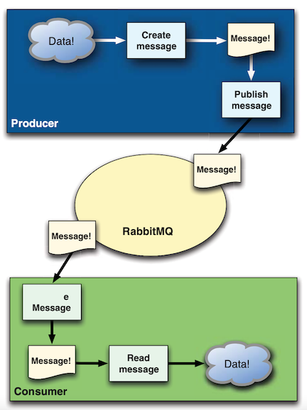
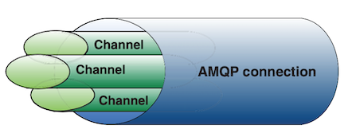

#  **Chap2 理解消息通信**

## **1 消费者和生产者**

生产者（producer）创建消息，然后发布（发送）到代理服务器(RabbitMQ)。 

什么是消息呢？消息包含两部分内容：**有效载荷（payload）和标签（label)**。 有效载荷就是你想要传输的数据。它可以是任何内容，一个JSON数组或者MP3。 RabbitMQ不会在意这些。

标签就更有趣了。它描述了有效载荷，并且RabbitMQ用它来决定一谁将获得消息的拷贝。**举例来说，不同于TCP协议的是，当你明确指定发送方和接收方时，AMQP只会用标签表述这条消息**（一个交换器的名称和可选的主题标记），然后把消息交由Rabbit。Rabbit会根据标签把消息、发送给感兴趣的接收方。

这种通信方式是一种“发后即忘”(fire-and-forget) 的单向方式。

**消费者它们连接到代理服务器上，并订阅到队列（queue）上**。

把消息队列想象成一个具名邮箱。每当消息、到达特定的邮箱时，**RabbitMQ会将其发送给其中一个订阅的／监听的消费者**。当消费者接收到消息时，它只得到消息的一部分： **有效载荷**。

在消息路由过程中．消息的标签并没有随有效载荷一同传递。**RabbitMQ 甚至不会告诉你是谁生产／发送了消息。** 如果需要明确知道是谁生产的AMQP消息的话，就要看生产者是否把发送方信息放入有效载荷中。 

你必须首先连接到Rabbit，才能消费或者发布消息。

你在应用程序和Rabbit代理服务器之问创建一条TCP连接。一旦TCP连接打开（你通过了认证），应用程 序就可以创建一条AMQP信道。信道是建立在“真实的”TCP连接内的虚拟连接。 AMQP命令都是通过信道发送出去的。每条信道都会被指派一个唯一ID (AMQP 库会帮你记住他）

### **为什么通过信道而不是直接TCP链接发送AMQP命令呢？**

**主要原因在于对操作系统来说建立和销毁TCP会话是非常昂贵的开销**。假设应用程序从队列消费消息，并根据服务需求合理调度线程。

假设你只进行TCP连接，那么每个线程都需要自行连接到Rabbit。也就是说高峰期有每秒成 百上千条连接。这不仅造成TCP连接的巨大浪费，而且操作系统每秒也就只能建立这点数量的连接。因此，你可能很快就碰到性能瓶颈了。

如果我们为所有线程只使用一条TCP连接以满足性能方而的要求，但又能确保每个线程的私密性，就像拥有独立连接一样的话，那不就非常完美吗？这就是要引入信道概念的原因。

**线程启动后，会在现成的连接上创建建一条信道，也就获得了连接到Rabbit上的私密通信路径**， 而不会给操作系统的TCP栈造成额外负担因此，你可以每秒成百上千次地创建信道而不会影响操作系统。

在一条TCP连接上创建多少条信道是没有限制的。把它想象成一束光纤电缆就可以了。 

一旦建立到RabbitMQ 代理服务器的连接，应用程序将创建多条信道：

`chan recv`信道用于服务接收消息的线程，`chan sendX` (X就是线程号）信道用于服务每一个应答线程。你使用 `than recv`设置队列的订阅，用来接收包含“票查询”请求的消息。

当应用程序通过`chan recv`信道收到一条票查询消息时，它检查消息中包含的票ID。

最终，新线程为应答消息设置标签并 通过`chan sendX`信道将其发送给Rabbit。如果只有一条信道，新应答线程将无法分 享TCP连接。你有两个选择。

* 其一，每个线程使用一个连接。这意味着你的应用程序在响应当前请求前无法处理新的查询请求。
* **其二，为每个发送线程都分配TCP 连接，这样会浪费TCP资源**。

**使用多个信道，线程可以同时共享连接。这意味着对请求的应答不会阻塞消费新的请求，也不会浪费TCP连接。有时你可能会选择仅使用一条信道，但是有了AMQP，你可以灵活地使用多个信道来满足应用程序的需求，而不会有众多TCP连接的开销。**

## **2 队列**

